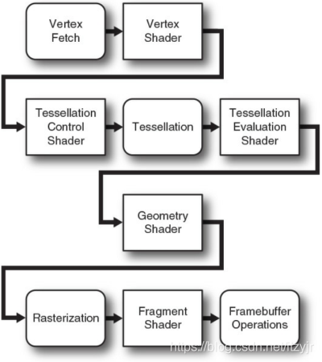

//Description: Qt学习笔刷V2，基于Qt 5.14

//Create Date: 2021-09-01 20:09:19

//Author: channy

# Qt_Class_Learning

## Qt Designer

中文名Qt设计师，主要为写布局用，可调各widget的参数并直接看效果

可直接在Qt Designer中调好布局，导出为.ui文件，再在代码中直接用QUiLoader加载.ui文件，

QMetaObject QObject.staticMetaObject

QObject Q_PROPERTY 显示属性

信号/槽

## QLayout

**QBoxLayout** QHBoxLayout/QVBoxLayout

**QFormLayout** 表单

**QGridLayout**

**QStackedLayout** 栈

## QToolButton 多用于工具栏的button

## 获取某点的颜色

```
const QDesktopWidget *desktop = QApplication::desktop();
const QPixmap pixmap = QGuiApplication::primaryScreen()->grabWindow(desktop->winId(), p.x(), p.y(), 1, 1);
QImage i = pixmap.toImage();
return i.pixel(0, 0);
```

## QWidget

QWidget.paintEvent 可由QWidget.update进行刷新

## QDialog

QDialog.show 和 QDialog.open，前者在显示的同时不影响其它操作，后者显示后屏蔽了其它对父窗口的操作，特别地，当鼠标press后如果触发了QDialog.open，那么不管鼠标的release是否在QDialog.close后，原父窗口都无法再接收到该release事件。

## QOpenGLWidget

重写initializeGL,resizeGL和paintGL



**Vertex Fetch stage（顶点获取阶段）**

在顶点着色器运行之前，有一个固定管线被称为vertex fetching（或vertex pulling）在运行。它自动为顶点着色器提供输入。

我们在绘制任何东西之前，最后一件必须得做的事是创建一个vertex array object(VAO)，它表示OpenGL管线的 **顶点获取阶段(Vertex Fetch)** 的对象，用于向顶点着色器提供输入。

顶点着色器的in由glVertexAttrib*()获取填充值

* **QOpenGLShaderProgram**  
加载shader文件或源码
* **QOpenGLBuffer**  
vbo
vbo.create: 向GPU申请创建vbo
vbo.allocate: 申请分配显存
* **QOpenGLVertexArrayObject**  
vao，存储和解析数据格式及数据来源
使用vbo前需要vao.bind

参考[顶点数组对象和缓存对象](https://www.bilibili.com/read/cv10477263/)

* 非QOpenGLWidget类操作opengl需要绑定上下文QOpenGLContext，见Qt样例`examples/opengl/contextinfo`
* vao和vbo使用前后bind和release

[back](/)

