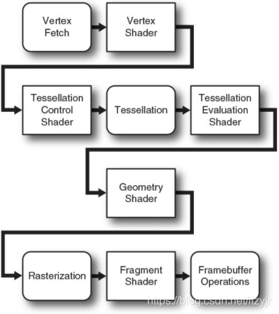

//Description: Qt学习笔记，关于OpenGL，基于Qt 5.15.2

//Create Date: 2021-11-22 11:04:19

//Author: channy

# Qt_Opengl_Notes

前置技能：Qt创建窗口，Qt信号槽基本使用，图形学基本知识，shader语言

## Qt OpenGL 1: 创建QtOpenGL窗口

### 创建空窗口

GlWidget类继承QOpenGLWidget类，需要重写initializeGL(),paintGL()和resizeGL(int w, int h)三个函数，分别对应于OpenGL窗口的初始化、刷新绘制和调整窗口大小后的操作这三个情况。其中：  
**initializeGL**会在创建窗口时被调用一次  
**paintGL**会不定时被调用  
**resizeGL**只有在创建窗口时或窗口被改变大小时才会被调用  

由于创建的OpenGL窗口为空，故当前显示的窗口大小诡异，需要增加窗口大小设置。  

### 增加QtOpenGL相关基本变量

**QOpenGLShaderProgram**从字符串中或文件中读取shader程序，初学常用addShaderFromSourceFile和addShaderFromSourceCode两个接口
**QOpenGLVertexArrayObject**vao,
**QOpenGLFunctions**opengl相关函数
**QOpenGLBuffer**vbo，存顶点数据等

shader可由字符串传入，也可由文件传入。为减少耦合，使用Qt的资源文件qrc统一管理shader文件(这里用glsl)

重写initializeGL,resizeGL和paintGL

#### 补充
**Vertex Fetch stage（顶点获取阶段）**

在顶点着色器运行之前，有一个固定管线被称为vertex fetching（或vertex pulling）在运行。它自动为顶点着色器提供输入。

我们在绘制任何东西之前，最后一件必须得做的事是创建一个vertex array object(VAO)，它表示OpenGL管线的 **顶点获取阶段(Vertex Fetch)** 的对象，用于向顶点着色器提供输入。

顶点着色器的in由glVertexAttrib*()获取填充值

* **QOpenGLShaderProgram**  
加载shader文件或源码
* **QOpenGLBuffer**  
vbo
vbo.create: 向GPU申请创建vbo
vbo.allocate: 申请分配显存
* **QOpenGLVertexArrayObject**  
vao，存储和解析数据格式及数据来源
使用vbo前需要vao.bind

参考[顶点数组对象和缓存对象](https://www.bilibili.com/read/cv10477263/)

* 非QOpenGLWidget类操作opengl需要绑定上下文QOpenGLContext，见Qt样例`examples/opengl/contextinfo`
* vao和vbo使用前后bind和release

## Qt OpenGL 2: 平面图形
当需要显示的顶点数据量少时，可以直接在代码里写上顶点坐标VERTEX_DATA，用vbo加载

在initializeGL中加载数据，在paintGL中绘制

shader中gl_开头的为shader自有变量，如gl_Position

## Qt OpenGL 3: 上色
shader的attributeLocation能够获取shader中location号，当需要输入的数据量多时，通过该号进行变量的区分和赋值

fragment shader输出颜色

shader的setAttributeBuffer设置数据，enableAttributeArray激活

## Qt OpenGL 4：旋转
旋转即原始顶点 x 旋转矩阵得到旋转后的顶点，再进行绘制

uniform 不可更改变量

旋转矩阵QMatrix4x4依赖于顶点位置，如果顶点位置有变，需要保证最后显示窗口中存在顶点，否则会旋转到视野外，从而窗口空白（空黑？）。OpenGL的难点之一也在这里，数据之前有关联不能随便乱造，否则经过投影、旋转、裁剪后有可能不在最终显示的视野内

## Qt OpenGL 5：3D
shader中gl_FragColor对应于前面的fragment shader的输出col。

之前用的QOpenGLBuffer(vbo)一直只用到VertexBuffer，顶点Buffer；如果顶点数多并且面对应的顶点有重复，则需要同时用到IndexBuffer，索引Buffer。

triangle_stripe的顶点索引以两个相同数字结尾，遵循face(v1, v2, v3),face(v3, v2, v4), face(v3, v4, v5)...保证CW/CCW

## Qt OpenGL 6: Texture
**QOpenGLTexture**

在绘制过程中需要保证texture在bind的状态

## Qt OpenGL 7: Light

[back](/)

