//Description: 日语语法笔记

//Create Date: 2020-02-28 21:45:40

//Author: channy

***
 N1 
***

# ~あっての 
有...才...  
n. あっての n.
# ~いかん/~いかんによって
取决于  
n. いかんて  
　いかんだ。  
　いかんによって  
## ~次第で/次第だ
n. 次第で + 许多种状态或结果  
　次第だ。
## ~次第では
n. 次第では + 具体唯一的状态或结果
## ~いかんでは/いかんによっては
n. [の] いかんでは  
　　　いかんによっては
# ~いかんによらず/~いかんにかかわらず
无论如何都  
n. いかんによらず  
　いかんにかかわらず
# ~うが/~うとも
即使也  
意向形 うが  
      うと[も]
# ~うが~まいが/~うと~まいと
不管做不做  
v. 意向形 うが v. 辞書形 まいが  
         うと          まいと
# ~うにも~ない
即使想[做]...也不能  
意向形 うにも 否定形 ない
# ~かぎりだ/かぎりです
真是太...,感到非常  
adj. ~い かぎりだ  
     ~な かぎりだ
# ~たが最後/~たら最後
一旦[做]...就  
v. た が最後  
   た ら最後
# ~かたがた
顺便，顺道  
n. かたがた
## ~がてら
動作性名詞 がてら  
   v. ~~ます~~形 
# ~かたわら
同时，一边...一边  
v. 辞書形 かたわら  
      n. の
## ~ながら

# ~が早いか
刚一[做]A就B  
v. 辞書形 が早いか 過去形
# ~からある/~からする/~からの
起码，至少  
n. からある n.
   からする  
   からの
# ~きらいがある
有点...,经常...,有...倾向(neg.)  
v. 辞書形/ない形 きらいがある  
                名詞の
# ~極まる/~極まりない
非常，极其  
    な形容詞 極まる  
い形容詞 こと 極まりない
# ~ごとく/~ごとき/~ごとし
如同，就像  
      n. の ごとく  
      n. が ごとき  
v. 普通形 ごとし  
      n. ごとき
# ~こととて
因为(接谢罪、请求)  
[普通形な・の] こととて  
v. ~~ない~~形 ぬ こととて
# ~なしに/~ことなしに  
没有...而,不...而  
          n. なしに  
v. 辞書形 こと なしに

# ~始末だ

竟然(neg.)  
v. 辞書形 始末だ

# ~ずくめ

全都，全是  
n. ずくめ

# ~ないではおかない/~ずにはおかない

不能不，必然，一定  
ない形 ではおかない  
~~ない~~形 ずにはおかない  
## ~ないではすまない/~ずにはすまない

非...不可  
ない形 ではすまない  
ない形 ではすまない

# ~すら

连...都，甚至
## ~さえ (N3)
n. [助] さえ
      で さえ
##  ~だに

连~都，只要~就
           n. だに
v. 辞書形 だに

# ~そばから

刚...就(对立关系)

# ~たところで

即使(neg.)  
v. た形 ところで

# ~たりとも

哪怕~也不，即使~也不  
一 数量詞 たりとも (neg.)

# ~たる

作为~  
n. たる n.

# ~つ~つ

(表示动作交替进行)  
v. ~~ます~~形 つ v. ~~ます~~形 つ

# ~であれ/~であろうが/~であろうと

不管~也，即使~也，无论~都  
n. であれ  
   であろうが  
   であろうと
# ~てからというもの

自从~以后  
v. て からというもの  
# ~でなくて何だろう

不是~又是什么呢  
n. でなくて何だろう[か]

# ~じゃあるまいし

又不是~  
n. じゃあるまいし

# ~てやまない

~不已，一直~  
v. て形 やまない

# ~と相まって

与~相结合，与~相融合  
n. と相まって

# ~とあって

因为~  
v. 普通形 とあって
      n.
# ~とあれば/とあらば
如果~，既然~就~  
[普通形] とあれば  
        とあらば
# ~といい~といい
不论~还是~, ~也好~也好
n. といい n. といい
# ~というところだ/といったところだ
顶多~, 差不多~
n. というところだ
    といったところだ
# ~といえども
即使~, 虽然~
n. といえども
# ~といったらない/といったらありはしない
~極了，~不得了
v. 辞書形 [とい]ったらない
い形容詞 い [とい]ったらありはしない
な形容詞
n.
# ~と思いきや
原以为
普通形 と思いきや
# ときたら
说到~，提到~
n. ときたら
# ~ところを
正~的时候，~之时，~之中
普通形 ところ[を]
# ~にしたところで/としたところで
就算~也，即使~也
n. にしたところで
   としたところで
# ~とは
竟然，没想到
[普通形] とは
# ~とはいえ
虽然~但，虽说~但
[普通形] とはいえ
# ~とばかりに
像是
[普通形] とばかりに
# ~ともなく/ともなしに
无意中，漫不经心地，不自觉地，不晓得
    v. 辞書形 ともなく
疑問詞 助詞 ともなしに
# ~ともなると/ともなれば
要是，一旦
v. 辞書形 ともなると
n. ともなれば
# ~ないまでも
就算~至少也，就是~也该，即使不~也该
v. ない形 までも
# ~

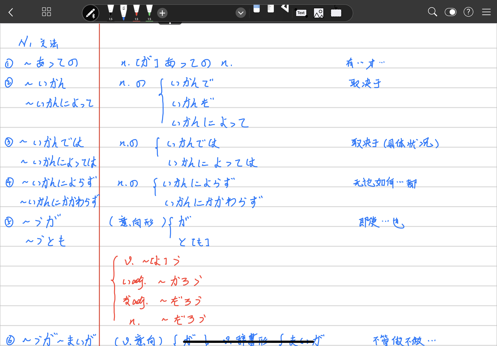
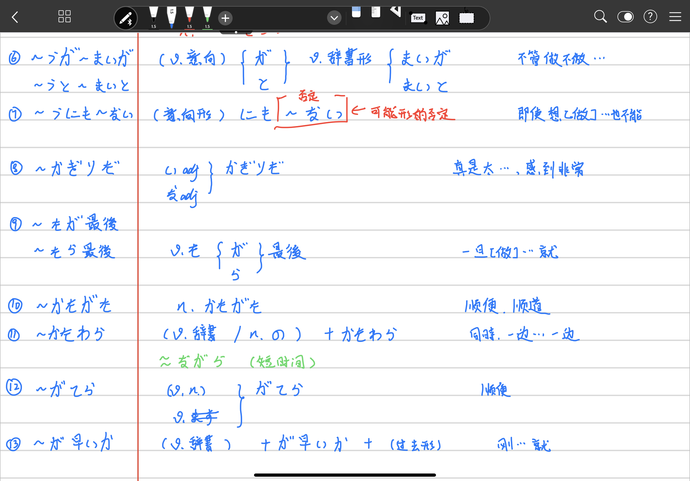
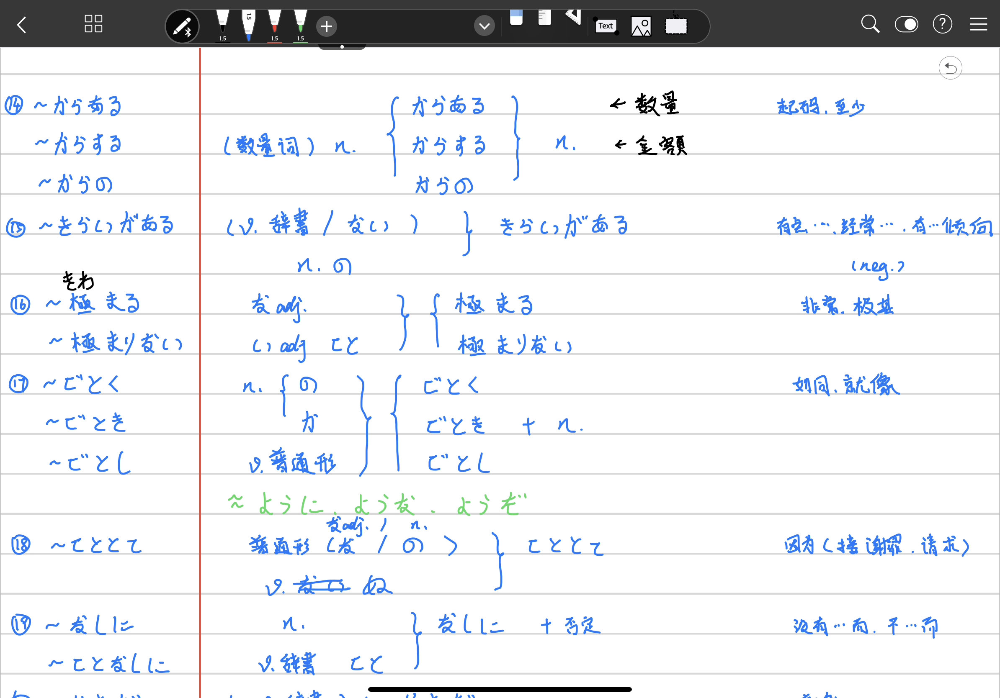
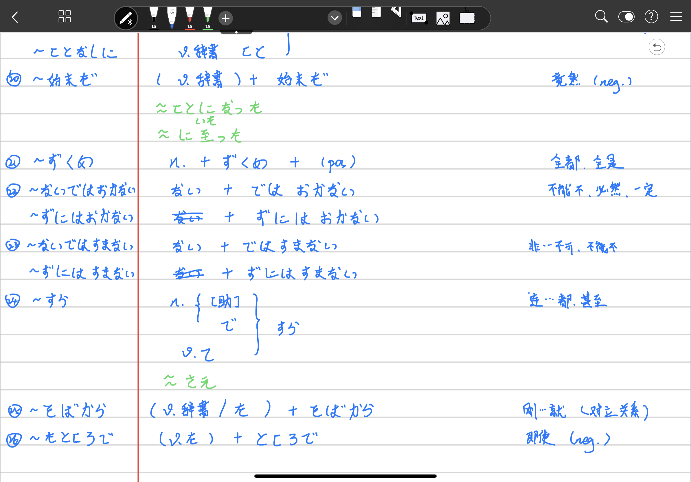

***
 N2 
***

## 1. ~あげく

[做]...结果...

## 2. ~あまり/あまりの~に

因为太...

## 3. ~以上

既然

## 4. ~一方

另一方面

## 5. ~うえで

在...的时候(必要,重要的事;不接具体行为动作)

## 6. ~うえで

[做]...后

## 7. ~うえは

既然

## 8. ~うではないか

让我们...吧

## 9. ~得る

可能，能

## 10. ~かぎり

只要...就

## 11. ~かぎりでは

在...范围内，据(我)所...

## 12. ~がたい

难以...(精神的)

## 13. ~かねる

不能，难以...(心情、外因)

## 14. ~かねない

有可能(neg.)

## 15. ~からして

就连...都,从...就

## 16. ~からして/~からすると/~からすれば/~からしたら

以...来看，从...来看

## 17. ~からといって/~からって

不能因为...就...，即使因为...也不...

## 18. ~気味

稍微，有点(neg.)

## 19. ~きり

[做了]...就(再也没有)，一直持续[做]，只有

## 20. ~くせに/~くせして

明明...却...(批判，轻蔑，不满)(neg.)

## 21. ~げ

...的样子，...的感觉

## 22. ~ことだ(忠告)

就得，就该

## 23. ~ことだ(感慨)

## 24. ~ことなく

不...而,没...而

## 25. ~ことに

(令人)~的是

## 26. ざるを得ない

不得不~

## 27. ~次第

一~立刻

## 28. ~次弟で

全凭~，要看~而定

## 29. ~次弟では

全凭~，要看~而定

## 30. ~上/~の上で

在~上

## 31. ~ないではいられない/~ずにはいられない

不能不~，忍不住~，不禁~

## 32. ~だけに/~だけあって/~だけのことはある

不愧是~，正因为~

## 33. ~っこない

不可能~，不会~

## 34. ~つつ

一边~一边

## 35. ~つつ

虽然~

## 36. ~つつある

正在~

## 37. ~っばなし

v.~ます~ + っばなし

~就放置不管，一直~

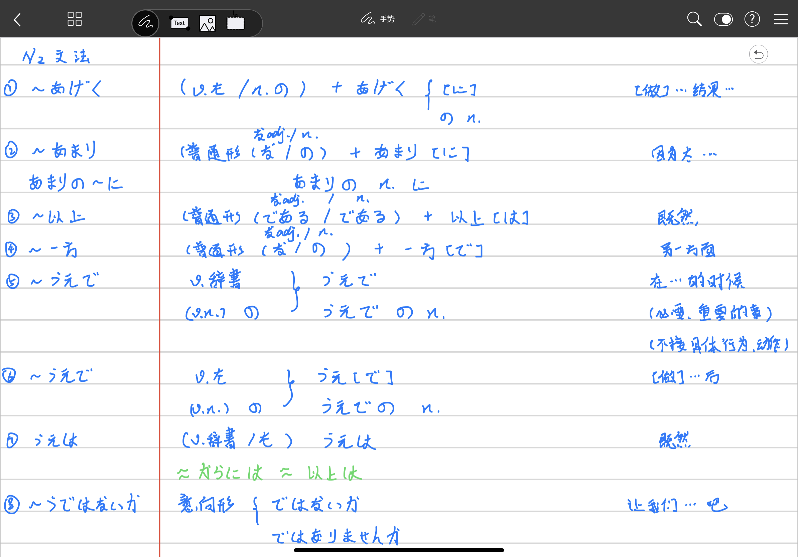
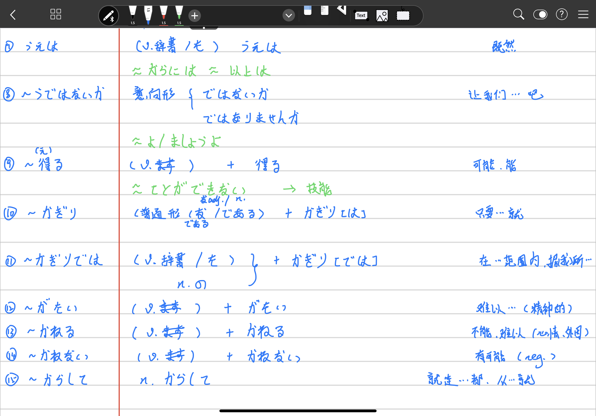
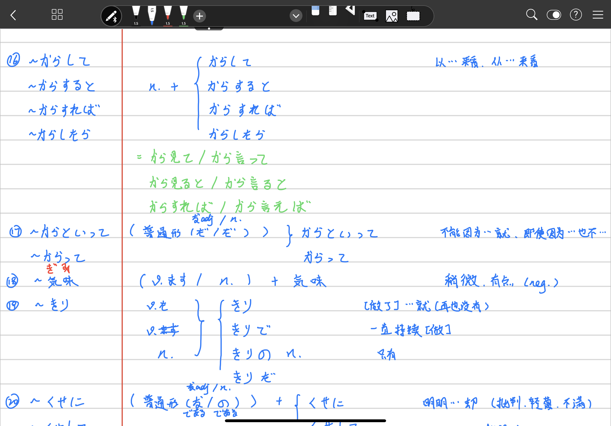
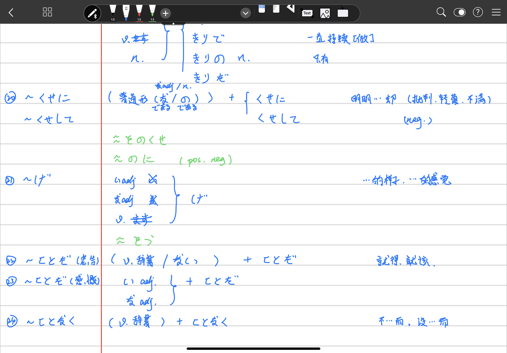

***
 N3 
***

## 1. ~一方だ

(v.辞書)　+　一方だ/一方です

一直...

## 2. ~うえに

(普通形(な/の))　+　うえ[に]

不但...还...

## 3. ~うちに

(v.て) いる　+　うちに

(普通形(な/の))　+　うちに

趁.../在...时

## 4. ~おかげ

(普通形(な/の))　+　おかげで/おかげか/おかげだ

托...的福

## 5. ~おそれがある

恐怕

## 6. ~かける/~かけ

(v.去掉ます)

刚开始...，到一半，快要

## 7. ~がち

经常

## 8. ~から~にかけて

从...到...

## 9. ~からには

既然

## 10. ~から見て/~から見ると/~から見れば/~から見たら

从...来看

## 11. ~かわりに

代替，另一面，代价

## 12. ~きる/~きれる

[做]完，到极限，到最后
[做]得完

## 13. ~くらい/~くらいだ

像...的程度，那样

## 14. ~こそ

n. + こそ

...才是,...正是

## 15. ~ことから/~ところから

因为，根据

## 16. ~のことだから/~のことだ

n. + ~のことだから/~のことだ

因为是

## 17. ~ことはない

没必要，用不着

## 18. ~最中に

正在...，正好是

## 19. ~祭に/~祭は

...的时候

## 20. ~ことになっている

按照规定，有决定

## 21. ~ことにしている

(自己过去)决定

## 22. ~ことになる

也就是说

## 23. ~さえ

连...都

## 24. ~さえ~ば

只要...就

## 25. 〜しかない

只好，只能

## 26. ~せい

因为，都怪

## 27. ~だけ/~だけの

〜多少就，尽量

## 28. ~たところ

[做]〜结果

## 29. ~たとたん

刚~就

## 30. ~たびに

每次，每当

## 31. ~だらけ

全是，满是

## 32. ~ついでに

顺便

## 33. ~っけ

[例]この店、以前来たことがあったっけ？

~来着（确认，回顾）

## 34. ~っぽう

v.~ます~/n. + っぽい

[例]うちの上司は怒りっぽい。

容易~，有点~，好像~

## 35. ~てからでないと/~てからでなければ

v.て + からでないと/からでなければ

[例]直接部屋を見てからでないと、借りるかどうか決められません。

若不先[做]~就

## 36. ~てしょうがない/~てしかたがない

v.て/い.adj　くて/な.adj で + しょうがない/しかたがない

~得不得了，非常~  

## 37. ~てたまらない

v.て/い.adj くて/な.adj で + たまらない

[例] 合格通知を受け取って、嬉しくてたまらない。

[例] 合格通知を受け取った彼女は嬉しくてたまらないようだ。

~得不得了

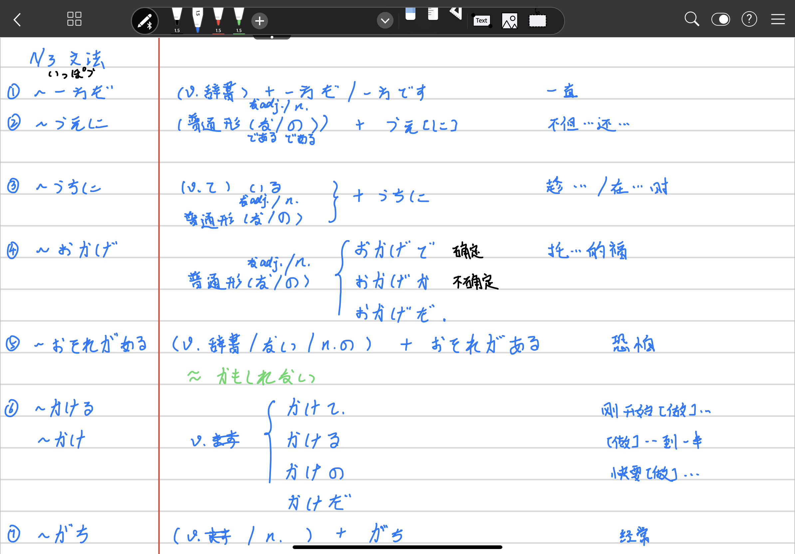
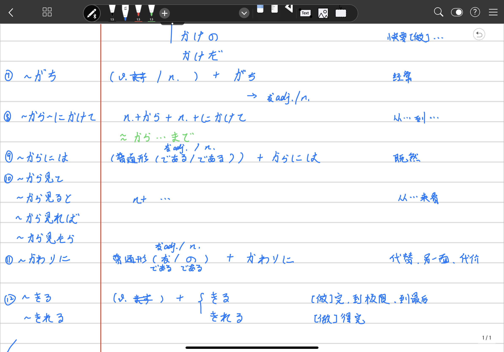
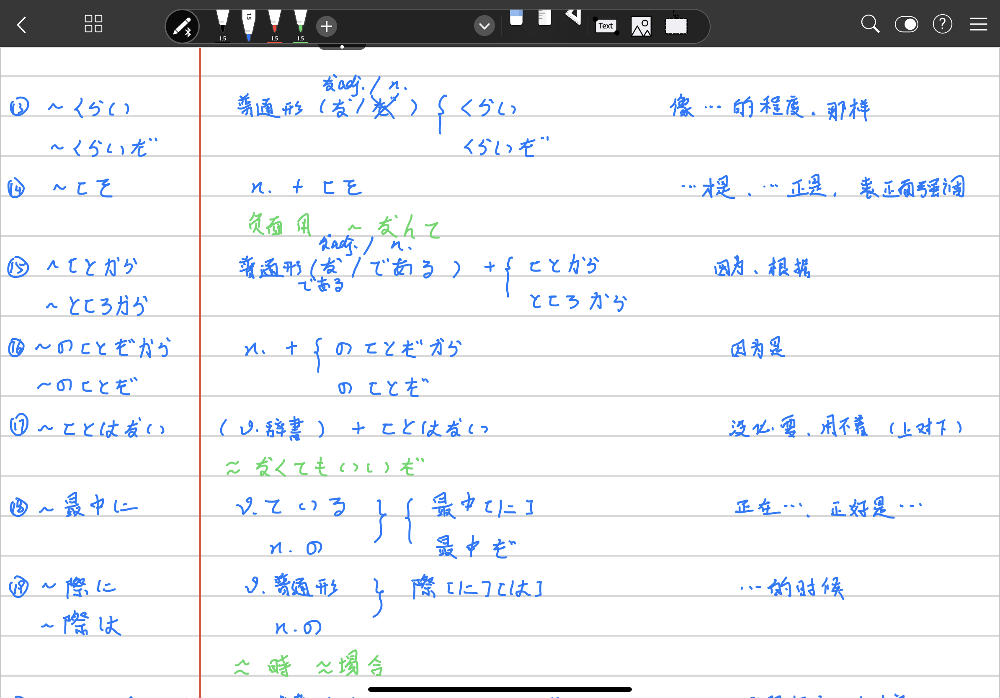
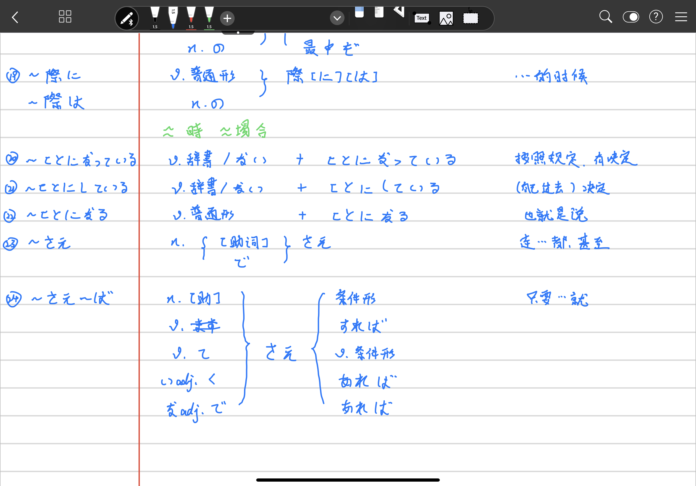

***
 N4 
***

## 1. ~までに

~まで, ~に

## 2. ~つもり

(v.辞書/v.ない)　+ つもりはありません

从大到小：つもり　と思って　と思い

	~たいです　~と思います　~つもりです

打算。。。

## 3. ~かもしれません

(普通形(なadj./n.去掉だ))

## 4. ~AはBより

## 5. ~やすい

(v.去掉ます)

容易[做]

## 6. ~にくい

(v.去掉ます)

不容易[做]

## 7. ~方(かた/ほう)

(v.去掉ます)

## 8. ~ので

(普通形(なadj./n.な))

因为

## 9. ~のに

(普通形(なadj./n.な))

(明明)A却B

## 10. ~ことができます

(v.辞書)　こと　+　ができます

可以/能够/会[做]

## 11. ~たことがあります

(v.た)　こと　+　があります

有[做]过

## 12. ~ほうがいいです

(v.辞書/た/v.ない) + ほうがいいです

[做]...比较好，不[做]...比较好

## 13. ~ すぎます/~すぎです

(v.去掉ます/adj去掉い/adj去掉な) + すぎます -> v.
				 + すぎです -> なadj./n.

ない -> なさすぎます 

## 14. ~ なさい

 (v.去掉ます) + なさい

命令表现

します　なさいます　なさいません

## 15. ~てもいいです = ~てもかみいません

(v.て)　+　てもいいです/てもかまいません

## 16. ~てはいけません = ~てはだめです

(v.て)　+　はいけません/はだめです

## 17. ~なくてもいいです = ~なくてもかまいません

(v.去掉ない)　+　なくてもいいです/なくてもかまいません 

## 18. ~なくてはいいません = ~なければなりません = ~ないとだめです

 (v.去掉ない)　+　なくては/なければ/ないと　+　いいません/なりません/だめです

## 19. ~ことになります

 (v.辞書/v.ない) + ことになります

别人(可含自己)决定

## 20. ~ことにします

自己决定

## 21. ~てきます

(v.て)　+　きます

## 22. ~ていきます

(v.て)　+　いきます

## 23. ~てみます

(v.て)　+　みます

试着[做]

## 24. ~てしまいます

(v.て)　+　しまいます

~掉、~完

(音变) てしま　->　ちゃ

## 25. ~ておきます

## 26. ~ています

正在~，目前状态，习惯

## 27. 缩约表现

## 28. 指示词

## 29. ~はじめます

开始~

## 30. ~だしまし

v.~ます~ + だします

开始~，~起来，~出来

## 31. ~続けます

持续~，继续~

## 32. ~終わります/終えます

~完

## 33. ~がします

有~，感觉~

## 34. ~てあげます

帮sb.[做]

## 35. ~てもらいます

请sb.(为sb.)[做]~

## 36. ~てくれます

sb.帮我~

## 37. ~やります/~てやります

帮sb.[做]~

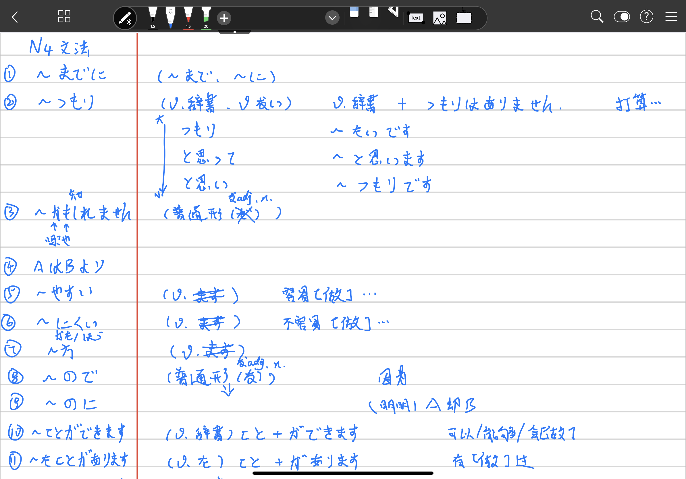
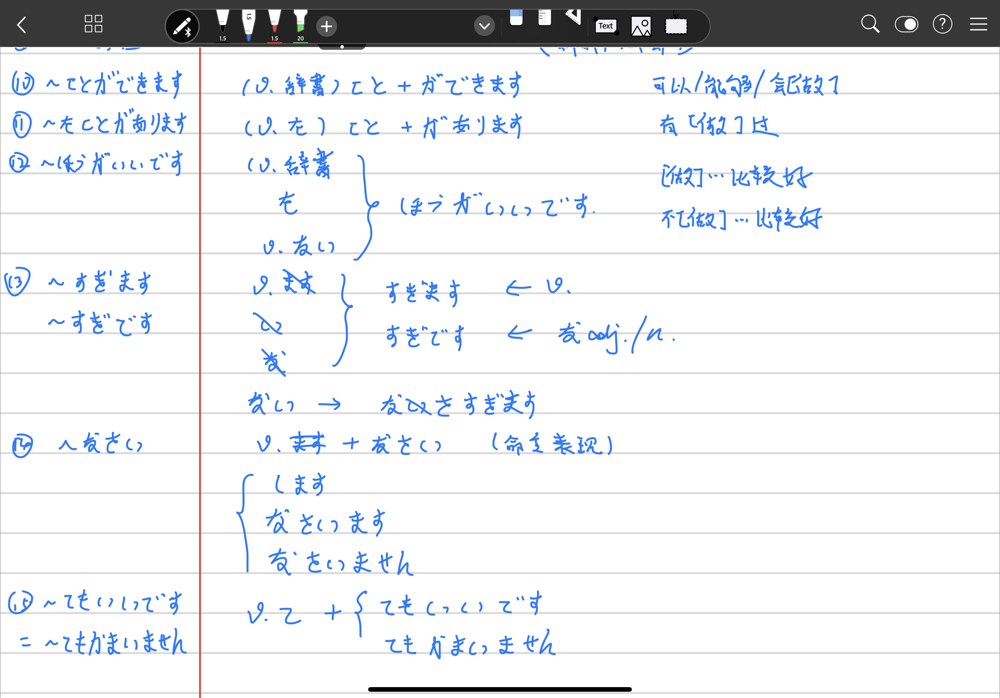
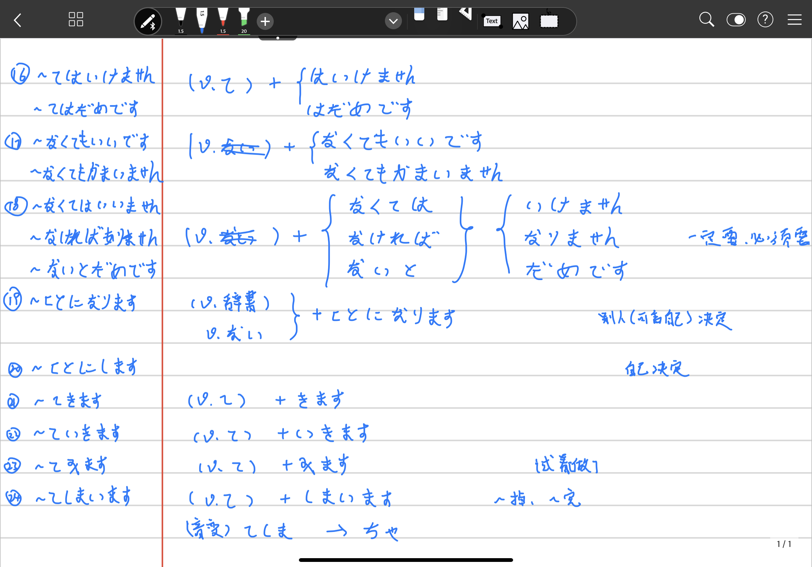

***
其它
***

[原笔记1](/../docs/japanese.docx)

[原笔记2](/../docs/japanese 2.docx)

[初级语法指南](http://res.wokanxing.info/jpgramma/index.html)

[back](/)
