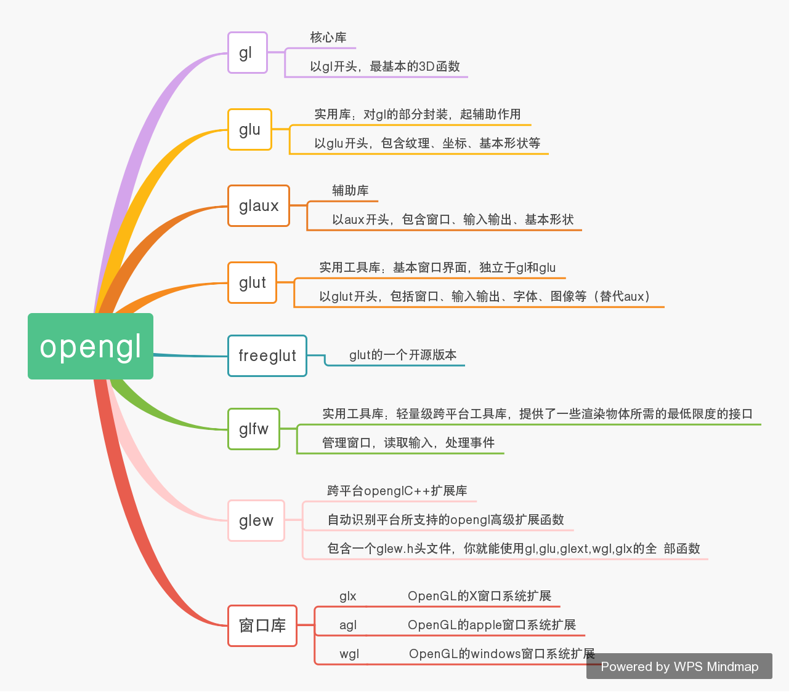

//Description: Qt下使用OpenGL-根据NeHe的教程改写的(1-5)

//Create Date: 2013-12-23 16:02:39

//Author: channy

[toc]

* Xatlas


# 概述
下面这个网址上有前辈们已经实现的一部分，但发现有些地方对Qt5以上版本的不适用，故做了些修改……有兴趣的可以先看看前辈实现的这个：

[Qt OpenGL教程](http://www.qiliang.net/old/nehe_qt/])

还有这个前辈写的也不错：http://blog.csdn.net/fuyajun01/article/category/871042

编译环境：win 7 32 bit, Qt 5.1.1, vs 2010

# 第一课：创建OpenGL窗口
nehewidget.h 头文件：

```c++
#ifndef NEHEWIDGET_H
#define NEHEWIDGET_H

#include <QtOpenGL/QGLWidget>
//#include "ui_nehewidget.h"

#include <qgl.h>

class nehewidget : public QGLWidget
{
	Q_OBJECT

public:
	nehewidget(QWidget *parent = 0,bool fs=false);
	~nehewidget();

protected:
	void initializeGL();
	void paintGL();
	void resizeGL(int w,int h);

	void keyPressEvent(QKeyEvent *e);

	bool fullscreen;
};

#endif // NEHEWIDGET_H
```

nehewidget.cpp 实现文件：

```c++
#include "nehewidget.h"

#include <gl/GLU.h>
#include <QKeyEvent>

nehewidget::nehewidget(QWidget *parent,bool fs)
	: QGLWidget(parent)
{
	fullscreen=fs;
	setGeometry(0,0,640,480);
//	setCaption("OpenGL window"); //这个函数，不支持了吧？
	setWindowTitle("OpenGL Window");
	if(fullscreen) showFullScreen();
}

nehewidget::~nehewidget()
{

}

void nehewidget::initializeGL()
{
	glShadeModel(GL_SMOOTH);
	glClearColor(0,0,0,0);
	glClearDepth(1.0);
	glEnable(GL_DEPTH_TEST);
	glDepthFunc(GL_LEQUAL);
	glHint(GL_PERSPECTIVE_CORRECTION_HINT,GL_NICEST);
}

void nehewidget::paintGL()
{
	glClear(GL_COLOR_BUFFER_BIT|GL_DEPTH_BUFFER_BIT);
	glLoadIdentity();
}

void nehewidget::resizeGL(int w,int h)
{
	if(h==0) h=1;
	glViewport(0,0,(GLint)w,(GLint)h);
	glMatrixMode(GL_PROJECTION);
	glLoadIdentity();
	//下面这个函数在Qt和OpenGL新版本中都不支持了！先注释掉吧，以后不得不用时再想办法
//	gluPerspective(45.0,(GLfloat)w/(GLfloat)h,0.1,100.0);

	glMatrixMode(GL_MODELVIEW);
	glLoadIdentity();
}

void nehewidget::keyPressEvent(QKeyEvent *e)
{
	switch(e->key()) {
	case Qt::Key_F2:
		fullscreen=!fullscreen;
		if(fullscreen) showFullScreen();
		else {
			showNormal();
			setGeometry(0,0,640,480);
		}
		updateGL();
		break;
	case Qt::Key_Escape:
		close();
	}
}
```

main 主函数：

```c++
#include "nehewidget.h"
#include <QtWidgets/QApplication>
#include <QMessageBox>

int main(int argc, char *argv[])
{
	bool fs=false;
	QApplication a(argc, argv);
	switch(QMessageBox::information(0,"FullScreen?","Fullscreen or not?",QMessageBox::Yes,QMessageBox::No|QMessageBox::Default)) {
	case QMessageBox::Yes:
		fs=true;
		break;
	case QMessageBox::No:
		fs=false;
		break;
	}
	nehewidget w(0,fs);
	w.show();
	return a.exec();
}
```

# 第二课：多边形

这里只有paintGL()函数改了，故只给出nehewidget.cpp文件，其它的和第一课的一样。

```c++
#include "nehewidget.h"

#include <gl/GLU.h>
#include <QKeyEvent>

nehewidget::nehewidget(QWidget *parent,bool fs)
	: QGLWidget(parent)
{
	fullscreen=fs;
	setGeometry(50,50,640,480);
//	setCaption("OpenGL window"); //这个函数，不支持了吧？
	setWindowTitle("OpenGL Window");
	if(fullscreen) showFullScreen();
}

nehewidget::~nehewidget()
{

}

void nehewidget::initializeGL()
{
	glShadeModel(GL_SMOOTH);
	glClearColor(0,0,0,0);
	glClearDepth(1.0);
	glEnable(GL_DEPTH_TEST);
	glDepthFunc(GL_LEQUAL);
	glHint(GL_PERSPECTIVE_CORRECTION_HINT,GL_NICEST);
}

void nehewidget::paintGL()
{
	glClear(GL_COLOR_BUFFER_BIT|GL_DEPTH_BUFFER_BIT);
	glLoadIdentity();
	//难道是gluPerspective的缘故？参数必须小一些才能看到图形
	//而且圆形和屏幕大小有关系，屏幕不对劲，正方形变长方形了……
	glTranslatef(-0.3,0.3,-0.6);
	glBegin(GL_TRIANGLES);
	glVertex3f(0.0,0.2,0.0);
	glVertex3f(-0.2,-0.2,0.0);
	glVertex3f(0.2,-0.2,0.0);
	glEnd();
	glTranslatef(0.6,0,0);
	glBegin(GL_QUADS);
	glVertex3f(-0.2,0.2,0);
	glVertex3f(0.2,0.2,0);
	glVertex3f(0.2,-0.2,0);
	glVertex3f(-0.2,-0.2,0);
	glEnd();
	//下面被注释的一段是另添加的，有兴趣的可以去掉注释运行一下
	//用连续的点或三角形来逼近圆，一个空心，一个实心
/*
	glTranslatef(-0.5,-0.5,0.0);
	GLfloat x,y,angle;
	glBegin(GL_POINTS);
	for(angle=0;angle<2*3.1415926;angle+=0.001) {
		x=0.2*sin(angle);
		y=0.2*cos(angle);
		glVertex3f(x,y,0.0);
	}
	glEnd();
	glTranslatef(0.5,0.0,0.0);
	glBegin(GL_TRIANGLE_FAN);
	for(int i=0;i<100;i++) {
		float angle=2*3.1415926*i/100;
		glVertex3f(0.2*cos(angle),0.2*sin(angle),0);
	}
	glEnd();
*/
}

void nehewidget::resizeGL(int w,int h)
{
	if(h==0) h=1;
	glViewport(0,0,(GLint)w,(GLint)h);
	glMatrixMode(GL_PROJECTION);
	glLoadIdentity();
	//下面这个函数在Qt和OpenGL新版本中都不支持了！先注释掉吧，以后不得不用时再想办法
//	gluPerspective(45.0,(GLfloat)w/(GLfloat)h,0.1,100.0);

	glMatrixMode(GL_MODELVIEW);
	glLoadIdentity();
}

void nehewidget::keyPressEvent(QKeyEvent *e)
{
	switch(e->key()) {
	case Qt::Key_F2:
		fullscreen=!fullscreen;
		if(fullscreen) showFullScreen();
		else {
			showNormal();
			setGeometry(0,0,640,480);
		}
		updateGL();
		break;
	case Qt::Key_Escape:
		close();
	}
}
```

# 第三课：上色
比上一课多加了三行，都是上色的……

```c++
#include "nehewidget.h"

#include <gl/GLU.h>
#include <QKeyEvent>

nehewidget::nehewidget(QWidget *parent,bool fs)
	: QGLWidget(parent)
{
	fullscreen=fs;
	setGeometry(50,50,640,480);
//	setCaption("OpenGL window"); //这个函数，不支持了吧？
	setWindowTitle("OpenGL Window");
	if(fullscreen) showFullScreen();
}

nehewidget::~nehewidget()
{

}

void nehewidget::initializeGL()
{
	glShadeModel(GL_SMOOTH);
	glClearColor(0,0,0,0);
	glClearDepth(1.0);
	glEnable(GL_DEPTH_TEST);
	glDepthFunc(GL_LEQUAL);
	glHint(GL_PERSPECTIVE_CORRECTION_HINT,GL_NICEST);
}

void nehewidget::paintGL()
{
	glClear(GL_COLOR_BUFFER_BIT|GL_DEPTH_BUFFER_BIT);
	glLoadIdentity();
	//难道是gluPerspective的缘故？参数必须小一些才能看到图形
	//而且圆形和屏幕大小有关系，屏幕不对劲，正方形变长方形了……
	glTranslatef(-0.3,0.3,-0.6);
	glBegin(GL_TRIANGLES);
	glColor3f(1.0,0.0,0.0);
	glVertex3f(0.0,0.2,0.0);
	glColor3f(0.0,1.0,0.0);
	glVertex3f(-0.2,-0.2,0.0);
	glColor3f(0.0,0.0,1.0);
	glVertex3f(0.2,-0.2,0.0);
	glEnd();
	glTranslatef(0.6,0,0);
	glColor3f(0.5,0.5,1.0);
	glBegin(GL_QUADS);
	glVertex3f(-0.2,0.2,0);
	glVertex3f(0.2,0.2,0);
	glVertex3f(0.2,-0.2,0);
	glVertex3f(-0.2,-0.2,0);
	glEnd();
	//下面被注释的一段是另添加的，有兴趣的可以去掉注释运行一下
	//用连续的点或三角形来逼近圆，一个空心，一个实心
/*
	glTranslatef(-0.5,-0.5,0.0);
	GLfloat x,y,angle;
	glBegin(GL_POINTS);
	for(angle=0;angle<2*3.1415926;angle+=0.001) {
		x=0.2*sin(angle);
		y=0.2*cos(angle);
		glVertex3f(x,y,0.0);
	}
	glEnd();
	glTranslatef(0.5,0.0,0.0);
	glBegin(GL_TRIANGLE_FAN);
	for(int i=0;i<100;i++) {
		float angle=2*3.1415926*i/100;
		glVertex3f(0.2*cos(angle),0.2*sin(angle),0);
	}
	glEnd();
*/
}

void nehewidget::resizeGL(int w,int h)
{
	if(h==0) h=1;
	glViewport(0,0,(GLint)w,(GLint)h);
	glMatrixMode(GL_PROJECTION);
	glLoadIdentity();
	//下面这个函数在Qt和OpenGL新版本中都不支持了！先注释掉吧，以后不得不用时再想办法
//	gluPerspective(45.0,(GLfloat)w/(GLfloat)h,0.1,100.0);

	glMatrixMode(GL_MODELVIEW);
	glLoadIdentity();
}

void nehewidget::keyPressEvent(QKeyEvent *e)
{
	switch(e->key()) {
	case Qt::Key_F2:
		fullscreen=!fullscreen;
		if(fullscreen) showFullScreen();
		else {
			showNormal();
			setGeometry(0,0,640,480);
		}
		updateGL();
		break;
	case Qt::Key_Escape:
		close();
	}
}
```

# 第四课：旋转
只增加了几个变量，几行代码。我的机器运行特别慢，故增大了旋转增量，有兴趣的可以减小一些试试……

nehewidget.h 文件：
```c++
#ifndef NEHEWIDGET_H
#define NEHEWIDGET_H

#include <QtOpenGL/QGLWidget>
//#include "ui_nehewidget.h"

#include <qgl.h>

class nehewidget : public QGLWidget
{
	Q_OBJECT

public:
	nehewidget(QWidget *parent = 0,bool fs=false);
	~nehewidget();

protected:
	void initializeGL();
	void paintGL();
	void resizeGL(int w,int h);

	void keyPressEvent(QKeyEvent *e);

	bool fullscreen;
	GLfloat rtri,rquad;
};

#endif // NEHEWIDGET_H
```

nehewidget.cpp 文件：
```c++
#include "nehewidget.h"

#include <gl/GLU.h>
#include <QKeyEvent>

nehewidget::nehewidget(QWidget *parent,bool fs)
	: QGLWidget(parent)
{
	rtri=0.0;
	rquad=0.0;
	fullscreen=fs;
	setGeometry(50,50,640,480);
//	setCaption("OpenGL window"); //这个函数，不支持了吧？
	setWindowTitle("OpenGL Window");
	if(fullscreen) showFullScreen();
}

nehewidget::~nehewidget()
{

}

void nehewidget::initializeGL()
{
	glShadeModel(GL_SMOOTH);
	glClearColor(0,0,0,0);
	glClearDepth(1.0);
	glEnable(GL_DEPTH_TEST);
	glDepthFunc(GL_LEQUAL);
	glHint(GL_PERSPECTIVE_CORRECTION_HINT,GL_NICEST);
}

void nehewidget::paintGL()
{
	glClear(GL_COLOR_BUFFER_BIT|GL_DEPTH_BUFFER_BIT);
	glLoadIdentity();
	//难道是gluPerspective的缘故？参数必须小一些才能看到图形
	//而且圆形和屏幕大小有关系，屏幕不对劲，正方形变长方形了……
	glTranslatef(-0.3,0.3,-0.6);
	glRotatef(rtri,0.0,1.0,0.0);
	glBegin(GL_TRIANGLES);
	glColor3f(1.0,0.0,0.0);
	glVertex3f(0.0,0.2,0.0);
	glColor3f(0.0,1.0,0.0);
	glVertex3f(-0.2,-0.2,0.0);
	glColor3f(0.0,0.0,1.0);
	glVertex3f(0.2,-0.2,0.0);
	glEnd();
	rtri+=30;
	glLoadIdentity();

	glTranslatef(0.3,0.3,0.0);
	glRotatef(rquad,1.0,0.0,0.0);
	glColor3f(0.5,0.5,1.0);
	glBegin(GL_QUADS);
	glVertex3f(-0.2,0.2,0);
	glVertex3f(0.2,0.2,0);
	glVertex3f(0.2,-0.2,0);
	glVertex3f(-0.2,-0.2,0);
	glEnd();
	rquad-=20;
	//下面被注释的一段是另添加的，有兴趣的可以去掉注释运行一下
	//用连续的点或三角形来逼近圆，一个空心，一个实心
/*
	glTranslatef(-0.5,-0.5,0.0);
	GLfloat x,y,angle;
	glBegin(GL_POINTS);
	for(angle=0;angle<2*3.1415926;angle+=0.001) {
		x=0.2*sin(angle);
		y=0.2*cos(angle);
		glVertex3f(x,y,0.0);
	}
	glEnd();
	glTranslatef(0.5,0.0,0.0);
	glBegin(GL_TRIANGLE_FAN);
	for(int i=0;i<100;i++) {
		float angle=2*3.1415926*i/100;
		glVertex3f(0.2*cos(angle),0.2*sin(angle),0);
	}
	glEnd();
*/
}

void nehewidget::resizeGL(int w,int h)
{
	if(h==0) h=1;
	glViewport(0,0,(GLint)w,(GLint)h);
	glMatrixMode(GL_PROJECTION);
	glLoadIdentity();
	//下面这个函数在Qt和OpenGL新版本中都不支持了！先注释掉吧，以后不得不用时再想办法
//	gluPerspective(45.0,(GLfloat)w/(GLfloat)h,0.1,100.0);

	glMatrixMode(GL_MODELVIEW);
	glLoadIdentity();
}

void nehewidget::keyPressEvent(QKeyEvent *e)
{
	switch(e->key()) {
	case Qt::Key_F2:
		fullscreen=!fullscreen;
		if(fullscreen) showFullScreen();
		else {
			showNormal();
			setGeometry(0,0,640,480);
		}
		updateGL();
		break;
	case Qt::Key_Escape:
		close();
	}
}
```

# 第五课：三维

还是从上一课的代码中增加几行

nehewidget.cpp 文件：
```c++
#include "nehewidget.h"

#include <gl/GLU.h>
#include <QKeyEvent>

nehewidget::nehewidget(QWidget *parent,bool fs)
	: QGLWidget(parent)
{
	rtri=0.0;
	rquad=0.0;
	fullscreen=fs;
	setGeometry(50,50,640,480);
//	setCaption("OpenGL window"); //这个函数，不支持了吧？
	setWindowTitle("OpenGL Window");
	if(fullscreen) showFullScreen();
}

nehewidget::~nehewidget()
{

}

void nehewidget::initializeGL()
{
	glShadeModel(GL_SMOOTH);
	glClearColor(0,0,0,0);
	glClearDepth(1.0);
	glEnable(GL_DEPTH_TEST);
	glDepthFunc(GL_LEQUAL);
	glHint(GL_PERSPECTIVE_CORRECTION_HINT,GL_NICEST);
}

void nehewidget::paintGL()
{
	glClear(GL_COLOR_BUFFER_BIT|GL_DEPTH_BUFFER_BIT);
	glLoadIdentity();
	//难道是gluPerspective的缘故？参数必须小一些才能看到图形
	//而且圆形和屏幕大小有关系，屏幕不对劲，正方形变长方形了……
	glTranslatef(-0.5,0.0,0.0);
	glRotatef(rtri,0.0,1.0,0.0);
	glBegin(GL_TRIANGLES);
	glColor3f(1.0,0.0,0.0);
	glVertex3f(0.0,0.3,0.0);
	glColor3f(0.0,1.0,0.0);
	glVertex3f(-0.3,-0.3,0.3);
	glColor3f(0.0,0.0,1.0);
	glVertex3f(0.3,-0.3,0.3);

	glColor3f(1.0,1.0,0.0);
	glVertex3f(0.0,0.3,0.0);
	glColor3f(0.0,1.0,1.0);
	glVertex3f(0.3,-0.3,0.3);
	glColor3f(1.0,0.0,1.0);
	glVertex3f(0.3,-0.3,-0.3);

	glColor3f(0.2,0.7,0.0);
	glVertex3f(0.0,0.3,0.0);
	glVertex3f(0.3,-0.3,-0.3);
	glVertex3f(-0.3,-0.3,-0.3);

	glVertex3f(0.0,0.3,0.8);
	glVertex3f(-0.3,-0.3,-0.3);
	glVertex3f(-0.3,-0.3,0.3);
	glEnd();

	glBegin(GL_QUADS);
	glColor3f(0.5,0.3,0.1);
	glVertex3f(-0.3,-0.3,-0.3);
	glVertex3f(0.3,-0.3,0.3);
	glVertex3f(0.3,-0.3,-0.3);
	glVertex3f(-0.3,-0.3,-0.3);
	rtri+=3.0;
	glLoadIdentity();

	//正方形就不作三维了，有兴趣的依葫芦画瓢即可
	glTranslatef(0.5,0.0,0.5);
	glRotatef(rquad,1.0,0.0,0.0);
	glColor3f(0.5,0.5,1.0);
	glBegin(GL_QUADS);
	glVertex3f(-0.2,0.2,0);
	glVertex3f(0.2,0.2,0);
	glVertex3f(0.2,-0.2,0);
	glVertex3f(-0.2,-0.2,0);
	glEnd();
	rquad-=5.0;
	//下面被注释的一段是另添加的，有兴趣的可以去掉注释运行一下
	//用连续的点或三角形来逼近圆，一个空心，一个实心
/*
	glTranslatef(-0.5,-0.5,0.0);
	GLfloat x,y,angle;
	glBegin(GL_POINTS);
	for(angle=0;angle<2*3.1415926;angle+=0.001) {
		x=0.2*sin(angle);
		y=0.2*cos(angle);
		glVertex3f(x,y,0.0);
	}
	glEnd();
	glTranslatef(0.5,0.0,0.0);
	glBegin(GL_TRIANGLE_FAN);
	for(int i=0;i<100;i++) {
		float angle=2*3.1415926*i/100;
		glVertex3f(0.2*cos(angle),0.2*sin(angle),0);
	}
	glEnd();
*/
}

void nehewidget::resizeGL(int w,int h)
{
	if(h==0) h=1;
	glViewport(0,0,(GLint)w,(GLint)h);
	glMatrixMode(GL_PROJECTION);
	glLoadIdentity();
	//下面这个函数在Qt和OpenGL新版本中都不支持了！先注释掉吧，以后不得不用时再想办法
//	gluPerspective(45.0,(GLfloat)w/(GLfloat)h,0.1,100.0);

	glMatrixMode(GL_MODELVIEW);
	glLoadIdentity();
}

void nehewidget::keyPressEvent(QKeyEvent *e)
{
	switch(e->key()) {
	case Qt::Key_F2:
		fullscreen=!fullscreen;
		if(fullscreen) showFullScreen();
		else {
			showNormal();
			setGeometry(0,0,640,480);
		}
		updateGL();
		break;
	case Qt::Key_Escape:
		close();
	}
}
```
