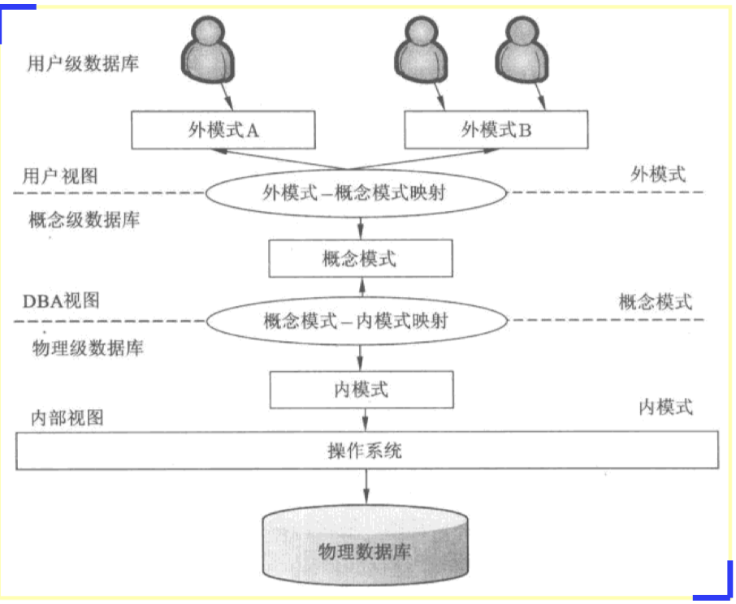

//Description： 记录系统分析中的一些概念和方法，备考软考系统分析师。主要参考书籍《系统分析师》（2010），辅助参考书籍《网络规划设计师》，其中后者用于补充前者所没有的知识点，如软件著作权、新技术等。部分内容大学课程中学过，如《计算机体系结构》、《数据库》、《操作系统》等。整个笔记共分两部分：第一部分为知识点总结，第二部分为笔记及经验。

[toc]

[系统分析师真题](https://www.gkzenti.cn/paper?cls=软考&province=高级_系统分析师)

***
综合知识   
***

# 信息论
现代科学“三论”：信息论、控制论、系统论。  
信息系统的生命周期：系统规划、系统分析、系统设计、系统实现、系统运行与评价。

# 操作系统
## 进程通信方式：PV信号量  
 m个进程n个资源，则PV $\in$ [-m + n， n]
  
## 文件系统
* 索引结构(随机结构)。  
为每个文件建立一个索引表，其中每个表项指出信息所在的物理块号，表目按逻辑记录编写顺序或按记录内某一关键字顺序排列。对于大文件，为检索方便，可以建立多级索引，还可以将文件索引表也作为一个文件(称为索引表文件)。该方式可以满足文件动态增长的要求且存取方便，但建立索引表增加了存储空间的开销，对于多级索引，访问时间开销较大。  
例如，在UNIX系统中，文件的物理结构采用直接、一级、二级和三级间接索引技术，假如索引节点有13个地址项，并且规定地址项0~9采用直接寻址方法，地址项10 采用一级间接寻址，地址项11采用二级间接寻址，地址项12采用三级间接寻址。每个盘块的大小为1KB，每个盘块号占4B，那么，对于访问文件的第356168B处的数据来说；先进行简单换算356168/1024≈348KB，由于地址项0~~9可直接寻址10个物理盘块，每个物理块大小为1KB，所以访问文件的前1OKB范围的数据时是直接寻址。地址项10采用一次间接寻址，即地址项10里存放的是一级索引表的地址，因为每个盘块号占4B，该索引表可存放1024/4-256个物理块的地址，所以当访问文件为10~266KB之间的数据时是一次间接寻址。由于要访问的数据是348KB，所以还有348-266-82KB。  
显然地址项11足够存取这些数据，因此，最多就在地址项11而无须存取地址项12，即只需要二级间接寻址。
* 位示图  
位示图是利用二进制的1位来表示文件存储空间中的1个块的使用情况。一个m行、n列的位示图，可用来描述mXn块的文件存储空间，当行号、列号和块号都是从0开始编号时，第i行、第j列的二进制位对应的物理块号为i * n + j。如果“0”表示对应块空闲，“1”表示对应块已分配，则在进行存储空间的分配时，可顺序扫描位示图。

# 数据通信与计算机网络
## 网络协议
* 应用层协议：FTP、TFTP、HTTP、SMTP、DHCP、Telnet、DNS、简单网络管理协议（Simple Network Management Protocol，SNMP）等  
* 传输层协议：TCP、UDP  
负责提供流量控制、错误校验和排序服务。
* 网络层协议：IP、ICMP、IGMP、ARP、RARP等。
## 网络地址
* 子网掩码
* IPv6中IP地址的长度为128位。
## 局域网和广域网
* IEEE 802.11标准
## 路由选择协议
内部网关协议（IGP）、外部网关协议（EGP）、核心网关协议（GGP）三大类。
## 补充点
* IPsec认证头（AH）不提供数据加密服务。

# 数据库系统
## 数据库模式
数据库系统由外模式、概念模式和内模式三级构成。

## 数据模型  
数据模型一般有两大类：概念数据模型（实体联系模型，E-R模型）和基本数据模型（结构数据模型）
* 关系运算
关系代数的基本运算主要有并、交、差、笛卡尔积、选择、投影、连接和除法运算。
    * (1)并。计算两个关系在集合理论上的并集，即给出关系R和S(两者有相同元列数)，RUS的元组包括R和所有元组的集合。
    * (2)差。计算两个关系的区别的集合，即给出关系R和S(两者有相同元/列数)， R-S的元组包括R中有而S中没有的元组的集合。
    * (3)交。计算两个关系集合理论上的交集，即给出关系R和S(两者有相同元/列数)， R交S的元组包括R和S相同元组的集合。
    * (4)笛卡尔积。计算两个关系的笛卡尔乘积，令R为有m元的关系，S为有n元的关系，则RXS是m+n元的元组的集合，其前m个元素来自R的一个元组，而后n个元素来自S的一个元组。
    * (5)投影。从一个关系中抽取指明的属性(列)。
    * (6)选择。从关系R中抽取出满足给定限制条件的记录。选择运算是从元组(行)的角度进行的运算。
    * (7) $\theta$ 连接。$\theta$ 连接从两个关系的笛卡儿积中选取属性之间满足一定条件的元组。如果两个关系中进行比较的分量必须是相同的属性组，并且在结果中将重复的属性去掉，则称为自然连接。
    * (8)除。设有关系R（X，Y)与关系S（Z），Y和Z具有相同的属性个数，且对应属性出自相同域。关系R（X，Y) / S（Z）所得的商关系是关系R在属性X上投影的一个子集，该子集和S（Z）的笛卡尔积必须包含在R（X，Y)中，记为R/S
## 范式（Normal Form，NF）
目前共定义了多个范式，分别为1NF，2NF，3NF，BCNF，4NF，5NF。
* 第一范式（1NF）
当且仅当所有属性只包含原子值，即每个分量都是不可再分的数据项。
* 第二范式（2NF）
当且仅当关系模型R满足1NF，且每个非键属性完全依赖于候选键。
* 第三范式（3NF）
当且仅当关系模型R满足1NF，且R中没有非键属性传递依赖于候选键。
* BCNF
当且仅当关系模型R满足1NF，且R中没有属性传递依赖于候选键。
* 第四范式（4NF）
当且仅当关系模型R满足1NF，若对任一多值依赖X->Y，X必包含R的候选键。
## 无损联接分解和保持函数依赖
## 数据库的控制功能
DBMS运行的基本工作单位是事务，事务是用户定义的一个数据库操作序列，这些操作序列要么全做，要么全不做，是一个不可分割的工作单位。事务具有以下特性：
* (1)原子性(Atomicity)。事务是数据库的逻辑工作单位，事务的原子性保证事务包含的一组更新操作是原子不可分的，也就是说，这些操作是一个整体，不能部分地完成。
* (2)一致性(Consistency)。一致性是指使数据库从一个一致性状态变到另一个一致性状态。例如，在转账的操作中，各账户金额必须平衡。一致性与原子性是密切相关的， 一致性在逻辑上不是独立的，它由事务的隔离性来表示。
* (3)隔离性(lsolation)。隔离性是指一个事务的执行不能被其他事务干扰，即一个事务内部的操作及使用的数据对并发的其他事务是隔离的，并发执行的各个事务之间不能互相干扰。它要求即使有多个事务并发执行，但看上去每个事务按串行调度执行一样。
这一性质也称为可串行性，也就是说，系统允许的任何交错操作调度等价于一个串行调度。
* (4)持久性(Durability)。持久性也称为永久性，是指事务一旦提交，改变就是永久性的，无论发生何种故障，都不应该对其有任何影响。
## 数据库设计与建模
基于数据库系统生命周期的数据库设计可分为如下5个阶段：规划、需求分析、概念设计、逻辑设计和物理设计。
### 概念设计  
在数据库的概念设计过程中，先设计各子系统的局部E-R图，其设计过程是，首先， 确定局部视图的范围：然后，识别实体及其标识，确定实体之间的联系：最后，分配实体及联系的属性。各子系统的局部E-R图设计好后，下一步就是要将所有的分ER图综合成一个系统的总体E-R图，一般称为视图的集成。
> 各局部E-R图之间的冲突主要有三类：属性冲突、命名冲突和结构冲突。  
在初步的ER图中，可能存在一些冗余的数据和实体间冗余的联系。冗余数据和冗余联系容易破坏数据库的完整性，给数据库维护增加困难，应当予以消除。消除冗余的主要方法为分析方法，即以数据字典和数据流图为依据，根据数据字典中关于数据项之间逻辑关系的说明来消除冗余。
* 数据一致性实现方式：
    * 应用程序实现:在进行添加、修改、删除操作时,从应用程序中,控制对两个数据表都进行相关操作,以保障数据的一致性。 
    * 触发器实现:在应用程序中,只对单个表进行操作。但写触发器,当单个表发生变化时同步更新到另一个表中。 
    * 物化视图实现:建立物化视图,物化视图会把相应的数据物理存储起来,而且在单个表发生变化时,会自动更新。
### 逻辑设计  
也称为逻辑结构设计,其任务是将概念模型转化为某个特定的DBMS上的逻辑模型。设计逻辑结构时,首先为概念模型选定一个合适的逻辑模型(例如,关系模型、网状模型或层次模型),然后将其转化为由特定DBMS支持的逻辑模型,最后对逻辑模型进行优化。
## 数据仓库技术
数据处理大致可以分为两大类：
* 联机事务处理（On-Line Transaction Processing， OLTP）  
传统数据库的主要应用，支持基本的、日常的事务处理；  
* 联机分析处理（On-Line Analytical Processing， OLAP）   
数据仓库系统的主要应用，支持复杂的分析操作，侧重决策支持，并且提供直观易懂的结果。  
> 基本多维分析操作有钻取、切片和切块、旋转等。
## 数据仓库
数据仓库的真正关键是数据的存储和管理。数据仓库的组织管理方式决定了它有别于传统数据库，同时也决定了其对外部数据的表现形式。要决定采用什么产品和技术来建立数据仓库的核心，则需要从数据仓库的技术特点着手分析。针对现有各业务系统的数据，进行抽取、清理，并有效集成，按照主题进行组织，整个过程可以简称为抽取、转换和加载(Extraction-Transformation-Loading，ETL)过程。
## 数据挖掘技术
* 空间数据挖掘（Spatial Data Mining，SDM）
* 多媒体数据挖掘（Multimedia Data Mining， MDM）
* 文本数据挖掘（Text Data Mining，SDM）
## 补充点
### MySql和NoSql
｜---｜---｜---｜  
｜特征 ｜ 关系数据库 ｜ NoSql ｜  
｜ 数据一致性 ｜ 实时一致性 ｜ 弱一致性 ｜  
｜ 数据类型 ｜ 结构化数据｜ 非结构化 ｜  
｜ 事务 ｜ 高事务性｜ 弱事务性 ｜  
｜ 水平扩展 ｜ 弱 ｜ 强 ｜  
｜ 数据容量 ｜ 有限数据 ｜ 海量数据 ｜
### 数据同步
1. 通过定时任务机制做定期数据更新。
2. 通过触发器完成数据同步。
3. 通过数据库插件完成数据同步。
### 大数据表
将数据进行水平或垂直分割

# 系统配置与性能评价
## 计算机层次体系结构
计算机系统是一个硬件和软件的综合体，可以把它看作是按功能划分的多级层次结构。这种结构的划分，有利于正确理解计算机系统的工作过程，明确软件、硬件在系统中的地位和作用。
* (1)硬联逻辑级。这是计算机的内核，由门、触发器等逻辑电路组成。
* (2)微程序级。这一级的机器语言是微指令集，程序员用微指令编写的微程序一般直接由硬件执行。
* (3)传统机器级。这一级的机器语言是该机的指令集，程序员用机器指令编写的程序可以由微程序进行解释。
* (4)操作系统级。从操作系统的基本功能来看，一方面它要直接管理传统机器中的软硬件资源，另一方面它又是传统机器的延伸。
* (5)汇编语言级。这一级的机器语言是汇编语言，完成汇编语言翻译的程序称为汇编程序。
* (6)高级语言级。这一级的机器语言就是各种高级语言，通常用编译程序来完成高级语言翻译的工作。
* (7)应用语言级。这一级是为了使计算机满足某种用途而专门设计的，因此，这一级的机器语言就是各种面向问题的应用语言。
## 存储器系统
存储器中数据常用的存取方式有顺序存取、直接存取、随机存取和相联存取等4种。
* 主存
    * 随机存取存储器(Random Access Memory， RAM)既可以写入也可以读出，但断电后信息无法保存，因此只能用于暂存数据。
    * 只读存储器(Read Only Memory， ROM)可以看作RAM的一种特殊形式，其特点是：存储器的内容只能随机读出而不能写入。
* 辅存
    * 廉价磁盘冗余阵列(Redundant Array of Inexpensive Disks，RAID)技术旨在缩小日益扩大的CPU速度和磁盘存储器速度之间的差距。其策略是用多个较小的磁盘驱动器替换单一的大容量磁盘驱动器，同时合理地在多个磁盘上分布存放数据以支持同时从多个磁盘进行读写，从而改善了系统的I/O性能。
* *缓存（Cache）
    * 映射机制
    冲突概率：直接映射 > 组相联映射 > 全相联映射
    * 替换算法
        * 随机算法。
        * 先进先出算法（FIFO）
        * 近期最少使用算法（LRU） -- 实现起来比较复杂，系统开销较大。
## 虚拟存储技术（Virtual Storage）
## 输入输出方式
在计算机中，1/O系统可以有5种不同的工作方式，分别是程序控制方式、程序中断方式、DMA工作方式、通道方式、I/O处理机。
* 程序控制方式：又分为无条件传送和程序查询（占用主机CPU时间最多）两种方式。
* <b>DMA工作方式</b>：为了在主存 <-> 外设之间实现高速、批量数据交换。
## 指令系统 
* 复杂指令系统（CISC）
    * 指令数量众多
    * 支持多种寻址方式
    * 以微程序控制为主
* 精简指令系统（RISC）
    * 指令数量少
    * 寻址方式少
    * 以硬布线逻辑控制为主
    * CPU中通用寄存器数量多
## 流水线技术
* 时空图
* 吞吐率（Though Put rate，TP） -- 在单位时间内流水线所完成的任务数量或输出的结果数量。
当流水线中各个流水段的执行时间不完全相等时，吞吐率由执行时间最长的流水段决定。
* 加速比（Speedup Ratio） -- 完成同一批任务，不使用流水线所用的时间和使用流水线所用的时间之比。
## 多处理机系统
主要目的是实现作业级和任务级代码的并行性。
* Flynn分类：单指令流单数据流（SISD）、单指令流多数据流（SIMD）、多指令流单数据流（MDISD）、多指令流多数据流（MIMD）。
## 系统性能
* 系统性能设计
计算机系统的性能一般包括两个大的方面。一个方面是它的可靠性或可用性，也就是计算机系统能正常工作的时间，其指标可以是能够持续工作的时间长度(例如，平均无故障时间)，也可以是在一段时间内，能正常工作的时间所占的百分比：另一个方面是它的处理能力或效率，这又可分为三类指标，第一类指标是吞吐率(例如，系统在单位时间内能处理正常作业的个数)，第二类指标是响应时间(从系统得到输入到给出输出之间的时间)，第三类指标是资源利用率，即在给定的时间区间中，各种部件(包括硬设备和软件系统)被使用的时间与整个时间之比。
* 系统性能评估
性能评估的常用方法有时钟频率法、指令执行速度法、等效指令速度法、数据处理速率法、综合理论性能法和基准程序法等。  
    * 基准程序法 -- 上述性能评估方法主要是针对CPU(有时包括主存)的性能，但没有考虑诸如1/0结构、操作系统、编译程序的效率等对系统性能的影响，因此，难以准确评估计算机系统的实际性能。

# UML 
## UML的结构 
UML的结构包括构造块、规则和公共机制三个部分。
* (1)构造块。UML有三种基本的构造块，分别是事物(thing)、关系(relationship) 和图(diagram)。事物是UML 的重要组成部分，关系把事物紧密联系在一起，图是多个相互关联的事物的集合。
* (2)公共机制。公共机制是指达到特定目标的公共UML方法，主要包括规格说明(详细说明)、修饰、公共分类(通用划分)和扩展机制4种。规格说明是事物语义的细节描述，它是模型真正的核心；UML为每个事物设置了一个简单的记号，还可以通过修饰来表达更多的信息；UML包括两组公共分类：类与对象(类表示概念，而对象表示具体的实体)、接口与实现(接口用来定义契约，而实现就是具体的内容)：扩展机制包括约束(扩展了UML构造块的语义，允许增加新的规则或修改现有的规则)、构造型(扩展UML的词汇，用于定义新的构造块)和标记值(扩展了UML构造块的特性，允许创建新的特殊信息来扩展事物的规格说明)。
* (3)规则。规则是构造块如何放在一起的规定，包括为构造块命名：给一个名字以特定含义的语境，即范围；怎样使用或看见名字，即可见性；事物如何正确、一致地相互联系，即完整性；运行或模拟动态模型的含义是什么，即执行。
## UML的视图 
UML对系统架构的定义是系统的组织结构，包括系统分解的组成部分，以及它们的关联性、交互机制和指导原则等提供系统设计的信息。具体来说，就是指以下5个系统视图： 
* (1)逻辑视图。逻辑视图也称为设计视图，它表示了设计模型中在架构方面具有重要意义的部分，即类、子系统、包和用例实现的子集。
* (2)进程视图。进程视图是可执行线程和进程作为活动类的建模，它是逻辑视图的一次执行实例，描述了并发与同步结构。
* (3)实现视图。实现视图对组成基于系统的物理代码的文件和构件进行建模。
* (4)部署视图。部署视图把构件部署到一组物理节点上，表示软件到硬件的映射和分布结构。
* (5)用例视图。用例视图是最基本的需求分析模型。
## 事物 
UML中的事物也称为建模元素，包括结构事物(Structural Things)、行为事物(Behavioral Things，动作事物)、分组事物(GroupingThings)和注释事物(Annotational Things，注解事物)。这些事物是UML模型中最基本的OO构造块。
* (1)结构事物。结构事物在模型中属于最静态的部分，代表概念上或物理上的元素。UML有7种结构事物，分别是类、接口、协作、用例、活动类、构件和节点。
    > 类是描述具有相同属性、方法、关系和语义的对象的集合，一个类实现一个或多个接口；  
    > 接口是指类或构件提供特定服务的一组操作的集合，接口描述了类或构件的对外的可见的动作；  
    > 协作定义了交互的操作，是一些角色和其他事物一起工作，提供一些合作的动作，这些动作比事物的总和要大；
    > 用例是描述一系列的动作，产生有价值的结果。在模型中用例通常用来组织行为事物。用例是通过协作来实现的：
    > 活动类的对象有一个或多个进程或线程。活动类和类很相似，只是它的对象代表的事物的行为和其他事物是同时存在的； 
    > 构件是物理上或可替换的系统部分，它实现了一个接口集合；
    > 节点是一个物理元素，它在运行时存在，代表一个可计算的资源，通常占用一些内存和具有处理能力。一个构件集合一般来说位于一个节点，但有可能从一个节点转到另一个节点。
* (2)行为事物：行为事物是UML模型中的动态部分，代表时间和空间上的动作。UML有两种主要的行为事物。第一种是交互(内部活动)，交互是由一组对象之间在特定上下文中，为达到特定目的而进行的一系列消息交换而组成的动作。交互中组成动作的对象的每个操作都要详细列出，包括消息、动作次序(消息产生的动作)、连接(对象之间的连接)；第二种是状态机，状态机由一系列对象的状态组成。
* (3)分组事物。分组事物是UML模型中组织的部分，可以把它们看成是个盒子， 模型可以在其中进行分解。UML只有一种分组事物，称为包。包是一种将有组织的元素分组的机制。与构件不同的是，包纯粹是一种概念上的事物，只存在于开发阶段，而构件可以存在于系统运行阶段。
* (4)注释事物。注释事物是UML模型的解释部分。
## 关系 
UML用关系把事物结合在一起，主要有下列4种关系。
* (1)依赖(dependency)。依赖是两个事物之间的语义关系，其中一个事物发生变化会影响另一个事物的语义。
* (2)关联(association)。关联描述一组对象之间连接的结构关系。
* (3)泛化(generalization)。泛化是一般化和特殊化的关系，描述特殊元素的对象可替换一般元素的对象。
* (4)实现(realization)。实现是类之间的语义关系，其中的一个类指定了由另一个类保证执行的契约。
## 图
UML2.0包括14种图。
* (1)类图(Class Diagram)。类图描述一组类、接口、协作和它们之间的关系。在OO系统的建模中，最常见的图就是类图。类图给出了系统的静态设计视图，活动类的类图给出了系统的静态进程视图。
* (2)对象图(Object Diagram)。对象图描述一组对象及它们之间的关系。对象图描述了在类图中所建立的事物实例的静态快照。和类图一样，这些图给出系统的静态设计视图或静态进程视图，但它们是从真实案例或原型案例的角度建立的。
* (3)构件图(Component Diagram)。构件图描述一个封装的类和它的接口、端口， 以及由内嵌的构件和连接件构成的内部结构。构件图用于表示系统的静态设计实现视图。构件图是类图的变体。
* (4)组合结构图(Composite Structure Diagram)。组合结构图描述结构化类(例如， 构件或类)的内部结构，包括结构化类与系统其余部分的交互点。组合结构图用于画出结构化类的内部内容， 
* (5)用例图(Use Case Diagram)。用例图描述一组用例、参与者及它们之间的关系。用例图给出系统的静态用例视图。这些图在对系统的行为进行组织和建模时是非常重要的。
* (6)顺序图(Sequence Diagram，序列图)。顺序图是一种交互图(interaction diagram)，交互图展现了一种交互，它由一组对象或参与者以及它们之间可能发送的消息构成。交互图专注于系统的动态视图。顺序图是强调消息的时间次序的交互图。  
顺序图的基本元素包括：对象、生命线和消息。
* (7)通信图(Communication Diagram)。通信图也是一种交互图，它强调收发消息的对象或参与者的结构组织。顺序图和通信图表达了类似的基本概念，但它们所强调的概念不同，顺序图强调的是时序，通信图强调的是对象之间的组织结构(关系)。在UML 1.X版本中，通信图称为协作图(Collaboration Diagram)。
* (8)定时图(Timing Diagram，计时图)。定时图也是一种交互图，它强调消息跨越不同对象或参与者的实际时间，而不仅仅只是关心消息的相对顺序。
* (9)状态图(State Diagram)。状态图描述一个状态机，它由状态、转移、事件和活动组成。状态图给出了对象的动态视图。它对于接口、类或协作的行为建模尤为重要， 而且它强调事件导致的对象行为，这非常有助于对反应式系统建模。
* (10)活动图(Activity Diagram)。活动图将进程或其他计算结构展示为计算内部步步的控制流和数据流。活动图专注于系统的动态视图。它对系统的功能建模和业务流程建模特别重要，并强调对象间的控制流程， 
* (11)部署图(Deployment Diagram)。部署图描述对运行时的处理节点及在其中生存的构件的配置。部署图给出了架构的静态部署视图，通常一个节点包含一个或多个部署图。
* (12)制品图(Artifact Diagram)。制品图描述计算机中一个系统的物理结构。制品包括文件、数据库和类似的物理比特集合。制品图通常与部署图一起使用。制品也给出了它们实现的类和构件， 
* (13)包图(Package Diagram)。包图描述由模型本身分解而成的组织单元，以及它们之间的依赖关系。
* (14)交互概览图(lnteraction Overview Diagram)。交互概览图是活动图和顺序图的混合物。  
静态视图主要包括：用例图、类图、包图。  
交互视图主要包括：序列图、协作图。  

## 用例模型 
在OOA方法中，构建用例模型一般需要经历4个阶段，分别是识别参与者、合并需求获得用例、细化用例描述和调整用例模型， 其中前三个阶段是必需的。
* 用例图的元素
    * (1)参与者。参与者是指存在于系统外部并与系统进行交互的任何事物，既可以是使用系统的用户，也可以是其他外部系统和设备等外部实体。
    * (2)用例。用例是在系统中执行的一系列动作，这些动作将生成特定参与者可见的价值结果。也就是说，用例表示系统所提供的服务，它定义了系统是如何被参与者所使用的，它描述的是参与者为了使用系统所提供的某一完整功能而与系统之间发生的一段对话。
    * (3)通信关联。通信关联表示的是参与者和用例之间的关系，或用例与用例之间的关系。箭头表示在这一关系中哪一方是对话的主动发起者，箭头所指方是对话的被动接受者，箭尾所指方是对话的主动发起者。如果不想强调对话中的主动与被动关系，可以使用不带箭头的关联实线。在用例模型中，信息流不是由通信关联来表示的，该信息流是默认存在的，并且是双向的，它与箭头所指的方向没有关系。
* 用例规约(use case specification)
## 用例之间的关系 
主要有包含、扩展和泛化。
* (1)包含关系。当可以从两个或两个以上的用例中提取公共行为时，应该使用包含关系来表示它们。其中这个提取出来的公共用例称为抽象用例，而把原始用例称为基本用例或基础用例。
* (2)扩展关系。如果一个用例明显地混合了两种或两种以上的不同场景，即根据情况可能发生多种分支，则可以将这个用例分为一个基本用例和一个或多个扩展用例，这样使描述可能更加清晰。
* (3)泛化关系。当多个用例共同拥有一种类似的结构和行为的时候，可以将它们的共性抽象成为父用例，其他的用例作为泛化关系中的子用例。
## 类的职责和关系
类的职责包括两个方面的内容，一个是类所维护的知识，即成员变量或属性；另一个是类能够执行的行为，即成员方法或责任。  

* 关联关系
* 依赖关系
* 泛化关系
* 共享聚集/聚合关系 -- 部分可能同时属于多个整体
* 组合聚集/组合关系 -- 部分只属于一个整体
* 实现关系

# 企业信息化战略与实施
## 企业信息化方法：
    > 业务流程重组方法（BPR） -- 根本性、彻底性、显著性和流程是BPR强调的4个核心内容。  
    > 核心业务应用方法  
    > 信息系统建设方法  
    > 主题数据库方法  
    > 资源管理方法  
## 企业信息化规划
    * 企业战略规划 -- 用机会和威胁评价现在和未来的环境，用优势和劣势评价企业现状，进而选择和确定企业的总体和长远目标，制定和抉择实现目标的行动方案。
    * 信息系统战略规划 -- 如何通过信息系统来支撑业务流程的运作，进而实现企业的关键业务目标，其重点在于对信息系统远景、组成架构、各部分逻辑关系进行规划。
    * 信息技术战略规划 （IT战略规划） -- 在信息系统规划的基础上，对支撑信息系统运行的硬件、软件、支撑环境等进行具体的规划。
    * 信息资源规划 -- 为开展具体的信息化建设项目而进行的数据需求分析、信息资源标准建立、信息资源整合工作。
## 企业战略和信息化战略集成方法
    业务与IT整合（BITA）、企业IT架构（EITA）
## 信息系统开发方法 
    确定系统边界->
        * 结构化方法/生命周期法
            * 结构化分析（SA）
            * 结构化设计（SD）
            * 结构化程序设计（SP）
        * 面向对象方法（OO）
            * 面向对象的分析（OOA）
            * 面向对象的设计（OOD）
            * 面向对象的程序设计（OOP）
        * 面向服务方法（SO）
            * 操作
            * 服务
            * 业务流程
        * 原型化方法/快速原型法
## 信息系统战略规划方法（ISSP）
    * 企业系统规划法（BSP） -- 主要用于大型信息系统的开发。
    * 关键成功因素法（CSF） -- 找到影响系统成功的关键因素，进行分析以确定企业的信息需求。
    * 战略集合转化法（SST） -- 将企业战略看成是一个信息集合。
    * 战略数据规划法（SDP） -- 数据处理。
    * 信息工程方法（IE） -- 信息战略规划阶段、业务领域分析阶段、系统设计阶段、系统构建阶段。
    * 战略栅格法（SG） -- 利用栅格表/矩阵依据现有信息系统和规划中的信息系统的战略影响，确定不同的信息系统战略规划条件。
    * 价值链分析法（VCA） -- 视企业为一系列的输入、处理与输出的活动序列集合。
    * 战略一致性模型（SAM） -- 把企业战略的目标转化为信息系统战略的目标。
## 企业资源规划和实施
    * 企业资源规划（ERP） -- 企业资源可以归纳为：物流、资金流、信息流。
## 信息资源管理（IRM） -- 包括数据资源管理和信息处理管理。
    * 信息资源规划（IRP） -- 对企业生产经营活动所需要的信息，对产生、获取、处理、存储、传输和利用等方面进行全面的规划。
## 企业信息系统
 * 客户关系管理（CRM） -- 核心是客户价值管理。  
* 供应链管理（SCM） -- 由供应商、制造商、仓库、配送中心和渠道商等构成的物流网络。  
* 产品数据管理（PDM） -- 管理所有与产品相关信息（包括零件信息、配置、文档、计算机辅助设计文件、结构、权限信息等）和所有与产品相关过程（包括过程定义和管理）的技术。  
    * 核心功能：数据库和文档管理、产品结构与配置管理、生命周期管理和流程管理。
* 产品生命周期管理（PLM） -- 产品的生命周期一般包括5个阶段，分别是培育期(概念期)、成长期、成熟期、衰退期、结束期(报废期)5个阶段。  
* 知识管理（KM） -- 知识可分为两类，即显性知识(Explicit Knowledge)与隐性知识(Tacit Knowledge)。通常，可以把知识管理工具分为知识生成工具、知识编码工具和知识转移工具三大类。  
* 商业智能（BI） -- BI系统主要包括数据预处理、建立数据仓库、数据分析和数据展现4个主要阶段。
    * 数据预处理是整合企业原始数据的第一步，它包括数据的抽取(extraction)、转换(transfomation)和加载(load)三个过程(ETL过程)。
    * 建立数据仓库则是处理海量数据的基础；
    * 数据分析是体现系统智能的关键，一般采用OLAP和数据挖掘两大技术。  
* 企业门户（EP）  
    * 企业网站 -- 注重信息的单向传送
    * 企业信息门户 -- 多业务系统的集成
    * 企业知识门户（Enterprise Knowledge Protal，EKP）
    * 企业应用门户（Enterprise Application Protal，EAP） -- 对企业业务流程的集成。
* 电子商务（EC）  
* 决策支持系统（DSS） -- DSS基本结构主要由4个部分组成：数据库子系统、模型库子系统、推理部分和用户接口子系统。
## 电子政务
    政府对政府（G2G）、政府对企业（G2B）、政府对公众（G2C）、政府对公务员（G2E）。
## 企业应用集成（EAI）
将多个企业信息系统连接起来，实现无缝集成。可以包括表示集成/界面集成、数据集成、控制集成/API集成和业务流程集成等。
* 事件驱动架构（EDA） -- 订阅方式通过消息代理传输，一个事件可以传送给多个订阅者。
    * 订阅-发布模式（Subscript/Publish）
    * 动态接收表模式（Dynamic List）
    * 消息存储库模式（Message Store）
    * 文件传输模式（File Transfer）

# 软件工程
## 软件开发模型 
大体上可分为三种类型。第一种是以软件需求完全确定为前提的瀑布模型；第二种是在软件开发初始阶段只能提供基本需求时采用的迭代式或渐进式开发模型，例如，喷泉模型、螺旋模型、统一开发过程和敏捷方法等，第三种是以形式化开发方法为基础的变换模型。
* 瀑布模型 -- 将软件开发的过程分为软件计划、需求分析、软件设计、程序编码、软件测试和运行维护6个阶段，形如瀑布流水，最终得到软件产品。    
    * 快速应用开发（RAD）
> 软件开发生命周期(Software Development Life Cycle， SDLC)
* 统一过程（UP）-- RUP中的软件过程在时间上被分解为4个顺序的阶段，分别是初始阶段基本产品定义、细化阶段架构、构建阶段和移交阶段。
* 敏捷方法 -- 目前，主要的敏捷方法有极限编程(eXtreme Programming，XP)、自适应软件开发(Adaptive Software Development，ASD)、水晶方法(Crystal)、特性驱动开发(Feature Driven Development， FDD)、动态系统开发方法(Dynamic Systems Development Method， DSDM)、测试驱动开发(Test-Driven Development，TDD)、敏捷数据库技术(Agile Database Techniques，AD)和精益软件开发(Lean Software Development)等。
## 软件能力成熟度模型(Capability Maturity Model， CMM) 
    CMM的5个成熟度等级分别为初始级、可重复级、已定义级、已管理级和优化级。

# 系统规划
## 系统规划的主要步骤
* (1)对现有系统进行初步调查。根据企业战略和发展目标，从类似企业和本企业内部收集各种信息，站在管理层的高度观察企业的现状，分析现有系统的运行状况。
* (2)分析和确定系统目标。系统目标应包括服务的质量和范围、政策、组织和人员等，它不仅包括信息系统的目标，还要反映整个企业的目标。
* (3)分析子系统的组成和基本功能。自顶向下对系统进行划分，并且详细说明各个子系统应该实现的功能。
* (4)拟定系统的实施方案。可以对子系统的优先级进行设定，以便确定子系统的开发顺序。
* (5)进行系统的可行性（Feasibility）研究，编写可行性研究报告，召开可行性论证会。
    * 1.经济可行性 -- 也称为投资收益分析或成本效益分析，主要评估项目的建设成本、运行成本和项目建成后可能的经济收益。
    * 2.技术可行性 -- 技术可行性也称为技术风险分析，研究的对象是信息系统需要实现的功能和性能， 以及技术能力约束。
    * 3.法律可行性 -- 法律可行性也称为社会可行性，具有比较广泛的内容，它需要从政策、法律、道德、制度等社会因素来论证信息系统建设的现实性。
    * 4.用户使用可行性 -- 用户使用可行性也称为执行可行性，是从信息系统用户的角度来评估系统的可行性，包括企业的行政管理和工作制度、使用人员的素质和培训要求等，可以细分为管理可行性和运行可行性。
* (6)制订系统建设方案。对可行性研究报告中提出的各项技术指标进行分析、比较，落实各项假设的前提条件，制订系统建设方案。
## 成本效益分析 
按照成本性态分类，可以分为固定成本、变动成本和混合成本。
    * (1)固定成本。固定成本是指其总额在一定期间和一定业务量范围内，不受业务量变动的影响而保持固定不变的成本。
    * (2)变动成本。变动成本也称为可变成本，是指在一定时期和一定业务量范围内其总额随着业务量的变动而成正比例变动的成本。
    * (3)混合成本。混合成本就是混合了固定成本和变动成本的性质的成本。
* 净现值（Net Present Value，NPV）  
$NPV = \sum Ci / (1 + i)^t$ 

# 系统分析
## 详细调查 
深入了解企业管理工作中信息处理的全部具体情况和存在的具体问题，为提出新系统的逻辑模型提供可靠的依据。  
详细调查的<b>主要内容</b>有现有系统的运行环境和状况、组织结构、业务流程、系统功能、数据资源与数据流程、资源情况、约束条件和薄弱环节等。
## 现有系统分析 
在系统规划阶段，对现有系统进行了初步调查，为提出新系统建议方案及其在技术上是否具有可行性提供原始资料。在系统分析阶段，对现有系统进行了详细调查，为系统逻辑模型的建立提供资料。
## 系统功能分析
确定了系统的所有功能后,还需要分析各功能之间的关系和流程,一般使用功能流程图来描述。功能流程图可以检验是否识别出所有的功能,判定系统分析师是否理解了系统功能,也是以后进行系统设计的基础。
## 业务流程
* 企业业务流程 
企业业务流程包含三个要素,分别是实体、对象和活动。业务流程发生在实体之间, 它们可以是企业间的、功能间的,也可以是人与人之间的；业务流程的功能就是对对象进行操作,这些对象既可以是物理的(例如,订单等),也可以是逻辑的(例如,信息等)； 业务流程涉及管理活动和业务操作活动。
* 业务流程建模
    * 标杆瞄准（Bench marking） -- 通过分析和评价，确定出代表最佳实践的经营过程和工作过程，以便合理地确定本企业的业务流程。
    * 集成定义方法（Integration DEFinition method，IDEF） -- IDEF是一系列建模、分析和仿真方法的统称,从IDEFO到IDEF14(包括IDEFIX 在内)共有16套方法,每套方法都是通过建模程序来获取某个特定类型的信息。它们分别是DEFO(功能建模)、IDEF1(信息建模、DEFlX(数据建模)、IDEF2(仿真建模设计)、IDEF3(过程描述获取)、DEF4(面向对象设计)、IDEFS(本体论描述获取)、IDEF6(设计原理获取)、DEF7(信息系统审计)、DEF8(用户界面建模、DEF9(场景驱动信息系统设计)、DEF10(实施架构建模)、IDEF11(信息制品建模、IDEF12(组织建模)、IDEF13(三模式映射设计)和IDEF14(网络规划)。
    * DEMO -- 定义了信息系统中行为角色之间的通信方式。
    * Petri网 -- 适用于多种系统的图形化、数学化建模工具。
* 业务流程分析
    * 价值链分析法
    * 客户关系分析法
    * 供应链分析法
    * 基于ERP的分析法
    * 业务流程重组
## 业务流程分析工具：业务流程图（TFD）、业务活动图示（BAM）、UML的活动图等。
* TFD是分析和描述现有系统的传统工具,是业务流程调查结果的图形化表示。它反映现有系统各部门的业务处理过程和它们之间的业务分工与联系,以及连接各部门的物流、信息流的传递和流动关系,体现现有系统的边界、环境、输入、输出、处理和数据存储等内容。TFD是一种用尽可能少、尽可能简单的方法,描述业务处理过程的方法。  
业务流程图（TFD）的基本符号 
* 业务活动图（BAM）的基本符号 
## 数据与数据流程分析
> 数据的动态特性有三种：固定值属性、固定个体变动属性、随机变动属性。
* 固定值属性 -- 其值一般不随时间而改变
* 固定个体变动属性 -- 对总体具有相对固定的个体集，对个体其值是变动的。如库存余额。
* 随机变动属性 -- 如月累计销售量。

# 软件需求工程
> 质量功能部署（QFD）
## 需求获取
* 用户访谈 -- 是最基本的一种需求获取手段，其形式包括结构化和非结构化两种。结构化是指事先准备好一系列问题，有针对地进行；而非结构化则是只列出一个粗略的想法， 根据访谈的具体情况发挥。最有效的访谈是结合这两种方法进行。用户访谈具有良好的灵活性，有较宽广的应用范围。但是，也存在着许多困难，例如，用户经常较忙，难以安排时间；面谈时信息量大，记录较为困难；沟通需要很多技巧，同时需要系统分析师具有足够的领域知识等。
* 问卷调查 -- 与用户访谈相比，问卷调查可以在短时间内，以低廉的代价从大量的回答中收集数据；问卷调查允许回答者匿名填写，大多数用户可能会提供真实信息；问卷调查的结果比较好整理和统计。问卷调查最大的不足就是缺乏灵活性。
* 采样 -- 采样是指从种群中系统地选出有代表性的样本集的过程，通过认真研究所选出的样本集，可以从整体上揭示种群的有用信息。通过采样技术，选择部分而不是选择种群的全部，不仅加快了数据收集的过程，而且提高了效率，从而降低了开发成本。另外，采样技术使用了数理统计原理，能减少数据收集的偏差。但是，由于采样技术基于统计学原理，样本规模的确定依赖于期望的可信度和己有的先验识，很大程度上取决于系统分析师的主观因素，对系统分析师个人的经验和能力依赖性很强，要求系统分析师具有较高的水平和丰富的经验。
* 情节串联板
* 联合需求计划（JRP） -- 是一个通过高度组织的群体会议来分析企业内的问题并获取需求的过程，它是联合应用开发(Joint Application Development，JAD)的一部分。
* 需求记录技术 -- 任务卡片、场景说明、用户故事、Volere白卡。
## 需求分析
方法主要有SA方法、OOA方法和面向问题域的分析(Problem Domain Oriented Analysis， PDOA)方法。另外， 还有一些形式化方法，例如，VDM(Vienna Design Method)和Z等。需求分析的形式化方法由于实用性不强，一般用在学术研究中。
* 结构化分析方法（SA）-- 数据字典中一般有6类条目，分别是数据元素、数据结构、数据流、数据存储、加工逻辑和外部实体。
* 使用E-R图表示数据模型，用DFD（Data Flow Diagram）图表示功能模型，用状态转换图aSTD（State Transform Diagram）图表示行为模型。
* 面向对象的分析方法（OOA）
* 使用用例图、类图、交互图
## 软件需求规格说明书（SRS）

# 软件架构设计
* 软件架构（Software Architecture）
## 软件复用(SoftWare Reuse)
可复用性(可重用性)是指系统和(或)其组成部分能在其他系统中重复使用的程度。软件开发的全生命周期都有可复用的价值,包括项目的组织、软件需求、设计、文档、实现、测试方法和测试用例,都是可以被重复利用和借鉴的有效资源。可复用性体现在软件的各个层次,遍用的、可复用性高的软件模块往往已经由操作系统或开发工具提供,例如,通用库、标准构件和模板库等,它们并不需要程序员重新开发。  
是将已有软件的各种有关知识用于建立新的软件，以缩减软件开发和维护的花费。软件复用是提高软件生产力和质量的一种重要技术。早期的软件复用主要是代码级复用，被复用的知识专指程序，后来扩大到包括领域知识、开发经验、设计决定、体系结构、需求、设计、代码和文档等一切有关方面。
## 构件(component) 
也称为组件，是一个功能相对独立的具有可复用价值的软件单元。
## 构件标准 
目前，主流的构件标准有对象管理集团(Object Management CGroup， OMG)的CORBA、Microsoft的构件对象模型(Component Object Model，COM)和分布式构件对象模型(Distributed Component Object Model， DCOM)和Sun的Java企业Bean (Enterprise JavaBean， EJB)。
## 遗留工程（Legacy Engineering）
## 软件架构模型 
分为五种，分别是结构模型、框架模型、动态模型、过程模型和功能模型。
* (1)结构模型：这是一种最直观和最普遍的建模方法，它以构件、连接件和其他概念来刻画架构，并力图通过架构来反映系统的重要语义内容，包括系统的配置、约束、隐含的假设条件、风格和性质等。研究结构模型的核心是架构描述语言。
* (2)框架模型：框架模型与结构模型类似，但它不太侧重描述结构的细节而更侧重于整体结构。框架模型主要以一些特殊的问题为目标建立只针对和适应该问题的架构。
* (3)动态模型：动态模型是对结构模型或框架模型的补充，研究系统的粗粒度行为性质。例如，描述系统的重新配置或演化等，这类系统通常是激励型的。
* (4)过程模型：过程模型研究构建系统的步骤和过程。
* (5)功能模型：功能模型认为架构是由一组功能构件按层次组成的，下层向上层提供服务。功能模型可以看作是一种特殊的框架模型。
## 面向服务的架构（Service-Oriented Architecture, SOA）
### REST 
表述性状态转移(Representational State Transfer, REST)是一种只使用HTTP和XML进行基于Web通信的技术,可以降低开发的复杂性,提高系统的可伸缩性。它的简单性和缺少严格配置文件的特性。使它与SOAP很好地隔离开来,REST从根本上来说只支持几个操作(POST、GET、PUT和 DELETE),这些操作适用于所有的消息。  
REST 提出了如下一些设计概念和准则:
1. 网络上的所有事物都被抽象为资源。
2. 每个资源对应一个唯一的资源标识。
3. 通过通用的连接件接口对资源进行操作。
4. 对资源的各种操作不会改变资源标识。
5. 所有的操作都是无状态的。
## 软件产品线（Software Product Line）
敏件产品线(Software ProductLine)是一个产品集合,这些产品共享一个公共的、可管理的特征集,这个特征集能满足特定领域的特定需求。软件产品线是一个十分适合专业开发组织的软件开发方法,能有效地提高软件生产率和质量,缩短开发时间,降低总开发成本, 软件产品线主要由两部分组成,分别是核心资源和产品集合。
## 补充点
### MVP（Model View Presenter）
MVP与MVC相比，最在的差异在于层次之类的耦合度不一样。MVP将M与V彻底分离，所有交互均通过P传达，这样，有利于软件构件及架构的重用，也利于修改，有良好的可扩展性。

# 系统设计
系统设计的主要内容包括概要设计和详细设计。概要设计又称为系统总体结构设计, 它是系统开发过程中很关键的一步,其主要任务是将系统的功能需求分配给软件模块, 确定每个模块的功能和调用关系,形成软件的模块结构图,即系统结构图。在概要设计中,将系统开发的总任务分解成许多个基本的、具体的任务,为每个具体任务选择话当的技术手段和处理方法的过程称为详细设计。
## 用户界面设计
人机交互的“黄金三原则”。另外,在设计用户界面时,还需要保证界面的合理性和独特性, 有效进行组合,注重美观与协调:恰到好处地提供快捷方式,注意资源协调等。
* 置于用户控制之下
* 减轻用户的记忆负担
* 保持界面一致性
## 处理流程设计
* 工作流管理系统（WorkFlow Management System，WFMS）
* 工作流参考模型(Workflow Reference Model, WRM)
包含6个基本模块,分别是工作流执行服务、工作流引擎、流程定义工具、客户端应用、调用应用和管理监控工具。这6个模块被认为是WFMS最基本的组成部分,WRM同时也包括了这些模块之间的接口标准,包括接口一、接口二、接口三、接口四和接口五。

    * (1)工作流执行服务。工作流执行服务是WFMS的核心模块,它的功能包括创建和管理流程定义,创建、管理和执行流程实例。
    * (2)工作流引擎。工作流引擎是为流程实例提供运行环境,并解释执行流程实例的软件模块,即负责流程处理的软件模块。
    * (3)流程定义工具。流程定义工具是管理流程定义的工具,它可以通过图形方式把复杂的流程定义显示出来并加以操作,流程定义工具与工作流执行服务交,一般该模块为设计人员提供图形化的用户界面。
* 程序流程图（Program Flow Diagram，PFD）
* 问题分析图（Problem Analysis Diagram，PAD）
* 系统结构图（Structure Chart，SC）
## 结构化设计（Structured Design，SD）
在SD中,这种功能分解就是将系统划分为模块,模块是组成系统的基本单位,它的特点是可以自由组合、分解和变换,系统中任何一个处理功能都可以看成一个模块。
> 模块的扇入和扇出要合理。一个模块的扇出是指该模块直接调用的下级模块的个数:扇出大表示模块的复杂度高,需要控制和协调过多的下级模块。扇出过大一般是因为缺乏中间层次,应该适当增加中间层次的控制模块;扇出太小时可以把下级模块进一步分解成若于个子功能模块,或者合并到它的上级模块中去。一个模块的扇入是指直接调用该模块的上级模块的个数:扇入大表示模块的复用程度高。

## 面向对象设计
在系统设计过程中,类可以分为三种类型:实体类、边界类和控制类。
* 1.实体类  
实体类映射需求中的每个实体,实体类保存需要存储在水久存储体中的信息,例如, 在线教育平台系统可以提取出学员类和课程类,它们都属于实体类。实体类通常都是永久性的,它们所具有的属性和关系是长期需要的,有时甚至在系统的整个生存期都需要。
* 2.控制类  
控制类是用于控制用例工作的类,一般是由动宾结构的短语(“动词+名词”或“名词+动词”转化来的名词。
* 3.边界类  
边界类用于封装在用例内、外流动的信息或数据流。边界类位于系统与外界的交接处,包括所有窗体、报表、打印机和扫描仪等硬件的接口,以及与其他系统的接口。
> 常用的OOD原则包括开闭原则、里氏替换原则、依赖倒置原则、组合/聚合复用原则、接口隔离原则和最少知识原则等。
## 设计模式
根据目的和用途不同,设计模式可分为创建型(creational)模式、结构型(structural) 模式和行为型(behavioral)模式三种。
* 1.创建型模式  
创建型模式对类的实例化过程(即对象的创建过程)进行了抽象,能够使软件模块做到与对象的创建和组织无关。创建型模式隐藏了对象是如何被创建的和组合在一起的, 以达到使整个系统独立的目的。创建型模式包括工厂方法模式、抽象工厂模式、原型模式、单例模式和建造者模式等。
* 2.结构型模式  
结构型模式描述如何将类或对象结合在一起形成更大的结构。结构型模式描述两种不同的事物,即类与类的实例(对象),根据这一点,可以分为类结构型模式和对象结构型模式。结构型模式包括适配器模式、桥接模式、组合模式、装饰模式、外观模式、享元模式和代理模式等。
* Adapter
* Decorator
* Delegation
* Proxy
* 3.行为型模式  
行为型模式是对在不同的对象之间划分责任和算法的抽象化,它不仅仅是关于类和对象的,而且是关于它们之间的相互作用的。行为型模式分为类行为模式和对象行为模式两种,其中类行为模式使用继承关系在几个类之间分配行为,而对象行为模式则使用对象的聚合来分配行为。行为型模式包括职责链模式、命令模式、解释器模式、选代器模式、中介者模式、备忘录模式、观察者模式、状态模式、策略模式、模板方法模式、访问者模式等。

# 系统实现与测试
## 面向方面的程序设计（AOP）
## 测试类型 -- 可分为单元测试、集成测试、配置项测试、系统测试、验收测试和回归测试等类别。
    * 确认测试 -- 主要用于验证软件的功能、性能和其他特性是否与用户需求一致。根据用户的参与程度，通常包括以下4种类型： 
        * (1)内部确认测试。内部确认测试主要由软件开发组织内部按照SRS进行测试。
        * (2)Alpha测试和Beta测试。对于通用产品型的软件开发而言，Alpha测试是指由用户在开发环境下进行测试。通过Alpha测试以后的产品通常称为Alpha版：Beta测试是指由用户在实际使用环境下进行测试，通过Beta测试的产品通常称为Beta版。一般在通过Beta测试后，才能把产品发布或交付给用户。
        * (3)验收测试。验收测试是指针对SRS，在交付前以用户为主进行的测试。

# 系统运行与维护
## 遗留系统（Legacy System）
    * 外部环境评价 -- 系统的外部技术环境是指硬件、支撑软件和企业T基础设施的统一体。
    * 应用软件评价 -- 应用软件评价可以分为系统级和部件级。系统级评价把整个系统看作是不可分割的原子，评价时不考虑系统的任何部分；部件级评价关注系统的每个子系统，考虑每个子系统的特征，包括复杂性、数据、文档、外部依赖性、合法性、维护记录、大小和安全性等指标。
    * 分析评价结果 -- 评价活动将产生硬件、支撑软件、企业叮基础设施和应用软件的特征值矩阵，这些特征值体现了遗留系统当前的技术因素，其加权平均值代表了系统的技术水平。
## 系统转换与交接
    * 数据转换与迁移 -- 程序大致可以分为抽取、转换与装载三个过程。数据抽取、转换是根据新旧系统数据库的映射关系进行的，转换步骤一般还要包含数据清洗的过程，数据清洗主要是针对源数据库中，对出现二义性、重复、不完整、违反业务或逻辑规则等问题的数据进行相应的清洗操作。

# 嵌入式系统分析与设计
## 多任务调试算法
* 可抢占与非抢占算法。可抢占算法是指正在运行的任务可能被其他任务打断, 从而放弃CPU,让其他任务执行;非抢占算法是指任务会一直运行到结束或者等待其他资源而被阻塞,否则不会放弃CPU。

# 系统安全性分析与设计
## 系统安全的分类 
主要包括实体安全、信息安全、运行安全和人员安全等几个部分。
## 系统安全体系结构 
可以将安全防范体系的层次划分为物理层安全、系统层安全、网络层安全、应用层安全和安全管理。
## 数据加密技术
* DES -- 是一种迭代的分组密码，明文和密文都是64位，使用一个56位的密钥以及附加的8位奇偶校验位。攻击DES的主要技术是穷举法，由于DES的密钥长度较短，为了提高安全性，就出现了<b>使用112位密钥对数据进行三次加密的算法(3DES)</b>，即用两个56位的密钥Kl和K2，发送方用K1加密，K2解密，再使用K1加密；接收方则使用K1解密，K2加密，再使用K1解密，其效果相当于将密钥长度加倍。
* IDEA是在DES的基础上发展起来的，类似于3DES。IDEA的明文和密文都是64 位，密钥长度为128位。
* RSA -- RSA算法的密钥长度为512位。
## 认证（authentication）技术
* (1)消息摘要算法(Message Digest algorithm5，MD5)
* (2)安全散列算法。安全散列算法(Secure Hash Algorithm， SHA)能计算出一个数字信息所对应的长度固定的字符串(消息摘要，它对长度不超过264位的消息产生160 位的消息摘要。
## 数字证书 
通常包括版本号、序列号(CA下发的每个证书的序列号都是唯一的)、签名算法标识符、发行者名称、有效期、主体名称、主体的公钥信息、发行者唯一识别符、主体唯一识别符、扩充域、发行者签名(就是CA用自己的私钥对上述数据进行数字签名的结果，也可以理解为是CA中心对用户证书的签名)等信息。 
* 密钥管理基础设施（Key Management Infrastructure，KMI）
* 公钥基础设施（Public Key Infrastructure，PKI）
## 防火墙
一般可以分为包过滤型防火墙、电路级网关型防火墙、应用网关型防火墙、代理服务型防火墙、状态检测型防火墙和自适应代理型防火墙。
* (1)包过滤型防火墙。包过滤型防火墙是在网络层对数据包进行分析、选择，选择的依据是系统内设置的过滤规则(访问控制表)。通过检查每个数据包的源地址、目的地址、端口和协议状态等因素，确定是否允许该数据包通过。包过滤型防火墙的优点是逻辑简单、成本低，易于安装和使用，网络性能和透明性好，通常安装在路由器上。其缺点是很难准确地设置包过滤器，缺乏用户级的授权：包过滤判别的条件位于数据包的头部，由于IPv4的不安全性，很可能被假冒或窃取；是基于网终层的安全技术，不能检测通过高层协议而实施的攻击。
* (2)电路级网关型防火墙。电路级网关型防火墙起着一定的代理服务作用，监视两台计算机建立连接时的握手信息，判断该会话请求是否合法。一旦会话连接有效后，该网关仅复制和传递数据。电路级网关型防火墙在P层代理各种高层会话，具有隐藏内部网络信息的能力，且透明性高。但由于其对会话建立后所传输的具体内容不再作进一步的分析，因此安全性低。
* (3)应用网关型防火墙。应用网关型防火墙是在应用层上实现协议过滤和转发功能， 针对特别的网络应用协议制定数据过滤规则。应用网关通常安装在专用工作站系统上， 由于它工作于应用层，因此具有高层应用数据或协议的理解能力，可以动态地修改过滤规则，提供记录和统计信息。应用网关型防火墙和包过滤型防火墙有一个共同特点，就是它们仅依靠特定的逻辑来判断是否允许数据包通过，一旦符合条件，则防火墙内外的计算机系统建立直接联系，防火墙外部网络能直接了解内部网络结构和运行状态，这大大增加了实施非法访问攻击的机会。
* (4)代理服务型防火墙。代理服务器接收客户请求后，会检查并验证其合法性，如合法，它将作为一台客户机向真正的服务器发出请求并取回所需信息，最后再转发给客户。代理服务型防火墙将内部系统与外界完全隔离开来，从外面只看到代理服务器，而看不到任何内部资源，而且代理服务器只允许被代理的服务通过。代理服务安全性高， 还可以过滤协议，通常认为是最安全的防火墙技术。其不足主要是不能完全透明地支持各种服务和应用，而且会消耗大量的CPU资源，导致系统的低性能。
* (5)状态检测型防火墙。状态检测型防火墙动态记录和维护各个连接的协议状态， 并在网络层对通信的各个层次进行分析与检测，以决定是否允许通过防火墙。因此，状态检测型防火墙兼备了较高的效率和安全性，可以支持多种网络协议和应用，且可以方便地扩展实现对各种非标准服务的支持。
* (6)自适应代理型防火墙。自适应代理型防火墙可以根据用户定义的安全策略，动态适应传送中的分组流量。如果安全要求较高，则最初的安全检查仍在应用层完成。而一且代理明确了会话的所有细节，那么其后的数据包就可以直接经过速度快得多的网络层。因此，此类防火墙兼备了代理技术的安全性和状态检测技术的高效率。
## 安全协议 
主要包括IPSec、SSL、PGP和安全套接字层上的超文本传输协议(Hypertext Transfer Protocol over Secure Socket Layer， HTTPS)等。
* 1. SSL -- SSL是一个传输层的安全协议，用于在Intemet上传送机密文件。SSL协议由握手协议、记录协议和警报协议组成。SSL主要提供三个方面的服务，分别是用户和服务器的合法性认证、加密数据以隐藏被传送的数据和保护数据的完整性。SSL使用40位关键字作为RC4流加密算法。
* 2. HTTPS
* 3. PGP -- PGP是一个基于RSA的邮件加密软件。
* 4. IPSec -- IPSec是一个工业标准网络安全协议
## 虚拟专用网(Virtual Private Network， VPN）
* 隧道技术。隧道技术是VPN的基本技术，类似于点对点连接技术，它在公用网建立一条数据通道(隧道)，让数据包通过这条隧道传输。隧道是由隧道协议形成的， 可分为第二层隧道协议和第三层隧道协议。第二层隧道协议是先将各种网络协议封装到PPP中，再将整个数据包装入隧道协议中。这种双层封装方法形成的数据包靠第二层(数据链路层)协议进行传输。第二层隧道协议主要有L2F(Level 2 Forwarding。第二层转发)协议、PPTP(Point to Point Tunneling Protocol，点对点隧道协议)和L2TP(LayerTwo Tunneling Protocol，第二层通道协议)等：第三层隧道协议是将各种网络协议直接装入隧道协议中，形成的数据包依靠第三层(网络层)协议进行传输。第三层隧道协议主要有VTP (VLAN Trunking Protocol，虚拟局域网干道协议)、IPSe等。
## 病毒防治与防闯入
* 入侵检测系统(Intrusion-detection system， IDS）  
一个IDS系统通常由探测器（Sensor）、分析器（Analyzer）、响应单元（Response Units）和事件数据库（Event Database）组成。
常用的三种分析方法：模式匹配、数据完整性分析、统计分析  
* 入侵防护系统(1ntrusion Prevention System， IPS)
* 拒绝服务(Denial of Service， DoS)
## 端口 
    | ：-------- | --- | ：-------- | --- | 
    | FTP | 21 | DNS | 53 |
    | HTTPS | 443 | HTTP | 80 | 

# 系统可靠性分析与设计
## 系统可靠性指标
    * 平均无故障时间（MTTF）
    * 平均故障修复时间（MTTR）
    * 平均故障间隔时间（MTBF）
    * 系统可用性
## 系统可靠性分析
    * 串联系统 -- $R = R1 * R2 * ... * Rn$
    * 并联系统 -- $R = 1 - (1-R1) * (1-R2) * ... * (1-Rn)$

# 项目管理
## 进度管理
    * 前导图法(Precedence Diagramming Method，PDM) -- 也称为单代号网络图法(Active on the Node， AON)，它用方格或矩形(节点)表示活动，用箭线表示依赖关系。在PDM 中，每项活动都有唯一的活动号，注明了预计工期。每个节点的活动有最早开始时间(Early Start，ES)、最迟开始时间(LateStart，LS)、最早结束时间(Early Finish，EF) 和最迟结束时间(Late Finish， LF)。
    * 箭线图法(Arow Diagramming Method，ADM) -- 也称为双代号网络图法(ActiveOn the Arow，AOA)，它用节点表示事件，用箭线表示活动，并在节点处将其连接起来， 以表示依赖关系。在ADM中，给每个事件而不是每项活动指定一个唯一的号码。活动的开始(箭尾)事件叫做该活动的紧前事件(Precede Event)，活动的结束(箭头)事件叫做该活动的紧后事件(Successor Event)。

# 知识产权与法律法规
## 著作权法
* 为完成单位工作任务所创作的作品，称为职务作品。如果该职务作品是利用单位的物质技术条件进行创作，并由单位承担责任的，或者有合同约定，其著作权属于单位的， 那么作者将仅享有署名权，其他著作权归单位享有。  
* 根据《计算机软件保护条例》规定，软件开发可以分为合作开发、职务开发、委托开发三种形式。
    * (1)合作开发。对于由两个或两个以上的开发者或组织合作开发的软件，著作权的归属根据合同约定确定。若无合同，则共享著作权。若合作开发的软件可以分割使用， 那么开发者对自己开发的部分单独享有著作权，可以在不破坏整体著作权的基础上行使。
    * (2)职务开发。如果开发者在单位或组织中任职期间，所开发的软件符合以下条件， 则软件著作权应归单位或组织所有。
        * 针对本职工作中明确规定的开发目标所开发的软件。
        * 开发出的软件属于从事本职工作活动的结果。
        * 使用了单位或组织的资金、专用设备、未公开的信息等物质、技术条件，并由单位或组织承担责任的软件。
    * (3)委托开发。如果是接受他人委托而进行开发的软件，其著作权的归属应由委托第15章知识产权与法律法规533 人与受托人签订书面合同约定；如果没有签订合同，或合同中未规定的，则其著作权由受托人享有。
* 软件著作权自软件开发完成之日起生效。
    * (1)著作权属于公民。著作权的保护期为作者终生及其死亡后的50年(第50年的12月31日)。对于合作开发的，则以最后死亡的作者为准。
    * (2)著作权属于单位。著作权的保扩护期为50年(首次发表后的第50年的12月31 日)，若50年内未发表的，不予保护。单位变更、终止后，其著作权由承受其权利义务的单位享有。
## 专利
专利法的客体是发明创造，也就是其保护的对象。这里的发明创造是指发明、实用新型和外观设计。
* (1)发明：就是指对产品、方法或者其改进所提出的新的技术方案。
* (2)实用新型：是指对产品的形状、构造及其组合，提出的实用的新的技术方案。
* (3)外观设计：对产品的形状、图案及其组合，以及色彩与形状、图案的结合所做出的富有美感并适用于工业应用的新设计。
## 商标
商标指生产者及经营者为使自己的商品或服务与他人的商品或服务相区别，而使用在商品及其包装上或服务标记上的由文字、图形、字母、数字、三维标志和颜色组合， 以及上述要素的组合所构成的一种可视性标志。作为一个商标，应满足以下三个条件。
* (1)商标是用在商品或服务上的标记，与商品或服务不能分离，并依附于商品或服务。
* (2)商标是区别于他人商品或服务的标志，应具有特别显著性的区别功能，从而便于消费者识别。
* (3)商标的构成是一种艺术创造，可以是由文字、图形、字母、数字、三维标志和颜色组合，以及上述要素的组合构成的可视性标志。
> 作为一个商标，应该具备显著性、独占性、价值和竞争性四个特征。
注册商标的有效期限为10年，自核准注册之日起计算，注册商标有效期满，需要继续使用的，应当在期满前6个月内申请续展注册。

# 多媒体基础知识
## 压缩编码技术
* 无损压缩法  
包括HaffMan编码、算术编码、行程编码等。
* 熵压缩法/有损压缩编码法
    * MPEG  
    | --- | ：-------- |
    | MPEG-7 | 多媒体内容描述接口 |

# 补充点
## 域名查询

***
案例分析
***

# 图
## PERT图（Program Evaluation and Review Technique)
* 关键路径
* 任务依赖关系
* 松弛时间
## Gantt图（甘特图）
* 开始结束时间
* 任务并行关系

# MDA（Model Driven Archtecture）
## 可移植性
在MDA中，先会建立平台无关模型（PIM），然后转换为平台相关模型（PSM），1个PIM可转换成多个PSM，所以要把一个软件移植到另一个平台时，只需要将平台无关模型转换成另一个平台的相关模型即可。所以可移植性很强。
## 平台互操作性
在MDA中，整个开发过程都是模型驱动的，所以标准化程度很高，这样为平台的互操作带来了非常大的帮助。
## 文档和代码的一致性
在MDA中，代码是由模型生成的，所以具有天然的一致性。这一点其它方法无法比拟。

# 问题分析
## 问题分析阶段的四项主要任务
包括：  
1）研究问题领域  
2）分析问题和机会  
3）制定系统改进目标  
4）修改项目计划
## 系统约束条件
可以分为四类
1.进度  
2.成本  
3.功能/技术约束  
4.质量/政策标准约束

# 武器装备产品
企业要承担武器装备产品生产任务,需获得军工四证，包括:
1. 武器装备科研生产单位保密资质认证;
2. 武器装备科研生产许可证认证; 
3. 装备承制单位资格审查(装备承制单位资格名录认证 和 武器装备质量管理体系认证); 
## 安全关键系统
是指系统功能一旦失效将引起生命、财产等重大损失以及环境可能遭到严重破坏的系统。如战斗机的航空电子系统,火控雷达系统等。

