//Description： 记录系统架构中的一些概念和方法，备考软考系统架构设计师。主要参考书籍《系统架构设计师》（2009，2022）。整个笔记共分两部分：第一部分为知识点总结，第二部分为笔记及经验。

[toc]

[系统架构设计师真题](https://www.gkzenti.cn/paper?cls=软考&province=高级_系统架构设计师)

***
综合知识   
***

# 第1章 绪论
## 1.1 系统架构概述
架构分析常用的方法有：软件架构分析方法SAAM、架构权衡分析法ATAM、成本效益分析法CBAM、基于场景的架构再工程SBAR、架构层次的软件可维护性预测ALPSM、软件架构评估模型SAEM等, 架构设计是指生成一个满足用户需求的软件架构过程。
架构设计常用的方法有：从工件描述中提取架构描述的工件驱动(artifact-drnven)方法:从用例导出架构抽象的用例驱动(use case-driven);从模式导出架构抽象的模式驱动(paterm-driven)方法:从领域模型导出架构抽象的域驱动(domain-driven)方法以及从设计过程中获得架构质量属性需求的属性驱动设计(attribute-driven design)方法等。
架构测试着重于仿真系统模型、解决架构层的主要问题。由于测试的抽象层次不同,架构测试策略分为单元、子系统、集成和验收测试等阶段的测试策略。测试方法主要包括架构测试覆盖方法、组件设计正确性验证方法和基于CHAM的架构动态语义验证方法等。

通常软件开发模型可分为三种：以软件需求完全确认为前提的瀑布模型;在软件开发初期只能提供基本需求为前提的渐进式开发模型(如螺旋模型等);以形式化开发方法为基础的变换模型。
### 1.1.2 软件架构的常用分类及建模方法(论)
软件架构的常用分类：比较典型的架构模型包括分层架构、事件驱动架构、微核架构、微服务架构和云架构等五类。

系统架构的常用建模方法：架构师在进行软件架构设计时,必须掌握软件架构的表示方法,即如何对软件架构建模。根据建模的侧重点的不同,可以将软件架构的模型分成4种:结构模型、框架模型、动态模型和过程模型。
* 结构模型:这是一个最直观、最普遍的建模方法。此方法以架构的构件、选连接件和其他概念来刻画结构。并力图通过结构来反映系统的重要语义内容,包括系统的配置、约束、隐含的假设条件、风格和性质。研究结构模型的核心是架构描述语言。
* 框架模型;框架模型与结构模型类似,但它不太侧重描述结构的细节,而更侧重整体的结构。框架模型主要以一些特殊的问题为目标建立只针对和适应问题的结构。
* 动态模型;动态模型是对结构或框架模型的补充,主要研究系统的“大颗粒”行为的性质。例如,描述系统的重新配置或演化。这里的动态可以是指系统总体结构的配置、建立或拆除通信或计算的过程,这类系统模型常是激励型的。
* 过程模型:过程模型是研究构造系统的步骤和过程,其结构是遵循某些过程脚本的结果。
## 1.2 系统架构设计师概述
# 第2章 计算机与网络基础知识
## 2.1 计算机系统概述
## 2.2 计算机硬件
处理器的指令集按照其复杂程度可分为复杂指令集(Complex Instruction Set Computers, CISC)与精简指令集(Reduced Instruction Set Computers, RISC)两类。CISC 以Intel、AMD 的x86CPU为代表,RISC以ARM和Power为代表。
## 2.3 计算机软件
通常,操作系统可分为批处理操作系统、分时操作系统、实时操作系统、网络操作系统、分布式操作系统、微型计算机操作系统和嵌入式操作系统等类型。
### 2.3.3 数据库
早期数据库种类有3种,分别是层次式数据库、网络式数据库和关系型数据库。目前最常机的数据库种类是关系型数据库和非关系型数据库。根据数据库存储体系分类,还可分为关系型数据库、键值(Key-Value)数据库、列存储数据库、文档数据库和搜索引擎数据库等类型。
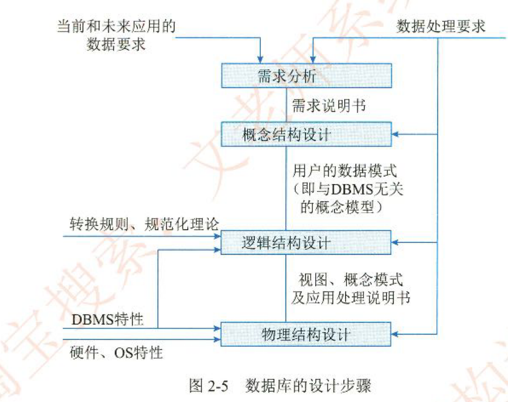
设计数据库概念模型的最著名、最常用的方法是E-R方法。采用E-R方法的数据库概念结构设计可分为三步:设计局部E-R模型、设计全局E-R模型以及全局E-R模型的优化。
逻辑结构设计是在概念结构设计基础上进行的数据模型设计,可以是层次、网状模型和关系模型。逻辑结构设计阶段的主要任务是确定数据模型,将E-R图转换为指定的数据模型,确定完整性约束,确定用户视图。
分布式数据库系统(Distributed DataBase System, DDBS)
### 2.3.6 中间件
因而出现了一类称为“中间件(Middleware)的软件,它们作为应用软件与各种操作系统之间使用的标准化编程接口和协议。
可以起承上启下的作用,使应用软件的开发相对独立于计算机硬件和操作系统,并能在不同的系统上运行,实现相同的应用功能。
### 2.3.7 软件构件
构件又称为组件,是一个自包容、可复用的程序集。构件是一个程序集,或者说是一组程序的集合。这个集合可能会以各种方式体现出来,如源程序或二进制的代码。
构件组装模型的优点如下:构件的自包容性让系统的扩展变得更加容易:设计良好的构件更容易被重用,降低软件开发成本;构件的粒度较整个系统更小,因此安排开发任务更加灵活, 可以将开发团队分成若干组,并行地独立开发构件。
## 2.4 嵌入式系统及软件
嵌入式系统(Embedded System)
DO-178B标准将软件生命周期分为“软件计划过程”“软件开发过程”和“软件综合过程”,其中软件开发过程和软件综合过程又分别被细分成4个子过程。
## 2.5 计算机网络
由低层至高层分别为物理层(PhysicalLayer)、数据链路层(DatalinkLayer)、网络层(Network Layer)、传输层(Transport Layer)、会话层(Sesion Layer)、表示层(Presentation Layer)和应用层(Application Layer)。
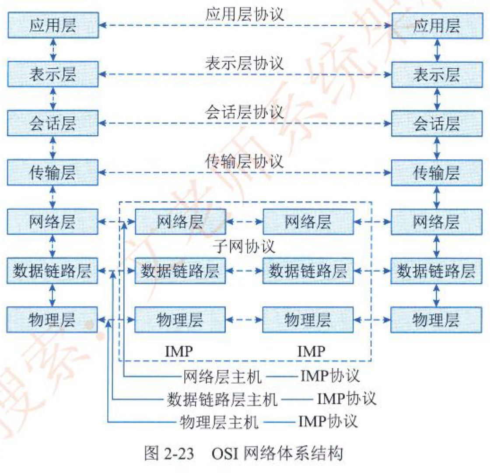
网络存储体系结构大致分为三种:直连式存储(Direct Attached Storage,DAS)、网络连接存储(Network Attached Storage,NAS)和存储区域存储(Storage Area Network, SAN)
## 2.6 计算机语言
机器语言的指令格式：机器语言指令是一种二进制代码,由操作码和操作数两部分组成。
### UML
UML中有4种关系:依赖、关联、泛化和实现。
1. 依赖是两个事物间的语义关系,其中一个事物(独立事物)发生变化会影响另一个事物(依赖事物)的语义。在图形上,把一个依赖画成一条可能有方向的虚线,如图2-29所示。
2. 关联是一种结构关系,它描述了一组链,链是对象之间的连接。聚集是一种特殊类型的关联,它描述了整体和部分间的结构关系。关联和聚集的图形化表示如图2-30和图2-31所示。
在关联上可以标注重复度和角色。
3. 泛化是一种特殊/一般关系,特殊元素(子元素)的对象可替代一般元素(父元素)的对象。用这种方法,子元素共享了父元素的结构和行为。在图形上,把一个泛化关系画成一条带有空心箭头的实线,它指向父元素,如图2-32所示。
4. 实现是类元之间的语义关系,其中一个类元指定了由另一个类元保证执行的契约。在两种情况下会使用实现关系:一种是在接口和实现它们的类或构件之间:另一种是在用例和实现它们的协作之间。在图形上,把一个实现关系画成一条带有空心箭头的虚线,如图2-33所示。
按照图本身具有的特点,可以把图形划分为5类视图,分别是用例视图、逻辑视图、进程视图、实现视图和部署视图,其中的用例视图居于中心地位。
按照软件工程“自项向下、逐步求精”的原则,软件生命周期可分为可行性分析、需求分析、体系结构设计、详细设计、编码和测试发布6个阶段,形式化方法贯穿软件工程整个生命周期。
## 2.7 多媒体
视音频压缩方法目前,视音频压缩方法有上百种,这些方法总体上可归类为有损(Lossy)压缩和无损(Losless)压缩两类。无损压缩也即压缩前和解压缩后的数据完全一致。多数的无损压缩都采用RLE行程编码算法。而有损压缩意味着解压缩后的数据与压缩前的数据不一致,在压缩的过程中要丢失一些人眼和人耳不敏感的图像或音频信息,这些丢失的信息是不可恢复的。无损压缩常见的格式有WAV、 PCM、 TTA、FLAC、AU、APE、TAK和WavPack (WV)等;有损压缩常见的格式有MP3、Windows Media Audio (WMA)、OggVorbis (OGG)等。
## 2.8 系统工程
系统工程是运用系统方法,对系统进行规划、研究、设计、制造、试验和使用的组织管理技术。
系统之系统(System of System,SoS)适用于其系统元素本身也是系统的情况。这些系统之系统带来了大规模跨学科问题,涉及多重、混合和分布式的系统。这些部件系统的互操作集台通常能产生单个系统无法单独达成的结果。
### 2.8.4 基于模型的系统工程
基于模型的系统工程(Model-Based Systems Engineering, MBSE)
MBSE的三大支柱分别是建模语言、建模工具和建模思路。
## 2.9 系统性能

1.基准测试程序
大多数情况下,为测试新系统的性能,用户必须依靠评价程序来评价机器的性能。下面列出了4种评价程序,它们评测的准确程度依次递减:真实的程序、核心程序、小型基准程序和合成基准程序。
把应用程序中用得最多、最频繁的那部分核心程序作为评价计算机性能的标准程序,称为基准测试程序(benchmark)。基准测试程序有整数测试程序Dhrystone、浮点测试程序Linpack、Whetstone基准测试程序、SPEC基准测试程序和TPC基准程序。
# 第3章 信息系统基础知识
## 3.1 信息系统概述
一般来说,信息系统的生命周期分为4个阶段,即产生阶段、开发阶段、运行阶段和消亡阶段。
信息系统的开发阶段是信息系统生命周期中最重要和关键的阶段。该阶段又可分为5个阶段,即,总体规划、系统分析、系统设计、系统实施和系统验收阶段。
### 3.1.6 信息系统开发方法
1.结构化方法
结构化方法是由结构化系统分析和设计组成的一种信息系统开发方法,是目前最成熟、应用最广泛的信息系统开发方法之一。它假定被开发的系统是一个结构化的系统。
2.原型法
原型法是一种根据用户需求,利用系统开发工具,快速地建立一个系统模型展示给用户, 在此基础上与用户交流,最终实现用户需求的信息系统快速开发的方法。
3.面向对象方法
面向对象方法是对客观世界的一种看法,它是把客观世界从概念上看成一个由相互配合、协作的对象所组成的系统。信息系统开发的面向对象方法的兴起是信息系统发展的必然趋势。
数据处理包括数据与处理两部分。
4.面向服务的方法
面向对象的应用构建在类和对象之上,随后发展起来的建模技术将相关对象按照业务功能进行分组,就形成了构件的概念。对于跨构件的功能调用,则采用接口的形式暴露出来。进一步将接口的定义与实现进行解耦,则催生了服务和面向服务的开发方法。
## 3.2 业务处理系统(TPS)
数据处理TPS中常见的数据处理方式有两种,一种是批处理方式;另一种是联机事务处理方式。
## 3.3 管理信息系统(MIS)
## 3.4 决策支持系统(DSS)(论)
### 3.4.3 决策支持系统的特点
(1)决策支持系统面向决策者,系统在开发中遵循的需求和操作是设计系统的依据和原则。
系统的收集、存储和输出的一切信息,都是为决策者服务。
(2)决策支持系统支持对半结构化问题的决策。半结构化问题的复杂性致使传统的计算机信息系统,如电子数据处理系统、管理信息系统都难以解决,而决策支持系统则可以辅助决策者对决策信息过程和方案进行较系统且全面的分析。
(3)决策支持系统的作用是辅助决策者、支持决策者。由于决策过程的复杂性和决策过程中的重要作用,系统不可能取代人而做出决策。在整个决策过程中系统不可能也不应该提供答案,也不应该强加给决策者预先规定的决策顺序。
(4)决策支持系统体现决策过程的动态性。用户或用户通过模型,根据决策层次、决策环境、问题理解、知识积累等多方面变化的情况来动态地确定问题的解答,并在决策的动态运行过程中完善和调整系统。
(5)决策支持系统提倡交互式处理。通过人、机对话的方式将决策人的经验、观念和判断纳入系统,进而将人们主观的、经验的判断与客观的信息反映相结合,最后确定决策方案。
### 3.4.4 决策支持系统的组成
1. 数据的重组和确认
2. 数据字典的建立
3. 数据挖掘和智能体
4. 模型建立
## 3.5 专家系统(ES)
## 3.6办公自动化系统OAS
## 3.7 企业资源规划(ERP)
ERP中的企业资源包括企业的“三流”资源,即物流资源、资金流资源和信息流资源。
ERP实际上就是对这“三流”资源进行全面集成管理的管理信息系统。
## 3.8 典型信息系统架构模型
企业战略教据模型分为数据库模型和数据仓库模型,数据库模型用来描述日常事务处理中数据及其关系:数据仑库模型则描述企业高层管理决策者所需信息及其关系。在企业信息化过程中,数据库模型是基础,一个好的数据库模型应该客观地反映企业生产经营的内在联系。数据库是办公自动化、计算机辅助管理系统、开发与设计自动化、生产过程自动化、lntranet的基础和环境。
新的方法。
几种常用的企业信息化方法
(1)业务流程重构方法。企业业务流程重构的中心思想是,在信息技术和网络技术迅猛发展的时代,企业必须重新审视企业的生产经营过程,利用信息技术和网络技术,对企业的组织结构和工作方法进行“彻底的、根本性的”重新设计,以适应当今市场发展和信息社会的需求。
(2)核心业务应用方法。任何一家企业,要想在市场竞争的环境中生存发展,都必须有自己的核心业务,否则,必然会被市场所淘汰。当然,不同的企业,其核心业务是不同的。比如一个石油生产企业,原油的勘探开发生产就是它的核心业务。围绕核心业务应用计算机技术和网络技术是很多企业信息化成功的秘诀。
(3)信息系统建设方法。对大多数企业来说,建设信息系统是企业信息化的重点和关键。
因此,信息系统建设成了最具普遍意义的企业信息化方法。
(4)主题数据库方法。主题数据库就是面向企业业务主题的数据库,也就是面向企业的核心业务的数据库。有些企业,特别是在业务数量浩繁,流程错综复杂的大型企业里,建设覆盖整个企业的信息系统往往很难成功。但是,各个部门的局部开发和应用又有很大弊端,会造成系统分割严重,形成许多“信息孤岛”,造成大量的无效或低效投资。在这样的企业里,应用主题数据库方法推进企业信息化无疑是一个投入少、效益好的方法。
(5)资源管理方法。计算机技术和网络技术的应用为企业资源管理提供了强大的能力。目前,; 流行的企业信息化的资源管理方法有很多,最常见的有企业资源计划(Entermrise Resource Planning,ERP)、供应链管理(Supply Chain Management,SCM)等。
(6)人力资本投资方法。人力资本的概念是经济学理论发展的产物。人力资本与人力资源的主要区别是人力资本理论把一部分企业的优秀员工看作是一种资本,能够取得投资收益。人力资本投资方法特别适用于那些依靠智力和知识而生存的企业,例如,各种咨询服务、软件开发等企业,
# 第4章 信息安全技术基础知识
## 4.1 信息安全基础知识
信息安全包括5个基本要素:机密性、完整性、可用性、可控性与可审查性
(1)机密性:确保信息不暴露给未授权的实体或进程。
(2)完整性:只有得到允许的人才能修改数据,并且能够判别出数据是否已被篡改。
(3)可用性:得到授权的实体在需要时可访问数据,即攻击者不能占用所有的资源而阻碍授权者的工作。
(4)可控性:可以控制授权范围内的信息流向及行为方式。
(5)可审查性:对出现的信息安全问题提供调查的依据和手段。
信息安全的范围包括:设备安全、数据安全、内容安全和行为安全。
## 4.2 信息系统安全的作用与意义
## 4.3 信息安全系统的组成框架
信息系统安全系统框架通常由技术体系、组织机构体系和管理体系共同构建。
从实现技术上来看,信息安全系统涉及基础安全设备、计算机网络安全、操作系统安全、数据库安全、终端设备安全等多方面技术。
管理是信息系统安全的灵魂。信息系统安全的管理体系由法律管理、制度管理和培训管理3个部分组成。所谓“三分技术,七分管理”。
(1)法律管理是根据相关的国家法律、法规对信息系统主体及其与外界关联行为的规范和约束。
(2)制度管理是信息系统内部依据系统必要的国家、团体的安全需求制定的一系列内部规章制度
(3)培训管理是确保信息系统安全的前提
## 4.4 信息加解密技术
* DES (Data Encryption Standard )
三重DES (Tiple-DES)是DES的改进算法,它使用两把密钥对报文做三次DES加密,效果相当于将DES密钥的长度加倍,克服了DES密钥长度较短的缺点。本来应该使用3个不同的密钥进行3次加密,这样就可以把密销的长度加长到3X56=168位。但许多密码设计者认为168位的密钥已经超过了实际需要,所以便在第1层和第3层中使用相同的密钥,产生一个有效长度为112位的密钥。之所以没有直接采用两重DES,是因为第2层DES不是十分安全,
* IDEA ( lnternational Data Encryption Algorithm )
1990年,瑞士联邦技术学院的来学嘉和Masscy建议了一种新的加密算法。这种算法使用128位的密钥,把明文分成64位的块,进行8轮迭代加密。
* 高级加密标准(Advanced Encryption Standard,AES)
AES支持128、192和256位3种密钥长度,能够在世界范围内免版税使用,提供的安全级别足以保护未来20~30年内的数据,可以通过软件或硬件实现。
## 4.5 密钥管理技术
## 4.6 访问控制及数字签名技术
## 4.7 信息安全的抗攻击技术
拒绝服务攻击DoS (Denial of Service)是由人为或非人为发起的行动,使主机硬件、软件或者两者同时失去工作能力,使系统不可访问并因此拒绝合法的用户服务要求。
* ARP原理:
某机器A要向主机C发送报文,会查询本地的ARP缓存表,找到C的P地址对应的MAC地址后,就会进行数据传输。如果未找到,则广播一个ARP请求报文(携带主机A的IP地址Ia一物理地址AA:AAAA:AA),请求P地址为Ic的主机C回答物理地址Pc。
网上所有主机包括C都收到ARP请求,但只有主机C识别自己的P地址,于是向A主机发回一个ARP响应报文。其中就包含有C的MAC地址 CC:CC:CC:CC, A接收到C的应答后,就会更新本地的ARP缓存。接着使用这个MAC地址发送数据(由网卡附加MAC地址)。因此，本地高速缓存的这个ARP表是本地网络流通的基础,而且这个缓存是动态的。
2.扫描原理分类
(1)全TCP连接。这种扫描方法使用三次握手,与目标计算机建立标准的TCP连接。需要说明的是,这种古老的扫描方法很容易被目标主机记录。
(2)半打开式扫描(SYN扫描)。在这种扫描技术中,扫描主机自动向目标计算机的指定端口发送SYN数据段,表示发送建立连接请求。
·如果目标计算机的回应TCP报文中SYN=l,ACK=l,则说明该端口是活动的,接着扫描主机传送一个RST给目标主机拒绝建立TCP连接,从而导致三次握手的过程失败。
 如果目标计算机的回应是RST,则表示该端口为“死端口”,这种情况下,扫描主机不用做任何回应。
由于扫描过程中,全连接尚未建立,所以大大降低了被目标计算机记录的可能性,并且加快了扫描的速度。
(3)FHN扫描。在前面介绍过的TCP报文中,有一个字段为FIN,FIN扫描则依靠发送FIN来判断目标计算机的指定端口是否是活动的。
发送一个FIN=l的TCP报文到一个关闭的端口时,该报文会被丢掉,并返回一个RST报文。
但是,如果当FN报文到一个活动的端口时,该报文只是被简单的丢掉,不会返回任何回应。
从FIN扫描可以看出,这种扫描没有涉及任何TCP连接部分。因此,这种扫描比前两种都安全,可以称之为秘密扫描。
(4)第三方扫描。第三方扫描又称“代理扫描”,这种扫描是利用第三方主机来代替入侵者讲行扫描。这个第三方主机一般是入侵者通过入侵其他计算机而得到的,该“第三方”主机常被入侵者称之为“肉鸡”。这些“肉鸡”一般为安全防御系数极低的个人计算机。
## 4.8 信息安全的保障体系与评估方法
# 第5章 软件工程基础知识
## 5.1 软件工程
### 5.1.2 软件过程模型
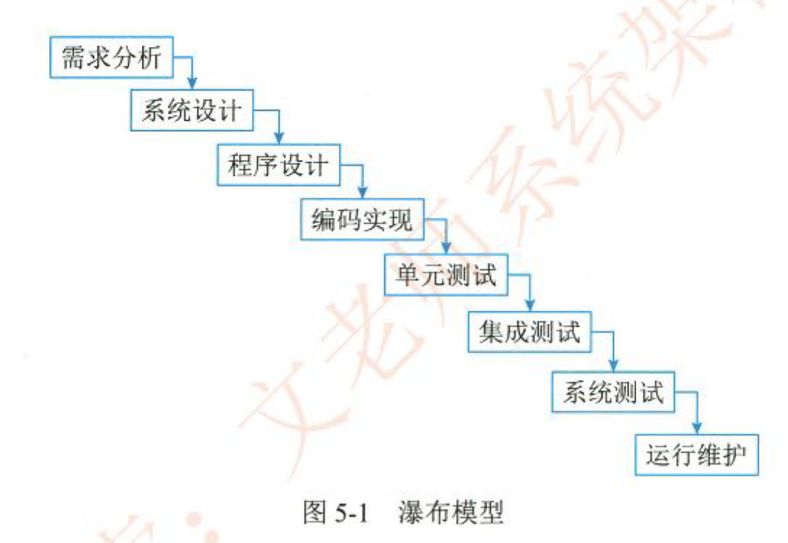
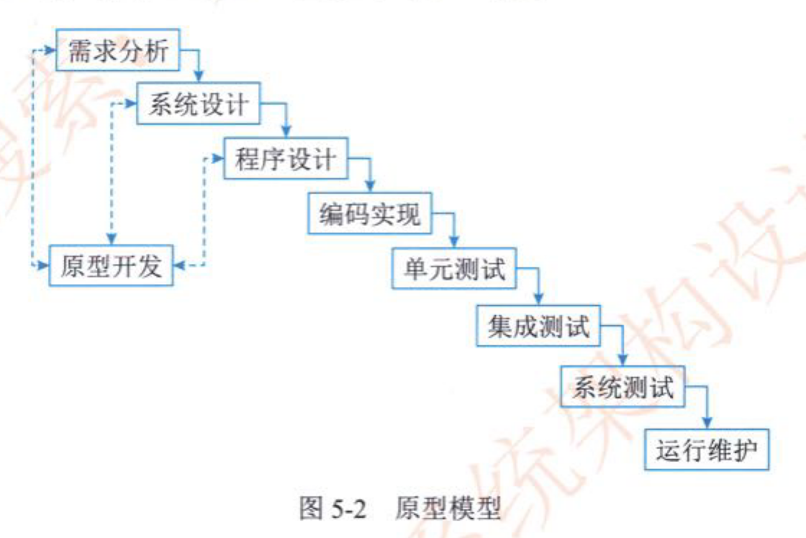
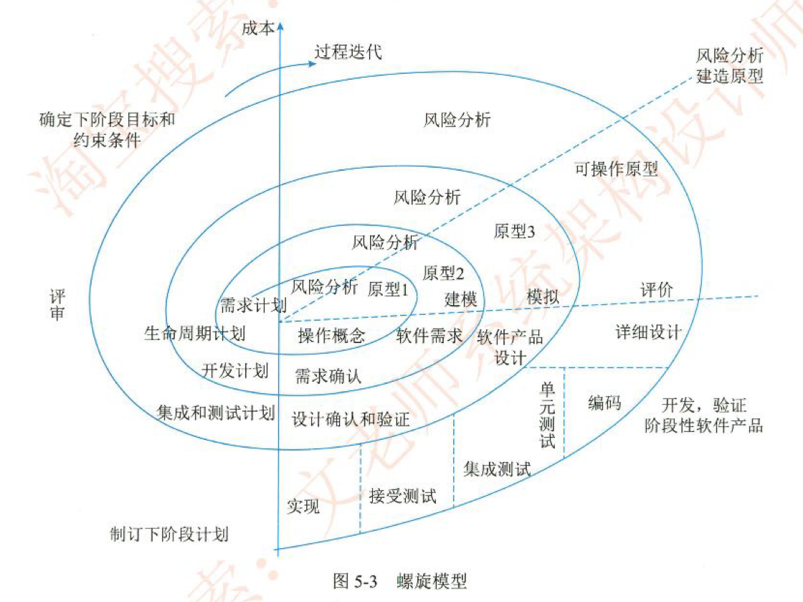
### 5.1.4 统一过程模型(RUP)(论)
软件统一过程(Rational Unified Process,RUP)是Rational软件公司创造的软件工程方法。
RUP描述了如何有效地利用商业的、可靠的方法开发和部署软件,是一种重量级过程。RUP类似一个在线的指导者,它可以为所有方面和层次的程序开发提供指导方针、模版以及事例支持。
1. RUP的生命周期
RUP软件开发生命周期是一个二维的软件开发模型,RUP中有9个核心工作流,这9个核心工作流如下。
* 业务建模(Business Modeling):理解待开发系统所在的机构及其商业运作,确保所有参与人员对待开发系统所在的机构有共同的认识,评估待开发系统对所在机构的影响。
* 需求(Requirements):定义系统功能及用户界而,使客户知道系统的功能,使开发人员理解系统的需求,为项目预算及计划提供基础。
* 分析与设计(Analysis & Design):把需求分析的结果转化为分析与设计模型。
* 实现(Implementation):把设计模型转换为实现结果,对开发的代码做单元测试,将不同实现人员开发的模块集成为可执行系统0测试(Tcst):检查各子系统之间的交互、集成,验证所有需求是否均被正确实现,对发现的软件质量上的缺陷进行归档,对软件质量提出改进建议。
* 部署(Deployment):打包、分发、安装软件,升级旧系统:培训用户及销售人员,并提供技术支持。
* 配置与变更管理(Configuration & Change Management):跟踪并维护系统开发过程中产生的所有制品的完整性和一致性。
* 项目管理(Project Management):为软件开发项目提供计划、人员分配、执行、监控等方面的指导,为风险管理提供框架。
* 环境(Environment):为软件开发机构提供软件开发环境,即提供过程管理和工具的支持。
3. RUP的特点
RUP是用例驱动的、以体系结构为中心的、迭代和增量的软件开发过程。
在“4+1”视图模型中,分析人员和测试人员关心的是系统的行为,会侧重于用例视图:最终用户关心的是系统的功能,会侧重于逻辅视图:程序员关心的是系统的配置、装配等问题, 会侧重于实现视图:系统集成人员关心的是系统的性能、可伸缩性、吞吐率等问题,会侧重于进程视图;系统工程师关心的是系统的发布、安装、拓扑结构等问题,会侧重于部署视图。
![[RUP视图模型.png]]
### 5.1.5 软件能力成熟度模型(Capability Maturity Model for Software,CMM)
CMMI提供了一个软件能力成熟度的框架,它将软件过程改进的步骤组织成5个成熟度等级,共包括18个关键过程域,52个过程目标,3168种关键时间,它为软件过程不断改进奠定了一个循序渐进的基础, 1)Level1初始级处于成熟度级别1级时,过程通常是随意且混乱的。这些组织的成功依赖于组织内人员的能力与英雄主义。成熟度1级的组织也常常能产出能用的产品与服务,但它们经常超出在计划中记录的预算与成本。
2)Level2已管理级在该等级下,意味着组织要确保策划、文档化、执行、监督和控制项目级的过程,并且需要为过程建立明确的目标,并能实现成本、进度和质量目标等。
3)Level3已定义级在这一等级,企业能够根据自身的特殊情况定义适合自己企业和项目的标准流程,将这套管理体系与流程予以制度化,同时企业开始进行项目积累,企业资产的收集。
4)Level4量化管理级在成熟度4级,组织建立了产品质量、服务质量以及过程性能的定量目标。成熟度级别3 级与4级的关键区别在于对过程性能的可预测。
5)Level5优化级在优化级水平上,企业的项目管理达到了最高的境界。成熟度级别5级关注于通过增量式的与创新式的过程与技术改进,不断地改进过程性能。处于成熟度5级时,组织使用从多个项目收集来的数据对整体的组织级绩效进行关注。
## 5.2 需求工程
### 需求获取方法(论)
针对不同类型的软件项目,需要采用不同的需求获取方法。常见的需求获取方法如下。
1)用户面谈
这是一种最为常见的需求获取方法,是理解用户需求的最有效方法。面谈过程需要认真的计划和准备;面谈之后,需要复查笔记的准确性、完整性和可理解性:把所收集的信息转化为适当的模型和文档:确定需要进一步澄清的问题。
2)需求专题讨论会
需求专题讨论会也是需求获取的一种有力技术。在短暂而紧凑的时间段内将相关涉众集中在一起集体讨论,与会者可以在应用需求上达成共识,对操作过程尽快取得统一的意见。参加第5章软件工程基础知识会议的人员包括主持人、用户、技术人员、项目组人员专题讨论会具有以下优点。
(1)协助建立一支高效的团队,围绕项目成功的目标。
(2)所有的风险承担人都畅所欲言。
(3)促进风险承担人和开发团队之间达成共识
(4)揭露和解决那些妨碍项目成功的行政问题。
(5)能够很快地产生初步的系统定义。
(6)可以有效地解决不同涉众之间的需求冲突
3)问卷调查
问卷调查可用于确认假设和收集统计倾向数据。存在的问题是:相关问题不能事先决定, 问题背后的假设对答案造成偏颇,难以探索一些新领域,难以继续用户的模糊响应。在完成最初的面谈和分析后,问卷调查可作为一项协作技术收到良好效果。
4)现场观察
该方法主要是通过观察用户实际执行业务的过程,来直观地了解业务的执行过程,全面了解需求细节。执行业务可能是手工操作,也可能是在原有的业务系统上执行。
5)原型化方法
在需求的早期,用户往往在具体的需求定义上存在很多不确定性,尤其是信息系统的人机交互界面和查询报表类的需求上。此时往往可以通过在需求阶段采用原型化方法,通过开发系统原型以及与用户的多次迭代反馈,解决在早期阶段需求不确定的问题,尤其是在人机界面等高度不确定的需求。
6)头脑风暴法
在一些新业务拓展的软件项目中,由于业务是新出现的,而且业务流程存在高度的不确定性,例如互联网上的新业务系统、App等,一群人围绕该业务,发散思维,不断产生新的观点, 参会者敞开思想使各种设想在相互碰撞中激起大脑的创造性风暴,从而确定具体的需求。
### 5.2.2 需求变更
![[SRr_需求变更管理过程.png]]
## 5.3 系统分析与设计
* 结构化方法,即SASD (Structured Analysis and Structured Design)方法,也可称为面向功能的软件开发方法或面向数据流的软件开发方法。
结构化分析方法给出一组帮助系统分析人员产生功能规约的原理与技术。它一般利用图形表达用户需求,使用的手段主要有数据流图、数据字典、结构化语言、判定表以及判定树等。
结构化分析的常用手段是数据流图(DFD)和数据字典。
DFD方法由4种基本元素(模型对象)组成:数据流、处理/加工、数据存储和外部项, (1)数据流(Data Flow)。数据流用一个箭头描述数据的流向,箭头上标注的内容可以是信息说明或数据项。
(2)处理(Process)。表示对数据进行的加工和转换,在图中用矩 形框表示。指向处理的数据流为该处理的输入数据,离开处理的数据流为该处理的输出数据。
(3)数据存储。表示用数据库形式(或者文件形式)存储的数据,对其进行的存取分别以指向或离开数据存储的箭头表示。
(4)外部项。也称为数据源或者数据终点。描述系统数据的提供者或者数据的使用者,如教师、学生、采购员、某个组织或部门或其他系统,在图中用圆角框或者平行四边形框表示。
数据字典(Data Dictionary)是一种用户可以访问的记录数据库和应用程序元数据的目录。
数据字典是指对数据的数据项、数据结构、数据流、数据存储、处理逻辑等进行定义和描述, 其目的是对数据流程图中的各个元素做出详细的说明。简而言之,数据字典是描述数据的信息集合,是对系统中使用的所有数据元素定义的集合。
* 结构化设计(Structured DesignSD)是一种而向数据流的设计方法,它以SRS和SA阶段所产生的数据流图和数据字典等文档为基础,是一个自顶向下、逐步求精和模块化的过程。SD 方法的基本思想是将软件设计成由相对独立且具有单一功能的模块组成的结构,分为概要设计和详细设计两个阶段,其中概要设计的主要任务是确定软件系统的结构,对系统进行模块划分, 确定每个模块的功能、接口和模块之间的调用关系;详细设计的主要任务是为每个模块设计实现的细节。
结构化程序设计(Stuctured Programing,SP)思想是最早由EWDijikstra在1965年提出的。“面向结构”的程序设计方法即结构化程序设计方法,是“面向过程”方法的改进,结构上将软件系统划分为若干功能模块,各模块按要求单独编程,再组合构成相应的软件系统。
* 数据库设计是指根据用户的需求,在某一具体的数据库管理系统上,设计数据库的结构和建立数据库的过程。数据库设计的内容包括:需求分析、概念结构设计、逻辑结构设计、物理结构设计、数据库的实施和数据库的运行和维护。
E-R图中的联系存在3种一般性约束:一对一约束(联系)、一对多约束(联系)和多对多约束(联系),它们用来描述实体集之间的数量约束。
### 5.3.2 面向对象方法
1. 面向对象(Object-Oriented,00)开发方法将面向对象的思想应用于软件开发过程中,指浮开发活动,是建立在“对象”概念基础上的方法学。面向对象方法的本质是主张参照人们认识一个现实系统的方法,完成分析、设计与实现一个软件系统,提倡用人类在现实生活中常用的思维方法来认识和理解描述客观事物,强调最终建立的系统能映射问题域,使得系统中的对象,以及对象之间的关系能够如实地反映问题域中固有的事物及其关系。
2. 面向对象设计方法(Object-Oriented Design,O0D)是00A方法的延续,其基本思想包括抽象、封装和可扩展性,其中可扩展性主要通过继承和多态来实现。在00D中,数据结构和在数据结构上定义的操作算法封装在一个对象之中。由于现实世界中的事物都可以抽象出对象的集合,所以OOD方法是一种更接近现实世界、更自然的系统设计方法。
在0OD中,类可以分为3种类型:实体类、控制类和边界类。
3. 面向对象程序设计(Object Oriented ProgrammingOOP)是一种计算机编程架构。OOP的一条基本原则是计算机程序由单个能够起到子程序作用的单元或对象组合而成。OOP达到了软件工程的3个主要目标:重用性、灵活性和扩展性。OOP=对象+类+继承+多态+消息,其中核心概念是类和对象。
4.数据持久化与数据库
在面向对象开发方法中,对象只能存在于内存中,而内存不能永久保存数据,如果要永久保存对象的状态,需要进行对象的持久化(Persistence),对象持久化是把内存中的对象保存到数据库或可永久保存的存储设备中。在多层软件设计和开发中,为了降低系统的耦合度,一般会引入持久层(Persistence Layer),即专注于实现数据持久化应用领域的某个特定系统的一个逻辑层面,将数据使用者和数据实体相关联,持久层的设计实现了数据处理层内部的业务逻辑和数据逻辑的解耦。
## 5.4 软件测试
软件测试方法的分类有很多种,以测试过程中程序执行状态为依据可分为静态测试(Static Testing,ST)和动态测试(Dynamic TestingDT);以具体实现算法细节和系统内部结构的相关情况为根据可分黑盒测试、白盒测试和灰盒测试3类:从程序执行的方式来分类,可分为人工测试(Manual Testing,MT)和自动化测试(Automatic Testing,AT)。
从阶段上划分,软件测试可以分为单元测试、集成测试和系统测试,系统测试中又包含了多种不同的测试种类,例如功能测试、性能测试、验收测试、压力测试等。
所以从用户的角度出发,测试人员还应进行Alpha测试或Beta测试。Alpha测试是在软件开发环境下由用户进行的测试,或者模拟实际操作环境进而进行的测试。Alpha测试主要是对软件产品的功能、局域化、界面、可使用性以及性能等等方面进行评价。而Beta测试是在实际环境中由多个用户对其进行测试,并将在测试过程中发现的错误有效反馈给软件开发者。
## 5.5 净室软件工程 (Cleanroom Software Engineering, CSE)
## 5.6 基于构件的软件工程 (Component-Based Software Engineering, CBSE)
### 5.6.3 构件组装
1. 顺序组装
2. 层次组装
3. 叠加组装
## 5.7 软件项目管理
1. 工作分解结构 (Work Breakdown Structure, WBS)
软件项目往往是比较大而复杂的,往往需要进行层层分解,将大的任务分解成一个个的单一小任务进行处理。
在项目管理中,目前通常采用甘特图等方式来展示和管理项目活动。
### 5.7.3 软件配置管理(Software Configuration Management, SCM)
软件配置管理核心内容包括版本控制和变更控制。
### 5.7.4 软件质量管理
软件质量保证(论)
软件质量保证(Software Quality Assurance, SQA)是建立一套有计划,有系统的方法,来向管理层保证拟定出的标准、步骤、实践和方法能够正确地被所有项目所采用。软件质量保证的目的是使软件过程对于管理人员来说是可见的。
软件质量保证的关注点集中在于一开始就避免缺陷的产生。质量保证的主要目标是:
(1)事前预防工作,例如,着重于缺陷预防而不是缺陷检查。
(2)尽量在刚刚引入缺陷时即将其捕获,而不是让缺陷扩散到下一个阶段。
(3)作用于过程而不是最终产品,因此它有可能会带来广泛的影响与巨大的收益。
(4)贯穿于所有的活动之中,而不是只集中于一点。
软件质量保证的主要任务是以下3个方面
(1)SQA审计与评审。SQA审计包括对软件工作产品、软件工具和设备的审计,评价这几项内容是否符合组织规定的标准。SQA评审的主要任务是保证软件工作组的活动与预定的软件过程一致,确保软件过程在软件产品的生产中得到遵循。
(2)SQA报告。SQA人员应记录工作的结果,并写入到报告之中,发布给相关的人员。
SQA报告的发布应遵循三条原则:SQA和高级管理者之间应有直接沟通的渠道:SQA报告必须发布给软件工程组,但不必发布给项目管理人员;在可能的情况下向关心软件质量的人发布SOA报告。
(3)处理不符合问题。这是SQA的一个重要的任务,SQA人员要对工作过程中发现的问题进行处理及时向有关人员及高级管理者反映。
# 第6章 数据库设计基础知识
## 6.1 数据库基本概念
### 6.1.2 数据模型
数据库的基础结构是数据模型,是用来描述数据的一组概念和定义。数据模型的三要素是数据结构、数据操作和数据的约束条件。
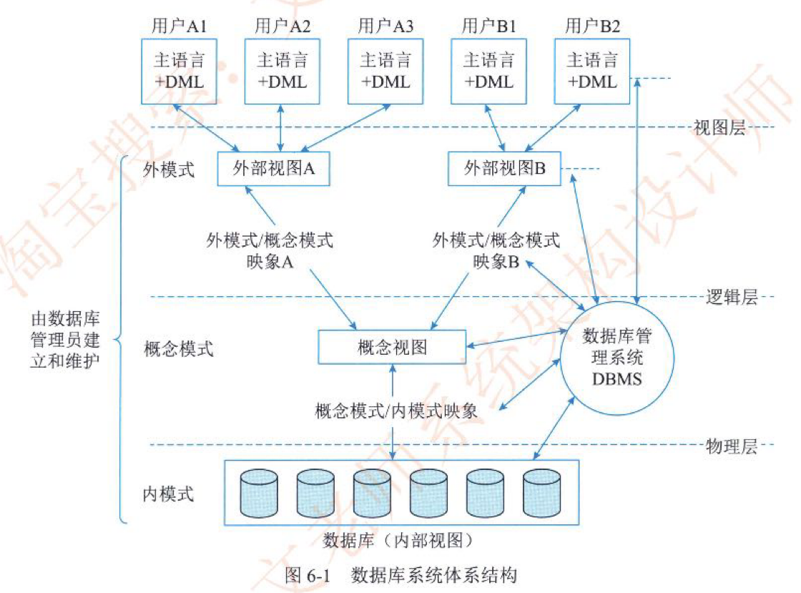
## 6.2 关系数据库
1. 函数依赖
数据依赖是通过一个关系中属性间值的相等与否体现出来的数据间的相互关系,是现实世界属性间联系和约束的抽象,是数据内在的性质,是语义的体现。函数依赖则是一种最重要、最基本的数据依赖。
3. 关系的完整性约束
关系的完整性约束共分为3类:实体完整性、参照完整性(也称引用完整性)和用户定义完整性
(1)实体完整性(Entity lntegrity)。实体完整性规则要求每个数据表都必须有主键,而作为主键的所有字段,其属性必须是唯一且非空值。
(2)参照完整性(Referential lntegrity)。现实世界中的实体之间往往存在某种联系,在关系模型中实体及实体间的联系是用关系来描述的,这样自然就存在着关系与关系间的引用。
(3)用户定义完整性(User Defined lntegrity)。就是针对某一具体的关系数据库的约束条件,反映某一具体应用所涉及的数据必须满足的语义要求,由应用的环境决定。
## 6.3 数据库设计
数据库设计(Database Design)属于系统设计的范畴。通常把使用数据库的系统统称为数据库应用系统,把对数据库应用系统的设计简称为数据库设计。目前主流的数据库系统多数为关系数据库系统,所以本节的论述基本是关系数据库的设计。
(1)用户需求分析。数据库设计人员采用一定的辅助工具对应用对象的功能、性能、限制等要求进行科学的分析。
(2)概念结构设计。概念结构设计是对信息分析和定义,如视图模型化、视图分析和汇总。
对应用对象精确地抽象、概括而形成独立于计算机系统的企业信息模型。描述概念模型的较理想的工具是E-R图。
(3)逻辑结构设计。将抽象的概念模型转化为与选用的DBMS产品所支持的数据模型相符合的逻辑模型,它是物理结构设计的基础。包括模式初始设计、子模式设计、应用程序设计、模式评价以及模式求精, (4)物理结构设计。是逻辑模型在计算机中的具体实现方案。
(5)数据库实施阶段。数据库设计人员根据逻辑设计和物理设计阶段的结果建立数据库, 编制与调试应用程序,组织数据入库,并进行试运行。
(6)数据库运行和维护阶段。数据库应用系统经过试运行即可投入运行,但该阶段需要不断地对系统进行评价、调整与修改。
### 6.3.2 数据需求分析
分析和表达用户需求的方法主要包括自顶向下和自底向上两类方法。自顶向下的结构化分析(Strnuctured Analysis,SA)方法从最上层的系统组织机构入手,采用逐层分解的方式分析系统,并把每一层用数据流图和数据字典描述。
(1) 信息要求
(2)处理要求。
(3)系统要求
## 6.4 应用程序与数据库的交互
## 6.5 NoSQL数据库(论)
一般可以将NoSOL数据库分为以下4种类型。
1. 列式存储数据库
2. 键值对存储数据库
3. 文档型数据库
4. 图数据库

目前业界对于NoSOL开没有一个明确的范围和定又,但是它们普遍存在下面一些共同特征:
1. 易扩展:去掉了关系数据库的关系型特性。数据之间无关系,这样就非常容易扩展。
2. 大数据量,高性能:NoSQL数据库都具有非常高的读写性能,尤其在大数据量下。这得益于它的无关系性,数据库的结构简单。
3. 灵活的数据模型:NoSQL无须事先为要存储的数据建立字段,随时可以存储自定义的数据格式, 
4. 高可用:NoSOL在不太影响性能的情况下, 就可以方便地实现高可用的架构,有些产品通过复制模型也能实现高可用。
### 6.5.2 体系框架
NoSOL整体框架分为4层,由下至上分为数据持久层(Data Persistence)、数据分布层(Data Distribution Model)、数据逻辑模型层(Data Logical Model)和接口层(Interface),层次之间相辅相成,协调工作。
***
# 第7章 系统架构设计基础知识
## 7.1 软件架构概念
体系结构描述语言(Architecture Description Language, ADL)
## 7.2 基于架构的软件开发方法(论)
基于体系结构的软件设计(Architecture-Based Software Design,ABSD)
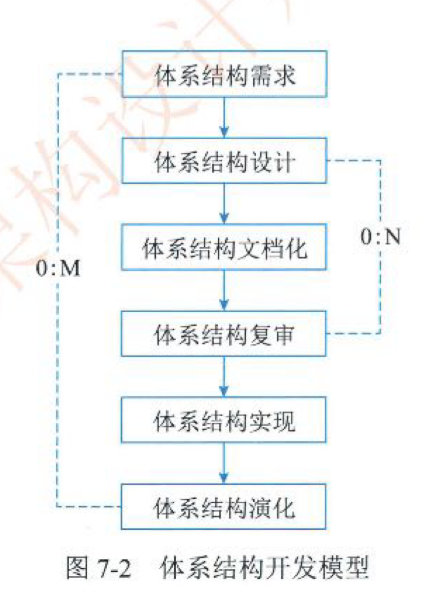
ABSD方法有3个基础。第1个基础是功能的分解。在功能分解中,ABSD方法使用己有的基于模块的内聚和耦合技术。第2个基础是通过选择体系结构风格来实现质量和商业需求。
第3个基础是软件模板的使用,软件模板利用了一些软件系统的结构。
2. 视角与视图
考虑体系结构时,要从不同的视角(Perspective)来观察对架构的描述,这需要软件设计师考虑体系结构的不同属性。例如,展示功能组织的静态视角能判断质量特性,展示并发行为的动态视角能判断系统行为特性,因此,选择的特定视角或视图(如逻辑视图、进程视图、实现视图和配置视图)可以全方位的考虑体系结构设计。使用逻辑视图来记录设计元素的功能和概念接口,设计元素的功能定义了它本身在系统中的角色,这些角色包括功能、性能等。
3. 用例和质量场景
用例已经成为推测系统在一个具体设置中的行为的重要技术,用例被用在很多不同的场合, 用例是系统的一个给予用户一个结果值的功能点,用例用来捕获功能需求。
在使用用例捕获功能需求的同时,人们通过定义特定场景来捕获质量需求,并称这些场景为质量场景。这样一来,在一般的软件开发过程中,人们使用质量场景捕获变更、性能、可靠性和交互性,分别称之为变更场景、性能场景、可靠性场景和交互性场景。质量场景必须包括预期的和非预期的场景。
### 7.2.9 体系结构的演化
体系结构演化是使用系统演化步骤去修改应用,以满足新的需求。主要包括以下6个步骤。
1.需求变化归类首先必须对用户需求的变化进行归类,使变化的需求与己有构件对应。对找不到对应构件的变动,也要做好标记,在后续工作中,将创建新的构件,以对应这部分变化的需求。
2.制订体系结构演化计划在改变原有结构之前,开发组织必须制订一个周密的体系结构演化计划,作为后续演化开发工作的指南。
3.修改、增加或删除构件在演化计划的基础上,开发人员可根据在第1步得到的需求变动的归类情况,决定是否修改或删除存在的构件、增加新构件。最后,对修改和增加的构件进行功能性测试。
4.更新构件的相互作用随着构件的增加、删除和修改,构件之间的控制流必须得到更新。
5.构件组装与测试通过组装支持工具把这些构件的实现体组装起来,完成整个软件系统的连接与合成,形成新的体系结构。然后对组装后的系统整体功能和性能进行测试。
6.技术评审e 对以上步骤进行确认,进行技术评审。评审组装后的体系结构是否反映需求变动、符合用户需求。如果不符合,则需要在第2到第6步之间进行迭代。
在原来系统上所做的所有修改必须集成到原来的体系结构中,完成一次演化过程。
## 7.3 软件架构风格
### 7.3.2 数据流体系结构风格
  * 批处理
  * 管道-过滤器
### 7.3.3 调用返回体系结构风格
调用/返回风格是指在系统中采用了调用与返回机制。
调用/返回体系结构风格主要包括主程序/子程序风格、面向对象风格、层次型风格以及客户端/服务器风格。
  * 主程序/子程序
  * 面向对象
  * 层次型
  * 客户端/服务器
### 7.3.4 以数据为中心的体系结构风格
  * 仓库
  * 黑板
### 7.3.5 虚拟机体系结构风格
  * 解释器
  * 规则系统
### 7.3.6 独立构件体系结构风格
独立构件风格主要强调系统中的每个构件都是相对独立的个体,它们之间不直接通信,以降低耦合度,提升灵活性。独立构件风格主要包括进程通信和事件系统风格。
  * 进程通信: 在进程通信结构体系结构风格中,构件是独立的过程,连接件是消息传递,这种风格的特点是构件通常是命名过程,消息传递的方式可以是点到点、异步或同步方式及远程过程调用等。
  * 事件系统 (基于事件的隐式调用风格)
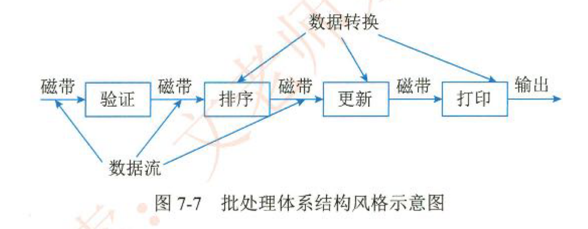
## 7.4 软件架构复用
软件复用是指系统化的软件开发过程:开发一组本的软件构造模块,以覆盖不同的需求/ 体系结构之间的相似性,从而提高系统开发的效率、质量和性能。软件复用是一种系统化的软件开发过程,通过识别、开发、分类、获取和修改软件实体,以便在不同的软件开发过程中重复的使用它们。
## 7.5 特定领域软件体系结构(论)
简单地说,DSSA (Domain Specific Software Architecture)就是在一个特定应用领域中为一组应用提供组织结构参考的标准软件体系结构。对DSSA研究的角度、关心的问题不同导致了对DSSA的不同定义。
### 7.5.2 DSSA的基本活动
1. 领域分析
这个阶段的主要目标是获得领域模型。
2. 颁域设计
这个阶段的主要目标是获得DSSA。
3. 领域实现
这个阶段的主要目标是依据领域模型和DSSA开发和组织可重用信息。
### 7.5.3 参与DSSA的人员
参与DSSA的人员可以划分为4种角色:领域专家、领域分析人员、领域设计人员和领域实现人员。
# 第8章 系统质量属性与架构评估
## 8.1 软件系统质量属性
评估方法所普遍关注的质量属性有以下几种,
1. 性能
2. 可靠性
3. 可用性
4. 安全性
5. 可修改性
6. 功能性
7. 可变性
8. 互操作性
## 8.2 系统架构评估(论)
系统架构评估的方法通常可以分为3类:基于调查问卷或检查表的方式、基于场景的方式和基于度量的方式。
(1)基于调查问卷或检查表的方法。该方法的关键是要设计好问卷或检查表,充分利用系统相关人员的经验和知识,获得对架构的评估。该方法的缺点是在很大程度上依赖于评估人员的主观推断。
(2)基于场景的评估方法。基于场景的方式由卡耐基梅隆大学软件工程研究所首先提出并应用在架构权衡分析法(Architecthure Tradeof Analysis Mehod, ATAM)和软件架构分析方法(Sofware ArchitectureAnalvsis Method, SAAM)中。它是迪过分析软件架构对场景(也就是对系統的使用或修改活动)的支持程度,从而判断该架构对这一场景所代表的质量需求的满足程度。
(3)基于度量的评估方法。它是建立在软件架构度量的基础上的,涉及3个基本活动,首先需要建立质量属性和度量之间的映射原则,然后从软件架构文档中获取度量信息,最后根损映射原则分析推导出系统的质量属性,
敏感点(Sensitivity Point)和权衡点(Tradeof Point)。敏感点和权衡点是关键的架构决策。敏感点是一个或多个构件(和/或构件之间的关系)的特性。研究敏感点可使设计人员或分析员明确在搞清楚如何实现质量目标时应注意什么。权衡点是影响多个质量属性的特性是多个质量属性的敏感点。例如,改变加密级别可能会对安全性和性能产生非常重要的影响
系统架构评估方法
1.SAAM方法
SAAM (Scenarios-based Architecture Analysis Method)是卡耐基梅隆大学软件工程研究所(SEI at CMU)的Kazman等人于1983年提出的一种非功能质量属性的架构分析方法,是最早形成文档并得到广泛使用的软件架构分析方法。最初它用于比较不同软件体系的架构,以分析系统架构的可修改性,后来实践证明它也可用于其他质量属性如可移植性、可扩充性等,最终发展成了评估一个系统架构的通用方法
2.ATAM方法
架构权衡分析方法(Architecture Tradeof Analysis Method,ATAM)是在SAAM的基础上发展起来的,主要针对性能、实用性、安全性和可修改性,在系统开发之前,对这些质量属性进行评价和折中。
3.CBAM方法
在大型复杂系统的构建过程中,经济性通常是需要考虑的首要因素。因此,需要从经济角度建立成本、收益、风险和进度等方面教件的“经济”模型。成本效益分析法(the Cost Benefit Analysis Method,CBAM)是在ATAM上构建,用来对架构设计决策的成本和收益进行建模, 是优化此类决策的一种手段。CBAM的思想就是架构策略影响系统的质量属性,反过来这些质量属性又会为系统的项目干系人带来一些收益(称为“效用”),CBAM协助项目干系人根据其投资回报(Retum On lnvestment,RO)选择架构黄略。CBAM在ATAM结束时开始,它实际上使用了ATAM评估的结果。
## 8.3 ATAM方法架构评估实践
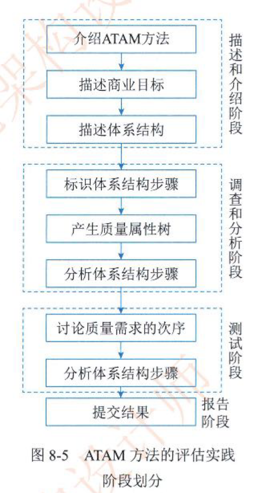
# 第9章 软件可靠性基础知识
## 9.1 软件可靠性基本概念
### 9.1.2 软件可靠性的定量描述
1. 规定时间
2. 失效概率
3. 可靠度
4. 失效强度
5. 平均失效前时间
6. 平均恢复前时间(Mean Time To Restoration MTTR)
7. MTBF (Mean Time Between Failures,平均故障间隔时间)
## 9.2 软件可靠性建模
### 9.2.2 软牛可靠性的建模方法
一个软件可靠性模型通常(但不是绝对)由以下几部分组成。
(1)模型假设。模型是实际情况的简化或规范化,总要包含若干假设,例如测试的选取代表实际运行剖面,不同软件失效独立发生等, (2)性能度量。软件可靠性模型的输出量就是性能度量,如失效强度、残留缺陷数等。在软件可靠性模型中性能度量通常以数学表达式给出。
(3)参数估计方法。某些可靠性度量的实际值无法直接获得,例如残留缺陷数,这时需通过一定的方法估计参数的值,从而间接确定可靠性度量的值。当然,对于可直接获得实际值的可靠性度量,就无须参数估计了。
(4)数据要求。一个软件可靠性模型要求一定的输入数据,即软件可靠性数据。不同类型的软件可靠性模型可能要求不同类型的软件可靠性数据。
软件的可靠性模型分类
种子法模型。
失效率类模型。
曲线拟合类模型。
可靠性增长模型。
程序结构分析模型。
输入域分类模型。
执行路径分析方法模型非齐次泊松过程模型。
马尔可夫过程模型。
贝叶斯分析模型。
## 9.3 软件可靠性管理
1. 需求分析阶段
2. 概要设计阶段
3. 详细设计阶段
4. 编码阶段
5. 测试阶段
6. 实施阶段
## 9.4 软件可靠性设计(论)
设计原则
(1)软件可靠性设计是软件设计的一部分,必须在软件的总体设计框架中使用,并且不能与其他设计原则相冲突。
(2)软件可靠性设计在满足提高软件质量要求的前提下,以提高和保障软件可靠性为最终目标。
(3)软件可靠性设计应确定软件的可靠性目标,不能无限扩大化,并且排在功能度、用户需求和开发费用之后考虑。
可靠性设计概念被广为引用,但并没有多少人能提出非常实用并且广泛运用的可靠性设计技术。一般来说,被认可的且具有应用前景的软件可靠性设计技术主要有容错设计、检错设计和降低复杂度设计等技术。
* 容错设计技术
对于软件失效后果特别严重的场合,如飞机的飞行控制系统、空中交通管制系统及核反应推安全控制系统等,可采用容错设计方法。常用的软件容错技术主要有恢复块设计、N版本程序设计和冗余设计3种方法
* 检错技术
在软件系统中,对无须在线容错的地方或不能采用冗余设计技术的部分,如果对可靠性要求较高,故障有可能导致严重的后果。一般采用检错技术,在软件出现故障后能及时发现并报警,提醒维护人员进行处理。检错技术实现的代价一般低于容错技术和冗余技术,但它有一个明显的缺点,就是不能自动解决故障,出现故障后如果不进行人工干预,将最终导致软件系统不能正常运行。
采用检错设计技术要着重考虑几个要素:检测对象、检测延时、实现方式和处理方式。
* 降低复杂度设计
前面讲到,软件和硬件最大的区别之一就是软件的内部结构比硬件复杂得多,人们用软件复杂度来定量描述软件的复杂程度。软件复杂性常分为模块复杂性和结构复杂性。模块复杂性主要包含模块内部数据流向和程序长度两个方面,结构复杂性用不同模块之间的关联程度来表示。
* 系统配置技术
通常在系统配置中可以采用相应的容错技术,通过系统的整体来提供相应的可靠性,主要有双机热备技术和服务器集群技术
* 系统配置技术
通常在系统配置中可以采用相应的容错技术,通过系统的整体来提供相应的可靠性,主要有双机热备技术和服务器集群技术。
## 9.5 软件可靠性测试
## 9.6 软件可靠性评价(论)
这个过程包含如下3个方面。
(1)选择可靠性模型。
(2)收集可靠性数据。
(3)可靠性评估和预测。
### 怎样选择可靠性模型
1. 模型假设的适用性
2. 预测的能力与质量
3. 模型输出值能否满足可靠性评价需求
4. 模型使用的简便性
### 可靠性数据的收集
目前,关于数据的收集工作,存在许多有待解决的问题。
(1)可靠性数据的规范不统一,对软件进行度量的定义混乱不清。例如,时间、缺陷、失效和模型结构等的定义就相当含糊,缺乏统一的标准。这样就使得在进行软件可靠性数据的收集时,目标不明确,甚至无从下手。
(2)数据收集工作的连续性不能保证。可靠性数据的收集是连续的、长期的过程,而且需要投入一定的资金、人力、时间,往往这些投入会在软件的开发计划中被忽略,以至于不能保证可靠性数据收集工作的正常进行。
(3)缺乏有效的数据收集手段。进行数据收集同样需要方便实用的工具,然而除了在可靠性测试方面有了一些可用的数据收集工具外,其他方面的工具还十分缺乏。
(4)数据的完整性不能保证。即使可靠性活动计划做得再周密,收集到的数据仍有可能是不完全的,而且遗漏的数据往往会影响到可靠性评价的结果, 
(5)数据质量和准确性不能保证。不完全的排错及诊断,使收集的数据中含有不少虚假的成分,它们不能正确反映软件的真实状况。使用不准确的可靠性数据进行的可靠性评价,误差有可能会比利用可靠性模型进行预测产生的误差大一个数量级,这说明数据质量的重要性。
### 软件可靠性的评估和预测
软件可靠性评价技术和方法主要依据选用的软件可靠性模型,其来源于统计理论。软件可靠性评估和预测以软件可靠性模型分析为主,但也要在模型之外运用一些统计技术和手段对可靠性数据进行分析,作为可靠性模型的补充、完善和修正。这些辅助方法如下。
(1)失效数据的图形分析法。运行图形处理软件失效数据,可以直观地帮助人们进行分析, 图形指标如下。
①累积失效个数图形。
②单位时间段内的失效数的图形,
③失效间隔时间图形
(2)试探性数据分析技术(Exploratory Data Analysis,EDA)。
对于失效数据图形进行一定的数字化分析,能发现和揭示出数据中的异常。对可靠性分析有用的信息如下。
①循环相关, 
②短期内失效数的急剧上升。
③失效数集中的时间段。
这种分析方法常可以发现因排错引入新的缺陷、数据收集的质量问题及时间域的错误定义等问题
# 第10章 软件架构的演化和维护
## 10.1 软件架构演化和定义的关系
为了适应用户的新需求,业务环境和运行环境的变化等,软件架构需要不断地进行自身的演化,也就是说软件架构的演化就是为了维持软件架构自身的有用性。
## 10.2 面向对象软件架构演化过程
### 10.2.1 对象演化
在顺序图中,组件的实体为对象。组件本身包含了众多的属性,如接口、类型、语义等, 这些属性的演化是对象自身的演化,对于描述对象之间的交互过程并无影响。因此,会对架构设计的动态行为产生影响的演化只包括AddObject (AO)和DeleteObject (DO)两种。
### 10.2.2 消息演化
消息是顺序图中的核心元素,包含了名称、源对象、目标对象、时序等信息。这些信息与其他对象或消息相关联,产生的变化会直接影响到对象之间的交互,从而对架构的正确性或时态属性产生影响。另外,消息自身的属性,如接口、类型等,产生的变化不会影响到对象之间交互的过程,则不考虑其发生的演化类型。因此,我们将消息演化分为AddMessage (AM)、DeleteMessage (DM)、SwapMessageOrder (SMO)、OverturnMessage (OM)、ChangeMesageModule (CMM)5种
### 10.2.3 复合片段演化
复合片段是对象交互关系的控制流描述,表示可能发生在不同场合的交互,与消息同属于连接件范畴。复合片段本身的信息包括类型、成立条件和内部执行序列,其中内部执行序列的演化等价于消息序列演化。通常,会产生分支的复合片段包括ref、loop、break、 alt、 opt、 par, 其余的复合片段类型并不会产生分支,因此主要考虑这些会产生分支的复合片段所产生的演化。
复合片段的演化分为AddFragment (AF)、DeleteFragment (DF)、FragmentTypeChange (FTC) 和FragmentConditionChange (FCC),如图10-3所示。
### 10.2.4 约束演化
顺序图中的约束信息以文字描述的方式存储于对象或消息中,如通常可以用TL来描述时态属性约束。约束演化对应着架构配置的演化,一般来源于系统属性的改变。
## 10.3 软件架构演化方式的分类(论)
(1)按照软件架构的实现方式和实施粒度分类:基于过程和函数的演化、面向对象的演化、基于组件的演化和基于架构的演化。
(2)按照研究方法将软件架构演化方式分为4类(Jefiey M.Bames等人的分类方法):第1类是对演化的支持,如代码模块化的准则、可维护性的指示(如内聚和耦合)、代码重构等; 第2类是版本和工程的管理工具,如CVS和 COCOMO:第3类是架构变换的形式方法,包括系统结构和行为变换的模型,以及架构润化的重现风格等:第4类是架构演化的成本收益分析, 决定如何增加系统的弹性。
(3)针对软件架构的演化过程是否处于系统运行时期,可以将软件架构演化分为静态演化(Static Evolution)和动态演化(Dynamic Evolution),前者发生在软件架构的设计、实现和维护过程中,软件系统还未运行或者处在运行停止状态;后者发生在软件系统运行过程中。
### 10.3.2 软件架构静态演化
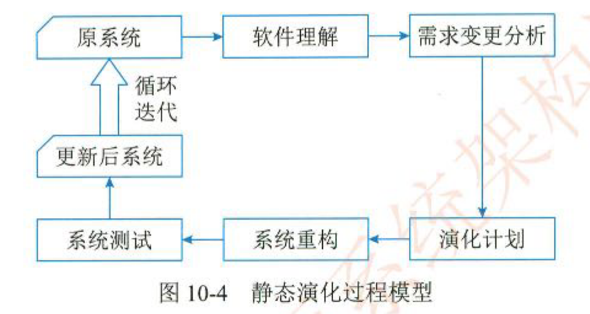
### 10.3.3 软件架构动态演化
1)软件动态性的等级。
CarlosE.Cuesta等人将软件的动态性分为3个级别(见图10-6):①交互动态性(Interactive Dynamism),要求数据在固定的结构下动态交互:②结构动态性(Structural Dynamism),允许对结构进行修改,通常的形式是组件和连接件实例的添加和删除,这种动态性是研究和应用的主流:③架构动态性(Architectural Dynamism),允许软件架构的基本构造的变动,即结构可以被重定义,如新的组件类型的定义。
2)动态演化的内容
根据所修改的内容不同,软件的动态演化主要包括以下4个方面。
* 属性改名:目前所有的ADL都支持对非功能属性的分析和规约,而在运行过程中,用户可能会对这些指标进行重新定义(如服务响应时间)。
* 行为变化;在运行过程中,用户需求变化或系统自身服务质量的调节都将引发软件行为的变化。诸如,为了提高安全级别而更换加密算法:将HTTP协议改为HTTPS协议;组件和连接件的替换和重新配置, 
* 拓扑结构改变:如增删组件,增删连接件,改变组件与连接件之间的关联关系等。
* 风格变化:一般软件演化后其架构风格应当保持不变,如果非要改变软件的架构风格,
目前,实现软件架构动态演化的技术主要有两种:采用动态软件架构(Dynamic Sofitware Architecture, DSA)和进行动态重配置(Dynamic Reconfiguration,DR)。DSA是指在运行时刻会发生变化的系统框架结构,允许在运行过程中通过框架结构的动态演化实现对架构的修改; DR从组件和连接件的配置入手,允许在运行过程中增删组件,增删连接件,修改连接关系等操作。二者从不同的侧面对软件和架构的动态演化进行研究,尚无明确的分类。
DSA实施动态演化大体遵循以下4步:①捕捉并分析需求变化;②获取或生成体系结构演化策略:(③根据步骤2得到的演化黄略,选择适当的演化黄略并实施演化:④演化后的评估与检测。完成这4个步骤还需要DSA描述语言和演化工具的支持。
5.动态重配置
基于软件动态重配置的软件架构动态演化主要是指在软件部署之后对配置信息的修改,常常被用于系统动态升级时需要进行的配置信息修改。一般来说,动态重配置可能涉及的修改有; ①简单任务的相关实现修改;②工作流实例任务的添加和删除;③组合任务流程中的个体修改; ④任务输入来源的添加和删除:⑤任务输入来源的优先级修改:⑥组合任务输出目标的添加和删除:⑦组合任务输出目标的优先级修改等。
## 10.4 软件架构演化原则
## 10.5 软件架构演化评估方法
## 10.6 大型网站系统架构演化实例
# 第11章 未来信息综合技术
## 11.1 信息物理系统技术概述
信息物理系统(Cyber-Physical Systems,CPS)
## 11.2 人工智能技术概述
## 11.3 机器人技术概述
机器人40主要有以下几个核心技术:包括云-边-端的无缝协同计算、持续学习与协同学习、知识图谱、场景自适应和数据安全。
## 11.4 边缘计算概述
## 11.5 数字孪生体技术概述
数字孪生体技术是跨层级、跨尺度的现实世界和虚拟世界建立沟通的桥梁,是第四次工业革命的通用目的技术和核心技术体系之一,是支撑万物互联的综合技术体系,是数字经济发展的基础,是未来智能时代的信息基础设施。未来十年将成为“数字孪生体时代”。
建模、仿真和基于数据融合的数字线程是数字孪生体的三项核心技术。
## 11.6 云计算和大数据技术概述
3.云计算的部署模式
根据NIST的定义,云计算从部署模式上看可以分为公有云、社区云、私有云和混合云四种类型。
***
# 第12章 信息系统架构设计理论与实践
## 12.1 信息系统架构基本概念及发展
信息系统架构(Infomation System Architecture,ISA)则是指对某一特定内容里的信息进行统筹、规划、设计、安排等一系列有机处理的活动。它的主体对象是信息,由信息建筑师来加以设计结构、决定组织方式以及归类,好让使用者与用户容易寻找与管理的一项艺术与科学。
## 12.2 信息系统架构
1.信息系统物理结构
按照信息系统硬件在空间上的拓扑结构,其物理结构一般分为集中式与分布式两大类。
几种常用的信息系统结构模式,可以供应用系统设计时参考。这些模式主要包括:单机应用系统、两层/多层CS、MVC结构、面向服务的SOA与多服务集合和数据交换总线等。
## 12.3 信息系统架构设计方法
## 12.4 信息系统架构案例分析
# 第13章 层次式架构设计理论与实践(论)
## 13.1 层次式体系结构概述
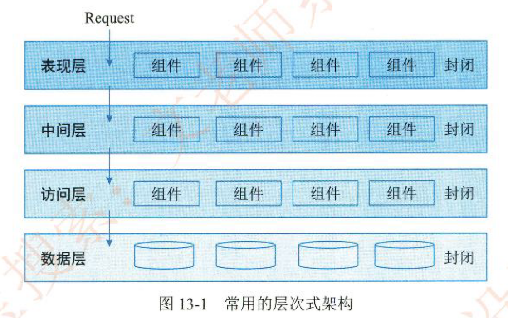
## 13.2 表现层框架设计
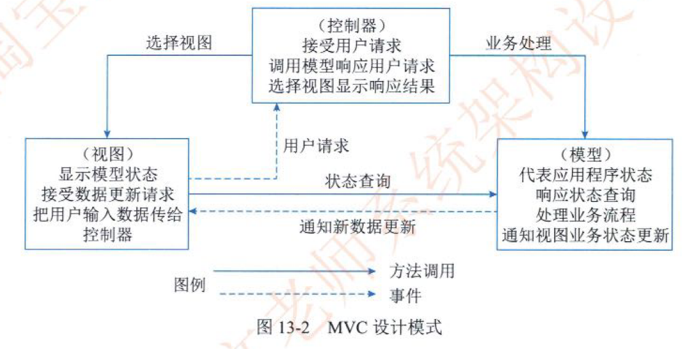
## 13.3 中间层架构设计
## 13.4 数据访问层设计(论)
### 13.4.1 5种数据访问模式
1. 在线访问
2. DataAccess Object
3. Data Transfer Object
4. 离线数据模式
5. 对象/关系映射(Object/Relation Mapping, O/R Mapping)
## 13.5 数据架构规划与设计
## 13.6 物联网层次架构设计
物联网可以分为三个层次,底层是用来感知数据的感知层,即利用传感器、二维码、RFID 等设备随时随地获取物体的信息。第二层是数据传输处理的网络层,即通过各种传感网络与互联网的融合,将对象当前的信息实时准确地传递出去。第三层则是与行业需求结合的应用层, 即通过智能计算、云计算等将对象进行智能化控制。
## 13.7 层次式架构案例分析
# 第14章 云原生架构设计理论与实践
## 14.1 云原生架构产生背景
## 14.2 云原生架构内涵
### 14.2.2 云原生架构原则(论)
1. 服务化原则
2. 弹性原则
3. 可观测原则
4. 韧性原则
5. 所有过程自动化原则
6. 零信任原则
7. 架构持续演进原则
### 14.2.3 主要架构模式
1. 服务化架构模式
2. Mesh化架构模式
3. Serverless模式
4. 存储计算分离模式
5. 分布式事务模式
6. 可观测架构
7. 事件驱动架构
## 14.3 云原生架构相关技术
## 14.4 云原生架构案例分析
# 第15章 面向服务架构设计理论与实践
## 15.1 SOA的相关概念
### 15.1.1 SOA的定义
面向服务的体系结构(Service-Oriented Architecture,SOA)
## 15.2 SOA的发展历史
### 15.2.3 SOA的微服务化发展(论)
## 15.3 SOA的参考架构(论)
从服务为中心的视角来看,企业集成的架构分为6大类
(1)业务逻辑服务(Business Logic Service):包括用于实现业务逻辑的服务和执行业务逻辑的能力,其中包括业务应用服务(Busines Application Service)、业务伙伴服务(Partner Service)以及应用和信息资产(Application and Information asset)。
(2)控制服务(Control Service):包括实现人(People)、流程(Process)和信息(Infor mation)集成的服务,以及执行这些集成逻辑的能力。
(3)连接服务6(Connectivity Service):通过提供企业服务总线提供分布在各种架构元素中服务间的连接性。
(4)业务创新和优化服务(Business Innovation and Optimization Service):用于监控业务系统运行时服务的业务性能,并通过及时了解到的业务性能和变化,采取措施适应变化的市场。
(5)开发服务(Development Service):贯彻整个软件开发生命周期的开发平台,从需求分析,到建模、设计、开发、测试和维护等全面的工具支持。
(6)IT服务管理(IT Service Management):支持业务系统运行的各种基础设施管理能力或服务,如安全服务、目录服务、系统管理和资源虚拟化。
## 15.4 SOA主要协议和规范
### 15.4.1 UDDI协议
UDDI(统一描述、发现和集成协议)计划是一个广泛的、开放的行业计划,它使得商业实体能够彼此发现:定义它们怎样在Intemet上互相作用,并在一个全球的注册体系架构中共享信息。UDDI是这样一种基础的系统构筑模块,它使商业实体能够快速、方便地使用它们自身的企业应用软件来发现合适的商业对等实体,并与其实施电子化的商业贸易。
### 15.4.2 WSDL规范
WSDL (Web Services Description Language,Web服务描述语言),是一个用来描述Web服务和说明如何与Web服务通信的XML语言。
### 15.4.3 SOAP协议
SOAP是在分散或分布式的环境中交换信息的简单的协议,是一个基于XML的协议。它包括4个部分:SOAP封装(Envelop),定义了一个描述消息中的内容是什么,是谁发送的,谁应当接收并处理它以及如何处理它们的框架:SOAP编码规则(Encoding Rules),用于表示应用程序需要使用的数据类型的实例:SOAP RPC表示(RPC Representation)是远程过程调用和应答的协定;SOAP绑定(Binding)是使用底层协议交换信息。
### 15.4.4 REST规范
REST是Roy Thomas Fielding博士在他的一篇论文中提出的一个概念,在这篇论文中设计了一种新的互联网软件架构风格,REST的设计不只是要适用于互联网环境,而是一个普遍的设计理念,目的是为了让不同的软件或者应用程序在任何网络环境下都可以进行信息的互相传递。
## 15.5 SOA设计的标准要求(论)
## 15.6 SOA的作用
SOA对于实现企业资源共享,打破“信息孤岛”的步骤如下。
(1)把应用和资源转换成服务。
(2)把这些服务变成标准的服务,形成资源的共享。
## 15.7 SOA的设计原则
## 15.8 SOA的设计模式
### 15.8.4 微服务模式(论)
微服务架构将一个大型的单个应用或服务拆分成多个微服务,可扩展单个组件而不是整个应用程序堆栈,从而满足服务等级协议。微服务架构围绕业务领域将服务进行拆分,每个服务可以独立进行开发、管理和迭代,彼此之间使用统一接口进行交流,实现了在分散组件中的部署、管理与服务功能,使产品交付变得更加简单,从而达到有效拆分应用,实现敏捷开发与部署的目的。
常见的微服务设计模式有聚合器微服务设计模式、代理微服务设计模式、链式微服务设计模式、分支微服务设计模式、数据共享微服务设计模式、异步消息传递微服务设计模式等。
## 15.9 构建SOA架构时应该注意的问题
## 15.10 SOA实施的过程
# 第16章 嵌入式系统架构设计理论与实践
## 16.1 嵌入式系统概述
## 16.2 嵌入式系统软件架构原理与特征
## 16.3 嵌入式系统软件架构设计方法
### 16.3.2 属性驱动的软件设计方法
嵌入式系统,尤其是安全攸关的系统与通常的软件系统的最大不同点就是高质量属性始终贯穿于整个产品的全生命周期中。属性驱动的软件设计(Atribute-Driven Design,ADD》是把组质量属性场景作为输入,利用对质量属性实现与架构设计之间的关系的了解(如体系结构风格、质量战术等)对软件架构进行设计的一种方法。
### 16.3.3实时系统设计方法
嵌入式系统具有众多自身的特性,这些特性通常和应用场景密切相关,而实时特性常被各类具各控制能力的系统所采用,比如工业控制、航空航天和轨道交通等领域中的嵌入式系统应同时具备高可靠性、高安全性、强实时性等。系统的实时性是这些嵌入式系统的核心特性, 对实时系统,其设计方法也有它的自身特点。实时系统设计方法(Design Approach for Real Time System,DARTS)常被应用于嵌入式系统的软件设计中。
## 16.4 嵌入式系统软件架构案例分析
# 第17章 通信系统架构设计理论与实践
## 17.1 通信系统概述
## 17.2 通信系统网络架构
### 17.2.4 存储网络架械
一般来说,计算机访问磁盘存储有3种方式: 
(1)直连式存储(Direct Atached Storage, DAS):计算机通过I/O端口直接访问存储设备的方式。
(2)网络连接的存储(Network Atached Storage NAS):计算机通过分布式文件系统访问存储设备的方式
(3)存储区域网络(Storage Area Network,SAN):计算机通过构建的独立存储网络访问存储设备的方式。
1.软件定义网络
软件定义网络(Software Defined Network, SDN)
## 17.3 网络构建关键技术
## 17.4 网络构建和设计方法
## 17.5 通信网络构建案例分析
# 第18章 安全架构设计理论与实践
## 18.1 安全架构概述
## 18.2 安全模型
当前比较被公认的模型有:状态机模型(State Machine Model)、Bel-LaPadula (BLP)模型、Biba模型、Clark-Wilson (CWM)模型、ChineseWal模型,以及信息流模型(Information Flow Model)、非干涉模型(Noninterference Model)、格子模型(Latice Model)、 Brewer and Nash模型和Graham-Denning模型等。这里简要介绍典型的五种安全模型。
## 18.3 系统安全体系架构规划框架
因此根据网络中风险威胁的存在实体划分出5个层次的实体对象:应用、存储、主机、网络和物理。
## 18.4 信息安全整体架构设计(WPDRRC模型)
WPDRRC模型有6个环节和3大要素。
6个环节包括:预警、保护、检测、响应、恢复和反击,它们具有较强的时序性和动态性, 能够较好地反映出信息系统安全保障体系的预警能力、保护能力、检测能力、响应能力、恢复能力和反击能力。
3大要素包括:人员、策略和技术。人员是核心,策略是桥梁,技术是保证。
## 18.5 网络安全体系架构设计(论)
鉴别(Authentication)的基本目的是防止其他实体占用和独立操作被鉴别实体的身份。鉴别提供了实体声称其身份的保证,只有在主体和验证者的关系背景下,鉴别才是有意义的。鉴别有两种重要的关系背景:一是实体由申请者来代表,申请者与验证者之间存在着特定的通信关系(如实体鉴别);二是实体为验证者提供数据项来源。
鉴别的方式主要基于以下5种。
(1)已知的,如一个秘密的口令。
(2)拥有的,如1C卡、令牌等。
(3)不改变的特性,如生物特征。
(4)相信可靠的第三方建立的鉴别(递推)。
(5)环境(如主机地址等)。
### 18.5.3 访问控制框架访问控制(Access Control)决定开放系统环境中允许使用哪些资源、在什么地方适合阻止未授权访问的过程。在访问控制实例中,访问可以是对一个系统(即对一个系统通信部分的一个实体)或对一个系统内部进行的。
## 18.6 数据库系统的安全设计
## 18.7 系统架构的脆弱性分析
## 18.8 安全架构设计案例分析
# 第19章 大数据架构设计理论与实践
## 19.1 传统数据处理系统存在的问题
## 19.2 大数据处理系统架构分析
## 19.3 Lambda架构
## 19.4 Kappa架构
## 19.5 Lambda架构与Kappa架构的对比和设计选择
## 19.6 大数据架构设计案例分析
# 第20章 系统架构设计师论文写作要点

***
补充
***
* 操作系统
	* 微内核
* 计算机组成原理
	* 指令周期取址

***
论文主题
***

* 2009
1. 论基于DSSA的软件架构设计与应用
1. 论信息系统建模方法
1. 论基于REST服务的Web应用系统设计
1. 软件可靠性设计与应用
* 2010
1. 论软件的静态演化和动态演化及其应用
2. 论数据挖掘技术的应用
3. 大规模分布式系统缓存设计策略？
4. 软件可靠性评价
* 2011
1. 论模型驱动架构在系统开发中的应用？
2. 论企业集成平台的架构设计？
3. 论企业架构管理与应用？
4. 论软件需求获取技术及应用
* 2012
1. 论基于架构的软件设计方法及应用
2. 论企业应用系统的数据持久层架构设计？
3. 论决策支持系统的开发与应用
4. 论企业信息化规划的实施与应用
* 2013
1. 软件架构建模技术与应用
2. 企业应用系统的分层架构⻛格
3. 论软件可靠性设计技术的应用
4. 论分布式存储系统架构设计？
* 2014
5. 论软件需求管理
6. 论非功能性需求对企业应用架构设计的影响？
7. 论软件的可靠性设计
8. 论网络安全体系设计
* 2015
1. 论应用服务器基础软件？
2. 论软件系统架构⻛格
3. 论面向服务的架构及其应用
4. 论企业集成平台的技术与应用？
* 2016
1. 论软件系统架构评估
2. 论软件设计模式及其应用
3. 论数据访问层设计技术及其应用
4. 论微服务架构及其应用
* 2017
1. 论软件架构⻛格
2. 论软件系统建模方法及其应用
3. 论无服务器架构及其应用？
4. 论软件质量保证及其应用
* 2018
1. 论软件开发过程RUP及其应用
2. 论软件体系结构的演化
3. 论面向服务架构设计及其应用：
4. 论NoSQL数据库技术及其应用
* 2019
1. 论软件设计方法及其应用
2. 论软件系统架构评估及其应用
3. 论数据湖技术及其应用？
4. 论负载均衡技术在Web系统中的应用？
* 2020
1. 论数据分片技术及其应用
2. 论云原生架构及其应用
3. 论软件测试中缺陷管理及其应用？
4. 论企业集成架构设计及应用？
* 2021
1. 论面向方面的编程技术及其应用（AOP）？
2. 论系统安全架构设计及其应用
3. 论企业集成平台的理解与应用？
4. 论微服务架构及其应用
* 2022
1. 论基于构件的软件开发方法与应用
2. 论软件维护方法及其应用
3. 论区块链技术及应用？
4. 论湖仓一体架构及其应用？

***
旧版教材
***
# 第3章 信息系统基础知识
## 3.3 信息化的典型应用
### 3.3.4 客户关系管理在企业的应用
客户关系管理 (Customer Relationship Management, CRM)
CRM的核心思想就是以客户为中心。
CRM是一套先进的管理思想及技术手段,它通过将人力资源、业务流程与专业技术进行有效的整合,最终为企业涉及到客户或消费者的各个领域提供了完美的集成,使得企业可以更低成本、更高效率地满足客户的需求,并与客户建立起基于学习性关系基础上的一对一营销模式,从而让企业可以最大程度提高客户满意度及忠诚度。
* CRM系统的主要模块
1) 销售自动化销售自动化(Sales Force Automation, SFA)是CRM中最基本的模块。
2) 营销自动化(Marketing Automation, MA)
3) 客户服务与支持
4) 商业智能
# 第4章 系统开发基础知识
## 4.5 软件的重用
软件重用是指在两次或多次不同的软件开发过程中重复使用相同或相似软件元素的过程。软件元素包括需求分析文档、设计过程、设计文档、程序代码、测试用例和领域知识等。对于新的软件开发项目而言,它们或者是构成整个目标软件系统的部件,或者在软件开发过程中发挥某种作用。通常将这些软件元素称为软部件。
按照重用活动是否跨越相似性较少的多个应用领域,软件重用可区别为横向重用和纵向重用。横向重用(horizontal reuse)是指重用不同应用领域中的软件元素,例如数据结构、分类算法和人机界面构件等。标准函数库是一种典型的、原始的横向重用机制。
纵向重用是指在一类具有较多公共性的应用领域之间进行软部件重用。因为在两个截然不同的应用领域之间实施软件重用的液力不大,所以纵向重用才广受瞩目,并成为软件重用技术的真正希望所在。
# 第7章 设计模式
## 7.2 设计模式实例
### 7.2.1 创健性模式
Abstract Factory(抽象工厂)。
Builder(构建建器)。
Factory Method (工厂方法)。
Prototype(原型)。
Singleton(单独)。
### 7.2.2 结构性模式
Adapter 适配器
Bridge 桥接
Composite 组合
Decorator 装饰
Facade 
Flyweight 
Proxy 代理
### 7.2.3 行为性模式
Chain of Responsibility 责任链
Command 命令
Interpreter 
Iterator 迭代器
Mediator 
Memento 备忘录
Observer 观察者
State 
Strategy 
Template Method
Visitor 访问者

