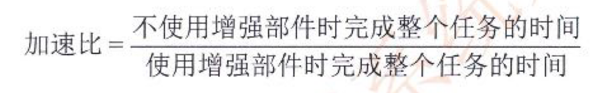
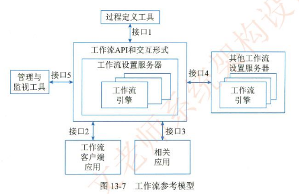
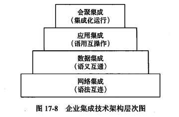

//Description： 记录系统架构中的一些概念和方法，备考软考系统架构设计师。主要参考书籍《系统架构设计师》（2009，2022）。整个笔记共分两部分：第一部分为知识点总结，第二部分为笔记及经验。

[toc]

[系统架构设计师真题](https://www.gkzenti.cn/paper?cls=软考&province=高级_系统架构设计师)

***
综合知识   
***

# 第1章 绪论
## 1.1 系统架构概述
架构分析常用的方法有：软件架构分析方法SAAM、架构权衡分析法ATAM、成本效益分析法CBAM、基于场景的架构再工程SBAR、架构层次的软件可维护性预测ALPSM、软件架构评估模型SAEM等, 架构设计是指生成一个满足用户需求的软件架构过程。
架构设计常用的方法有：从工件描述中提取架构描述的工件驱动(artifact-drnven)方法:从用例导出架构抽象的用例驱动(use case-driven);从模式导出架构抽象的模式驱动(paterm-driven)方法:从领域模型导出架构抽象的域驱动(domain-driven)方法以及从设计过程中获得架构质量属性需求的属性驱动设计(attribute-driven design)方法等。
架构测试着重于仿真系统模型、解决架构层的主要问题。由于测试的抽象层次不同,架构测试策略分为单元、子系统、集成和验收测试等阶段的测试策略。测试方法主要包括架构测试覆盖方法、组件设计正确性验证方法和基于CHAM的架构动态语义验证方法等。

通常软件开发模型可分为三种：以软件需求完全确认为前提的瀑布模型;在软件开发初期只能提供基本需求为前提的渐进式开发模型(如螺旋模型等);以形式化开发方法为基础的变换模型。
### 1.1.2 软件架构的常用分类及建模方法(论)
软件架构的常用分类：比较典型的架构模型包括分层架构、事件驱动架构、微核架构、微服务架构和云架构等五类。

系统架构的常用建模方法：架构师在进行软件架构设计时,必须掌握软件架构的表示方法,即如何对软件架构建模。根据建模的侧重点的不同,可以将软件架构的模型分成4种：结构模型、框架模型、动态模型和过程模型。
* 结构模型：这是一个最直观、最普遍的建模方法。此方法以架构的构件、选连接件和其他概念来刻画结构。并力图通过结构来反映系统的重要语义内容,包括系统的配置、约束、隐含的假设条件、风格和性质。研究结构模型的核心是架构描述语言。
* 框架模型：框架模型与结构模型类似,但它不太侧重描述结构的细节,而更侧重整体的结构。框架模型主要以一些特殊的问题为目标建立只针对和适应问题的结构。
* 动态模型：动态模型是对结构或框架模型的补充，主要研究系统的“大颗粒”行为的性质。例如，描述系统的重新配置或演化。这里的动态可以是指系统总体结构的配置、建立或拆除通信或计算的过程，这类系统模型常是激励型的。
* 过程模型：过程模型是研究构造系统的步骤和过程，其结构是遵循某些过程脚本的结果。  
* 功能模型：  
RUP“4+1”视图模型，从5个不同的视角包括逻辑视图、过程视图、物理视图、开发视图和场景视图   
UML“4+1”视图模型：逻辑视图、进程视图、部署视图、实现视图和用例视图  

## 1.2 系统架构设计师概述
# 第2章 计算机与网络基础知识
## 2.1 计算机系统概述
## 2.2 计算机硬件
处理器的指令集按照其复杂程度可分为复杂指令集(Complex Instruction Set Computers, CISC)与精简指令集(Reduced Instruction Set Computers, RISC)两类。CISC 以Intel、AMD 的x86CPU为代表,RISC以ARM和Power为代表。
## 2.3 计算机软件
通常,操作系统可分为批处理操作系统、分时操作系统、实时操作系统、网络操作系统、分布式操作系统、微型计算机操作系统和嵌入式操作系统等类型。  
7）嵌入式操作系统  
嵌入式操作系统运行在嵌入式智能设备环境中，对整个智能硬件以及它所操作、控制的各种部件装置等资源进行统一协调、处理、指挥和控制，其主要特点如下。
* 微型化：从性能和成本角度考虑，希望占用的资源和系统代码量少，如内存少、字长短、运行速度有限、能源少（用微小型电池）。
* 可定制：从减少成本和缩短研发周期考虑，要求嵌入式操作系统能运行在不同的微处理器平台上，能针对硬件变化进行结构与功能上的配置，以满足不同应用需要。
* 实时性：嵌入式操作系统主要应用于过程控制、数据采集、传输通信、多媒体信息及关键要害领域需要迅速响应的场合，所以对实时性要求较高。
* 可靠性：系统构件、模块和体系结构必须达到应有的可靠性，对关键要害应用还要提供容错和防故障措施。
* 易移植性：为了提高系统的易移植性，通常采用硬件抽象层（Hardware Abstraction Level，HAL）和板级支撑包（Board Support Package，BSP）的底层设计技术。  
常见的嵌入式实时操作系统有VxWorks、uClinux、PalmOS、WindowsCE、uC/OS-ⅡI和eCos等。
### 2.3.3 数据库
早期数据库种类有3种,分别是层次式数据库、网络式数据库和关系型数据库。目前最常机的数据库种类是关系型数据库和非关系型数据库。根据数据库存储体系分类,还可分为关系型数据库、键值(Key-Value)数据库、列存储数据库、文档数据库和搜索引擎数据库等类型。

设计数据库概念模型的最著名、最常用的方法是E-R方法。采用E-R方法的数据库概念结构设计可分为三步:设计局部E-R模型、设计全局E-R模型以及全局E-R模型的优化。
逻辑结构设计是在概念结构设计基础上进行的数据模型设计,可以是层次、网状模型和关系模型。逻辑结构设计阶段的主要任务是确定数据模型,将E-R图转换为指定的数据模型,确定完整性约束,确定用户视图。
2. 分布式数据库  
分布式数据库系统(Distributed DataBase System, DDBS)
3. 常用数据库管理系统
1) Oracle
2) IBM DB2
3) Sybase
4) Microsoft SQL Server
4. 大型数据库管理系统的特点
### 2.3.4 文件系统
4. 文件存取的方法和存储空间的管理  
1）文件的存取方法  
文件的存取方法是指读/写文件存储器上的一个物理块的方法。通常有顺序存取和随机存取两种方法。顺序存取方法是指对文件中的信息按顺序依次进行读/写：随机存取方法是指对文件中的信息可以按任意的次序随机地读/写。  
2）文件存储空间的管理  
要将文件保存到外部存储器（简称外存或辅存）上，首先必须知道存储空间的使用情况，即哪些物理块是被“占用”的，哪些是“空闲”的。特别是对大容量的磁盘存储空间被多用户共享时，用户执行程序经常要在磁盘上存储文件和删除文件，因此，文件系统必须对磁盘空间进行管理。外存空闲空间管理的数据结构通常称为磁盘分配表（Disk Allocation Table）。常用的空闲空间管理方法有空闲区表、位示图和空闲块链3种。  
（1）空闲区表。将外存空间上的一个连续的未分配区域称为“空闲区”。操作系统为磁盘外存上的所有空闲区建立一张空闲表，每个表项对应一个空闲区，空闲表中包含序号、空闲区的第1块号、空闲块的块数和状态等信息。它适用于连续文件结构。  
（2）位示图。这种方法是在外存上建立一张位示图（Bitmap），记录文件存储器的使用情况。每一位对应文件存储器上的一个物理块，取值0和1分别表示空闲和占用。例如，某文件存储器上位示图的大小为n，物理块依次编号为0，1，2，。假如计算机系统中字长为32位，那么在位示图中的第0个字（逻辑编号）对应文件存储器上的0，1.2，，31号物理块；第1个字对应文件存储器上的32，33，34，，63号物理块，依此类推。  
这种方法的主要特点是位示图的大小由磁盘空间的大小（物理块总数）决定，位示图的描述能力强，适合各种物理结构。  
（3）空闲块链。每个空闲物理块中有指向下一个空闲物理块的指针，所有空闲物理块构成一个链表，链表的头指针放在文件存储器的特定位置上（如管理块中），不需要磁盘分配表，节省空间。每次申请空闲物理块只需根据链表的头指针取出第1个空闲物理块，根据第一个空闲物理块的指针可找到第2个空闲物理块，依此类推。  
（4）成组链接法。UNIX系统采用该方法。例如，在实现时系统将空闲块分成若干组，每100个空闲块为一组，每组的第1个空闲块登记了下一组空闲块的物理盘块号和空闲块总数。假如某个组的第1个空闲块号等于0，意味着该组是最后一组，无下一组空闲块。  
5. 文件共享和保护  
1）文件的共享  
文件共享是指不同用户进程使用同一文件，它不仅是不同用户完成同一任务所必须的功能，还可以节省大量的主存空间，减少由于文件复制而增加的访问外存次数。文件共享有多种形式，采用文件名和文件说明分离的目录结构有利于实现文件共享。常见的文件链接有硬链接和符号链接两种。  
（1）硬链接。文件的硬链接是指两个文件目录表目指向同一个索引结点的链接，该链接也称基于索引结点的链接。换句话说，硬链接是指不同文件名与同一个文件实体的链接。文件硬链接不利于文件主删除它拥有的文件，因为文件主要删除它拥有的共享文件，必须首先删除（关闭）所有的硬链接，否则就会造成共享该文件的用户的目录表目指针悬空。  
（2）符号链接。符号链接建立新的文件或目录，并与原来文件或目录的路径名进行映射，当访问一个符号链接时，系统通过该映射找到原文件的路径，并对其进行访问。采用符号链接可以跨越文件系统，甚至可以通过计算机网络连接到世界上任何地方的机器中的文件，此时只须提供该文件所在的地址以及在该机器中的文件路径。  
2）文件的保护  
文件系统对文件的保护常采用存取控制的方式进行。所谓存取控制，就是规定不同的用户对文件的访问有不同的权限，以防止文件被未经文件主同意的用户访问。  
（1）存取控制矩阵。理论上，存取控制的方法可用存取控制矩阵实现，它是一个二维矩阵，一维列出计算机的全部用户，另一维列出系统中的全部文件，矩阵中的每个元素A表示第i个用户对第i个文件的存取权限。通常，存取权限有可读R、可写W、可执行X以及它们的组合。  
（2）存取控制表。存取控制矩阵由于太大往往无法实现。一个改进的办法是按用户对文件的访问权力的差别对用户进行分类，由于某一文件往往只与少数几个用户有关，所以这种分类方法可使存取控制表简化。UNIX系统就是使用了这种存取控制表方法，它把用户分成三类：文件主、同组用户和其他用户，每类用户的存取权限为可读、可写、可执行以及它们的组合。  
（3）用户权限表。改进存取控制矩阵的另一种方法是以用户或用户组为单位将用户可存取的文件集中起来存入表中，这称为用户权限表。表中的每个表目表示该用户对应文件的存取权限，这相当于存取控制矩阵一行的简化。  
（4）密码。在创建文件时，由用户提供一个密码，在文件存入磁盘时用该密码对文件的内容加密。在进行读取操作时，要对文件进行解密，只有知道密码的用户才能读取文件。
### 2.3.5 网络协议
### 2.3.6 中间件
因而出现了一类称为“中间件(Middleware)的软件,它们作为应用软件与各种操作系统之间使用的标准化编程接口和协议。
可以起承上启下的作用,使应用软件的开发相对独立于计算机硬件和操作系统,并能在不同的系统上运行,实现相同的应用功能。
1. 中间件分类
2. 中间件产品介绍
### 2.3.7 软件构件
构件又称为组件,是一个自包容、可复用的程序集。构件是一个程序集,或者说是一组程序的集合。这个集合可能会以各种方式体现出来,如源程序或二进制的代码。
1. 软件构件的组装模型  
构件组装模型的优点如下:构件的自包容性让系统的扩展变得更加容易:设计良好的构件更容易被重用,降低软件开发成本;构件的粒度较整个系统更小,因此安排开发任务更加灵活, 可以将开发团队分成若干组,并行地独立开发构件。
## 2.4 嵌入式系统及软件
嵌入式系统(Embedded System)
### 2.4.3 嵌入式软件的组成及特点
### 2.4.4 安全攸关软件的安全性设计
DO-178B标准将软件生命周期分为“软件计划过程”“软件开发过程”和“软件综合过程”,其中软件开发过程和软件综合过程又分别被细分成4个子过程。
## 2.5 计算机网络
### 2.5.2 通信技术
香农公式： $$ C = B * log_2 (1 + S/N) $$ 
信道容量C,b/s  
信号带宽B,Hz  
信号平均功率S,W  
噪声平均功率N,W  
信噪比S/N,dB
### 2.5.3 网络技术
最小帧长。由于CSMA/CD算法限制，以太网帧的最小长度为64字节。
### 2.5.4 组网技术
由低层至高层分别为物理层(PhysicalLayer)、数据链路层(DatalinkLayer)、网络层(Network Layer)、传输层(Transport Layer)、会话层(Sesion Layer)、表示层(Presentation Layer)和应用层(Application Layer)。

网络存储体系结构大致分为三种:直连式存储(Direct Attached Storage,DAS)、网络连接存储(Network Attached Storage,NAS)和存储区域存储(Storage Area Network, SAN)
## 2.6 计算机语言
机器语言的指令格式：机器语言指令是一种二进制代码,由操作码和操作数两部分组成。    
### UML
UML中有4种关系:依赖、关联、泛化和实现。
1. 依赖是两个事物间的语义关系,其中一个事物(独立事物)发生变化会影响另一个事物(依赖事物)的语义。在图形上,把一个依赖画成一条可能有方向的虚线,如图2-29所示。
2. 关联是一种结构关系,它描述了一组链,链是对象之间的连接。聚集是一种特殊类型的关联,它描述了整体和部分间的结构关系。关联和聚集的图形化表示如图2-30和图2-31所示。
在关联上可以标注重复度和角色。
3. 泛化是一种特殊/一般关系,特殊元素(子元素)的对象可替代一般元素(父元素)的对象。用这种方法,子元素共享了父元素的结构和行为。在图形上,把一个泛化关系画成一条带有空心箭头的实线,它指向父元素,如图2-32所示。
4. 实现是类元之间的语义关系,其中一个类元指定了由另一个类元保证执行的契约。在两种情况下会使用实现关系:一种是在接口和实现它们的类或构件之间:另一种是在用例和实现它们的协作之间。在图形上,把一个实现关系画成一条带有空心箭头的虚线。  
按照图本身具有的特点，可以把图形划分为5类视图,分别是用例视图、逻辑视图、进程视图、实现视图和部署视图,其中的用例视图居于中心地位。
按照软件工程“自项向下、逐步求精”的原则,软件生命周期可分为可行性分析、需求分析、体系结构设计、详细设计、编码和测试发布6个阶段,形式化方法贯穿软件工程整个生命周期。  
## 2.7 多媒体
视音频压缩方法目前,视音频压缩方法有上百种,这些方法总体上可归类为有损(Lossy)压缩和无损(Losless)压缩两类。无损压缩也即压缩前和解压缩后的数据完全一致。多数的无损压缩都采用RLE行程编码算法。而有损压缩意味着解压缩后的数据与压缩前的数据不一致,在压缩的过程中要丢失一些人眼和人耳不敏感的图像或音频信息,这些丢失的信息是不可恢复的。无损压缩常见的格式有WAV、 PCM、 TTA、FLAC、AU、APE、TAK和WavPack (WV)等;有损压缩常见的格式有MP3、Windows Media Audio (WMA)、OggVorbis (OGG)等。
## 2.8 系统工程
系统工程是运用系统方法,对系统进行规划、研究、设计、制造、试验和使用的组织管理技术。
系统之系统(System of System,SoS)适用于其系统元素本身也是系统的情况。这些系统之系统带来了大规模跨学科问题,涉及多重、混合和分布式的系统。这些部件系统的互操作集台通常能产生单个系统无法单独达成的结果。
### 2.8.4 基于模型的系统工程
基于模型的系统工程(Model-Based Systems Engineering, MBSE)
MBSE的三大支柱分别是建模语言、建模工具和建模思路。
## 2.9 系统性能

### 2.9.4 性能评估
1.基准测试程序
大多数情况下,为测试新系统的性能,用户必须依靠评价程序来评价机器的性能。下面列出了4种评价程序,它们评测的准确程度依次递减:真实的程序、核心程序、小型基准程序和合成基准程序。
把应用程序中用得最多、最频繁的那部分核心程序作为评价计算机性能的标准程序,称为基准测试程序(benchmark)。基准测试程序有整数测试程序Dhrystone、浮点测试程序Linpack、Whetstone基准测试程序、SPEC基准测试程序和TPC基准程序。

# 第3章 信息系统基础知识
## 3.1 信息系统概述
### 3.1.4 信息系统的生命周期
一般来说,信息系统的生命周期分为4个阶段,即产生阶段、开发阶段、运行阶段和消亡阶段。  
信息系统的开发阶段是信息系统生命周期中最重要和关键的阶段。该阶段又可分为5个阶段,即,总体规划、系统分析、系统设计、系统实施和系统验收阶段。
### 3.1.5 信息系统建设原则
### 3.1.6 信息系统开发方法(论)
1. 结构化方法
结构化方法是由结构化系统分析和设计组成的一种信息系统开发方法,是目前最成熟、应用最广泛的信息系统开发方法之一。它假定被开发的系统是一个结构化的系统。
2. 原型法
原型法是一种根据用户需求,利用系统开发工具,快速地建立一个系统模型展示给用户, 在此基础上与用户交流,最终实现用户需求的信息系统快速开发的方法。
3. 面向对象方法
面向对象方法是对客观世界的一种看法,它是把客观世界从概念上看成一个由相互配合、协作的对象所组成的系统。信息系统开发的面向对象方法的兴起是信息系统发展的必然趋势。
数据处理包括数据与处理两部分。
4. 面向服务的方法
面向对象的应用构建在类和对象之上,随后发展起来的建模技术将相关对象按照业务功能进行分组,就形成了构件的概念。对于跨构件的功能调用,则采用接口的形式暴露出来。进一步将接口的定义与实现进行解耦,则催生了服务和面向服务的开发方法。
## 3.2 业务处理系统(TPS)
数据处理TPS中常见的数据处理方式有两种,一种是批处理方式;另一种是联机事务处理方式。
## 3.3 管理信息系统(MIS)
## 3.4 决策支持系统(DSS)(论)
### 3.4.1 决策支持系统的概念
2. 决策支持系统的定义  
1）定义一  
DSS是一个由语言系统、知识系统和问题处理系统3个互相关联的部分组成的，基于计算机的系统。  
DSS应具有的特征是：  
（1）数据和模型是DSS的主要资源。  
（2）DSS用来支援用户作决策而不是代替用户作决策。
（3）DSS主要用于解决半结构化及非结构化问题。  
2）定义二  
DSS应当是一个交互式的、灵活的、适应性强的基于计算机的信息系统，能够为解决非结构化管理问题提供支持，以改善决策的质量。DSS使用数据，提供容易使用的用户界面，并可以体现决策者的意图。DSS可以提供即时创建的模型，支持整个决策过程中的活动，并可能包括知识成分。  
DSS应具有的特征是：  
（1）主要针对上层管理人员经常面临的结构化程度不高、说明不够充分的问题。  
（2）界面友好，容易被非计算机人员所接受。  
（3）将模型、分析技术与传统的数据存取与检索技术结合起来。  
（4）具有对环境及决策方法改变的灵活性与适应性。  
（5）支持但不是代替高层决策者进行决策。  
（6）充分利用先进信息技术快速传递和处理信息。  
3. 决策支持系统的基本模式  
DSS由若干部件按一定的结构组成，部件不同或结构不同会构成功能略有差异的DSS，但各种DSS的结构都建立在某种基本模式之上。DSS的基本模式反映DSS的形式及其与“真实系统”、人和外部环境的关系，如图3-11所示。其中管理者处于核心地位，运用自己的知识和经验，结合决策支持系统提供的支持，对其管理的“真实系统”进行决策。
4. 决策支持系统的功能
### 3.4.3 决策支持系统的特点
(1) 决策支持系统面向决策者,系统在开发中遵循的需求和操作是设计系统的依据和原则。
系统的收集、存储和输出的一切信息,都是为决策者服务。
(2) 决策支持系统支持对半结构化问题的决策。半结构化问题的复杂性致使传统的计算机信息系统,如电子数据处理系统、管理信息系统都难以解决,而决策支持系统则可以辅助决策者对决策信息过程和方案进行较系统且全面的分析。
(3) 决策支持系统的作用是辅助决策者、支持决策者。由于决策过程的复杂性和决策过程中的重要作用,系统不可能取代人而做出决策。在整个决策过程中系统不可能也不应该提供答案,也不应该强加给决策者预先规定的决策顺序。
(4) 决策支持系统体现决策过程的动态性。用户或用户通过模型,根据决策层次、决策环境、问题理解、知识积累等多方面变化的情况来动态地确定问题的解答,并在决策的动态运行过程中完善和调整系统。
(5) 决策支持系统提倡交互式处理。通过人、机对话的方式将决策人的经验、观念和判断纳入系统,进而将人们主观的、经验的判断与客观的信息反映相结合,最后确定决策方案。
### 3.4.4 决策支持系统的组成
1. 数据的重组和确认
2. 数据字典的建立
3. 数据挖掘和智能体
4. 模型建立
## 3.5 专家系统(ES)
## 3.6办公自动化系统OAS
## 3.7 企业资源规划(ERP)
### 3.7.2 企业资源规划的结构
ERP中的企业资源包括企业的“三流”资源,即物流资源、资金流资源和信息流资源。
ERP实际上就是对这“三流”资源进行全面集成管理的管理信息系统。
### 3.7.3 企业资源规划的功能
## 3.8 典型信息系统架构模型
企业战略教据模型分为数据库模型和数据仓库模型,数据库模型用来描述日常事务处理中数据及其关系:数据仑库模型则描述企业高层管理决策者所需信息及其关系。在企业信息化过程中,数据库模型是基础,一个好的数据库模型应该客观地反映企业生产经营的内在联系。数据库是办公自动化、计算机辅助管理系统、开发与设计自动化、生产过程自动化、lntranet的基础和环境。
新的方法。  
### 3.8.2 企业信息化与电子商务(论)
2. 企业信息化的目的
3. 企业信息化的规划  
企业信息化一定要建立在企业战略规划基础之上，以企业战略规划为基础建立的企业管理模式是建立企业战略数据模型的依据。  
企业信息化就是技术和业务的融合。这个“融合”并不是简单地利用信息系统对手工的作业流程进行自动化改造，而是需要从3个层面来实现。  
（1）企业战略的层面。在规划中必须对企业自前的业务策略和未来的发展方向作深入分析。通过分析，确定企业的战略对企业内外部供应链和相应管理模式，从中找出实现战略目标的关键要素，分析这些要素与信息技术之间的潜在关系，从而确定信息技术应用的驱动因素，达到战略上的融合。  
（2）业务运作层面。针对企业所确定的业务战略，通过分析获得实现这些自标的关键驱动力和实现这些自标的关键流程。这些关键流程的分析和确定要根据它们对企业价值产生过程中的贡献程度来确定。关键的业务需求是从那些关键的业务流程分析中获得的，它们将决定未来系统的主要功能。这一环节非常重要，因为，信息系统如果能够与这些直接创造价值的关键业务流程相融合，这对信息化投资回报的贡献是非常巨大的，也是信息化建设的成败的一个衡量指标。  
（3）管理运作层面。虽然这一层面从价值链的角度上来说，是属于辅助流程，但它对企业日常管理的科学性、高效性是非常重要的。另外，在企业战略层面的分析中，我们可以获得适应企业未来业务发展的管理模式，这个模式的实现是离不开信息技术的支撑的。所以，在管理运作层面的规划上，除了提出应用功能的需求外，还必须给出相应的信息技术体系，这些将确保管理模式和组织架构适应信息化的需要。  
企业战略数据模型分为数据库模型和数据仓库模型，数据库模型用来描述日常事务处理中数据及其关系：数据仓库模型则描述企业高层管理决策者所需信息及其关系。在企业信息化过程中，数据库模型是基础，一个好的数据库模型应该客观地反映企业生产经营的内在联系。数据库是办公自动化、计算机辅助管理系统、开发与设计自动化、生产过程自动化、Intranet的基础和环境。  
信息技术和网络技术都在飞速发展，企业信息化是多种类、多层次信息系统建设、集成和应用的过程，因而，不是一而就的事情，需要结合企业的实际，全面规划，分步实施。
4. 企业信息化方法 
(1) 业务流程重构方法。企业业务流程重构的中心思想是,在信息技术和网络技术迅猛发展的时代,企业必须重新审视企业的生产经营过程,利用信息技术和网络技术,对企业的组织结构和工作方法进行“彻底的、根本性的”重新设计,以适应当今市场发展和信息社会的需求。  
(2) 核心业务应用方法。任何一家企业,要想在市场竞争的环境中生存发展,都必须有自己的核心业务,否则,必然会被市场所淘汰。当然,不同的企业,其核心业务是不同的。比如一个石油生产企业,原油的勘探开发生产就是它的核心业务。围绕核心业务应用计算机技术和网络技术是很多企业信息化成功的秘诀。  
(3) 信息系统建设方法。对大多数企业来说,建设信息系统是企业信息化的重点和关键。
因此,信息系统建设成了最具普遍意义的企业信息化方法。  
(4) 主题数据库方法。主题数据库就是面向企业业务主题的数据库,也就是面向企业的核心业务的数据库。有些企业,特别是在业务数量浩繁,流程错综复杂的大型企业里,建设覆盖整个企业的信息系统往往很难成功。但是,各个部门的局部开发和应用又有很大弊端,会造成系统分割严重,形成许多“信息孤岛”,造成大量的无效或低效投资。在这样的企业里,应用主题数据库方法推进企业信息化无疑是一个投入少、效益好的方法。  
(5) 资源管理方法。计算机技术和网络技术的应用为企业资源管理提供了强大的能力。目前,; 流行的企业信息化的资源管理方法有很多,最常见的有企业资源计划(Entermrise Resource Planning,ERP)、供应链管理(Supply Chain Management,SCM)等。  
(6) 人力资本投资方法。人力资本的概念是经济学理论发展的产物。人力资本与人力资源的主要区别是人力资本理论把一部分企业的优秀员工看作是一种资本,能够取得投资收益。人力资本投资方法特别适用于那些依靠智力和知识而生存的企业,例如,各种咨询服务、软件开发等企业,

# 第4章 信息安全技术基础知识
## 4.1 信息安全基础知识
信息安全包括5个基本要素:机密性、完整性、可用性、可控性与可审查性  
(1) 机密性:确保信息不暴露给未授权的实体或进程。  
(2) 完整性:只有得到允许的人才能修改数据,并且能够判别出数据是否已被篡改。  
(3) 可用性:得到授权的实体在需要时可访问数据,即攻击者不能占用所有的资源而阻碍授权者的工作。  
(4) 可控性:可以控制授权范围内的信息流向及行为方式。  
(5) 可审查性:对出现的信息安全问题提供调查的依据和手段。  
信息安全的范围包括:设备安全、数据安全、内容安全和行为安全。  
## 4.2 信息系统安全的作用与意义
## 4.3 信息安全系统的组成框架
信息系统安全系统框架通常由技术体系、组织机构体系和管理体系共同构建。
### 4.3.1 技术体系
从实现技术上来看,信息安全系统涉及基础安全设备、计算机网络安全、操作系统安全、数据库安全、终端设备安全等多方面技术。
### 4.3.3 管理体系
管理是信息系统安全的灵魂。信息系统安全的管理体系由法律管理、制度管理和培训管理3个部分组成。所谓“三分技术,七分管理”。
(1)法律管理是根据相关的国家法律、法规对信息系统主体及其与外界关联行为的规范和约束。
(2)制度管理是信息系统内部依据系统必要的国家、团体的安全需求制定的一系列内部规章制度
(3)培训管理是确保信息系统安全的前提
## 4.4 信息加解密技术
### 4.4.1 数据加密
### 4.4.2 对称密钥加密算法
1. DES (Data Encryption Standard )  
三重DES (Tiple-DES)是DES的改进算法,它使用两把密钥对报文做三次DES加密,效果相当于将DES密钥的长度加倍,克服了DES密钥长度较短的缺点。本来应该使用3个不同的密钥进行3次加密,这样就可以把密销的长度加长到3X56=168位。但许多密码设计者认为168位的密钥已经超过了实际需要,所以便在第1层和第3层中使用相同的密钥,产生一个有效长度为112位的密钥。之所以没有直接采用两重DES,是因为第2层DES不是十分安全,
2. IDEA ( lnternational Data Encryption Algorithm )  
1990年,瑞士联邦技术学院的来学嘉和Masscy建议了一种新的加密算法。这种算法使用128位的密钥,把明文分成64位的块,进行8轮迭代加密。  
3. 高级加密标准(Advanced Encryption Standard,AES)  
AES支持128、192和256位3种密钥长度,能够在世界范围内免版税使用,提供的安全级别足以保护未来20~30年内的数据,可以通过软件或硬件实现。
### 4.4.3 非对称密钥加密算法
* RSA (Rivest Shamir and Adleman)
## 4.5 密钥管理技术
## 4.6 访问控制及数字签名技术
### 4.6.1 访问控制技术
互联网络的蓬勃发展，为信息资源的共享提供了更加完善的手段，企业在信息资源共享的同时也要阻正非授权用户对企业敏感信息的访问。访问控制的目的是为了保护企业在信息系统中存储和处理的信息的安全。
1. 访问控制的基本模型  
访问控制是指主体依据某些控制策略或权限对客体本身或是其资源进行的不同授权访问。访问控制包括3个要素，即主体、客体和控制策略。访问控制模型是一种从访问控制的角度出发，描述安全系统，建立安全模型的方法。  
（1）主体（Subject）：是可以对其他实体施加动作的主动实体，简记为S。有时我们也称为用户（User）或访问者（被授权使用计算机的人员），记为U。主体的含义是广泛的，可以是用户所在的组织（以后我们称为用户组）、用户本身，也可是用户使用的计算机终端、卡机、手持终端（无线）等，甚至可以是应用服务程序程序或进程。  
（2）客体（Object）：是接受其他实体访问的被动实体，简记为O。客体的概念也很广泛，凡是可以被操作的信息、资源、对象都可以认为是客体。在信息社会中，客体可以是信息、文第4章信息安全技术基础知识157件和记录等的集合体，也可以是网路上的硬件设施，无线通信中的终端，甚至一个客体可以包含另外一个客体。   
（3）控制策略：是主体对客体的操作行为集和约束条件集，简记为KS。简单讲，控制策略是主体对客体的访问规则集，这个规则集直接定义了主体对可以的作用行为和客体对主体的条件约束。访问策略体现了一种授权行为，也就是客体对主体的权限充许，这种充许不超越规则集，由其给出。  
访问控制的实现首先要考虑对合法用户进行验证，然后是对控制策略的选用与管理，最后要对没有非法用户或是越权操作进行管理。所以，访问控制包括认证、控制策略实现和审计3方面的内容：  
（1）认证。主体对客体的识别认证和客体对主体的检验认证。主体和客体的认证关系是相互的，当一个主体受到另外一个客体的访问时，这个主体也就变成了客体。一个实体可以在某一时刻是主体，而在另一时刻是客体，这取决于当前实体的功能是动作的执行者还是动作的被执行者。  
（2）控制策略的具体实现。如何设定规则集合从而确保正常用户对信息资源的合法使用，既要防止非法用户，也要考虑敏感资源的泄露，对于合法用户而言，更不能越权行使控制策略所赋予其权利以外的功能。  
（3）审计。审计的重要意义在于，比如客体的管理者即管理员有操作赋予权，他有可能滥用这一权利，这是无法在策略中加以约束的。必须对这些行为进行记录，从而达到威和保证访问控制正常实现的目的。  
2. 访问控制的实现技术  
建立访问控制模型和实现访问控制都是抽象和复杂的行为，实现访问的控制不仅要保证授权用户使用的权限与其所拥有的权限对应，制止非授权用户的非授权行为：还要保证敏感信息的交叉感染。为了便于讨论这一问题，我们以文件的访问控制为例对访问控制的实现做具体说明。通常用户访问信息资源（文件或是数据库），可能的行为有读、写和管理。为方便起见，用Read或是R表示读操作，Write或是W表示写操作，Own或是O表示管理操作。之所以将管理操作从读写中分离出来，是因为管理员也许会对控制规则本身或是文件的属性等做修改。  
1）访问控制矩阵  
访问控制矩阵（AccessControlMatrix，ACM）是通过矩阵形式表示访问控制规则和授权用户权限的方法。也就是说，对每个主体而言，都拥有对哪些客体的哪些访问权限：而对客体而言，又有哪些主体对他可以实施访问：将这种关联关系加以阐述，就形成了控制矩阵。其中，特权用户或特权用户组可以修改主体的访问控制权限。  
访问矩阵是以主体为行索引，以客体为列索引的矩阵，矩阵中的每一个元素表示一组访问方式，是若干访问方式的集合。矩阵中第i行第i列的元素记录着第i个主体S可以执行的对第i个客体O的访问方式，比如M等于表示S可以对O进行读和写访问。访  
问控制矩阵的实现很易于理解，但是查找和实现起来有一定的难度，而且，如果用户和文件系统要管理的文件很多，那么控制矩阵将会成几何级数增长。因为在大型系统中访问矩阵很大而且其中会有很多空值，所以自前使用的实现技术都不是保存整个访问矩阵，而是基于访问矩阵的行或者列来保存信息。  
2）访问控制表  
访问控制表ACLs（Access Control Lists）是目前最流行、使用最多的访问控制实现技术。每个客体有一个访问控制表，是系统中每一个有权访问这个客体的主体的信息。这种实现技术实际上是按列保存访问矩阵。访问控制表提供了针对客体的方便的查询方法，通过查询一个客体的访问控制表，很容易决定某一个主体对该客体的当前访问权限。删除客体的访问权限也很方使，把该客体的访问控制表整个替换为空表即可。但是用访问控制表来查询一个主体对所有客体的所有访问权限是很困难的，必须查询系统中所有客体的访问控制表来获得其中每一个与该主体有关的信息。类似地，删除一个主体对所有客体的所有访问权限也必须查询所有客体的访问控制表，删除与该主体相关的信息。  
3）能力表  
能力表（Capabilities）对应于访问控制表，这种实现技术实际上是按行保存访问矩阵。每个主体有一个能力表（Cap-abilityLists），是该主体对系统中每一个客体的访问权限信息。使用能力表实现的访问控制系统可以很方便地查询某一个主体的所有访问权限，只需要遍历这个主体的能力表即可。然而查询对某一个客体具有访问权限的主体信息就很困难了，必须查询系统中所有主体的能力表。20世纪70年代，很多操作系统的访问控制安全机制是基于能力表实现的，但并没有取得商业上的成功，现代的操作系统大多改用基于访问控制表的实现技术，只有少数实验性的安全操作系统使用基于能力表的实现技术。在一些分布式系统中，也使用了能力表和访问控制表相结合的方法来实现其访问控制安全机制。  
4）授权关系表  
访问矩阵也有既不对应于行也不对应于列的实现技术，那就是对应访问矩阵中每一个非空元素的实现技术一授权关系表（Authorization Relations）。授权关系表的每一行（或者说元组）就是访问矩阵中的一个非空元素，是某一个主体对应于某一个客体的访问权限信息。如果授权关系表按主体排序，查询时就可以得到能力表的效率；如果按客体排序，查询时就可以得到访问控制表的效率。安全数据库系统通常用授权关系表来实现其访问控制安全机制。
### 4.6.2数字签名
## 4.7 信息安全的抗攻击技术
### 4.7.2 拒绝服务攻击与防御
拒绝服务攻击DoS (Denial of Service)是由人为或非人为发起的行动,使主机硬件、软件或者两者同时失去工作能力,使系统不可访问并因此拒绝合法的用户服务要求。
### 4.7.3 欺骗攻击与防御
1. ARP欺骗
1）ARP欺骗原理
ARP原理：某机器A要向主机C发送报文,会查询本地的ARP缓存表,找到C的IP地址对应的MAC地址后,就会进行数据传输。如果未找到,则广播一个ARP请求报文(携带主机A的IP地址Ia一物理地址AA:AAAA:AA),请求IP地址为Ic的主机C回答物理地址Pc。网上所有主机包括C都收到ARP请求,但只有主机C识别自己的IP地址,于是向A主机发回一个ARP响应报文。其中就包含有C的MAC地址 CC:CC:CC:CC, A接收到C的应答后,就会更新本地的ARP缓存。接着使用这个MAC地址发送数据(由网卡附加MAC地址)。因此，本地高速缓存的这个ARP表是本地网络流通的基础,而且这个缓存是动态的。
### 4.7.4 端口扫描
1. 端口扫描原理
2. 端口原理分类
(1) 全TCP连接。这种扫描方法使用三次握手,与目标计算机建立标准的TCP连接。需要说明的是,这种古老的扫描方法很容易被目标主机记录。  
(2) 半打开式扫描(SYN扫描)。在这种扫描技术中,扫描主机自动向目标计算机的指定端口发送SYN数据段,表示发送建立连接请求。
* 如果目标计算机的回应TCP报文中SYN=l,ACK=l,则说明该端口是活动的,接着扫描主机传送一个RST给目标主机拒绝建立TCP连接,从而导致三次握手的过程失败。
* 如果目标计算机的回应是RST,则表示该端口为“死端口”,这种情况下,扫描主机不用做任何回应。
由于扫描过程中,全连接尚未建立,所以大大降低了被目标计算机记录的可能性,并且加快了扫描的速度。
(3) FIN扫描。在前面介绍过的TCP报文中,有一个字段为FIN,FIN扫描则依靠发送FIN来判断目标计算机的指定端口是否是活动的。
发送一个FIN=l的TCP报文到一个关闭的端口时,该报文会被丢掉,并返回一个RST报文。但是,如果当FN报文到一个活动的端口时,该报文只是被简单的丢掉,不会返回任何回应。
从FIN扫描可以看出,这种扫描没有涉及任何TCP连接部分。因此,这种扫描比前两种都安全,可以称之为秘密扫描。  
(4) 第三方扫描。第三方扫描又称“代理扫描”,这种扫描是利用第三方主机来代替入侵者讲行扫描。这个第三方主机一般是入侵者通过入侵其他计算机而得到的,该“第三方”主机常被入侵者称之为“肉鸡”。这些“肉鸡”一般为安全防御系数极低的个人计算机。
### 4.7.5 强化TCP/IP堆栈以抵御拒绝服务攻击
1. 同步包风暴(SYN Flooding)
2. ICMP攻击
3. SNMP攻击
### 4.7.6 系统漏洞扫描
1. 基于网络的漏洞扫描
2. 基于主机的漏洞扫描
## 4.8 信息安全的保障体系与评估方法
### 4.8.1 计算机信息系统安全保护等级
### 4.8.2 安全风险管理

# 第5章 软件工程基础知识
## 5.1 软件工程
### 5.1.2 软件过程模型
1. 瀑布模型(Waterfall Model)

2. 原型化模型
原型模型(Prototype Model)又称快速原型。

3. 螺旋模型(Spiral Model)

### 5.1.3 敏捷开发
软件开发在20世纪90年代受到两个大的因素影响：对内，面向对象编程开始取代面向过程编程：对外，互联网泡沫导致快速投向市场以及公司的快速发展成为关键商业因素。快速变化的需求需要短的产品交付周期，这与传统软件开发流程并不兼容。  
2001年2月，17位著名的软件开发专家齐聚在美国犹他州雪鸟镇，举行了一次敏捷方法发起者和实践者的聚会。在这次会议上，正式提出了Agile（敏捷）的概念，并共同签署了敏捷宣言。  
1. 敏捷方法的特点  
敏捷型方法主要有两个特点，这也是其区别于其他方法，尤其是计划驱动或重型开发方法的最主要的特征。  
敏捷型方法是"适应性"(adaptive)方法而非“预设性”(predictive)的。重型方法试图对一软件开发项目在很长的时间跨度内做出详细的计划，然后依计划进行开发。这类方法在计划制订完成后拒绝变化，而敏捷型方法欢迎变化。其实，敏捷的目的就是成为适应变化的过程，甚至能允许改变自身来适应变化。  
敏捷型方法是“面向人的”(Peoplee-oriented)而非“面向过程的”(Process-oriented)。它们试图使软件开发工作能够充分发挥人的创造能力。它们强调软件开发应当是一项愉快的活动。  
下面是对上面两点的详细解释。  
1）适应性和预设性  
传统软件开发方法的基本思路一般是从其他工程领域借鉴而来，比如土木工程等。在这类工程实践中，通常非常强调施工前的设计规划。只要图纸设计得合理并考虑充分，施工队伍可以完全遵照图纸顺利建造，并且可以很方便地把图纸划分为许多更小的部分，交给不同的施工人员分别完成。  
但是，软件开发与上面的土未工程有着显著的不同。软件的设计是难以实现的，并且需要昂贵的有创造性的人员。土木工程师在设计时所使用的模型是基于多年的工程实践，而且一些设计上的关键部分都是建立在坚实的数学分析之上。而在软件设计中，完全没有类似的基础。软件开发无法将设计和实施分离开来，一些设计错误只能在编码和测试时才能发现，根本无法做出一个交给程序员就能直接编码的软件设计。  
所以，软件过程不可能照搬其他工程领域原有的方法，需要有适应其特点的新开发方法。  
软件的设计之所以难以实现，问题在于软件需求的不稳定，从而导致软件过程的不可预测。但是，传统的控制项目的模式都是针对可预测的环境，在不可预测的环境下，往往无法使用这些方法。  
但是，必须对这样的过程进行监控，以使得整个过程能向期望的目标前进。于是Agile方法引入“适应性”方法，该方法使用反馈机制对不可预测过程进行控制。  
2）面向人而非面向过程  
传统计划驱动方法的目标之一是使得一个项目的参与人员成为可替代的部件。这样的一种过程将人看成是一种资源，他们具有不同的角色，如分析员、程序员、测试员及管理人员。个体是不重要的，只有角色才是重要的。这样考虑的一个重要的出发点就是：尽量减少人为因素对开发过程的影响。但是，敏捷型方法则正好相反。  
计划驱动方法是让软件并发人员“服从”一个过程而非“接受”一个过程。但是，一个常见的情况是：软件的并发过程是由管理人员决定的，而管理人员已经脱离实际并发活动相当长的时间了，如此设计出来的开发过程是难以为开发人员所接受的。其技术变化速度非常之快。今关的新技术可能儿年后就过时了。只有在第一线的开发人员才能真正掌握和理解开发过程中的技术细节。所以技术方面的决定必须由他们来做出。这样一来，就使得开发人员和管理人员在一个软件项目的领导方面有同等的地位，他们共同对整个开发过程负责。  
敏捷方法特别强调开发中相关人员之间的信息交流。Alistair Cockburm在对数十个项目的案例调查分析后得出一个结论，“项目失败的原因最终都可以追溯到信息没有及时准确地传递到应该接受它的人”。在开发过程中，项自的需求是在不断变化的，管理人员之间、开发人员之间以及管理人员和并发人员之间，都必须不断地了解这些变化，对这些变化做出反应，并实施在随后的开发过程中。
2. 敏捷方法的核心思想  
敏捷方法的核心思想主要有下面3点。  
（1）敏捷方法是适应型，而非可预测型。与传统方法不同，敏捷方法拥抱变化，也可以说它的初衷就是适应变化的需求，利用变化来发展，甚至改变自己，最后完善自己。  
（2）敏捷方法是以人为本，而非以过程为本。传统方法以过程为本，强调充分发挥人的特性，不去限制它。并且软件开发在无过程控制和过于严格烦琐的过程控制中取得一种平衡，以保证软件的质量。  
（3）迭代增量式的开发过程。敏捷方法以原型开发思想为基础，采用迭代增量式开发，发行版本小型化。它根据客户需求的优先级和并发风险，制订版本发行计划，每一发行版都是在前一成功发行版的基础上进行功能需求扩充，最后满足客户的所有功能需求。
3. 主要敏捷方法简介  
这里简单介绍几种影响比较大的敏捷方法。  
（1）极限编程（ExtremeProgramming，XP）。在所有的敏捷型方法中，XP是最引人瞩目的。极限编程是一个轻量级的、灵巧的软件开发方法；同时它也是一个非常严谨和周密的方法。它的基础和价值观是交流、朴素、反馈和勇气，即任何一个软件项目都可以从4个方面入手进行改善：加强交流：从简单做起：寻求反馈：勇于实事求是。  
XP是一种近螺旋式的开发方法，它将复杂的开发过程分解为一个个相对比较简单的小周期：通过积极的交流、反馈以及其他一系列的方法，开发人员和客户可以非常清楚开发进度、变化、待解决的问题和潜在的困难等，并根据实际情况及时地调整开发过程。  
（2）水晶系列方法。水晶系列方法是由Alistair Cockburn提出的敏捷方法系列。它与XP方法一样，都有以人为中心的理念，但在实践上有所不同。其自的是发展一种提倡“机动性的”方法，包含具有共性的核心元素，每个都含有独特的角色、过程模式、工作产品和实践。Crystal家族实际上是一组经过证明、对不同类型项目非常有效的敏捷过程，它的发明使得敏捷团队可以根据其项目和环境选择最合适的Crystal家族成员。  
（3）Scrum。该方法侧重于项目管理。Scrum是迭代式增量软件开发过程，通常用于敏捷软件开发。Scrum包括了一系列实践和预定义角色的过程骨架（是一种流程、计划、模式，用于有效率地开发软件）。  
在Scrum中，使用产品Backlog来管理产品的需求，产品Backlog是一个按照商业价值排序的需求列表。根据Backlog的内容，将整个开发过程被分为若干个短的选代周期（Sprint）。在Sprint中，Scrum团队从产品Backlog中挑选最高优先级的需求组成Sprintbacklog。在每个选代结束时，Scrum团队将递交潜在可交付的产品增量。当所有Sprint结束时，团队提交最终的软件产品。  
（4）特征驱动开发方法（Feature Driven Development，FDD）。FDD是由JeffDeLuca和大师PeterCoad提出来的。FDD是一个选代的开发模型。FDD认为有效的软件开发需要3个要素：人、过程和技术。  
FDD定义了6种关键的项目角色：项目经理、首席架构设计师、开发经理、主程序员、程序员和领域专家。根据项目大小，部分角色可以重复。  
FDD有5个核心过程：开发整体对象模型、构造特征列表、计划特征开发、特征设计和特征构建。其中，计划特征开发根据构造出的特征列表、特征间的依赖关系进行计划，设计出包含特征设计和特征构建过程组成的多次迭代。
### 5.1.4 统一过程模型(RUP)(论)
软件统一过程(Rational Unified Process,RUP)是Rational软件公司创造的软件工程方法。
RUP描述了如何有效地利用商业的、可靠的方法开发和部署软件,是一种重量级过程。RUP类似一个在线的指导者,它可以为所有方面和层次的程序开发提供指导方针、模版以及事例支持。
1. RUP的生命周期
RUP软件开发生命周期是一个二维的软件开发模型，RUP中有9个核心工作流，这9个核心工作流如下。
* 业务建模(Business Modeling)：理解待开发系统所在的机构及其商业运作,确保所有参与人员对待开发系统所在的机构有共同的认识,评估待开发系统对所在机构的影响。
* 需求(Requirements)：定义系统功能及用户界而,使客户知道系统的功能,使开发人员理解系统的需求,为项目预算及计划提供基础。
* 分析与设计(Analysis & Design)：把需求分析的结果转化为分析与设计模型。
* 实现(Implementation)：把设计模型转换为实现结果,对开发的代码做单元测试,将不同实现人员开发的模块集成为可执行系统
* 测试(Test)：检查各子系统之间的交互、集成,验证所有需求是否均被正确实现,对发现的软件质量上的缺陷进行归档,对软件质量提出改进建议。
* 部署(Deployment):打包、分发、安装软件,升级旧系统；培训用户及销售人员,并提供技术支持。
* 配置与变更管理(Configuration & Change Management)：跟踪并维护系统开发过程中产生的所有制品的完整性和一致性。
* 项目管理(Project Management)：为软件开发项目提供计划、人员分配、执行、监控等方面的指导,为风险管理提供框架。
* 环境(Environment)：为软件开发机构提供软件开发环境,即提供过程管理和工具的支持。
2. RUP中的核心概念  
* 角色
* 活动
* 制品
* 工作流
3. RUP的特点  
RUP是用例驱动的、以体系结构为中心的、迭代和增量的软件开发过程。  
在“4+1”视图模型中，分析人员和测试人员关心的是系统的行为，会侧重于用例视图；最终用户关心的是系统的功能，会侧重于逻辑视图；程序员关心的是系统的配置、装配等问题, 会侧重于实现视图；系统集成人员关心的是系统的性能、可伸缩性、吞吐率等问题，会侧重于进程视图；系统工程师关心的是系统的发布、安装、拓扑结构等问题，会侧重于部署视图。  
  

### 5.1.5 软件能力成熟度模型(Capability Maturity Model for Software,CMM)
CMMI提供了一个软件能力成熟度的框架,它将软件过程改进的步骤组织成5个成熟度等级,共包括18个关键过程域,52个过程目标,3168种关键时间,它为软件过程不断改进奠定了一个循序渐进的基础,   
1) Level1初始级处于成熟度级别1级时,过程通常是随意且混乱的。这些组织的成功依赖于组织内人员的能力与英雄主义。成熟度1级的组织也常常能产出能用的产品与服务,但它们经常超出在计划中记录的预算与成本。
2) Level2已管理级在该等级下,意味着组织要确保策划、文档化、执行、监督和控制项目级的过程,并且需要为过程建立明确的目标,并能实现成本、进度和质量目标等。
3) Level3已定义级在这一等级,企业能够根据自身的特殊情况定义适合自己企业和项目的标准流程,将这套管理体系与流程予以制度化,同时企业开始进行项目积累,企业资产的收集。
4) Level4量化管理级在成熟度4级,组织建立了产品质量、服务质量以及过程性能的定量目标。成熟度级别3 级与4级的关键区别在于对过程性能的可预测。
5) Level5优化级在优化级水平上,企业的项目管理达到了最高的境界。成熟度级别5级关注于通过增量式的与创新式的过程与技术改进,不断地改进过程性能。处于成熟度5级时,组织使用从多个项目收集来的数据对整体的组织级绩效进行关注。
## 5.2 需求工程(论)
（5）需求管理：包括需求文档的追踪管理、变更控制、版本控制等管理性活动。软件需求开发的最终文档经过评审批准后，则定义了开发工作的需求基线（Baseline）。这需求约定是需求开发和需求管理之间的桥梁。需求管理是一个对系统需求变更、了解和控制的过程。需求管理过程与需求开发过程相互关联，当初始需求导出的同时就启动了需求管理规划，一旦形成了需求文档的初稿，需求管理活动就开始了。

### 5.2.1 需求获取(论)
2. 需求获取方法
针对不同类型的软件项目,需要采用不同的需求获取方法。常见的需求获取方法如下。
1) 用户面谈
这是一种最为常见的需求获取方法,是理解用户需求的最有效方法。面谈过程需要认真的计划和准备;面谈之后,需要复查笔记的准确性、完整性和可理解性:把所收集的信息转化为适当的模型和文档:确定需要进一步澄清的问题。
2) 需求专题讨论会
需求专题讨论会也是需求获取的一种有力技术。在短暂而紧凑的时间段内将相关涉众集中在一起集体讨论,与会者可以在应用需求上达成共识,对操作过程尽快取得统一的意见。参加第5章软件工程基础知识会议的人员包括主持人、用户、技术人员、项目组人员专题讨论会具有以下优点。
(1)协助建立一支高效的团队,围绕项目成功的目标。
(2)所有的风险承担人都畅所欲言。
(3)促进风险承担人和开发团队之间达成共识
(4)揭露和解决那些妨碍项目成功的行政问题。
(5)能够很快地产生初步的系统定义。
(6)可以有效地解决不同涉众之间的需求冲突
3) 问卷调查
问卷调查可用于确认假设和收集统计倾向数据。存在的问题是:相关问题不能事先决定, 问题背后的假设对答案造成偏颇,难以探索一些新领域,难以继续用户的模糊响应。在完成最初的面谈和分析后,问卷调查可作为一项协作技术收到良好效果。
4) 现场观察
该方法主要是通过观察用户实际执行业务的过程,来直观地了解业务的执行过程,全面了解需求细节。执行业务可能是手工操作,也可能是在原有的业务系统上执行。
5) 原型化方法
在需求的早期,用户往往在具体的需求定义上存在很多不确定性,尤其是信息系统的人机交互界面和查询报表类的需求上。此时往往可以通过在需求阶段采用原型化方法,通过开发系统原型以及与用户的多次迭代反馈,解决在早期阶段需求不确定的问题,尤其是在人机界面等高度不确定的需求。
6) 头脑风暴法
在一些新业务拓展的软件项目中,由于业务是新出现的,而且业务流程存在高度的不确定性,例如互联网上的新业务系统、App等,一群人围绕该业务,发散思维,不断产生新的观点, 参会者敞开思想使各种设想在相互碰撞中激起大脑的创造性风暴,从而确定具体的需求。
### 5.2.2 需求变更

### 5.2.3 需求追踪
需求跟踪包括编制每个需求同系统元素之间的联系文档，这些元素包括其他需求、体系结构、其他设计部件、源代码模块、测试、帮助文件和文档等，是要在整个项目的工件之间形成水平可追踪性。跟踪能力信息使变更影响分析十分便利，有利于确认和评估实现某个建议的需求变更所必须的工作。  
需求跟踪提供了由需求到产品实现整个过程范围的明确查阅的能力。需求跟踪的目的是建立与维护“需求-设计-编程-测试”之间的一致性，确保所有的工作成果符合用户需求。需求跟踪有两种方式：  
（1）正向跟踪。检查《产品需求规格说明书》中的每个需求是否都能在后继工作成果中找到对应点。  
（2）逆向跟踪。检查设计文档、代码、测试用例等工作成果是否都能在《产品需求规格说明书》中找到出处。  
正向跟踪和逆向跟踪合称为“双向跟踪”。不论采用何种跟踪方式，都要建立与维护需求跟踪矩阵（即表格）。需求跟踪矩阵保存了需求与后继工作成果的对应关系。  
跟踪能力是优秀需求规格说明书的一个特征，为了实现可跟踪能力，必须统一地标识出每一个需求，以便能明确地进行查阅。  
需求跟踪是个要求手工操作且劳动强度很大的任务，要求组织提供支持。随着系统开发的进行和维护的执行，要保持关联信息与实际一致。跟踪能力信息一旦过时，可能再也不会重建它。在实际项目中，往往采用专门的配置管理工具来实现需求跟踪。
## 5.3 系统分析与设计
### 5.3.1 结构化方法 
结构化方法，即SASD (Structured Analysis and Structured Design)方法,也可称为面向功能的软件开发方法或面向数据流的软件开发方法。
1. 结构化分析  
结构化分析方法给出一组帮助系统分析人员产生功能规约的原理与技术。它一般利用图形表达用户需求,使用的手段主要有数据流图、数据字典、结构化语言、判定表以及判定树等。  
结构化分析的步骤如下：  
（1）分析业务情况，做出反映当前物理模型的数据流图（Data Flow Diagram，DFD）；  
（2）推导出等价的逻辑模型的DFD；  
（3）设计新的逻辑系统，生成数据字典和基元描述：  
（4）建立人机接口，提出可供选择的目标系统物理模型的DFD；  
（5）确定各种方案的成本和风险等级，据此对各种方案进行分析：  
（6）选择一种方案；  
（7）建立完整的需求规约。  
结构化分析的常用手段是数据流图(DFD)和数据字典。
1) 数据流图  
DFD方法由4种基本元素(模型对象)组成:数据流、处理/加工、数据存储和外部项。  
(1) 数据流(Data Flow)。数据流用一个箭头描述数据的流向,箭头上标注的内容可以是信息说明或数据项。  
(2) 处理(Process)。表示对数据进行的加工和转换，在图中用矩形框表示。指向处理的数据流为该处理的输入数据，离开处理的数据流为该处理的输出数据。  
(3) 数据存储。表示用数据库形式(或者文件形式)存储的数据,对其进行的存取分别以指向或离开数据存储的箭头表示。  
(4) 外部项。也称为数据源或者数据终点。描述系统数据的提供者或者数据的使用者,如教师、学生、采购员、某个组织或部门或其他系统,在图中用圆角框或者平行四边形框表示。  
2) 数据字典  
数据字典(Data Dictionary)是一种用户可以访问的记录数据库和应用程序元数据的目录。
数据字典是指对数据的数据项、数据结构、数据流、数据存储、处理逻辑等进行定义和描述, 其目的是对数据流程图中的各个元素做出详细的说明。简而言之,数据字典是描述数据的信息集合,是对系统中使用的所有数据元素定义的集合。  

2. 结构化设计
结构化设计(Structured DesignSD)是一种而向数据流的设计方法,它以SRS和SA阶段所产生的数据流图和数据字典等文档为基础,是一个自顶向下、逐步求精和模块化的过程。SD 方法的基本思想是将软件设计成由相对独立且具有单一功能的模块组成的结构,分为概要设计和详细设计两个阶段,其中概要设计的主要任务是确定软件系统的结构,对系统进行模块划分, 确定每个模块的功能、接口和模块之间的调用关系;详细设计的主要任务是为每个模块设计实现的细节。
1) 模型结构
2) 系统结构图   
系统结构图（StructureChart，SC）又称为模块结构图，它是软件概要设计阶段的工具，反映系统的功能实现和模块之间的联系与通信，包括各模块之间的层次结构，即反映了系统的总体结构。在系统分析阶段，系统分析师可以采用SA方法获取由DFD、数据字典和加工说明等组成的系统的逻辑模型；在系统设计阶段，系统设计师可根据一些规则，从DFD中导出系统初始的SC。  
详细设计的主要任务是设计每个模块的实现算法、所需的局部数据结构。详细设计的目标有两个：实现模块功能的算法要逻辑上正确和算法描述要简明易懂。详细设计必须遵循概要设计来进行。详细设计方案的更改，不得影响到概要设计方案；如果需要更改概要设计，必须经过项目经理的同意。详细设计，应该完成详细设计文档，主要是模块的详细设计方案说明。  
设计的基本步骤如下。  
（1）分析并确定输入/输出数据的逻辑结构。  
（2）找出输入数据结构和输出数据结构中有对应关系的数据单元。  
（3）按一定的规则由输入、输出的数据结构导出程序结构。  
（4）列出基本操作与条件，并把它们分配到程序结构图的适当位置。  
（5）用伪码写出程序。  
详细设计的表示工具有图形工具、表格工具和语言工具。  
（1）图形工具。利用图形工具可以把过程的细节用图形描述出来。具体的图形有业务流图、程序流程图、PAD（ProblemAnalysisDiagram）图、NS流程图（由Nassi和Shneiderman开发，简称NS）等。  
程序流程图又称为程序框图，是使用最广泛然的一种描述程序逻辑结构的工具。它用方框表示一个处理步骤，菱形表示一个逻辑条件，箭头表示控制流向。其优点是：结构清晰，易于理解，易于修改。缺点是：只能描述执行过程而不能描述有关的数据。  
NS流程图，也称为盒图，是一种强制使用结构化构造的图示工具，也称为方框图。其具有以下特点：功能域明确、不可能任意转移控制、很容易确定局部和全局数据的作用域、很容易表示嵌套关系及模板的层次关系。  
PAD图是一种改进的图形描述方式，可以用来取代程序流程图，相比程序流程图更直观，结构更清晰。最大的优点是能够反映和描述自顶向下的历史和过程。PAD提供了5种基本控制结构的图示，并充许递归使用。PAD的特点如下：
* 使用PAD符号设计出的程序代码是结构化程序代码：
* PAD所描绘的程序结构十分清晰：
* 用PAD图表现程序的逻辑易读、易懂和易记；
* 容易将PAD图转换成高级语言源程序自动完成；
* 既可以表示逻辑，也可用来描绘数据结构；
* 支持自顶向下方法的使用。  
（2）表格工具。  
可以用一张表来描述过程的细节，在这张表中列出了各种可能的操作和相应的条件。  
（3）语言工具。  
用某种高级语言来描述过程的细节，例如伪码和PDL（ProgramDesignLanguage）等。PDL也可称为伪码或结构化语言，它用于描述模块内部的具体算法，以便开发人员之间比较精确地进行交流。语法是开放式的，其外层语法是确定的，而内层语法则不确定。外层语法描述控制结构，它用类似于一般编程语言控制结构的关键字表示，所以是确定的。内层语法描述具体操作，考虑到不同软件系统的实际操作种类繁多，内层语法因而不确定，它可以按系统的具体情况和不同的设计层次灵活选用。
* PDL的优点：可以作为注释直接插在源程序中：可以使用普通的文本编辑工具或文字处理工具产生和管理：已经有自动处理程序存在，而且可以自动由PDL生成程序代码。
* PDL的不足：不如图形工具形象直观，描述复杂的条件组合与动作间对应关系时，不如判定树清晰简单。

3. 结构化编程  
结构化程序设计(Stuctured Programing,SP)思想是最早由EWDijikstra在1965年提出的。“面向结构”的程序设计方法即结构化程序设计方法,是“面向过程”方法的改进,结构上将软件系统划分为若干功能模块,各模块按要求单独编程,再组合构成相应的软件系统。
4. 数据库设计  
数据库设计是指根据用户的需求,在某一具体的数据库管理系统上,设计数据库的结构和建立数据库的过程。数据库设计的内容包括:需求分析、概念结构设计、逻辑结构设计、物理结构设计、数据库的实施和数据库的运行和维护。  
E-R图中的联系存在3种一般性约束：一对一约束(联系)、一对多约束(联系)和多对多约束(联系)，它们用来描述实体集之间的数量约束。

### 5.3.2 面向对象方法(论)
面向对象(Object-Oriented, OO)开发方法将面向对象的思想应用于软件开发过程中,指导开发活动,是建立在“对象”概念基础上的方法学。面向对象方法的本质是主张参照人们认识一个现实系统的方法,完成分析、设计与实现一个软件系统,提倡用人类在现实生活中常用的思维方法来认识和理解描述客观事物,强调最终建立的系统能映射问题域,使得系统中的对象,以及对象之间的关系能够如实地反映问题域中固有的事物及其关系。  
面向对象开发方法认为客观世界是由对象组成的，对象由属性和操作组成，对象可按其属性进行分类，对象之间的联系通过传递消息来实现，对象具有封装性、继承性和多态性。面向对象开发方法是以用例驱动的、以体系结构为中心的、选代的和渐增式的开发过程，主要包括需求分析、系统分析、系统设计和系统实现4个阶段，但是，各个阶段的划分不像结构化开发方法那样清晰，而是在各个阶段之间迭代进行的。
1. 面向对象分析
面向对象的分析方法（Object-OrientedAnalysis，OOA），是在一个系统的开发过程中进行了系统业务调查以后，按照面向对象的思想来分析问题。OOA与结构化分析有较大的区别。OOA所强调的是在系统调查资料的基础上，针对OO方法所需要的素材进行的归类分析和整理，而不是对管理业务现状和方法的分析。  
OOA模型由5个层次（主题层、对象类层、结构层、属性层和服务层）和5个活动（标识对象类、标识结构、定义主题、定义属性和定义服务）组成。在这种方法中定义了两种对象类之间的结构，一种称为分类结构；另一种称为组装结构。分类结构就是所谓的一般与特殊的关系。组装结构则反映了对象之间的整体与部分的关系。  
1）OOA原则  
OOA的基本原则包括如下内容。  
（1）抽象。抽象是从许多事物中舍弃个别的、非本质的特征，抽取共同的、本质性的特征。抽象是形成概念的必须手段。抽象是面向对象方法中使用最为广泛的原则。抽象原则包括过程抽象和数据抽象两个方面。过程抽象是指，任何一个完成确定功能的操作序列，其使用者都可以把它看作一个单一的实体，尽管实际上它可能是由一系列更低级的操作完成的。数据抽象是根据施加于数据之上的操作来定义数据类型，并限定数据的值只能由这些操作来修改和观察。数据抽象是OOA的核心原则。它强调把数据（属性）和操作（服务）结合为一个不可分的系统单位（即对象），对象的外部只需要知道它做什么，而不必知道它如何做。  
（2）封装。封装就是把对象的属性和服务结合为一个不可分的系统单位，并尽可能隐蔽对象的内部细节。这个概念也经常用于从外部隐藏程序单元的内部表示或状态。  
（3）继承。特殊类的对象拥有其对应的一般类的全部属性与服务，称作特殊类对一般类的继承。在OOA中运用继承原则，在特殊类中不再重复地定义一般类中已定义的东西，但是，在语义上，特殊类却自动地、隐含地拥有一般类（以及所有更上层的一般类）中定义的全部属性和服务。继承原则的好处是：使系统模型比较简练也比较清晰。  
（4）分类。分类就是把具有相同属性和服务的对象划分为一类，用类作为这些对象的抽象描述。分类原则实际上是抽象原则运用于对象描述时的一种表现形式。 
（5）聚合。聚合又称组装，其原则是：把一个复杂的事物看成若干比较简单的事物的组装体，从而简化对复杂事物的描述。  
（6）关联。关联是人类思考问题时经常运用的思想方法：通过一个事物联想到另外的事物。能使人发生联想的原因是事物之间确实存在着某些联系。  
（7）消息通信。这一原则要求对象之间只能通过消息进行通信，而不允许在对象之外直接地存取对象内部的属性。通过消息进行通信是由于封装原则而引起的。在OOA中要求用消息连接表示出对象之间的动态联系。  
（8）粒度控制。一般来讲，人在面对一个复杂的问题域时，不可能在同一时刻既能纵观全局，又能洞察秋毫。因此需要控制自己的视野：考虑全局时，注意其大的组成部分，暂时不考虑具体的细节；考虑某部分的细节时则暂时撒开其余的部分。这就是粒度控制原则。  
（9）行为分析。现实世界中事物的行为是复杂的，由大量的事物所构成的问题域中各种行为往往相互依赖、相互交织。  
2）基本步骤  
OOA大致上遵循如下5个基本步骤。  
（1）确定对象和类。这里所说的对象是对数据及其处理方式的抽象，它反映了系统保存和如何在一个类中建立一个新对象的描述。  
（2）确定结构。结构是指问题域的复杂性和连接关系。类成员结构反映了泛化-特化关系，整体-部分结构反映整体和局部之间的关系。  
（3）确定主题。主题是指事物的总体概貌和总体分析模型。  
（4）确定属性。属性就是数据元素，可用来描述对象或分类结构的实例，可在图中给出，并在对象的存储中指定。  
（5）确定方法。方法是在收到消息后必须进行的一些处理方法：方法要在图中定义，并在对象的存储中指定。对于每个对象和结构来说，那些用来增加、修改、删除和选择的方法本身都是隐含的（虽然它们是要在对象的存储中定义的，但并不在图上给出），而有些则是显示的。
2. 面向对象设计方法  
面向对象设计方法(Object-Oriented Design,OOD)是OOA方法的延续,其基本思想包括抽象、封装和可扩展性,其中可扩展性主要通过继承和多态来实现。在OOD中,数据结构和在数据结构上定义的操作算法封装在一个对象之中。由于现实世界中的事物都可以抽象出对象的集合,所以OOD方法是一种更接近现实世界、更自然的系统设计方法。  
在OOD中,类可以分为3种类型:实体类、控制类和边界类。  

3. 面向对象编程  
面向对象程序设计(Object Oriented Programming, OOP)是一种计算机编程架构。OOP的一条基本原则是计算机程序由单个能够起到子程序作用的单元或对象组合而成。OOP达到了软件工程的3个主要目标:重用性、灵活性和扩展性。OOP=对象+类+继承+多态+消息,其中核心概念是类和对象。
4. 数据持久化与数据库
在面向对象开发方法中,对象只能存在于内存中,而内存不能永久保存数据,如果要永久保存对象的状态,需要进行对象的持久化(Persistence),对象持久化是把内存中的对象保存到数据库或可永久保存的存储设备中。在多层软件设计和开发中,为了降低系统的耦合度,一般会引入持久层(Persistence Layer),即专注于实现数据持久化应用领域的某个特定系统的一个逻辑层面,将数据使用者和数据实体相关联,持久层的设计实现了数据处理层内部的业务逻辑和数据逻辑的解耦。
## 5.4 软件测试
### 5.4.1 测试方法
软件测试方法的分类有很多种,以测试过程中程序执行状态为依据可分为静态测试(Static Testing,ST)和动态测试(Dynamic TestingDT);以具体实现算法细节和系统内部结构的相关情况为根据可分黑盒测试、白盒测试和灰盒测试3类:从程序执行的方式来分类,可分为人工测试(Manual Testing,MT)和自动化测试(Automatic Testing,AT)。
### 5.4.2 测试阶段
从阶段上划分,软件测试可以分为单元测试、集成测试和系统测试,系统测试中又包含了多种不同的测试种类,例如功能测试、性能测试、验收测试、压力测试等。
所以从用户的角度出发,测试人员还应进行Alpha测试或Beta测试。Alpha测试是在软件开发环境下由用户进行的测试,或者模拟实际操作环境进而进行的测试。Alpha测试主要是对软件产品的功能、局域化、界面、可使用性以及性能等等方面进行评价。而Beta测试是在实际环境中由多个用户对其进行测试,并将在测试过程中发现的错误有效反馈给软件开发者。
## 5.5 净室软件工程 (Cleanroom Software Engineering, CSE)
### 5.5.2 技术手段
净室软件工程中应用的技术手段主要有以下4种。  
1. 统计过程控制下的增量式开发（IncrementalDevelopment）  
增量开发基于产品开发中受控迭代的工程原理一控制选代。增量开发不是把整个开发过程作为一个整体，而是将其划分为一系列较小的累积增量。小组成员在任何时刻只须把注意力集中于工作的一部分，而无须一次考虑所有的事情。  
2. 基于函数的规范与设计  
盒子结构方法按照函数理论定义了3种抽象层次：行为视图、有限状态机视图和过程视图。规范从一个外部行为视图（称为黑盒）开始，然后被转化为一个状态机视图（称为状态盒），最后由一个过程视图（明盒）来实现。盒子结构是基于对象的，并支持软件工程的关键原则：信息隐藏和实现分离。  
3. 正确性验证  
正确性验证被认为是CSE的核心，正是由于采用了这一技术，净室项目的软件质量才有了极大的提高。  
4. 统计测试（StatisticallyBasedTesting）和软件认证  
净室测试方法采用统计学的基本原理，即当总体太大时必须采取抽样的方法。首先确定一个使用模型（UsageModel）来代表系统所有可能使用的（一般是无限的）总体。然后由使用模型产生测试用例。因为测试用例是总体的一个随机样本，所以可得到系统预期操作性能的有效统计推导。  
净室软件工程是软件开发的一种形式化方法，它可以生成质量非常高的软件。它使用盒子结构规约进行分析和设计建模，并且强调将正确性验证（而不是测试）作为发现和消除错误的主要机制。
### 5.5.3 应用与缺点
## 5.6 基于构件的软件工程 (Component-Based Software Engineering, CBSE)(论)
### 5.6.1 构件和构件模型
不管构件如何定义，用于CBSE的构件应该具备以下特征  
（1）可组装型：对于可组装的构件，所有外部交互必须通过公开定义的接口进行。同时它还必须对自身信息的外部访问。  
（2）可部署性：软件必须是自包含的，必须能作为一个独立实体在提供其构件模型实现的构件平台上运行。构件总是二进制形式，无须在部署前编译。  
（3）文档化：构件必须是完全文档化的，用户根据文档来判断构件是否满足需求。  
（4）独立性：构件应该是独立的，应该可以在无其他特殊构件的情况下进行组装和部署如确实需要其他构件提供服务，则应显示声明。  
（5）标准化：构件标准化意味着在CBSE过程中使用的构件必须符合某种标准化的构件模型。  
构件模型定义了构件实现、文档化以及开发的标准。这些标准是为构件开发者确保构件的互操作性而设立的，也是为那些提供中间件的构件执行基础设施供应商支持构件操作而设立的。目前主流的构件模型是WebServices模型、Sun公司的EJB模型和微软的.NET模型。  
构件模型包含了一些模型要素，这些要素信息定义了构件接口、在程序中使用构件需要知道的信息，以及构件应该如何部署。  
（1）接口。构件通过构件接口来定义，构件模型规定应如何定义构件接口以及在接口定义中应该包含的要素，如操作名、参数以及异常等。  
（2）使用信息。为使构件远程分布和访问，必须给构件一个特定的、全局唯一的名字或句柄。构件元数据是构件本身相关的数据，比如构件的接口和属性信息。用户可以通过元数据找到构件提供的服务。构件模型的实现通常包括访问构件的元数据的特定方法。构件是通用实体，在部署的时候，必须对构件进行配置来适应应用系统。  
（3）部署。构件模型包括一个规格说明，指出应该如何打包构件使其部署成为一个独立的可执行实体。部署信息中包含有关包中内容的信息和它的二进制构成的信息。  
构件模型提供了一组被构件使用的通用服务，这种服务包括以下两种。  
* 平台服务，允许构件在分布式环境下通信和互操作。
* 支持服务，这是很多构件需要的共性服务。例如，构件都需要的身份认证服务。  
中间件实现共性的构件服务，并提供这些服务的接口。为了利用构件模型基础设施提供的服务，可以认为构件被部署在一个容器中。容器是支持服务的一个实现加上一个接口定义，构件必须提供该接口定义以便和容器整合在一起
### 5.6.2 CBSE过程
CBSE过程中的主要活动包括：  
(1) 系统需求概览；   
(2) 识别候选构件；  
(3) 根据发现的构件修改需求；   
(4) 体系结构设计；   
(5) 构件定制与适配；   
(6) 组装构件，创建系统。  
### 5.6.3 构件组装
1. 顺序组装
2. 层次组装
3. 叠加组装
## 5.7 软件项目管理
### 5.7.1 软件进度管理
1. 工作分解结构 (Work Breakdown Structure, WBS)
软件项目往往是比较大而复杂的,往往需要进行层层分解,将大的任务分解成一个个的单一小任务进行处理。
2. 任务活动图
在项目管理中,目前通常采用甘特图等方式来展示和管理项目活动。
### 5.7.3 软件配置管理(Software Configuration Management, SCM)
软件配置管理核心内容包括版本控制和变更控制。  
（1）版本控制
（2）变更控制
### 5.7.4 软件质量管理
1. 软件质量保证(论)  
软件质量保证(Software Quality Assurance, SQA)是建立一套有计划,有系统的方法,来向管理层保证拟定出的标准、步骤、实践和方法能够正确地被所有项目所采用。软件质量保证的目的是使软件过程对于管理人员来说是可见的。  
软件质量保证的关注点集中在于一开始就避免缺陷的产生。质量保证的主要目标是:  
(1) 事前预防工作,例如,着重于缺陷预防而不是缺陷检查。  
(2) 尽量在刚刚引入缺陷时即将其捕获,而不是让缺陷扩散到下一个阶段。  
(3) 作用于过程而不是最终产品,因此它有可能会带来广泛的影响与巨大的收益。  
(4) 贯穿于所有的活动之中,而不是只集中于一点。  
软件质量保证的主要任务是以下3个方面。  
(1) SQA审计与评审。SQA审计包括对软件工作产品、软件工具和设备的审计,评价这几项内容是否符合组织规定的标准。SQA评审的主要任务是保证软件工作组的活动与预定的软件过程一致,确保软件过程在软件产品的生产中得到遵循。  
(2) SQA报告。SQA人员应记录工作的结果,并写入到报告之中,发布给相关的人员。
SQA报告的发布应遵循三条原则:SQA和高级管理者之间应有直接沟通的渠道:SQA报告必须发布给软件工程组,但不必发布给项目管理人员;在可能的情况下向关心软件质量的人发布SOA报告。  
(3) 处理不符合问题。这是SQA的一个重要的任务,SQA人员要对工作过程中发现的问题进行处理及时向有关人员及高级管理者反映。
2. 软件质量认证
### 5.7.5 软件风险管理

# 第6章 数据库设计基础知识
## 6.1 数据库基本概念
### 6.1.2 数据模型
数据库的基础结构是数据模型,是用来描述数据的一组概念和定义。数据模型的三要素是数据结构、数据操作和数据的约束条件。
### 6.1.4 数据库三级模式

实际上，数据库的产品很多，它们支持不同的数据模型，使用不同的数据库语言，建立在不同的操作系统上，而且数据的存储结构也各不相同，但基本上都支持三级模式。  
数据库系统采用三级模式结构，这是数据库管理系统内部的系统结构。数据库有“型”和“值”的概念，“型”是指对某一数据的结构和属性的说明，“值”是型的一个具体赋值。从数据库管理系统的角度，数据库也分为三级模式，分别是外模式、概念模式和内模式。概念模式也称模式，是数据库中全部数据的逻辑结构和特征的描述，它由若干个概念记录类型组成，只涉及“型”的描述，不涉及具体的值。概念模式的一个具体值称为模式的一个实例，同一个模式可以有很多实例。概念模式反映的是数据库的结构及其联系，所以是相对稳定的：而实例反映的是数据库某一时刻的状态，是相对变动的。  
需要说明的是，概念模式不仅要描述概念记录类型，还要描述记录间的联系、操作、数据的完整性和安全性等要求。但是，概念模式不涉及存储结构、访问技术等细节。只有这样，概念模式才算做到了“物理数据独立性”。  
外模式也称用户模式或子模式，是用户与数据库系统的接口，是用户需要使用的部分数据的描述。它由若干个外部记录类型组成。用户使用数据操纵语言对数据库进行操作，实际上是对外模式的外部记录进行操作。  
内模式也称存储模式，是数据物理结构和存储方式的描述，是数据在数据库内部的表示方式。定义所有的内部记录类型、索引和文件的组织方式，以及数据控制方面的细节。  
总之，数据按外模式的描述提供给用户，按内模式的描述存储在磁盘上，而概念模式提供了连接这两极模式的相对稳定的中间观点，并使得两级的任意一级的改变都不受另一级的牵制。
## 6.2 关系数据库
### 6.2.1 关系数据库基本概念
3. 关系的完整性约束  
关系的完整性约束共分为3类：实体完整性、参照完整性(也称引用完整性)和用户定义完整性  
(1) 实体完整性(Entity lntegrity)。实体完整性规则要求每个数据表都必须有主键,而作为主键的所有字段,其属性必须是唯一且非空值。  
(2) 参照完整性(Referential lntegrity)。现实世界中的实体之间往往存在某种联系,在关系模型中实体及实体间的联系是用关系来描述的,这样自然就存在着关系与关系间的引用。  
(3) 用户定义完整性(User Defined lntegrity)。就是针对某一具体的关系数据库的约束条件,反映某一具体应用所涉及的数据必须满足的语义要求,由应用的环境决定。  

### 6.2.2 关系运算
### 6.2.3 关系数据库设计基本理论
1. 函数依赖
数据依赖是通过一个关系中属性间值的相等与否体现出来的数据间的相互关系,是现实世界属性间联系和约束的抽象,是数据内在的性质,是语义的体现。函数依赖则是一种最重要、最基本的数据依赖。
2. 多值依赖
3. 规范化  
范式1NF、2NF、3NF、BCNF、4NF和5NF  
## 6.3 数据库设计
数据库设计(Database Design)属于系统设计的范畴。通常把使用数据库的系统统称为数据库应用系统,把对数据库应用系统的设计简称为数据库设计。目前主流的数据库系统多数为关系数据库系统,所以本节的论述基本是关系数据库的设计。
### 6.3.1 数据库设计的基本步骤
(1)用户需求分析。数据库设计人员采用一定的辅助工具对应用对象的功能、性能、限制等要求进行科学的分析。  
(2)概念结构设计。概念结构设计是对信息分析和定义,如视图模型化、视图分析和汇总。对应用对象精确地抽象、概括而形成独立于计算机系统的企业信息模型。描述概念模型的较理想的工具是E-R图。  
(3)逻辑结构设计。将抽象的概念模型转化为与选用的DBMS产品所支持的数据模型相符合的逻辑模型,它是物理结构设计的基础。包括模式初始设计、子模式设计、应用程序设计、模式评价以及模式求精。  
(4)物理结构设计。是逻辑模型在计算机中的具体实现方案。  
(5)数据库实施阶段。数据库设计人员根据逻辑设计和物理设计阶段的结果建立数据库, 编制与调试应用程序,组织数据入库,并进行试运行。  
(6)数据库运行和维护阶段。数据库应用系统经过试运行即可投入运行,但该阶段需要不断地对系统进行评价、调整与修改。
### 6.3.2 数据需求分析
分析和表达用户需求的方法主要包括自顶向下和自底向上两类方法。自顶向下的结构化分析(Strnuctured Analysis,SA)方法从最上层的系统组织机构入手,采用逐层分解的方式分析系统,并把每一层用数据流图和数据字典描述。
(1) 信息要求
(2)处理要求。
(3)系统要求
### 6.3.3 概念结构设计
### 6.3.3 逻辑结构设计
5. 反规范化
在关系模式的规范化过程中，会导致关系的概念愈来愈单一化，在响应用户查询时，往往需要涉及多表的关联操作，导致查询性能下降。为此需要对关系模式进行修正，对部分影响性能的关系模式进行处理，包括分解、合并、增加究余属性等。  
这种修正称之为反规范化设计，反规范化（Denormalization）是加速读操作性能（数据检索）的方法，一般用这种方法有选择地在数据结构标准化后添加特定的余数据实例。反规范化数据库不应该与从未进行过标准化的数据库相混淆。常见的反规范化操作由允余列、派生列、表董组和表分割，其中表分割文分为水平分割和垂直分割。  
反规范化都会在数据库中形成数据余，在提高查询性能的同时，也带来设计复杂和更新异常的问题。由于反规范化形成了数据允余，为解决数据允余带来的数据不一致性问题，设计人员往往需要额外采用数据同步的方法来解决这种数据不一致性。常见的方法有应用程序同步、批量处理同步和触发器同步等。
### 6.3.5 物理设计
### 6.3.6 数据库实施
### 6.3.7 数据库运行维护
## 6.4 应用程序与数据库的交互
在普通的情况下，用户可以通过SQL和过程性SQL（如PL/SQL、T-SQL等）来访问数据库中的数据。但是在应用系统中，需要高级程序语言来完成与用户之间的交互，用户不能直接访问后台的数据库。因此数据库管理系统需要提供程序级别的接口来访问数据。常见应用程序与数据库的数据交互方式有库函数、嵌入式SQL、通用数据接口标准和对象关系映射（ObjectRelationalMapping，ORM）等。
### 6.4.1 库函数级别访问接口
库函数级别的数据访问接口往往是数据库提供的最底层的高级程序语言访问数据接口，如Oracle数据库的OracleCallInterface（OCI）。开发者可以使用高级程序语言编写程序实现人机交互和业务逻辑，而使用OCI来访问数据库。  
OCI是由一组应用程序开发接口（API）组成的，Oracle提供API的方式是提供一组库。这组库包含一系列的函数调用。这组函数包含了连接数据库、调用SQL和事务控制等。在安装DBMSServer或者客户端的时候，就安装了OCI。OCI开发方法实际上是将结构化查询语言（SQL）和高级程序语言相结合的一种方法。对数据库的访问是通过调用OCI库函数实现的，若将C语言作为宿主语言，那么Oracle数据库调用其实就是C程序中的函数调用，一个含OCI调用的C程序其实就是用C语言编写的应用程序。这样的程序既具有SQL语言非过程性的优点又具有C语言过程性的优点，同时还可具有SQL语言的扩展，PL/SQL语言过程性和结构性的优点，因此使得开发出的应用程序具有高度灵活性。  
OCI开发方法的缺点是往往强依赖于特定的数据库，需要数据库开发人员对该数据库机制有较深的理解，学习难度较大，开发效率不是很高。
### 6.4.2 嵌入SQL访问接口
嵌入式SQL（EmbeddedSQL）是一种将SQL语句直接写入某些高级程序语言，如C、COBOL、Java、Ada等编程语言的源代码中的方法。借此方法，可使得应用程序拥有了访问数据以及处理数据的能力。
### 6.4.3 通用数据接口标准
开放数据库连接（OpenDataBaseConnectivity，ODBC）是为解决异构数据库间的数据共享而产生的。ODBC为异构数据库访问提供统一接口，允许应用程序以SQL为数据存取标准，存取不同DBMS管理的数据：使应用程序直接操纵数据库中的数据，免除随数据库的改变而改变，也可以访问如Excel表和ASCII数据文件这类非数据库对象。  
一个基于ODBC的应用程序对数据库进行操作时，用户直接将SQL语句传送给ODBC，同时ODBC对数据库的操作也不依赖任何DBMS，不直接与DBMS打交道，所有的数据库操作由对应的DBMS的ODBC驱动程序完成，由对应DBMS的ODBC驱动程序对DBMS进行操作。也就是说，不论哪种数据库系统，均可用ODBCAPI进行访问。ODBC的最大优点就是能以统一的方式处理所有的关系数据库。  
在具体操作时，首先必须用ODBC管理器注册一个数据源，管理器根据数据源提供的数据库位置、数据库类型及ODBC驱动程序等信息，建立起ODBC与具体数据库的联系。这样，只要应用程序将数据源名提供给ODBC，ODBC就能建立起与相应数据库的连接。  
直接使用ODBCAPI比较麻烦，微软后来又发展出来DAO、RDO、ADO这些数据库接口，使用这些数据库接口开发程序更容易。
* 数据库访问对象（DatabaseAccessObject，DAO），就是因素与数据库打交道的，位于业务逻辑层与数据资源层之间，是微软的一种用来访问Jet引擎的方法，主要适用于单系统应用程序或在小范围本地分布使用，访问桌面数据库（如Access、FoxPro、dBase等）
* 远程数据库对象（RemoteDatabaseObject，RDO）。为了弥补DAO访问远程数据库能力的不足，微软推出了RDO数据库访问接口，可以方便地用来访问远程数据库。它封装了ODBCAPI的对象层，因此在访问ODBC兼容数据库时，具有比DAO更高的性能，而且比ODBC更易用。
* ActiveX数据对象（ActiveXDataObjects，ADO）是Microsoft提出的应用程序接口，用以实现访问关系或非关系数据库中的数据。ADO从原来的RDO而来。RDO与ODBC一起工作访问关系数据库，但不能访问如ISAM和VSAM的非关系数据库。ADO是对微软所支持的数据库进行操作的最有效、最简单和最直接的方法，使得大部分数据源可编程的属性得以直接扩展到ActiveServer页面上。可以使用ADO去编写紧凑、简明的脚本以便连接到ODBC兼容的数据库和OLEDB兼容的数据源，这样ASP程序员就可以访问任何与ODBC兼容的数据库，包括MSSQLServer、Access、Oracle等。  
ADO.NET是微软在.NET框架下开发设计的一组用于和数据源进行交互的面向对象类库。  ADO.NET提供了对关系数据、XML和应用程序的访问，允许和不同类型的数据源以及数据库进行交互。  
Java数据库连接（JavaDatabaseConnectivity，JDBC）是Java语言中用来规范客户端程序如何访问数据库的应用程序接口，提供了诸如查询和更新数据库中数据的方法。JDBC是一种用于执行SQL语句的JavaAPI，可以为多种关系数据库提供统一访问，它由一组用Java语言编写的类和接口组成。  
JDBC用于直接调用SQL命令，被设计为一种基础接口，在它之上可以建立高级接口和工具。
### 6.4.4 ORM访问接口
对象关系映射（Object Relational Mapping，简称ORM或O/RM或O/Rmapping）是一种程序设计技术，用于实现面向对象编程语言里不同类型系统数据之间的转换。ORM是通过使用描述对象和数据库之间映射的元数据，将程序中的对象与关系数据库相互映射：ORM可以解决数据库与程序间的异构性。
## 6.5 NoSQL数据库(论)
### 6.5.1 分类与特点
一般可以将NoSOL数据库分为以下4种类型。
1. 列式存储数据库：如Cassandra, HBase, Riak
2. 键值对存储数据库：如Tokyo Cabinet/Tyrant, Redis, Voldemort, Oracle BDB
3. 文档型数据库：如CouchDB, MongoDb, SequoiaDB
4. 图数据库：Neo4J, InfoGrid, Infinite Graph  

目前业界对于NoSOL开没有一个明确的范围和定又,但是它们普遍存在下面一些共同特征:
1. 易扩展:去掉了关系数据库的关系型特性。数据之间无关系,这样就非常容易扩展。
2. 大数据量,高性能:NoSQL数据库都具有非常高的读写性能,尤其在大数据量下。这得益于它的无关系性,数据库的结构简单。
3. 灵活的数据模型:NoSQL无须事先为要存储的数据建立字段,随时可以存储自定义的数据格式, 
4. 高可用:NoSOL在不太影响性能的情况下, 就可以方便地实现高可用的架构,有些产品通过复制模型也能实现高可用。
### 6.5.2 体系框架
NoSOL整体框架分为4层,由下至上分为数据持久层(Data Persistence)、数据分布层(Data Distribution Model)、数据逻辑模型层(Data Logical Model)和接口层(Interface),层次之间相辅相成,协调工作。  
（1）数据持久层定义了数据的存储形式，主要包括基于内存、硬盘、内存和硬盘接口、订制可插拔4种形式。基于内存形式的数据存取速度最快，但可能会造成数据去失：基于硬盘的数据存储可能保存很久，但存取速度慢于基于内存形式的数据：内存和硬盘相结合的形式，结合了前两种形式的优点，既保证了速度，又保证了数据不丢失：订制可插拔则保证了数据存取具有较高的灵活性。  
（2）数据分布层定义了数据是如何分布的，相对于关系型数据库，NoSQL可选的机制比较多，主要有3种形式：一是CAP支持，可用于水平扩展；二是多数据中心支持，可以保证在横跨多数据中心时也能够平稳运行：三是动态部署支持，可以在运行着的集群中动态地添加或删除结点。  
（3）数据逻辑层表述了数据的逻辑表现形式。  
（4）接口层为上层应用提供了方便的数据调用接口，提供的选择远多于关系型数据库。接口层提供了5种选择：Rest、Thrift、Map/Reduce、Get/Put、特定语言API，使得应用程序和数据库的交互更加方便。  
NoSQL分层架构并不代表每个产品在每一层只有一种选择。相反，这种分层设计提供了很大的灵活性和兼容性，每种数据库在不同层面可以支持多种特性。  
NoSQL数据库在以下这几种情况比较适用：
* 数据模型比较简单
* 需要灵活性更强的IT系统
* 对数据库性能要求较高
* 不需要高度的数据一致性  
对于给定key，比较容易映射复杂值的环境。

# 第7章 系统架构设计基础知识
## 7.1 软件架构概念
### 7.1.2 软件架构设计与生命周期
体系结构描述语言(Architecture Description Language, ADL)
### 7.1.3 软件架构的重要性
## 7.2 基于架构的软件开发方法(论)
### 7.2.1 体系结构的设计方法概述
基于体系结构的软件设计(Architecture-Based Software Design,ABSD)

ABSD方法有3个基础。第1个基础是功能的分解。在功能分解中,ABSD方法使用己有的基于模块的内聚和耦合技术。第2个基础是通过选择体系结构风格来实现质量和商业需求。
第3个基础是软件模板的使用,软件模板利用了一些软件系统的结构。
### 7.2.2 概念与术语
2. 视角与视图
考虑体系结构时,要从不同的视角(Perspective)来观察对架构的描述,这需要软件设计师考虑体系结构的不同属性。例如,展示功能组织的静态视角能判断质量特性,展示并发行为的动态视角能判断系统行为特性,因此,选择的特定视角或视图(如逻辑视图、进程视图、实现视图和配置视图)可以全方位的考虑体系结构设计。使用逻辑视图来记录设计元素的功能和概念接口,设计元素的功能定义了它本身在系统中的角色,这些角色包括功能、性能等。
3. 用例和质量场景
用例已经成为推测系统在一个具体设置中的行为的重要技术,用例被用在很多不同的场合, 用例是系统的一个给予用户一个结果值的功能点,用例用来捕获功能需求。
在使用用例捕获功能需求的同时,人们通过定义特定场景来捕获质量需求,并称这些场景为质量场景。这样一来,在一般的软件开发过程中,人们使用质量场景捕获变更、性能、可靠性和交互性,分别称之为变更场景、性能场景、可靠性场景和交互性场景。质量场景必须包括预期的和非预期的场景。
### 7.2.3 基于体系结构的开发模型
体系结构需求、设计、文档化、复审、实现和演化6个子过程
### 7.2.4 体系结构需求
### 7.2.5 体系结构设计
### 7.2.6 体系结构文档化
### 7.2.7 体系结构复审
### 7.2.8 体系结构实现
### 7.2.9 体系结构的演化
体系结构演化是使用系统演化步骤去修改应用,以满足新的需求。主要包括以下6个步骤。  
1. 需求变化归类  
首先必须对用户需求的变化进行归类,使变化的需求与己有构件对应。对找不到对应构件的变动,也要做好标记,在后续工作中,将创建新的构件,以对应这部分变化的需求。
2. 制订体系结构演化计划  
在改变原有结构之前,开发组织必须制订一个周密的体系结构演化计划,作为后续演化开发工作的指南。
3. 修改、增加或删除构件  
在演化计划的基础上,开发人员可根据在第1步得到的需求变动的归类情况,决定是否修改或删除存在的构件、增加新构件。最后,对修改和增加的构件进行功能性测试。
4. 更新构件的相互作用  
随着构件的增加、删除和修改,构件之间的控制流必须得到更新。  
5. 构件组装与测试  
通过组装支持工具把这些构件的实现体组装起来,完成整个软件系统的连接与合成,形成新的体系结构。然后对组装后的系统整体功能和性能进行测试。
6. 技术评审  
对以上步骤进行确认,进行技术评审。评审组装后的体系结构是否反映需求变动、符合用户需求。如果不符合,则需要在第2到第6步之间进行迭代。  
在原来系统上所做的所有修改必须集成到原来的体系结构中,完成一次演化过程。
## 7.3 软件架构风格(论)
### 7.3.1 软件架构风格概述
软件体系结构风格是描述某一特定应用领域中系统组织方式的惯用模式。体系结构风格定义一个系统家族,即一个体系结构定义一个词汇表和一组约束。词汇表中包含一些构件和连接件类型,而这组约束指出系统是如何将这些构件和连接件组合起来的。体系结构风格反映了领域中众多系统所共有的结构和语义特性,并指导如何将各个模块和子系统有效地组织成一个完整的系统。对软件体系结构风格的研究和实践促进对设计的重用,一些经过实践证实的解决方案也可以可靠地用于解决新的问题。
### 7.3.2 数据流体系结构风格
  * 批处理
  * 管道-过滤器
### 7.3.3 调用返回体系结构风格
调用/返回风格是指在系统中采用了调用与返回机制。
调用/返回体系结构风格主要包括主程序/子程序风格、面向对象风格、层次型风格以及客户端/服务器风格。
  * 主程序/子程序
  * 面向对象
  * 层次型
  * 客户端/服务器
### 7.3.4 以数据为中心的体系结构风格
  * 仓库
  * 黑板
### 7.3.5 虚拟机体系结构风格
  * 解释器
  * 规则系统
### 7.3.6 独立构件体系结构风格
独立构件风格主要强调系统中的每个构件都是相对独立的个体,它们之间不直接通信,以降低耦合度,提升灵活性。独立构件风格主要包括进程通信和事件系统风格。
  * 进程通信: 在进程通信结构体系结构风格中,构件是独立的过程,连接件是消息传递,这种风格的特点是构件通常是命名过程,消息传递的方式可以是点到点、异步或同步方式及远程过程调用等。
  * 事件系统 (基于事件的隐式调用风格)

## 7.4 软件架构复用
软件复用是指系统化的软件开发过程:开发一组本的软件构造模块,以覆盖不同的需求/ 体系结构之间的相似性,从而提高系统开发的效率、质量和性能。软件复用是一种系统化的软件开发过程,通过识别、开发、分类、获取和修改软件实体,以便在不同的软件开发过程中重复的使用它们。  
### 7.4.4 软件架构复用的基本过程

1. 复用的前提：获取可复用的软件资产  
首先需要构造恰当的、可复用的资产，并且这些资产必须是可靠的、可被广泛使用的、易于理解和修改的。  
2. 管理可复用资产  
该阶段最重要的是：构件库（ComponentLibrary），由于对可复用构件进行存储和管理，它是支持软件复用的必要设施。构件库中必须有足量的可复用构件才有意义。构件库应提供的主要功能包括构件的存储、管理、检索以及库的浏览与维护等，以及支持使用者有效地、准确地发现所需的可复用构件。在这个过程中，存在两个关键问题：一是构件分类，构件分类是指将数量众多的构件按照某种特定方式组织起来：二是构件检索，构件检索是指给定几个查询需求，能够快速准确地找到相关构件。  
3. 使用可复用资产  
在最后阶段，通过获取需求，检索复用资产库，获取可复用资产，并定制这些可复用资产：修改、扩展、配置等，最后将它们组装与集成，形成最终系统。
## 7.5 特定领域软件体系结构(论)
### 7.5.1 DSSA的定义
简单地说，DSSA (Domain Specific Software Architecture)就是在一个特定应用领域中为一组应用提供组织结构参考的标准软件体系结构。对DSSA研究的角度、关心的问题不同导致了对DSSA的不同定义。
### 7.5.2 DSSA的基本活动
1. 领域分析
这个阶段的主要目标是获得领域模型。
2. 颁域设计
这个阶段的主要目标是获得DSSA。
3. 领域实现
这个阶段的主要目标是依据领域模型和DSSA开发和组织可重用信息。
### 7.5.3 参与DSSA的人员
参与DSSA的人员可以划分为4种角色:领域专家、领域分析人员、领域设计人员和领域实现人员。
### 7.5.4 DSSA的建立过程
DSSA的建立过程分为5个阶段，每个阶段可以进一步划分为一些步骤或子阶段。每个阶段包括一组需要回答的问题，一组需要的输入，一组将产生的输出和验证标准。本过程是并发的（Concurrent）、递归的（Recursive）、反复的（Iterative）。或者可以说，它是螺旋模型（Spiral）。完成本过程可能需要对每个阶段经历几遍，每次增加更多的细节。  
（1） 定义领域范围。本阶段的重点是确定什么在感兴趣的领域中以及本过程到何时结束。这个阶段的一个主要输出是领域中的应用需要满足一系列用户的需求。  
（2） 定义领域特定的元素。本阶段的目标是编译领域字典和领域术语的同义词词典。在领域工程过程的前一个阶段产生的高层块圈将被增加更多的细节，特别是识别领域中应用间的共同性和差异性。  
（3） 定义领域特定的设计和实现需求约束。本阶段的目标是描述解空间中有差别的特性。不仅要识别出约束，并且要记录约束对设计和实现决定造成的后果，还要记录对处理这些问题时产生的所有问题的讨论。  
（4） 定义领域模型和体系结构。本阶段的目标是产生一般的体系结构，并说明构成它们的模块或构件的语法和语义。  
（5） 产生、搜集可重用的产品单元。本阶段的目标是为DSSA增加构件，使它可以被用来产生问题域中的新应用。DSSA的建立过程是并发的、递归的和反复进行的。该过程的目的是将用户的需求映射为基于实现限制集合的软件需求，这些需求定义了DSSA。在此之前的领域工程和领域分析过程并没有对系统的功能性需求和实现限制进行区分，而是统称为“需求”。

# 第8章 系统质量属性与架构评估
## 8.1 软件系统质量属性(论)(案)
### 8.1.2 面向架构评估的质量属性
评估方法所普遍关注的质量属性有以下几种,
1. 性能：性能(Performance)是指系统的响应能力,即要经过多长时间才能对某个事件做出响应,或者在某段事件内系统所能处理的事件的个数。经常用单位时间内所处理事务的数量或系统完成某个事务处理所需的时间来对性能进行定量表示。性能测试经常要使用基准测试程序。
2. 可靠性：可靠性(Reliability)是软件系统在应用或系统错误面前,在意外或错误使用的情况下维持软件系统的功能特性的基本能力。可靠性是最重要的软件特性,通常用来衡量在规定的条件和时间内,软件完成规定功能的能力。可靠性通常用平均失效等待时间(Mean Time To Failure, MTTF)和平均失效间隔时间(Mean Time Between Failure, MTBF)来衡量。在失效率为常数和修复时间很短的情况下,MTTF和MTBF几乎相等。可靠性可以分为两个方面。
4. 可用性：可用性(Availability)是系统能够正常运行的时间比例。经常用两次故障之间的时间长度或在出现故障时系统能够恢复正常的速度来表示。
5. 安全性：安全性(Security)是指系统在向合法用户提供服务的同时能够阻止非授权用户使用的企图或拒绝服务的能力。安全性可根据系统可能受到的安全威胁类型来分类。安全性又可划分为机密性、完整性、不可否认性及可控性等特性。其中,机密性保证信息不泄露给未授权的用户实体或过程;完整性保证信息的完整和准确,防止信息被非法修改:不可否认性是指信息交换的双方不能否认其在交换过程中发送信息或接收信息的行为:可控性保证对信息的传播及内容具有控制的能力,防止为非法者所用。
6. 可修改性：可修改性(Modifability)是指能够快速地以较高的性价比对系统进行变更的能力。通常以某些具体的变更为基准,通过考查这些变更的代价来衡量可修改性。可修改性包含以下4个方面。
7. 功能性：功能性(Functionality)是系统能完成所期望的工作的能力。一项任务的完成需要系统中许多或大多数构件的相互协作。
8. 可变性：可变性(Changeability)是指架构经扩充或变更而成为新架构的能力。这种新架构应该符合预先定义的规则,在某些具体方面不同于原有的架构。当要将某个架构作为一系列相关产品(例如,软件产品线)的基础时,可变性是很重要的。
9. 互操作性：作为系统组成部分的软件不是独立存在的,通常与其他系统或自身环境相互作用。为了支持互操作性,软件架构必须为外部可视的功能特性和数据结构提供精心设计的软件入口。程序和用其他编程语言编写的软件系统的交互作用就是互操作性的问题,这种互操作性也影响应用的软件架构,
### 8.1.3 质量属性场景描述
质量属性场景是一种面向特定质量属性的需求。它由6部分组成：
* 刺激源
* 刺激
* 环境
* 制品
* 响应
* 响应度量
## 8.2 系统架构评估(论)
系统架构评估的方法通常可以分为3类:基于调查问卷或检查表的方式、基于场景的方式和基于度量的方式。  
(1) 基于调查问卷或检查表的方法。该方法的关键是要设计好问卷或检查表,充分利用系统相关人员的经验和知识,获得对架构的评估。该方法的缺点是在很大程度上依赖于评估人员的主观推断。  
(2) 基于场景的评估方法。基于场景的方式由卡耐基梅隆大学软件工程研究所首先提出并应用在架构权衡分析法(Architecthure Tradeof Analysis Mehod, ATAM)和软件架构分析方法(Software Architecture Analysis Method, SAAM)中。它是通过分析软件架构对场景(也就是对系统的使用或修改活动)的支持程度,从而判断该架构对这一场景所代表的质量需求的满足程度。  
(3) 基于度量的评估方法。它是建立在软件架构度量的基础上的,涉及3个基本活动,首先需要建立质量属性和度量之间的映射原则,然后从软件架构文档中获取度量信息,最后根损映射原则分析推导出系统的质量属性。 
### 8.2.1 系统架构评估中的重要概念 
* 敏感点(Sensitivity Point)和权衡点(Tradeof Point)。敏感点和权衡点是关键的架构决策。敏感点是一个或多个构件(和/或构件之间的关系)的特性。研究敏感点可使设计人员或分析员明确在搞清楚如何实现质量目标时应注意什么。权衡点是影响多个质量属性的特性是多个质量属性的敏感点。
### 8.2.2 系统架构评估方法
1. SAAM方法
SAAM (Scenarios-based Architecture Analysis Method)是卡耐基梅隆大学软件工程研究所（SEIatCMU）的Kazman等人于1983年提出的一种非功能质量属性的架构分析方法，是最早形成文档并得到广泛使用的软件架构分析方法。最初它用于比较不同软件体系的架构，以分析系统架构的可修改性，后来实践证明它也可用于其他质量属性如可移植性、可扩充性等，最终发展成了评估一个系统架构的通用方法。  
（1）特定目标。SAAM的目标是对描述应用程序属性的文档，验证基本的架构假设和原则。此外，该分析方法有利于评估架构固有的风险。SAAM指导对架构的检查，使其主要关注潜在的问题点，如需求冲突，或仅从某一参与者观点出发得出的不全面的系统设计。SAAM不仅能够评估架构对于特定系统需求的使用能力，也能被用来比较不同的架构。  
（2）评估技术。SAAM所使用的评估技术是场景技术。场景代表了描述架构属性的基础，描述了各种系统必须支持的活动和可能存在的状态变化。  
（3）质量属性。这一方法的基本特点是把任何形式的质量属性都具体化为场景，但可修改性是SAAM分析的主要质量属性。  
（4）风险承担者。SAAM协调不同参与者之间感兴趣的共同方面，作为后续决策的基础，达成对架构的共识。  
（5）架构描述。SAAM用于架构的最后版本，但早于详细设计。架构的描述形式应当被所有参与者理解。功能、结构和分配被定义为描述架构的3个主要方面。  
（6）方法活动。SAAM的主要输入是问题描述、需求声明和架构描述。图8-1描绘了SAAM分析活动的相关输入及评估过程。

SAAM分析评估架构的过程包括5个步骤，即场景开发、架构描述、单个场景评估、场景交互和总体评估。

2. ATAM方法
架构权衡分析方法(Architecture Tradeof Analysis Method,ATAM)是在SAAM的基础上发展起来的,主要针对性能、实用性、安全性和可修改性,在系统开发之前,对这些质量属性进行评价和折中。
(6)方法的活动。ATAM被分为4个主要的活动领域(或阶段),分别是场景和需求收集、架构视图和场景实现、属性模型构造和分析、折中。

3. CBAM方法
在大型复杂系统的构建过程中,经济性通常是需要考虑的首要因素。因此,需要从经济角度建立成本、收益、风险和进度等方面教件的“经济”模型。成本效益分析法(the Cost Benefit Analysis Method,CBAM)是在ATAM上构建,用来对架构设计决策的成本和收益进行建模, 是优化此类决策的一种手段。CBAM的思想就是架构策略影响系统的质量属性,反过来这些质量属性又会为系统的项目干系人带来一些收益(称为“效用”),CBAM协助项目干系人根据其投资回报(Retum On lnvestment,RO)选择架构黄略。CBAM在ATAM结束时开始,它实际上使用了ATAM评估的结果。
## 8.3 ATAM方法架构评估实践
用ATAM方法评估软件体系结构，其工作分为4个基本阶段，即演示、调查和分析、测试和报告ATAM。

### 8.3.1 阶段1——演示（Presentation）
1) 胡佛(Hoover)事件架构  
胡佛的事件架构由组成事件框架的组件和利用框架服务的应用程序组成。  
如前所述，该框架基于事件框架，根据事件不同的类型进行相应处理。一个事件由两个主要部分组成：事件类型（EventType）和事件需要处理的参数（Args）。为了处理多个事件，系统中存在一个事件队列（Queue）组件。  
事件队列（EventQueue）保存系统中的事件，并以先来先服务（FIFO）模式进行分派。事件队列能够存储任意时间内产生的事件，并支持检索以供将来处理。  
该框架的核心组件是事件管理器（EventManager）。该组件绑定事件队列和事件类型（TypeBindings）。事件管理器还维护事件类型注册表（EventTypeRegistry）数据结构，并将事件类型注册到相关关联的处理程序中。一个事件可能关联多个处理程序。当事件正在执行时，由于事件管理器维护着事件类型注册表。它能将事件动态绑定到相应的处理程序中，这大大增加了框架的灵活性。  
该框架还有一个Handler组件，它是所有处理程序的基类。基本处理程序组件包含两个主要处理程序：
* STOP handler：此处理程序负责系统终止。
* IDLE handler：此处理程序执行“空闲等待”，直到用户输入一个输入事件。它将系统维持在空闲状态，直到有任意输入被提交给系统处理。  
应用程序在某些定义的“挂钩”处挂钩到上述框架。如图8-6所示，灰色背景阴影区域代表了胡佛架构的框架。主进程控制事件类型和应用程序的状态，它也控制着事件管理器。所有应用程序处理程序都会修改系统的状态。

2) 银行(banking)事件架构  
“银行”体系结构由组成事件框架的组件和利用框架服务的应用程序组成。  
这个框架与上面描述的架构类似，但有一些区别。在这种架构中，即使没有特有的事件组件，底层主题也可看作是一种事件（框架默认）。在这种架构中，事件有两个主要部分：类型（Type）及其参数（Args）。  
事件队列（Queue）组件对事件进行排队，并以先进先出FIFO模式进行处理。如果没有要返回的事件，则会生成“空闲”事件。  
框架中有一个基本的处理程序（Handler）组件，该组件由三个标准的指定处理程序和相应的扩展接口。  
* START handler：在启动时初始化系统。
* STOP handler：终止系统。
* IDLE handler：此处理程序执行“空闲等待”，直到用户输入一个事件。当用户输入事件后，该处理程序验证输入事件是否有效。如果有效，则事件排队；否则会产生另一个空闲事件。该处理程序将系统保持在空闲状态，直到系统处理任何输人事件。  
在这个架构中，主模块（Main）是框架的一部分。该组件将事件管理器和事件队列绑定到一起。该模块的基本功能是从事件队列中取出一个事件并将其分派给事件管理器进行处理。该组件中没有应用程序的特定信息。在此框架中，应用程序挂接在事件管理器，应用程序处理器（Application Handler）也链接到此事件处理器中。框架支持定义多个系统事件和多个应用程序处理程序，但只有一个事件队列和一个事件管理器。
### 8.3.2 阶段2——调查和分析
2）质量属性效用树生成  
效用树以“效用”作为根结点，质量属性构成效用树的辅助级别。  
在每个质量属性中都会包含特定的质量属性说明，以提供对方案更精确的描述。后者形成了实用程序树中的叶节点。效用树沿着两个维度进行优先顺序：每个场景对系统成功的重要性以及对此场景实现（从架构师的角度来看）所带来的难易程度的估计。效用树中的优先级排名为高（H）、中（M）和低（L）。
### 8.3.3 阶段3——测试
### 8.3.4 阶段4——报告ATAM
这是ATAM评估的最后阶段，其中提供了评估期间收集的所有信息。ATAM团队将他们的发现呈现给利益相关者。  
ATAM团队的主要发现通常包括：  
* 一种效用树；
* 一组生成的场景；
* 一组分析问题；
* 一套确定的风险和非风险
* 确定的架构方法。  
报告中包含的所有内容在前述的8个步骤中已经进行了介绍。

# 第9章 软件可靠性基础知识
## 9.1 软件可靠性基本概念
### 9.1.1 软件可靠性定义
### 9.1.2 软件可靠性的定量描述
1. 规定时间
2. 失效概率
3. 可靠度
4. 失效强度
5. 平均失效前时间(Mean Time To Failure, MTTF)
6. 平均恢复前时间(Mean Time To Restoration, MTTR)
7. 平均故障间隔时间(Mean Time Between Failures, MTBF)
### 9.1.3 可靠性目标
### 9.1.4 可靠性测试的意义
### 9.1.5 广义的可靠性测试与狭义的可靠性测试
## 9.2 软件可靠性建模
### 9.2.1 影响软件可靠性的因素(论)
在讲到软件可靠性评估的时候，我们不得不提到软件可靠性模型。软件可靠性模型（Software Reliability Model）是指为预计或估算软件的可靠性所建立的可靠性框图和数学模型。建立可靠性模型是为了将复杂系统的可靠性逐级分解为简单系统的可靠性，以便于定量预计、分配、估算和评价复杂系统的可靠性。  
为了构建软件的可靠性模型，首先要来分析一下影响软件可靠性的因素。影响软件可靠性的因素是纷杂而众多的，甚至包括技术以外的许多因素。首先必须考虑影响软件可靠性的主要因素：缺陷的引入、发现和清除。缺陷的引入主要取决于软件产品的特性和软件的开发过程特性。软件产品的特性指软件本身的性质，开发过程特性包括开发技术、开发工具、开发人员的水平、需求的变化频度等。缺陷的发现依靠用户对软件的操作方式、运行环境等，也就是运行剖面。缺陷的清除依赖于失效的发现和修复活动及可靠性方面的投入。  
从技术的角度来看，影响软件可靠性的主要因素如下。  
（1）运行剖面（环境）。软件可靠性的定义是相对运行环境而言的，一样的软件在不同的运行剖面下，其可靠性的表现是不一样的。  
（2）软件规模。软件规模也就是软件的大小，一个只有数十行代码的软件和几千、几万行代码的软件是不能相提并论的。  
（3）软件内部结构。结构对软件可靠性的影响主要取决于软件结构的复杂程度，一般来说，内部结构越复杂的软件，所包含的软件缺陷数就可能越多。  
（4）软件的开发方法和开发环境。软件工程表明，软件的开发方法对软件的可靠性有显著影响。例如，与非结构方法相比，结构化方法可以明显减少软件的缺陷数。  
（5）软件的可靠性投入。软件在生命周期中可靠性的投入包括开发者在可靠性设计、可靠性管理、可靠性测试和可靠性评价等方面投入的人力、资金、资源和时间等。经验表明，在早期重视软件可靠性并采取措施开发出来的软件，可靠性有明显的提高。  
总之，有许许多多的因素影响着软件的可靠性，有些至今也无法确定它们与软件可靠性之间的定量关系，甚至定性关系也不甚清楚。
### 9.2.2 软件可靠性的建模方法
一个软件可靠性模型通常(但不是绝对)由以下几部分组成。  
(1) 模型假设。模型是实际情况的简化或规范化，总要包含若干假设，例如测试的选取代表实际运行剖面，不同软件失效独立发生等。    
(2) 性能度量。软件可靠性模型的输出量就是性能度量，如失效强度、残留缺陷数等。在软件可靠性模型中性能度量通常以数学表达式给出。  
(3) 参数估计方法。某些可靠性度量的实际值无法直接获得，例如残留缺陷数，这时需通过一定的方法估计参数的值，从而间接确定可靠性度量的值。当然，对于可直接获得实际值的可靠性度量，就无须参数估计了。  
(4) 数据要求。一个软件可靠性模型要求一定的输入数据，即软件可靠性数据。不同类型的软件可靠性模型可能要求不同类型的软件可靠性数据。  

要建立一个有用的软件可靠性模型必须有坚实的理论研究工作、有关工具的建造和实际工作经验的积累。通常这些工作要许多人一年的工作量。相反，要应用一个好的软件可靠性模型，则要求以极少的项目资源就可以在实际工作中产生好的效益。  
一个好的软件可靠性模型应该具有如下重要特性。  
（1）基于可靠的假设。  
（2）简单。  
（3）计算一些有用的量。  
（4）给出未来失效行为的好的映射。  
（5）可广泛应用。
### 9.2.3 软件的可靠性模型分类  
1. 种子法模型。  
2. 失效率类模型。  
3. 曲线拟合类模型。  
4. 可靠性增长模型。  
5. 程序结构分析模型。  
6. 输入域分类模型。  
7. 执行路径分析方法模型
8. 非齐次泊松过程模型。  
9. 马尔可夫过程模型。  
10. 贝叶斯分析模型。  
## 9.3 软件可靠性管理
1. 需求分析阶段
2. 概要设计阶段
3. 详细设计阶段
4. 编码阶段
5. 测试阶段
6. 实施阶段
## 9.4 软件可靠性设计(论)
设计原则  
(1) 软件可靠性设计是软件设计的一部分，必须在软件的总体设计框架中使用，并且不能与其他设计原则相冲突。  
(2) 软件可靠性设计在满足提高软件质量要求的前提下，以提高和保障软件可靠性为最终目标。  
(3) 软件可靠性设计应确定软件的可靠性目标，不能无限扩大化，并且排在功能度、用户需求和开发费用之后考虑。  
可靠性设计概念被广为引用，但并没有多少人能提出非常实用并且广泛运用的可靠性设计技术。一般来说，被认可的且具有应用前景的软件可靠性设计技术主要有容错设计、检错设计和降低复杂度设计等技术。  

### 9.4.1 容错设计技术  
对于软件失效后果特别严重的场合,如飞机的飞行控制系统、空中交通管制系统及核反应推安全控制系统等，可采用容错设计方法。常用的软件容错技术主要有恢复块设计、N版本程序设计和冗余设计3种方法  
### 9.4.2 检错技术  
在软件系统中，对无须在线容错的地方或不能采用冗余设计技术的部分，如果对可靠性要求较高，故障有可能导致严重的后果。一般采用检错技术，在软件出现故障后能及时发现并报警，提醒维护人员进行处理。检错技术实现的代价一般低于容错技术和冗余技术，但它有一个明显的缺点，就是不能自动解决故障，出现故障后如果不进行人工干预，将最终导致软件系统不能正常运行。
采用检错设计技术要着重考虑几个要素：检测对象、检测延时、实现方式和处理方式。  

### 9.4.3 降低复杂度设计
前面讲到，软件和硬件最大的区别之一就是软件的内部结构比硬件复杂得多，人们用软件复杂度来定量描述软件的复杂程度。软件复杂性常分为模块复杂性和结构复杂性。模块复杂性主要包含模块内部数据流向和程序长度两个方面,结构复杂性用不同模块之间的关联程度来表示。
### 9.4.4 系统配置技术  
通常在系统配置中可以采用相应的容错技术,通过系统的整体来提供相应的可靠性，主要有双机热备技术和服务器集群技术。  

## 9.5 软件可靠性测试
### 9.5.1 软件可靠性测试概述
### 9.5.2 定义软件运行剖面
### 9.5.3 可靠性测试用例设计
### 9.5.4 可靠性测试的实施
## 9.6 软件可靠性评价(论)
### 9.6.1 软件可靠性评价概述
这个过程包含如下3个方面。  
(1) 选择可靠性模型。  
(2) 收集可靠性数据。  
(3) 可靠性评估和预测。
### 9.6.2 怎样选择可靠性模型
1. 模型假设的适用性
2. 预测的能力与质量
3. 模型输出值能否满足可靠性评价需求
4. 模型使用的简便性
### 9.6.3 可靠性数据的收集
目前,关于数据的收集工作,存在许多有待解决的问题。  
(1) 可靠性数据的规范不统一,对软件进行度量的定义混乱不清。例如,时间、缺陷、失效和模型结构等的定义就相当含糊,缺乏统一的标准。这样就使得在进行软件可靠性数据的收集时,目标不明确,甚至无从下手。  
(2) 数据收集工作的连续性不能保证。可靠性数据的收集是连续的、长期的过程,而且需要投入一定的资金、人力、时间,往往这些投入会在软件的开发计划中被忽略,以至于不能保证可靠性数据收集工作的正常进行。  
(3) 缺乏有效的数据收集手段。进行数据收集同样需要方便实用的工具,然而除了在可靠性测试方面有了一些可用的数据收集工具外,其他方面的工具还十分缺乏。  
(4) 数据的完整性不能保证。即使可靠性活动计划做得再周密,收集到的数据仍有可能是不完全的,而且遗漏的数据往往会影响到可靠性评价的结果。  
(5) 数据质量和准确性不能保证。不完全的排错及诊断,使收集的数据中含有不少虚假的成分,它们不能正确反映软件的真实状况。使用不准确的可靠性数据进行的可靠性评价,误差有可能会比利用可靠性模型进行预测产生的误差大一个数量级,这说明数据质量的重要性。
### 9.6.4 软件可靠性的评估和预测
软件可靠性评价技术和方法主要依据选用的软件可靠性模型,其来源于统计理论。软件可靠性评估和预测以软件可靠性模型分析为主,但也要在模型之外运用一些统计技术和手段对可靠性数据进行分析,作为可靠性模型的补充、完善和修正。这些辅助方法如下。  
(1) 失效数据的图形分析法。运行图形处理软件失效数据,可以直观地帮助人们进行分析, 图形指标如下。  
①累积失效个数图形  
②单位时间段内的失效数的图形   
③失效间隔时间图形  
(2) 试探性数据分析技术(Exploratory Data Analysis,EDA)。  
对于失效数据图形进行一定的数字化分析,能发现和揭示出数据中的异常。对可靠性分析有用的信息如下。  
①循环相关,   
②短期内失效数的急剧上升。  
③失效数集中的时间段。  
这种分析方法常可以发现因排错引入新的缺陷、数据收集的质量问题及时间域的错误定义等问题

# 第10章 软件架构的演化和维护
## 10.1 软件架构演化和定义的关系
为了适应用户的新需求,业务环境和运行环境的变化等,软件架构需要不断地进行自身的演化,也就是说软件架构的演化就是为了维持软件架构自身的有用性。
### 10.1.2 演化和定义的关系
由于软件架构的定义很多，根据不完全统计已有近百种不同的定义。不同的定义确定了不同的软件架构组成方式和组成规则。同时在这些定义中，一些定义给出的架构文有很多共性的描述。所以，软件架构演化根据这些定义体现了相同面，也体现了不同面。所以，我们在理解软件架构演化时，需要考虑具体的软件架构定义。  
例如，如果软件架构定义是SA={components，connectors，constraints}，也就是说，软件架构包括组件（Components）、连接件（Connectors）和约束（Constraints）三大要素，这类软件架构演化主要关注的就是组件、连接件和约束的添加、修改与删除等。组件是软件架构的基本要素和结构单元，表示系统中主要的计算元素、数据存储以及一些重要模块，当需要消除软件架构存在的缺陷、增加新的功能、适应新的环境时儿乎都涉及组件的演化。  
组件的演化体现在组件中模块的增加、删除或修改。通常模块的增加、删除和修改会产生波及效应，其中增加模块会导致增加新的交互消息，删除模块会导致删除已有交互消息，改变模块会导致改变已有交互消息。连接件是组件之间的交互关系，大多数情况下组件的演化牵涉到连接件的演化。  
连接件的演化体现在组件交互消息的增加、删除或改变，它除了伴随模块的改变而改变外，还有一种情况是由于系统内部结构调整导致的人与系统交互流程的改变，即组件之间交互消息的增加、删除或改变。约束是组件和连接件之间的拓扑关系和配置，它为组件和连接件提供额外数据支撑，可以是架构的约束数据，也可以是架构的参数。  
约束的演化体现在知识库中仿真数据的增加、删除或改变。无论是组件、连接件还是约束的演化都可能导致一系列的波及效应，从而分为受变更直接影响的组件、连接件、约束，以及受到变更波及的组件、连接件、约束两类变更元素。最终这两类变更元素和不受影响的元素共同组成了演化后的软件架构。
## 10.2 面向对象软件架构演化过程
### 10.2.1 对象演化
在顺序图中,组件的实体为对象。组件本身包含了众多的属性,如接口、类型、语义等, 这些属性的演化是对象自身的演化,对于描述对象之间的交互过程并无影响。因此,会对架构设计的动态行为产生影响的演化只包括AddObject (AO)和DeleteObject (DO)两种。
### 10.2.2 消息演化
消息是顺序图中的核心元素,包含了名称、源对象、目标对象、时序等信息。这些信息与其他对象或消息相关联,产生的变化会直接影响到对象之间的交互,从而对架构的正确性或时态属性产生影响。另外,消息自身的属性,如接口、类型等,产生的变化不会影响到对象之间交互的过程,则不考虑其发生的演化类型。因此,我们将消息演化分为AddMessage (AM)、DeleteMessage (DM)、SwapMessageOrder (SMO)、OverturnMessage (OM)、ChangeMesageModule (CMM)5种
### 10.2.3 复合片段演化
复合片段是对象交互关系的控制流描述,表示可能发生在不同场合的交互,与消息同属于连接件范畴。复合片段本身的信息包括类型、成立条件和内部执行序列,其中内部执行序列的演化等价于消息序列演化。通常,会产生分支的复合片段包括ref、loop、break、 alt、 opt、 par, 其余的复合片段类型并不会产生分支,因此主要考虑这些会产生分支的复合片段所产生的演化。
复合片段的演化分为AddFragment (AF)、DeleteFragment (DF)、FragmentTypeChange (FTC) 和FragmentConditionChange (FCC),如图10-3所示。
### 10.2.4 约束演化
顺序图中的约束信息以文字描述的方式存储于对象或消息中,如通常可以用TL来描述时态属性约束。约束演化对应着架构配置的演化,一般来源于系统属性的改变。
## 10.3 软件架构演化方式的分类(论)
(1) 按照软件架构的实现方式和实施粒度分类:基于过程和函数的演化、面向对象的演化、基于组件的演化和基于架构的演化。  
(2) 按照研究方法将软件架构演化方式分为4类(Jefiey M.Bames等人的分类方法):第1类是对演化的支持,如代码模块化的准则、可维护性的指示(如内聚和耦合)、代码重构等; 第2类是版本和工程的管理工具,如CVS和 COCOMO:第3类是架构变换的形式方法,包括系统结构和行为变换的模型,以及架构润化的重现风格等:第4类是架构演化的成本收益分析, 决定如何增加系统的弹性。  
(3) 针对软件架构的演化过程是否处于系统运行时期,可以将软件架构演化分为静态演化(Static Evolution)和动态演化(Dynamic Evolution),前者发生在软件架构的设计、实现和维护过程中,软件系统还未运行或者处在运行停止状态;后者发生在软件系统运行过程中。
### 10.3.1 软件架构演化时期
### 10.3.2 软件架构静态演化
* 软件理解
* 需求变更分析
* 演化计划
* 系统重构
* 系统测试
* 更新后系统

### 10.3.3 软件架构动态演化
1. 动态演化的需求
2. 动态演化的类型
1) 软件动态性的等级。
CarlosE.Cuesta等人将软件的动态性分为3个级别(见图10-6):①交互动态性(Interactive Dynamism),要求数据在固定的结构下动态交互:②结构动态性(Structural Dynamism),允许对结构进行修改,通常的形式是组件和连接件实例的添加和删除,这种动态性是研究和应用的主流:③架构动态性(Architectural Dynamism),允许软件架构的基本构造的变动,即结构可以被重定义,如新的组件类型的定义。
2) 动态演化的内容
根据所修改的内容不同,软件的动态演化主要包括以下4个方面。
* 属性改名:目前所有的ADL都支持对非功能属性的分析和规约,而在运行过程中,用户可能会对这些指标进行重新定义(如服务响应时间)。
* 行为变化;在运行过程中,用户需求变化或系统自身服务质量的调节都将引发软件行为的变化。诸如,为了提高安全级别而更换加密算法:将HTTP协议改为HTTPS协议;组件和连接件的替换和重新配置, 
* 拓扑结构改变:如增删组件,增删连接件,改变组件与连接件之间的关联关系等。
* 风格变化:一般软件演化后其架构风格应当保持不变,如果非要改变软件的架构风格,
目前,实现软件架构动态演化的技术主要有两种:采用动态软件架构(Dynamic Sofitware Architecture, DSA)和进行动态重配置(Dynamic Reconfiguration,DR)。DSA是指在运行时刻会发生变化的系统框架结构,允许在运行过程中通过框架结构的动态演化实现对架构的修改; DR从组件和连接件的配置入手,允许在运行过程中增删组件,增删连接件,修改连接关系等操作。二者从不同的侧面对软件和架构的动态演化进行研究,尚无明确的分类。
DSA实施动态演化大体遵循以下4步:①捕捉并分析需求变化;②获取或生成体系结构演化策略:(③根据步骤2得到的演化黄略,选择适当的演化黄略并实施演化:④演化后的评估与检测。完成这4个步骤还需要DSA描述语言和演化工具的支持。
3. 动态软件架构
4. 动态软件架构应用实例——PKUAS
5. 动态重配置  
基于软件动态重配置的软件架构动态演化主要是指在软件部署之后对配置信息的修改，常常被用于系统动态升级时需要进行的配置信息修改。一般来说，动态重配置可能涉及的修改有：  
①简单任务的相关实现修改;  
②工作流实例任务的添加和删除;  
③组合任务流程中的个体修改;   
④任务输入来源的添加和删除;  
⑤任务输入来源的优先级修改;  
⑥组合任务输出目标的添加和删除;  
⑦组合任务输出目标的优先级修改等。
## 10.4 软件架构演化原则
1. 演化成本控制原则
2. 进度可控原则
3. 风险可控原则
4. 主体维持原则
5. 系统总体结构优化原则
6. 平滑演化原则
7. 目标一致原则
8. 模块独立演化原则
9. 影响可控原则
10. 复杂性可控原则
11. 有利于重构原则
12. 有利于重用原则
13. 设计原则遵从性原则
14. 适应新技术原则
15. 环境适应性原则
16. 标准依从性原则
17. 质量向好原则
18. 适应新需求原则
## 10.5 软件架构演化评估方法
### 10.5.1 演化过程已知的评估
1. 评估流程
2. 架构演化中间版本度量
3. 架构质量属性距离
4. 架构演化评估
### 10.5.2 演化过程未知的评估
## 10.6 大型网站系统架构演化实例(论)
### 10.6.1 第一阶段：单体架构
### 10.6.2 第二阶段：垂直架构
### 10.6.3 第三阶段：使用缓存改善网站性能
网站访问的特点和现实世界的财富分配一样遵循二八定律：80%的业务访问集中在20%的数据上。既然大部分业务访问集中在一小部分数据上，那么如果把这一小部分数据缓存在内存中，就可以减少数据库的访问压力，提高整个网站的数据访问速度，改善数据库的写入性能了。网站使用的缓存可以分为两种：缓存在应用服务器上的本地缓存和缓存在专门的分布式缓存服务器上的远程缓存。  
* 本地缓存的访问速度更快一些，但是受应用服务器内存限制，其缓存数据量有限，而且会出现和应用程序争用内存的情况。
* 远程分布式缓存可以使用集群的方式，部署大内存的服务器作为专门的缓存服务器，可以在理论上做到不受内存容量限制的缓存服务。
### 10.6.4 第四阶段：使用服务集群改善网站并发处理能力
### 10.6.5 第五阶段：数据库读写分离
### 10.6.6 第六阶段：使用反向代理和CDN加速网站响应
CDN和反向代理的基本原理都是缓存
### 10.6.7 第七阶段：使用分布式文件系统和分布式数据库系统
### 10.6.8 第八阶段：使用NoSQL和搜索引擎
### 10.6.9 第九阶段：业务拆分
### 10.6.10 第十阶段：分布式服务
## 10.7 软件架构维护
### 10.7.1 软件架构知识管理
### 10.7.2 软件架构修改管理
### 10.7.3 软件架构版本管理
### 10.7.4 软件架构可维护性度量实践
1）圈复杂度（CCN）  
由于在组件图中组件是独立的，每个组件代表一个系统或子系统中的封装单位，封装了完整的事务处理行为，组件图能够通过组件之间的控制依赖关系来体现整个系统的组成结构。对架构的组件图进行圈复杂度的度量，可以对整个系统的复杂程度做出初步评估，在设计早期发现问题和做出调整，并预测待评估系统的测试复杂度，及早规避风险，提高软件质量。圈复杂度高的程序往往是最容易出现错误的程序，实践表明程序规模以CCN≤10为宜。  
2）扇入扇出度（FFC）  
扇入是指直接调用该模块的上级模块的个数，扇出指该模块直接调用的下级模块的个数。本文中用扇入扇出度综合评估组件主动调用以及被调用的频率。扇入扇出度越大，表明该组件与其他组件间的接口关联或依赖关联越多。

# 第11章 未来信息综合技术
## 11.1 信息物理系统技术概述
信息物理系统(Cyber-Physical Systems,CPS)  
### 11.1.2 CPS的实现
1. CPS的体系架构  
基于对CPS的认识，本节描述一个CPS最小单元体系架构，即单元级CPS体系架构，然后逐级扩展出系统级和SoS级两个层级的体系架构。  
1）单元级  
单元级CPS是具有不可分割性的CPS最小单元，其本质是通过软件对物理实体及环境进行状态感知、计算分析，并最终控制到物理实体，构建最基本的数据自动流动的闭环，形成物理世界和信息世界的融合交互。同时，为了与外界进行交互，单元级CPS应具有通信功能。单元级CPS是具备可感知、可计算、可交互、可延展、自决策功能的CPS最小单元，一个智能部件、一个工业机器人或一个智能机床都可能是一个CPS最小单元。  
2）系统级  
在实际运行中，任何活动都是多个人、机、物共同参与完成的。例如，在制造业中，实际生产过程中的冲压可能是有传送带进行传送，工业机器人进行调整，然后由冲压机床进行冲压，这是多个智能产品共同活动的结果，这些智能产品组合在一起就形成了一个系统。  
多个最小单元（单元级）通过工业网络（如工业现场总线、工业以太网等），实现更大范围、更宽领域的数据自动流动，实现了多个单元级CPS的互联、互通和互操作，进一步提高制造资源优化配置的广度、深度和精度。系统级CPS基于多个单元级CPS的状态感知、信息交互、实时分析，实现了局部制造资源的自组织、自配置、自决策、自优化。在单元级CPS功能的基础上，系统级CPS还主要包含互联互通、即插即用、边缘网关、数据互操作、协同控制、监视与诊断等功能。其中互连互通、边缘网关和数据互操作主要实现单元级CPS的异构集成；即插即用主要在系统级CPS实现组件管理，包括组（单元级CPS）的识别，配置，更新和删除等功能：协同控制是指对多个单元级CPS的联动和协同控制等：监视与诊断主要是对单元级CPS的状态实时监控和诊断其是否具备应有的能力。  
3）SoS级  
多个系统级CPS的有机组合构成SoS级CPS。例如，多个工序（系统的CPS）形成一个车间级的CPS或者形成整个工厂的CPS。  
SoS级CPS主要实现数据的汇聚，从而对内进行资产的优化和对外形成运营优化服务。其主要功能包括：数据存储、数据融合、分布式计算、大数据分析、数据服务，并在数据服务的基础上形成了资产性能管理和运营优化服务。  
SoS级CPS可以通过大数据平台，实现跨系统、跨平台的互联、互通和互操作，促成了多源异构数据的集成、交换和共享的闭环自动流动，在全局范围内实现信息全面感知、深度分析、科学决策和精准执行。这些数据部分存储在CPS智能服务平台，部分分散在各组成的组件内。对于这些数据进行统一管理和融合，并具有对这些数据的分布式计算和大数据分析能力，是这些数据能够提供数据服务，有效支撑高级应用的基础。
2. CPS的技术体系  
CPS技术体系主要分为CPS总体技术、CPS支撑技术、CPS核心技术。CPS总体技术主要包括系统架构、异构系统集成、安全技术、试验验证技术等，是CPS的顶层设计技术：CPS支撑技术主要包括智能感知、嵌入式软件、数据库、人机交互、中间件、SDN（软件定义网络）、物联网、大数据等，是基于CPS应用的支撑：CPS核心技术主要包括虚实融合控制、智能装备、MBD、数字李生技术、现场总线、工业以太网、CAXIMESERPPLM\CRM\SCM等，是CPS的基础技术。  
上述技术体系可以分为四大核心技术要素即“一硬”（感知和自动控制）、“一软”（工业软件）、“一网”（工业网络）、“二平台”（工业云和智能服务平台）。其中感知和自动控制是CPS实现的硬件支撑：工业软件固化了CPS计算和数据流程的规则，是CPS的核心：工业网络是互联互通和数据传输的网络载体：工业云和智能服务平台是CPS数据汇聚和支撑上层解决方案的基础，对外提供资源管控和能力服务。  
1）感知和自动控制  
（1）智能感知技术。  
CPS系统主要使用的智能感知技术是传感器技术。传感器是一种检测装置，能感受到被测量的信息，并能将检测感受到的信息，按一定规律变换成为电信号或其他所需形式的信息输出，以满足信息的传输、处理、存储、显示、记录和控制等要求。  
（2）虚实融合控制技术。  
CPS虚实融合控制是多层“感知-分析-决策-执行”循环，建立在状态感知的基础上，感知往往是实时进行的，向更高层次同步或即时反馈。包括嵌入控制、虚体控制、集控控制和目标控制四个层次。其中嵌入控制主要针对物理实体进行控制、虚体控制是指在信息空间进行的控制计算，主要针对信息虚体进行控制、集控控制是指在信息空间内，主要通过CPS总线的方式进行信息虚体的集成和控制、自标控制是指在实际生产的测量结果或追溯信息收集到产品数据过程中，通过即时比对判断来生产是否达成自标。  
2）工业软件  
工业软件是指专用于工业领域，为提高工业企业研发、制造、生产、服务与管理水平以及工业产品使用价值的软件。工业软件通过应用集成能够使机械化、电气化、自动化的生产系统具备数字化、网络化、智能化特征，从而为工业领域提供一个面向产品生命周期的网络化、协同化、开放式的产品设计、制造和服务环境。  
3）工业网络  
CPS中的工业网络技术是基于分布式的全新范式，由于各种智能设备的引入，设备可以相互连接从而形成一个网络服务。每一个层面，都拥有更多的嵌入式智能和响应式控制的预测分析；每一个层面，都可以使用虚拟化控制和工程功能的云计算技术。与传统工业控制系统严格的基于分层的结构不同，高层次的CPS是由低层次CPS互连集成，灵活组合而成。  
4）工业云和智能服务平台  
工业云和智能服务平台通过边缘计算、雾计算、大数据分析等技术进行数据的加工处理，形成对外提供数据服务的能力，并在数据服务基础上提供个性化和专业化智能服务。
### 11.1.3 信息物理系统的建设和应用
## 11.2 人工智能技术概述
### 11.2.3 人工智能关键技术
1. 自然语言处理(Natural Language Processing, NLP)
2. 计算机视觉(Computer Vision)
3. 知识图谱(Knowledge Graph)
4. 人机交互(Human-Computer Interaction, HCI)
5. 虚拟现实或增强现实(Virtual Reality/Augmented Reality, VR/AR)
6. 机器学习(Machine Learning, ML)
## 11.3 机器人技术概述
机器人4.0主要有以下几个核心技术:包括云-边-端的无缝协同计算、持续学习与协同学习、知识图谱、场景自适应和数据安全。
## 11.4 边缘计算概述
### 11.4.2 边缘计算的定义
1. 边缘计算产业联盟（ECC）对于边缘计算的定义  
边缘计算的业务本质是云计算在数据中心之外汇聚节点的延伸和演进，主要包括云边缘、边缘云和云化网关三类落地形态：以“边云协同”和“边缘智能”为核心能力发展方向：软件平台需要考虑导入云理念、云架构、云技术，提供端到端实时、协同式智能、可信赖、可动态重置等能力：硬件平台需要考虑异构计算能力，如鲲鹏、ARM、X86、GPU、NPU、FPGA等。  
（1）云边缘：云边缘形态的边缘计算，是云服务在边缘侧的延伸，逻辑上仍是云服务，主要的能力提供依赖于云服务或需要与云服务紧密协同。如华为云提供的IEF解决方案，阿里云提供的LinkEdge解决方案，AWS提供的Greengrass解决方案等均属于此类。  
（2）边缘云：边缘云形态的边缘计算，是在边缘侧构建中小规模云服务能力，边缘服务能力主要由边缘云提供：集中式DC侧的云服务主要提供边缘云的管理调度能力。如多接入边缘计算（MEC）、CDN、华为云提供的IEC解决方案等均属于此类。  
（3）云化网关：云化网关形态的边缘计算，以云化技术与能力重构原有嵌入式网关系统云化网关在边缘侧提供协议/接口转换、边缘计算等能力，部署在云侧的控制器提供边缘节点的资源调度、应用管理与业务编排等能力。  
2. OpenStack社区的定义概念  
“边缘计算是为应用开发者和服务提供商在网络的边缘侧提供云服务和IT环境服务：目标是在靠近数据输入或用户的地方提供计算、存储和网络带宽。”OpenStack社区是一个由NASA和Rackspace合作研发并发起的。  
3. ISO/IECJTC1/SC38对边缘计算给出的定义  
边缘计算是一种将主要处理和数据存储放在网络的边缘节点的分布式计算形式。边缘计算产业联盟对边缘计算的定义是指在靠近物或数据源头的网络边缘侧，融合网络、计算、存储、应用核心能力的开放平台，就近提供边缘智能服务，满足行业数字化在敏捷连接、实时业务、数据优化、应用智能、安全与隐私保护等方面的关键需求。
### 11.4.3 边缘计算的特点
边缘计算是在靠近物或数据源头的网络边缘侧，融合网络、计算、存储、应用核心能力的分布式开放平台（架构），就近提供边缘智能服务，满足行业数字化在敏捷联接、实时业务、数据优化、应用智能、安全与隐私保护等方面的关键需求。它可以作为联接物理和数字世界的桥梁，使能智能资产、智能网关、智能系统和智能服务。  
边缘计算具有以下特点：  
（1）联接性：联接性是边缘计算的基础。所联接物理对象的多样性及应用场景的多样性，需要边缘计算具备丰富的联接功能，如各种网络接口、网络协议、网络拓扑、网络部署与配置、网络管理与维护。联接性需要充分借鉴吸收网络领域先进研究成果，如TSN、SDN、NFV、NetworkasaService、WLAN、NB-loT、5G等，同时还要考虑与现有各种工业总线的互联互通。  
（2）数据第一入口：边缘计算作为物理世界到数字世界的桥梁，是数据的第一入口，拥有大量、实时、完整的数据，可基于数据全生命周期进行管理与价值创造，将更好的支撑预测性维护、资产效率与管理等创新应用：同时，作为数据第一入口，边缘计算也面临数据实时性、确定性、多样性等挑战。  
（3）约束性：边缘计算产品需适配工业现场相对恶劣的工作条件与运行环境，如防电磁、防尘、防爆、抗振动、抗电流/电压波动等。在工业互联场景下，对边缘计算设备的功耗、成本、空间也有较高的要求。边缘计算产品需要考虑通过软硬件集成与优化，以适配各种条件约束，支撑行业数字化多样性场景。  
（4）分布性：边缘计算实际部署天然具备分布式特征。这要求边缘计算支持分布式计算与存储、实现分布式资源的动态调度与统一管理、支撑分布式智能、具备分布式安全等能力。
### 11.4.4 边云协同(论)
边缘计算与云计算各有所长，云计算擅长全局性、非实时、长周期的大数据处理与分析，能够在长周期维护、业务决策支撑等领域发挥优势：边缘计算更适用局部性、实时、短周期数据的处理与分析，能更好地支撑本地业务的实时智能化决策与执行。因此边缘计算与云计算之间不是替代关系，而是互补协同关系，边云协同将放大边缘计算与云计算的应用价值：边缘计算既靠近执行单元，更是云端所需高价值数据的采集和初步处理单元，可以更好地支撑云端应用：反之，云计算通过大数据分析优化输出的业务规则或模型可以下发到边缘侧，边缘计算基于新的业务规则或模型运行。边缘计算不是单一的部件，也不是单一的层次，而是涉及EClaas、EC-Paas、EC-Saas的端到端开放平台。因此边云协同的能力与内涵涉及Laas、PaaS、SaaS各层面的全面协同，主要包括六种协同：资源协同、数据协同、智能协同、应用管理协同、业务管理协同、服务协同。  
（1）资源协同：边缘节点提供计算、存储、网络、虚拟化等基础设施资源、具有本地资源调度管理能力，同时可与云端协同，接受并执行云端资源调度管理策略，包括边缘节点的设备管理、资源管理以及网络连接管理。  
（2）数据协同：边缘节点主要负责现场/终端数据的采集，按照规则或数据模型对数据进行初步处理与分析，并将处理结果以及相关数据上传给云端；云端提供海量数据的存储、分析与价值挖掘。边缘与云的数据协同，支持数据在边缘与云之间可控有序流动，形成完整的数据流转路径，高效低成本对数据进行生命周期管理与价值挖掘。  
（3）智能协同：边缘节点按照AI模型执行推理，实现分布式智能：云端开展AI的集中式模型训练，并将模型下发边缘节点。  
（4）应用管理协同：边缘节点提供应用部署与运行环境，并对本节点多个应用的生命周期进行管理调度；云端主要提供应用开发、测试环境，以及应用的生命周期管理能力。  
（5）业务管理协同：边缘节点提供模块化、微服务化的应用/数字季生/网络等应用实例：  
（6）服务协同：边缘节点按照云端策略实现部分ECSaaS服务，通过ECSaaS与云端SaaS的协同实现面向客户的按需SaaS服务：云端主要提供SaaS服务在云端和边缘节点的服务分布策略，以及云端承担的SaaS服务能力。
### 11.4.5 边缘计算的安全
### 11.4.6 边缘计算应用场合
## 11.5 数字孪生体技术概述
数字孪生体技术是跨层级、跨尺度的现实世界和虚拟世界建立沟通的桥梁,是第四次工业革命的通用目的技术和核心技术体系之一,是支撑万物互联的综合技术体系,是数字经济发展的基础,是未来智能时代的信息基础设施。未来十年将成为“数字孪生体时代”。
### 11.5.3 数字孪生体的关键技术
建模、仿真和基于数据融合的数字线程是数字孪生体的三项核心技术。
## 11.6 云计算和大数据技术概述
### 11.6.1 云计算技术概述
2. 云计算的服务方式  
在对云计算定义深入理解的基础上，产业界和学术界对云计算的服务方式进行了总结。目前一致认为云计算自上而下具有”软件即服务（Software as a Service）“、“平台即服务（Platform as a Service，PaaS）”和“基础设施即服务（Infrastructure as a Service，IaaS）”三类典型的服务方式，下面将依次简要论述。  
1）软件即服务（SaaS）  
在SaaS的服务模式下，服务提供商将应用软件统一部署在云计算平台上，客户根据需要通过互联网向服务提供商订购应用软件服务，服务提供商根据客户所订购软件的数量、时间的长短等因素收费，并且通过标准浏览器向客户提供应用服务。  
2）平台即服务（PaaS）  
在PaaS模式下，服务提供商将分布式开发环境与平台作为一种服务来提供。这是一种分布式平台服务，厂商提供开发环境、服务器平台、硬件资源等服务给客户，客户在服务提供商平台的基础上定制开发自己的应用程序，并通过其服务器和互联网传递给其他客户。  
3）基础设施即服务（IaaS）  
在IaaS模式下，服务提供商将多台服务器组成的“云端”基础设施作为计量服务提供给客户。具体来说，服务提供商将内存、I/O设备、存储和计算能力等整合为一个虚拟的资源池，为客户提供所需要的存储资源、虚拟化服务器等服务。  
对三种服务方式进行分析后，可以看出这三种服务模式有如下特征：  
（1）在灵活性方面，SaaS→PaaS→IaaS灵活性依次增强。这是因为用户可以控制的资源越来越底层，粒度越来越小，控制力增强，灵活性也增强。  
（2）在方便性方面，IaaS→PaaS→SaaS方便性依次增强。这是因为IaaS只是提供CPU、存储等底层基本计算能力，用户必须在此基础上针对自身需求构建应用系统，工作量较大，方便性较差。而SaaS模式下，服务提供商直接将具有基本功能的应用软件提供给用户，用户只要根据自身应用的特定需求进行简单配置后就可以使得应用系统上线，工作量较小，方便性较好。  
PaaS是云计算服务模式中最为关键的一层，在整个云计算体系中起着支撑的作用。PaaS通常以特定的互联网资源为中心，采用开放平台的形式，对外提供基于Web的API服务。PaaS的地位相当于系统软件，需要为上层SaaS应用提供API，以支持各种SaaS应用的开发。除了一些基础性的API之外，PaaS还要提供更多高级的服务型API。这样，上层的应用就可以利用这些高级服务，构建面向最终用户的具体应用。  
3. 云计算的部署模式
根据NIST的定义，云计算从部署模式上看可以分为公有云、社区云、私有云和混合云四种类型。
### 11.6.2 大数据技术概述
1. 大数据的定义
2. 大数据的研究内容  
2012年冬季，来自IBM、微软、谷歌、HP、MIT、斯坦福、加州大学伯克利分校、UIUC等产业界和学术界的数据库领域专家通过在线的方式共同发布了一个关于大数据的白皮书。该白皮书首先指出大数据面临着5个主要问题，分别是异构性（Heterogeneity）、规模（Scale）、时间性（Timeliness）、复杂性（Complexity）和隐私性（Privacy）。在这一背景下，大数据的研究工作将面临5个方面的挑战：
  * 挑战一：数据获取问题。我们需要决策哪些数据需要保持或丢弃等问题，目前这些决策还只能采用特设方法给出。
  * 挑战二：数据结构问题。如何将没有语义的内容转换为结构化的格式，并进行后续处理。
  * 挑战三：数据集成问题。只有将数据之间进行关联，才能充分发挥数据的作用，因此数据集成也是一项挑战。
  * 挑战四：数据分析、组织、抽取和建模是大数据本质的功能性挑战。数据分析是许多大数据应用的瓶颈，目前底层算法缺乏伸缩性、对待分析数据的复杂性估计不够，等等。
  * 挑战五：如何呈现数据分析的结果，并与非技术的领域专家进行交互。  
为了应对上述挑战，白皮书建议采用现有成熟技术解决大数据带来的挑战，并给出了大数据分析的分析步骤，大致分为数据获取/记录、信息抽取/清洗/注记、数据集成/聚集/表现、数据分析/建模和数据解释5个主要阶段。在每个阶段都面临着各自的研究问题。  
  1）数据获取和记录  
  研究数据压缩中的科学问题，能够智能地处理原始数据，在不丢失信息的情况下，将海量数据压缩到人可以理解的程度：研究“在线”数据分析技术，能够处理实时流数据：研究元数据自动获取技术和相关系统：研究数据来源技术，追踪数据的产生和处理过程。  
  2）信息抽取和清洗  
  一般来说，收集到的信息需要一个信息抽取过程，才能用来进行数据分析。抽取的对象可能包含图像、视频等具有复杂结构的数据，而且该过程通常是与应用高度相关的。一般认为，大数据通常会反映事实情况，实际上大数据中广泛存在着虚假数据。关于数据清洗的现有工作通常假设数据是有效的、良好组织的，或对其错误模型具有良好的先验知识，这些假设在大数据领域将不再正确。  
  3）数据集成、聚集和表示  
  由于大量异构数据的存在，大数据处理不能仅仅是对数据进行记录，然后就将其放入存储中。如果仅仅是将一堆数据放入存储中，那么其他人就可能无法查找、修改数据，更不能使用数据了。即使各个数据源都存在元数据，将异构数据整合在一起仍然是一项巨大的挑战。对大规模数据进行有效分析需要以自动化的方式对数据进行定位、识别、理解和引用。为了实现该目标，需要研究数据结构和语义的统一描述方式与智能理解技术，实现机器自动处理，从这一角度看，对数据结构与数据库的设计也显得尤为重要。  
  4）查询处理、数据建模和分析  
  大数据中的噪声很多，具有动态性、异构性、关联性、不可信性等多种特征。尽管如此，即使是充满噪声的大数据也可能比小样本数据更有价值，因为通过频繁模式和相关性分析得到的一般统计数据通常强于具有波动性的个体数据，往往透露更可靠的隐藏模式和知识。互联的大数据可形成大型异构的信息网络，可以披露固有的社区，发现隐藏的关系和模式。此外，信息网络可以通过信息允余以弥补缺失的数据、交义验证冲突的情况、验证可信赖的关系。  
  数据挖掘需要完整的、经过清洗的、可信的、可被高效访问的数据，以及声明性的查询（例如SQL）和挖掘接口，还需要可扩展的挖掘算法及大数据计算环境。在TB级别上的可伸缩复杂交互查询技术是目前数据处理的一个重要的开放性研究问题。当前的大数据分析的一个问题是缺乏数据库系统之间的协作，需要研究并实现将声明性查询语言与数据挖掘、数据统计包有机整合在一起的数据分析系统。  
  5）解释  
  仅仅有能力分析大数据本身，而无法让用户理解分析结果，这样的效果价值不大。如果用户无法理解的分析。最终，一个决策者需要对数据分析结果进行解释。对数据的解释不能凭空出现，通常包括检查所有提出的假设并对分析过程进行追踪和折回分析。此外，分析过程中可能引入许多可能的误差来源：计算机系统可能有缺陷、模型总有其适用范围和假设、分析结果可能基于错误的数据等。在这种情况下，大数据分析系统应该支持用户了解、验证、分析电脑所产生的结果。大数据由于其复杂性，这一过程特别具有挑战性，是一个重要的研究内容。

# 第12章 信息系统架构设计理论与实践
## 12.1 信息系统架构基本概念及发展
信息系统架构(Infomation System Architecture,ISA)则是指对某一特定内容里的信息进行统筹、规划、设计、安排等一系列有机处理的活动。它的主体对象是信息,由信息建筑师来加以设计结构、决定组织方式以及归类,好让使用者与用户容易寻找与管理的一项艺术与科学。
## 12.2 信息系统架构
### 12.2.2 信息系统架构分类
1. 信息系统物理结构
按照信息系统硬件在空间上的拓扑结构,其物理结构一般分为集中式与分布式两大类。
### 12.2.4 信息系统常用4种架构模式
几种常用的信息系统结构模式,可以供应用系统设计时参考。这些模式主要包括:单机应用系统、两层/多层CS、MVC结构、面向服务的SOA与多服务集合和数据交换总线等。
1. 单机应用模式(Standalone)
2. 客户机/服务器模式(Client/Server)
1) 两层C/S：“胖客户端”模式
2) 三层C/S与B/S结构：
3) 多层C/S结构
3. 面向服务架构模式(SOA)
4. 企业数据交换总线
### 12.2.5 企业信息系统的总体框架
## 12.3 信息系统架构设计方法
### 12.3.1 ADM架构开发方法
1. TOGAF概述
TOGAF(The Open Group Archiecture Framework)
2. ADM架构开发方法
架构开发方法ADM(Architecture Development Method)
### 12.3.2 信息化总体架构方法
2. 信息化工程建设方法
1) 信息化架构模式
信息化架构一般有两种模式，一种是数据导向架构，一种是流程导向架构。
2) 信息化建设生命周期
3) 信息化工程总体规划的方法论
用于管理信息系统规划的方法很多，主要是关键成功因素法（Critical Success Factors, CSF）、战略目标集转化法（Strategy Set Transformation，SST）和企业系统规划法（Business System Planning，BSP）。其他还有企业信息分析与集成技术、产出/方法分析、投资回收法、征费法（chargout）、零线预算法和阶石法等。用得最多的是前面三种。
## 12.4 信息系统架构案例分析

# 第13章 层次式架构设计理论与实践(论)
## 13.1 层次式体系结构概述

设计时要注意以下两点：
(1) 要注意的是污水池反模型
(2) 需要考虑的是分层架构可能会让你的应用变得庞大
## 13.2 表现层框架设计
1. MVC模式

2. MVP模式
3. MVVM模式
### 13.2.3 表现层中UIP设计思想
UIP(UserInterface Process Application Block)
## 13.3 中间层架构设计
### 13.3.1 业务逻辑层组件设计
### 13.3.2 业务逻辑层工作流设计
工作流管理联盟（WorkFlow Management Coalition，WFMC）将工作流定义为：业务流程的全部或部分自动化，在此过程中，文档、信息或任务按照一定的过程规则流转，实现组织成员间的协调工作以达到业务的整体目标。  
工作流管理一直是企业界和学术界关注的热点领域。1993年，国际上专门成立了工作流管理联盟（WorkFlow Management Coalition，WFMC），以便对工作流实现标准化管理。它是一种反映业务流程的计算机化的模型，是为了在先进计算机环境支持下实现经营过程集成与经营过程自动化而建立的可由工作流管理系统执行的业务模型。它解决的主要问题是：使在多个参与者之间按照某种预定义的规则传递文档、信息或任务的过程自动进行，从而实现某个预期的业务目标，或者是促使此目标的实现。

## 13.4 数据访问层设计(论)
### 13.4.1 5种数据访问模式
1. 在线访问
2. DataAccess Object
3. Data Transfer Object
4. 离线数据模式
5. 对象/关系映射(Object/Relation Mapping, O/R Mapping)
### 13.4.2 工厂模式在数据访问层应用
### 13.4.3 ORM、Hibernate与CMP2.0设计思想
### 13.4.4 灵活运用XML Schema
### 13.4.5 事务处理设计
事务是现代数据库理论中的核心概念之一。如果一组处理步骤或者全部发生或者一步也不执行，我们称该组处理步骤为一个事务。当所有的步骤像一个操作一样被完整地执行，我们称该事务被提交。由于其中的一部分或多步执行失败，导致没有步骤被提交，则事务必须回滚（回到最初的系统状态）。事务必须服从ISO/IEC所制定的ACID原则。ACID是原子性（Atomicity）、一致性（Consistency）、隔离性（Isolation）和持久性（Durability）的缩写。事务的原子性表示事务执行过程中的任何失败都将导致事务所做的任何修改失效。一致性表示当事务执行失败时，所有被该事务影响的数据都应该恢复到事务执行前的状态。隔离性表示在事务执行过程中对数据的修改，在事务提交之前对其他事务不可见。持久性表示已提交的数据在事务执行失败时，数据的状态都应该正确。  
一般情况下，J2EE应用服务器支持JDBC事务、JTA（Java Transaction API）事务和容器管理事务。一般情况下，最好不要在程序中同时使用上述三种事务类型，例如在JTA事务中嵌套JDBC事务。另外，事务要在尽可能短的时间内完成，不要在不同方法中实现事务的使用。下面举例说明两种事务处理方式。
### 13.4.6 连接对象管理设计
## 13.5 数据架构规划与设计
## 13.6 物联网层次架构设计
物联网可以分为三个层次,底层是用来感知数据的感知层,即利用传感器、二维码、RFID 等设备随时随地获取物体的信息。第二层是数据传输处理的网络层,即通过各种传感网络与互联网的融合,将对象当前的信息实时准确地传递出去。第三层则是与行业需求结合的应用层, 即通过智能计算、云计算等将对象进行智能化控制。  
1. 感知层
2. 网络层
3. 应用层
## 13.7 层次式架构案例分析

# 第14章 云原生架构设计理论与实践
## 14.1 云原生架构产生背景
## 14.2 云原生架构内涵(论)
### 14.2.1 云原生架构定义
从技术的角度，云原生架构是基于云原生技术的一组架构原则和设计模式的集合，旨在将云应用中的非业务代码部分进行最大化的剥离，从而让云设施接管应用中原有的大量非功能特性（如弹性、韧性、安全、可观测性、灰度等），使业务不再有非功能性业务中断困扰的同时，具备轻量、敏捷、高度自动化的特点。由于云原生是面向“云”而设计的应用，因此，技术部分依赖于传统云计算的3层概念，即基础设施即服务（IaaS）、平台即服务（PaaS）和软件即服务（SaaS）。  
云原生的代码通常包括三部分：业务代码、三方软件、处理非功能特性的代码。其中“业务代码”指实现业务逻辑的代码；“三方软件”是业务代码中依赖的所有三方库，包括业务库和基础库：“处理非功能性的代码”指实现高可用、安全、可观测性等非功能性能力的代码。三部分中只有业务代码是核心，是对业务真正带来价值的，另外两个部分都只算附属物，但是，随着软件规模的增大、业务模块规模变大、部署环境增多、分布式复杂性增强，使得今天的软件构建变得越来越复杂，对开发人员的技能要求也越来越高。云原生架构相比较传统架构进了一大步，从业务代码中剥离大量非功能性特性（不会是所有，比如易用性还不能剥离）到IaaS和PaaS中，从而减少业务代码开发人员的技术关注范围，通过云厂商的专业性提升应用的非功能性能力。  
此外，具备云原生架构的应用可以最大程度利用云服务和提升软件交付能力，进一步加快软件开发。
1. 代码结构发生巨大变化
2. 非功能性特性大量委托  
任何应用都提供两类特性，功能性特性和非功能性特性。功能性特性是真正为业务带来价值的代码，比如建立客户资料、处理订单、支付等；即使是一些通用的业务功能特性，比如组织管理、业务字典管理、搜索等也是紧贴业务需求的。非功能性特性是没有给业务带来直接业务价值，但通常又是必不可少的特性，比如高可用能力、容灾能力、安全特性、可运维性、易用性、可测试性、灰度发布能力等。  
云计算虽然没有解决所有非功能性问题，但确实有大量非功能性，特别是分布式环境下复杂非功能性问题，被云产品解决了。以大家最头疼的高可用为例，云产品在多个层面为应用提供了解决方案。  
虚拟机：当虚拟机检测到底层硬件发生异常时，自动帮助应用做热迁移，迁移后的应用不需重新启动而仍然具备对外服务的能力，应用对整个迁移过程都不会有任何感知。  
容器：有时应用所在的物理机是正常的，只是应用首身的问题（比如bug、资源耗尽等）而无法正常对外提供服务。容器通过监控检查探测到进程状态异常，从而实施异常节点的下线、新节点上线和生产流量的切换等操作，整个过程自动完成而无需运维人员干预。  
云服务：如果应用把“有状态”部分都交给了云服务（如缓存、数据库、对象存储等），加上全局对象的持有小型化或具备从磁盘快速重建能力，由于云服务本身是具备极强的高可用能力，那么应用本身会变成更薄的“无状态”应用，高可用故障带来的业务中断会降至分钟级：如果应用是N-M的对等架构模式，那么结合负载均衡产品可获得很强的高可用能力。
3. 高度自动化的软件交付
### 14.2.2 云原生架构原则(论)
1. 服务化原则
2. 弹性原则
3. 可观测原则
4. 韧性原则
5. 所有过程自动化原则
6. 零信任原则
7. 架构持续演进原则
### 14.2.3 主要架构模式
1. 服务化架构模式
2. Mesh化架构模式
3. Serverless模式
4. 存储计算分离模式
5. 分布式事务模式
6. 可观测架构
7. 事件驱动架构
## 14.3 云原生架构相关技术
### 14.3.1 容器技术
1. 容器技术的背景与价值
2. 容器编排
### 14.3.2 云原生微服务
2. 微服务设计约束
3. 主要微服务技术
### 14.3.3 无服务技术(论)
1. 技术特点  
Serverless计算包含以下特征：
（1）全托管的计算服务，客户只需要编写代码构建应用，无需关注同质化的、负担繁重的基于服务器等基础设施的开发、运维、安全、高可用等工作；  
（2）通用性，结合云BaaSAPI的能力，能够支撑云上所有重要类型的应用；  
（3）自动弹性伸缩，让用户无需为资源使用提前进行容量规划；  
（4）按量计费，让企业使用成本得有效降低，无需为闲置资源付费。
2. 技术关注点  
1) 计算资源弹性调度
2) 负载均衡和流控
资源调度服务是Serverless系统的关键链路。为了支撑每秒近百万次的资源调度请求，系统需要对资源调度服务的负载进行分片，横向扩展到多台机器上，避免单点瓶颈。分片管理器通过监控整个集群的分片和服务器负载情况，执行分片的迁移、分裂、合并操作，从而实现集群处理能力的横向扩展和负载均衡。在多租户环境下，流量隔离控制是保证服务质量的关键。由于用户是按实际使用的资源付费，因此计算资源要通过被不同用户的不同应用共享来降低系统成本。这就需要系统具备出色的隔离能力，避免应用相互干扰。
3) 安全性
### 14.3.4 服务网格
1. 技术特点  
服务网格（ServiceMesh）是分布式应用在微服务软件架构之上发展起来的新技术，旨在将那些微服务间的连接、安全、流量控制和可观测等通用功能下沉为平台基础设施，实现应用与平台基础设施的解耦。这个解耦意味着开发者无需关注微服务相关治理问题而聚焦于业务逻辑本身，提升应用开发效率并加速业务探索和创新。换句话说，因为大量非功能性从业务进程剥离到另外进程中，服务网格以无侵入的方式实现了应用轻量化。
2. 主要技术  
2017年发起的服务网格Istio开源项目，清晰定义了数据平面（由开源软件Envoy承载）和管理平面（Istio自身的核心能力）。Istio为微服务架构提供了流量管理机制，同时亦为其他增值功能（包括安全性、监控、路由、连接管理与策略等）创造了基础。Istio利用久经考验的LyftEnvoy代理进行构建，可在无需对应用程序代码作出任何发动的前提下实现可视性与控制能力。2019年Istio所发布的1.12版已达到小规模集群上线生产环境水平，但其性能仍受业界病。开源社区正试图通过架构层面演进改善这一问题。由于Istio是建构于Kubermetes技术之上的，所以它当然可运行于提供Kubermetes容器服务的云厂商环境中，同时Istio成为了大部分云厂商默认使用的服务网格方案。   
除了Istio外，也有Linkerd、Consul这样相对小众的ServiceMesh解决方案。Linkerd在数据平面采用了Rust编程语言实现了linkerd-proxy，控制平面与Istio一样采用Go语言编写。最新的性能测试数据显示，Linkerd在时延、资源消耗方面比Istio更具优势。Consul在控制面上直接使用ConsulServer，在数据面上可以选择性地使用Envoy。与Istio不同的是，Linkerd和Consul在功能上不如Istio完整。  
Conduit作为Kubermetes的超轻量级ServiceMesh，其目标是成为最快、最轻、最简单且最安全的ServiceMesh。它使用Rust构建了快速、安全的数据平面，用Go开发了简单强大的控制平面，总体设计围绕着性能、安全性和可用性进行。它能透明地管理服务之间的通信，提供可测性、可靠性、安全性和弹性的支持。虽然与Linkerd相仿，数据平面是在应用代码之外运行的轻量级代理，控制平面是一个高可用的控制器，然而与Linkerd不同的是，Conduit的设计更加倾向于Kubermetes中的低资源部署。
## 14.4 云原生架构案例分析

# 第15章 面向服务架构设计理论与实践
## 15.1 SOA的相关概念
### 15.1.1 SOA的定义
面向服务的体系结构(Service-Oriented Architecture,SOA)
### 15.1.2 业务流程与BPEL
## 15.2 SOA的发展历史
### 15.2.3 SOA的微服务化发展(论)
SOA与微服务的区别在于如下几个方面: 
(1) 微服务相比于SOA更加精细,微服务更多地以独立的进程的方式存在,互相之间并无影响; 
(2) 微服务提供的接口方式更加通用化,例如 HTTP RESTful方式,各种终端都可以调用, 无关语言、平台限制; 
(3) 微服务更倾向于分布式去中心化的部署方式,在互联网业务场景下更适合。
## 15.3 SOA的参考架构(论)
从服务为中心的视角来看，企业集成的架构分为6大类  
(1) 业务逻辑服务(Business Logic Service):包括用于实现业务逻辑的服务和执行业务逻辑的能力,其中包括业务应用服务(Busines Application Service)、业务伙伴服务(Partner Service)以及应用和信息资产(Application and Information asset)。
(2) 控制服务(Control Service):包括实现人(People)、流程(Process)和信息(Infor mation)集成的服务,以及执行这些集成逻辑的能力。
(3) 连接服务(Connectivity Service):通过提供企业服务总线提供分布在各种架构元素中服务间的连接性。
(4) 业务创新和优化服务(Business Innovation and Optimization Service):用于监控业务系统运行时服务的业务性能,并通过及时了解到的业务性能和变化,采取措施适应变化的市场。
(5) 开发服务(Development Service):贯彻整个软件开发生命周期的开发平台,从需求分析,到建模、设计、开发、测试和维护等全面的工具支持。
(6) IT服务管理(IT Service Management):支持业务系统运行的各种基础设施管理能力或服务,如安全服务、目录服务、系统管理和资源虚拟化。
1. 连接服务——企业服务总线
2. 业务逻辑服务
3. 控制服务
4. 开发服务
5. 业务创新和优化
6. IT服务管理
## 15.4 SOA主要协议和规范(论)
Web服务作为实现SOA中服务的最主要手段。首先来了跟踪Web Service相关的标准。它们大多以“WS-”作为名字的前缀，所以统称“WS-*”。Web服务最基本的协议包括UDDI、WSDL和SOAP，通过它们，可以提供直接而又简单的WebService支持。
### 15.4.1 UDDI协议
UDDI(统一描述、发现和集成协议)计划是一个广泛的、开放的行业计划,它使得商业实体能够彼此发现:定义它们怎样在Intemet上互相作用,并在一个全球的注册体系架构中共享信息。UDDI是这样一种基础的系统构筑模块,它使商业实体能够快速、方便地使用它们自身的企业应用软件来发现合适的商业对等实体,并与其实施电子化的商业贸易。
### 15.4.2 WSDL规范
WSDL (Web Services Description Language,Web服务描述语言),是一个用来描述Web服务和说明如何与Web服务通信的XML语言。
### 15.4.3 SOAP协议
SOAP是在分散或分布式的环境中交换信息的简单的协议,是一个基于XML的协议。它包括4个部分:SOAP封装(Envelop),定义了一个描述消息中的内容是什么,是谁发送的,谁应当接收并处理它以及如何处理它们的框架:SOAP编码规则(Encoding Rules),用于表示应用程序需要使用的数据类型的实例:SOAP RPC表示(RPC Representation)是远程过程调用和应答的协定;SOAP绑定(Binding)是使用底层协议交换信息。
### 15.4.4 REST规范
REST是Roy Thomas Fielding博士在他的一篇论文中提出的一个概念,在这篇论文中设计了一种新的互联网软件架构风格,REST的设计不只是要适用于互联网环境,而是一个普遍的设计理念,目的是为了让不同的软件或者应用程序在任何网络环境下都可以进行信息的互相传递。微服务对外就是以RESTAPI形式暴露给调用者。RESTful即REST式的，是对遵循REST设计思想同时满足设计约束的一类架构设计或应用程序的统称，这一类都可称为RESTful。REST即RepresentationalStateTransfer，对应的翻译是表述性状态转移，可以理解为资源表述性状态转移。  
1. 资源（Resource）  
REST是以资源为中心构建，资源可以是一个订单，也可以是一幅图片。将互联网中一切暴露给客户端的事物都可以看作是一种资源，对资源相关数据和表述进行组合，借助URI（统一资源标识符）标识Web上的资源。但是URI和资源又不是一一映射，一个资源可以设计多个URI，但一个URI只能对应一种资源。  
2. 表述（Representational）  
REST中用表述描述资源在Web中某一个时间的状态。客户端和服务端借助RESTful API传递数据，实际就是在进行资源表述的交互。表述在Web中常用表现形式有HTML、JSON、XML、纯文本等，但是资源表述返回客户端的形式只是统一格式，是开发阶段根据实际需求设计一个统一的表述格式。  
3. 状态转移（StateTransfer）  
REST定义中状态分为两种：应用状态和资源状态。应用状态是对某个时间内用户请求会话相关信息的快照，保存在客户端，由客户端自身维护，可以和缓存配合降低服务端并发请求压力。资源状态在服务端保存，是对某个时间资源请求表述的快照，保证在服务端，如果一段时间内没有对资源状态进行改变，客户端对同一资源请求返回的表述一致。同时状态转移还要借助HTTP方法来实现，如GET方法、POST方法、DELETE方法等。  
4. 超链接  
超链接是通过在页面中嵌入链接和其他资源建立联系，这里的资源可以是文本、图片、文件等。REST定义中超链接是很重要的一部分，在资源表述中除了处理当前请求资源信息外，还会添加一些相关资源URI，将一些资源接口暴露给客户端，便于用户请求这些资源，实现资源状态转移。这些超链接是包含在应用状态中，由客户端维护保存，并不是服务端提前设定好的，是服务请求过程中添加进去，客户端对其解析提供给用户。REST是一种设计风格而不是一个架构。RESTful不可能摒弃REST而独立存在，是人们借助HTTP、JSON、URI、HTML等Web服务开发中广泛使用的标准和协议，同时使用不同的编程语言编写客户端和服务端，通过HTTP方法操作资源状态，最后遵循REST设计原则实现的应用程序或服务架构。
## 15.5 SOA设计的标准要求(论)
### 15.5.1 文档标准化
### 15.5.2 通信协议标准
### 15.5.3 应用程序统一登记与集成
### 15.5.4 服务质量(QoS)
1. 可靠性
2. 安全性
3. 策略
4. 控制
5. 管理
## 15.6 SOA的作用
SOA对于实现企业资源共享,打破“信息孤岛”的步骤如下。  
(1) 把应用和资源转换成服务。  
(2) 把这些服务变成标准的服务,形成资源的共享。
## 15.7 SOA的设计原则
SOA架构中，继承了来自对象和组件设计的各种原则，如封装、自我包含等。那些保证服务的灵活性、松散耦合和重用能力的设计原则，对SOA架构来说同样是非常重要的。  
结构上，服务总线是SOA的架构模式之一。  
关于服务，一些常见和讨论的设计原则如下。  
（1）无状态。以避免服务请求者依赖于服务提供者的状态。  
（2）单一实例。避免功能亢余。  
（3）明确定义的接口。服务的接口由WSDL定义，用于指明服务的公共接口与其内部专用格式（即服务的公共数据）。使用者依赖服务规约调用服务，所以服务定义必须长时间稳定，一旦公布，不能随意更改：服务的定义应尽可能明确，减少使用者的不适当使用：不要让使用者看到服务内部的私有数据。  
（4）自包含和模块化。服务封装了那些在业务上稳定、重复出现的活动和组件，实现服务的功能实体是完全独立自主的，独立进行部署、版本控制、自我管理和恢复。
（5）粗粒度。服务数量不应该太大，依靠消息交互而不是远程过程调用（RPC），通常消息量比较大，但是服务之间的交互频度较低。  
（6）服务之间的松耦合性。服务使用者看到的是服务的接口，其位置、实现技术和当前状态等对使用者是不可见的，服务私有数据对服务使用者是不可见的。  
（7）重用能力。服务应该是可以重用的。  
（8）互操作性、兼容和策略声明。为了确保服务规约的全面和明确，策略成为一个越来越重要的方面。这可以是技术相关的内容，例如一个服务对安全性方面的要求：也可以是跟业务有关的语义方面的内容，例如需要满足的费用或者服务级别方面的要求，这些策略对于服务在交互时是非常重要的。WS-Policy用于定义可配置的互操作语义，来描述特定服务的期望、控制其行为。在设计时，应该利用策略声明确保服务期望和语义兼容性方面的完整和明确。
## 15.8 SOA的设计模式
### 15.8.1 服务注册表模式
### 15.8.2 企业服务总线模式
### 15.8.3 案例研究
### 15.8.4 微服务模式(论)
1. 微服务架构概述  
微服务架构将一个大型的单个应用或服务拆分成多个微服务,可扩展单个组件而不是整个应用程序堆栈,从而满足服务等级协议。微服务架构围绕业务领域将服务进行拆分,每个服务可以独立进行开发、管理和迭代,彼此之间使用统一接口进行交流,实现了在分散组件中的部署、管理与服务功能,使产品交付变得更加简单,从而达到有效拆分应用,实现敏捷开发与部署的目的。  
1）复杂应用解耦  
微服务架构将单一模块应用分解为多个微服务，同时保持总体功能不变。应用按照业务逻辑被分解为多个可管理的分支或服务，避免了复杂度的不断积累。每个服务专注于单一功能，通过良好的接口清晰表述服务边界。由于功能单一、复杂度低，小规模开发团队完全能够掌握，易于保持较高的开发效率，且易于维护。  
2）独立  
微服务在系统软件生命周期中是独立开发、测试及部署的。微服务具备独立的运行进程，每个微服务可进行独立开发与部署，因此在大型企业互联网系统中，当某个微服务发生变更时无需编译、部署整个系统应用。从测试角度来看，每个微服务具备独立的测试机制，测试过程中不需要建立大范围的回归测试，不用担心测试破坏系统其他功能。因此，微服务组成的系统应用具备一系列可并行的发布流程，使得开发、测试、部署更加高效，同时降低了因系统变更给生产环境造成的风险。  
3）技术选型灵活  
微服务架构下系统应用的技术选型是去中心化的，每个开发团队可根据自身应用的业务需求发展状况选择合适的体系架构与技术，从而更方便地根据实际业务情况获得系统应用最佳解决方案，并且每个微服务功能单一、结构简单，在架构转型或技术栈升级时面临较低风险，因此系统应用不会被长期限制在某个体系架构或技术栈上。  
4）容错  
在传统单体应用架构下，当某一模块发生故障时，该故障极有可能在整个应用内扩散，造成全局应用系统瘫痪。然而，在微服务架构下，由于各个微服务相互独立，故障会被隔离在单个服务中，并且系统其他微服务可通过重试、平稳退化等机制实现应用层的容错，从而提高系统应用的容错性。微服务架构良好的容错机制可避免出现单个服务故障导致整个系统瘫痪的情况。  
5）松耦合，易扩展  
传统单体应用架构通过将整个应用完整地复制到不同节点，从而实现横向扩展。但当系统应用的不同组件在扩展需求上存在差异时，会导致系统应用的水平扩展成本很高。微服务架构中每个服务之间都是松耦合的，可以根据实际需求实现独立扩展，体现微服务架构的灵活性。  
2. 微服务架构模式方案  
微服务是一种软件架构演变后的新型架构风格，是系统应用开发的一种设计思想，没有固定开发模式。开发团队可根据企业实际业务场景进行架构设计，体现了微服务架构的灵活性。常见的微服务设计模式有聚合器微服务设计模式、代理微服务设计模式、链式微服务设计模式、分支微服务设计模式、数据共享微服务设计模式、异步消息传递微服务设计模式等。  
1）聚合器微服务
2）链式微服务
3）数据共享微服务
4）异步消息传递微服务
3. 微服务架构面临的问题与挑战  
## 15.9 构建SOA架构时应该注意的问题
## 15.10 SOA实施的过程
### 15.10.2 业务流程分析
1. 建立服务模型
1) 自顶向下分解法
2) 业务目标分析法
3) 自底向上分析法
2. 建立业务流程

# 第16章 嵌入式系统架构设计理论与实践
## 16.1 嵌入式系统概述
### 16.1.2 嵌入式系统硬件体系结构
2. 存储器
1) RAM: DRAM、SRAM、VRAm、FPM DRAM、EDO DRAM、BEDO DRAM、MDRAM、WRAM...
2) ROM
### 16.1.3 嵌入式软件架构概述
## 16.2 嵌入式系统软件架构原理与特征
### 16.2.1 两种典型的嵌人式系统架构模式
大多数嵌入式系统都具备实时特征，那么，这种嵌入式系统的典型架构可概括为两种模式，即层次化模式架构和递归模式架构。  
1. 层次化模式架构  
系统为了达到概念一致性，许多系统通过层次化包的方法进行搭建。这样做的结果是：位于高层的（更抽象的域只依赖于更具体的域）抽象概念与低层的更加具体的概念之间存在着依赖关系。即：系统所在的域可以被认为是由一组带有语义的概念构成，并且这些概念位于一个特定的抽象层次之中。域中更加抽象的概念是由位于其他层上更为具体的概念实现。  
层次化模式依赖于概念的抽象，不同使用者可关注到架构的不同层面的细节。  
层次化模式架构主要设计思想是：  
（1）当一个系统存在高层次的抽象，这些抽象的表现形式是一个个的抽象概念，而这些抽象概念需要具体的低层概念进行实现时，就可采用层次化模式。  
（2）分层模式结构只包含了一个主要的元素（域包）和它的接口，以及用来说明模式结构的约束条件。  
（3）层次化模式可以分为两种：封闭型和开放性。封闭型的特征是：一层中的对象只能调用同一层或下一个底层的对象提供的方法。而并放型一层中的对象可以调用同一层或低于该层的任意一层的对象提供的方法。这两种的优缺点在于：开放型的性能较好，但由于破坏了封装，所以移植性不如封闭型的系统。  
2. 递归模式架构
递归模式解决的问题是：需要将一个非常复杂的系统进行分解，并且还要确保分解过程是可扩展的，即只要有必要，该分解过程就可以持续下去。这样做的好处是：可以将需求阶段得到的一个非常复杂的用元素例用逐步求精的方法映射到这种设计架构，并在每步求精细化时，进行系统可靠性和实时性的验证。  
递归模式实际上是对系统的抽象：系统中的交互协作可以在不同的层次上进行抽象，只不过每层反映的细节不同而已。  
递归模式的实现实际上就是靠重复应用简单的包含关系。在创建这种模式的实例时，通常使用两种相反的工作流程。
* 自顶向下：自顶向下的工作流从系统层级开始并标识结构对象，这些对象提供实现协作的服务。在实时系统和嵌入式系统中，大多数情况下是基于某个标准方法，将系统分成一个个子系统。当开发人员逐步降低抽象层级，向下推进时，容易确保开发者的工作没有偏离用例中所规定的需求。
* 自底向上：自底向上专注于域的构造一首先确定域中的关键类和关系。这种方法之所以可行是因为：开发者以往有丰富的开发经验，并能将其他领域所获得的知识映射到当前开发所在的域中。通过这种方法，最终开发者会到达子系统级的抽象。

虚拟存储技术不仅可让我们可以使用更多的内存，它还提供了以下功能：  
* 寻址空间：操作系统让系统看上去有比实际内存大得多的内存空间。虚拟内存可以是系统中实际物理空间的许多倍。每个进程运行在其独立的虚拟地址空间中。这些虚拟空间相互之间都完全隔离开来，所以进程间不会互相影响。同时，硬件虚拟内存机构可以将内存的某些区域设置成不可写。这样可以保护代码与数据不会受恶意程序的干扰。  
* 内存映射：内存映射技术可以将映象文件和数据文件直接映射到进程的地址空间。在内存映射中，文件的内容被直接连接到进程虚拟地址空间上。  
* 物理内存分配：内存管理子系统充许系统中每个运行的进程公平地共享系统中的物理内存。  
* 共享虚拟内存：尽管虚拟内存充许进程有其独立的虚拟地址空间，但有时也需要在进程之间共享内存。例如有可能系统中有几个进程同时运行BASH命令外壳程序。为了避免在每个进程的虚拟内存空间内都存在BASH程序的拷贝，较好的解决办法是系统物理内存中只存在一份BASH的拷贝并在多个进程间共享。动态库则是另外一种进程间共享执行代码的方式。共享内存可用来作为进程间通信（IPC）的手段，多个进程通过共享内存来交换信息。Linux支持SYSTEMV的共享内存IPC机制。
### 16.2.3 嵌入式数据库
1. 嵌入式数据库的定义及特点  
与传统数据库相比，嵌入式数据库系统有以下几个主要特点：
* 嵌入式：嵌入性是嵌入式数据库的基本特性。嵌入式数据库不仅可以嵌入到其他的软件当中，也可以嵌入到硬件设备当中。
* 实时性：实时性和嵌入性是分不开的。只有具有了实时性的数据库才能够第一时间得到系统的资源，对系统的请求在第一时间内做出响应。但是，并不是具有嵌入性就一定具有实时性。要想嵌入式数据库具有很好的实时性，必须做很多额外的工作。
* 移动性：移动性是目前在国内提得比较多的一个说法，这和目前国内移动设备的大规模应用有关。可以这么说，具有嵌入性的数据库一定具有比较好的移动性，但是具有比较好的移动性的数据库，不一定具有嵌入性。
* 伸缩性：伸缩性在嵌入式场合显得尤为重要。首先嵌入式场合硬件和软件的平台都是千差万别，基本都是客户根据需要自己选择的结果。
2. 嵌入式数据库的分类
3. 嵌入式数据库的一般架构
4. 嵌入式数据库的主要功能
5. 典型嵌入式数据库系统
### 16.2.4 嵌入式中间件
1. 嵌入式中间件的定义及特点
2. 嵌入式中间件的分类
3. 嵌入式中间件的一般架构
4. 嵌入式中间件的主要功能
5. 典型嵌入式中间件系统
### 16.2.5 嵌入式系统软件开发环境
## 16.3 嵌入式系统软件架构设计方法
### 16.3.1 基于架构的软件设计开发方法的应用
### 16.3.2 属性驱动的软件设计方法
嵌入式系统,尤其是安全攸关的系统与通常的软件系统的最大不同点就是高质量属性始终贯穿于整个产品的全生命周期中。属性驱动的软件设计（Atribute-Driven Design, ADD）是把一组质量属性场景作为输入,利用对质量属性实现与架构设计之间的关系的了解(如体系结构风格、质量战术等)对软件架构进行设计的一种方法。
1. ADD开发方法的质量属性
1) 质量属性
2) 质量场景
* 刺激源
* 刺激
* 环境
* 制品
* 响应
* 响应度量
### 16.3.3实时系统设计方法
嵌入式系统具有众多自身的特性,这些特性通常和应用场景密切相关,而实时特性常被各类具各控制能力的系统所采用,比如工业控制、航空航天和轨道交通等领域中的嵌入式系统应同时具备高可靠性、高安全性、强实时性等。系统的实时性是这些嵌入式系统的核心特性, 对实时系统,其设计方法也有它的自身特点。实时系统设计方法(Design Approach for Real Time System,DARTS)常被应用于嵌入式系统的软件设计中。
## 16.4 嵌入式系统软件架构案例分析

# 第17章 通信系统架构设计理论与实践
## 17.1 通信系统概述
## 17.2 通信系统网络架构
### 17.2.1 局域网网络架构
### 17.2.2 广域网网络架构
### 17.2.3 移动通信网络架构
移动通信网为移动互联网提供了强有力的支持，尤其是5G网络为个人用户、垂直行业等提供了多样化的服务。以下从业务应用角度给出面向5G网络的组网方式。
1. 5GS与DN互连  
5GS（5GSystem）在为移动终端用户（UserEquipment，UE）提供服务时通常需要DN（DataNetwork）网络，如Internet、IMS（IPMediaSubsystem）、专用网络等互连来为UE提供所需的业务。各式各样的上网、语音、ARVR、工业控制和无人驾驶等5GS中UPF网元作为DN的接入点。5GS和DN之间通过5GS定义的N6接口互连。
2. 5G网络边缘计算
### 17.2.4 存储网络架械
一般来说,计算机访问磁盘存储有3种方式: 
(1) 直连式存储(Direct Atached Storage, DAS):计算机通过I/O端口直接访问存储设备的方式。
(2) 网络连接的存储(Network Atached Storage NAS):计算机通过分布式文件系统访问存储设备的方式
(3) 存储区域网络(Storage Area Network,SAN):计算机通过构建的独立存储网络访问存储设备的方式。
### 17.2.5 软件定义网络架构
1. 软件定义网络  
软件定义网络(Software Defined Network, SDN)
2. SDN网络架构
## 17.3 网络构建关键技术
### 17.3.1 网络高可用设计
### 17.3.2 IPv4与IPv6融合组网技术
### 17.3.3 SDN技术
1. 控制平面技术
2. 数据平面技术
3. 转发规则一致性更新技术
## 17.4 网络构建和设计方法
### 17.4.1 网络需求分析
### 17.4.2 网络技术遴选及设计
1. 局域网技术遴选
1) 生成树协议(Spanning Tree Protocol, STP)
2) 虚拟局域网
3) 无线局域网
4) 线路冗余设计
5) 交换设备功能的合理使用
6) 服务器冗余设计
2. 广域网技术遴选
1) 远程接入技术
2) 广域网互连技术
3. 地址规划模型
4. 路由协议选择
5. 层次化网络模型设计
6. 网络高可用设计
### 17.4.3 网络安全
网络从出现、发展演进都始终伴随着安全方面的问题，只是每个阶段表现的形式不同而已。在网络安全方面，不能不提进行网络攻击的网络病毒，或者说恶意代码（Malware）。所有恶意代码具有目的恶意、形态为计算机程序、通过执行发生作用的共性。实施网络攻击的恶意代码包含多种种类，主要有计算机病毒、网络蠕虫、特洛伊木马、后门、DDoS程序、僵户进程、Rootkit、黑客攻击工具、间谋软件、广告软件、垃圾邮件，等等。  
以下简单介绍实施网络安全控制的相关技术。  
1）防火墙布设  
防火墙是设置在两个或多个网络之间的安全屏障，用于保障本地网络资源的安全。其作用在于通过允许、拒绝或重定向经过防火墙的数据流，实现对可信网络的保护，同时对进出网络的服务或访问进行审计。  
防火墙可以是基于软件的，也可以是基于硬件的，还可以是嵌入式的等形态。就防火墙采用的技术来说，有包过滤型、应用层网关、代理服务型等种类。就防火墙体系而言，有双重宿主机结构、被屏蔽主机结构、被屏蔽子网结构等形式。实际组网中应根据网络安全要求合理选择。  
2）VPN技术  
VPN（VirtualPrivateNetwork）是指利用公共网络来建立私有专用网络的一种技术。VPN中数据通过安全加密通道完成传送。使用VPN有节省建网成本、方便提供远程访问、网络可扩展性强、便于管理和实现全面控制等益处。主要VPN技术包括IPSeC、GRE、MPLSVPN、VPDN等。  
3）访问控制技术  
网络的发展为信息共享提供了便利，但同时也给敏感信息任意访问带来潜在风险。因此对网络资源的访问加以控制无为重要。  
访问控制是主体依据控制策略或权限对客体本身或其资源实施的不同授权访问。访问控制涉及认证、控制策略实现和审计三个环节。在实现上，有访问控制矩阵、访问控制表、能力表等技术手段。就访问控制模型而言，有传统的自主型访问控制和强制型访问控制；有基于角色的访问控制、基于任务的访问控制、基于对象的访问控制等多种模型。  
在实际网络设计中，需要根据网络的业务特点及安全要求选择适合的访问控制技术。  
4）网络安全隔离  
网络安全隔离是在网络运行过程中将网络攻击隔离在可信网络之外，同时保证可信网络内信息不被外泄。网络安全隔离又分为分子网隔离、VLAN隔离、逻辑隔离、物理隔离等形式。  
5）网络安全协议  
网络安全运行离不开安全协议的支撑。其中比较典型的安全协议有SSL/SET/HTTPS等。  
SSL协议：是网景公司面向Web应用提出的安全协议。该协议指定了一种在应用层协议和TCP/IP协议之间提供数据安全性控制的机制。它为TCP/IP连接提供数据加密、服务器认证、消息完整性保护、客户机认证等能力。该协议主要包括记录协议、告警协议和握手协议三部分。  
SET协议：即安全电子交易协议，由VISA、MasterCard等多家公司联合推出。它主要用于解决用户、商家和银行之间通过信用卡支付的交易问题，保证支付信息的机密、支付过程的完整、商户和持卡人身份合法性及可操作性。  
HTTPS协议：是基于SSL或TLS进行HTTP交互的协议，用于在客户计算机和服务器之间交换信息。它使用安全套接字层进行信息交互，所有交互数据均被加密。对于启用HTTPS协议的服务器，需要预先生成一个电子证书。同时，客户计算机需要安装证书。借用证书，客户计算机和服务器之间完成相互身份认证，双方通过密钥对数据加密来实现信息交换。  
6）网络安全审计  
安全审计是对网络的脆弱性进行测试评估和分析，最大限度保障业务的安全正常运行的一切行为和手段。其主要包括安全审计自动响应、安全审计数据生成、安全审计分析、安全审计浏览、安全审计事件存储和安全审计事件选择等功能。
### 17.4.4 绿色网络设计方法
## 17.5 通信网络构建案例分析

# 第18章 安全架构设计理论与实践
## 18.1 安全架构概述
### 18.1.1 信息安全面临的威胁
对于信息系统来说，威胁可以是针对物理环境、通信链路、网络系统、操作系统、应用系统以及管理系统等方面。物理安全威胁是指对系统所用设备的威胁，如自然灾害、电源故障操作系统引导失败或数据库信息丢失、设备被盗/被毁造成数据丢失或信息泄露；通信链路安全威胁是指在传输线路上安装窃听装置或对通信链路进行干扰；网络安全威胁是指由于互联网的并放性、国际化的特点，人们很容易通过技术手段窃取互联网信息，对网络形成严重的安全威胁；操作系统安全威胁是指对系统平台中的软件或硬件芯片中植入威胁，如“木马”和“陷阱门”、BIOS的万能密码；应用系统安全威胁是指对于网络服务或用户业务系统安全的威胁，也受到“木马”和“陷阱门”的威胁，管理系统安全威胁是指由于人员管理上疏忽而引发人为的安全漏洞，如人为的通过拷贝、拍照、抄录等手段盗取计算机信息。  
具体来讲，常见的安全威胁有以下几种。  
（1）信息泄露：信息被泄露或透露给某个非授权的实体。  
（2）破坏信息的完整性：数据被非授权地进行增删、修改或破坏而受到损失  
（3）拒绝服务：对信息或其他资源的合法访问被无条件地阻正。  
（4）非法使用（非授权访问）：某一资源被某个非授权的人或以非授权的方式使用。  
（5）窃听：用各种可能的合法或非法的手段窃取系统中的信息资源和敏感信息。例如对通信线路中传输的信号进行搭线监听，或者利用通信设备在工作过程中产生的电磁泄漏截取有用信息等。  
（6）业务流分析：通过对系统进行长期监听，利用统计分析方法对诸如通信频度、通信的信息流向、通信总量的变化等态势进行研究，从而发现有价值的信息和规律。  
（7）假冒：通过欺骗通信系统（或用户）达到非法用户冒充成为合法用户，或者特权小的用户冒充成为特权大的用户的目的。黑客大多是采用假冒进行攻击。  
（8）旁路控制：攻击者利用系统的安全缺陷或安全性上的脆弱之处获得非授权的权利或特权。例如，攻击者通过各种攻击手段发现原本应保密，但是却又暴露出来的一些系统“特性”。利用这些“特性”，攻击者可以绕过防线守卫者侵入系统的内部。  
（9）授权侵犯：被授权以某一目的使用某一系统或资源的某个人，却将此权限用于其他非授权的目的，也称作“内部攻击”。  
（10）特洛伊未马：软件中含有一个察觉不出的或者无害的程序段，当它被执行时，会破坏用户的安全。这种应用程序称为特洛伊未马（TrojanHorse）。允许违反安全策略。  
（12）抵赖：这是一种来自用户的攻击，例如，否认自己曾经发布过的某条消息、伪造一份对方来信等。（13）重放：所截获的某次合法的通信数据备份，出于非法的自的而被重新发送。  
（14）计算机病毒：所谓计算机病毒，是一种在计算机系统运行过程中能够实现传染和侵害的功能程序。一种病毒通常含有两个功能：一种功能是对其他程序产生“感染”：另外一种或者是引发损坏功能或者是一种植入攻击的能力。  
（15）人员渎职：一个授权的人为了钱或利益、或由于粗心，将信息泄露给一个非授权的人。  
（16）媒体废弃：信息被从废弃的磁盘或打印过的存储介质中获得。  
（17）物理侵入：侵入者通过绕过物理控制而获得对系统的访问。  
（18）窃取：重要的安全物品，如令牌或身份卡被盗。  
（19）业务欺骗：某一伪系统或系统部件欺骗合法的用户或系统自愿地放弃敏感信息。
### 18.1.2 安全架构的定义和范围
### 18.1.3 与信息安全相关的国内外标准及组织
## 18.2 安全模型
当前比较被公认的模型有:状态机模型(State Machine Model)、Bel-LaPadula (BLP)模型、Biba模型、Clark-Wilson (CWM)模型、ChineseWal模型,以及信息流模型(Information Flow Model)、非干涉模型(Noninterference Model)、格子模型(Latice Model)、 Brewer and Nash模型和Graham-Denning模型等。这里简要介绍典型的五种安全模型。
### 18.2.1 状态机模型
### 18.2.2 Bell-Lapadula模型
### 18.2.3 Biba模型
### 18.2.4 Clark-Wilson模型
### 18.2.5 Chinese Wall模型
## 18.3 系统安全体系架构规划框架
因此根据网络中风险威胁的存在实体划分出5个层次的实体对象:应用、存储、主机、网络和物理。
## 18.4 信息安全整体架构设计(WPDRRC模型)
WPDRRC模型有6个环节和3大要素。  
6个环节包括：预警、保护、检测、响应、恢复和反击,它们具有较强的时序性和动态性, 能够较好地反映出信息系统安全保障体系的预警能力、保护能力、检测能力、响应能力、恢复能力和反击能力。  
3大要素包括:人员、策略和技术。人员是核心,策略是桥梁,技术是保证。
### 18.4.2 信息安全体系架构设计
## 18.5 网络安全体系架构设计(论)
### 18.5.1 OSI的安全体系架构概述
1. OSI概述
GB/T9387.2一1995给出了基于0SI参考模型的7层协议之上的信息安全体系结构。其核心内容是：为了保证异构计算机进程与进程之间远距离交换信息的安全，它定义了该系统5大类安全服务，以及提供这些服务的8类安全机制及相应的OSI安全管理，并可根据具体系统适当地配置于OSI模型的7层协议中。
2. OSI安全架构
OSI定义了7层协议，其中除第5层（会话层）外，每一层均能提供相应的安全服务。实际上，最适合配置安全服务的是在物理层、网络层、运输层及应用层上，其他层都不宜配置安全服务。  
OSI开放系统互联安全体系的5类安全服务包括鉴别、访问控制、数据机密性、数据完整性和抗抵赖性。  
OSI定义分层多点安全技术体系架构，也称为深度防御安全技术体系架构，它通过以下三种方式将防御能力分布至整个信息系统中。  
1）多点技术防御  
在对手可以从内部或外部多点攻击一个目标的前提下，多点技术防御通过对以下多个防御核心区域的防御达到抵御所有方式的攻击目的。
（1）网络和基础设施。为了确保可用性，局域网和广域网需要进行保护以抵抗各种攻击，如拒绝服务攻击等。为了确保机密性和完整性，需要保护在这些网络上传送的信息以及流量的特征以防止非故意的泄露。
（2）边界。为了抵御主动的网络攻击，边界需要提供更强的边界防御，例如流量过滤和控制以及入侵检测。
（3）计算环境。为了抵御内部、近距离的分布攻击，主机和工作站需要提供足够的访问控制。
2）分层技术防御  
即使最好的可得到的信息保障产品也有弱点，其最终结果将使对手能找到一个可探查的脆弱性，一个有效的措施是在对手和自标间使用多个防御机制。为了减少这些攻击成功的可能性和对第18章安全架构设计理论与实践655成功攻击的可承担性，每种机制应代表一种唯一的障碍并同时包括保护和检测方法。例如，在外部和内部边界同时使用嵌套的防火墙并配合以入侵检测就是分层技术防御的一个实例。
3）支撑性基础设施  
支撑性基础设施为网络、边界和计算环境中信息保障机制运行基础的支撑性基础设施，包括公钥基础设施以及检测和响应基础设施。  

### 18.5.2 认证框架
鉴别(Authentication)的基本目的是防止其他实体占用和独立操作被鉴别实体的身份。鉴别提供了实体声称其身份的保证,只有在主体和验证者的关系背景下,鉴别才是有意义的。鉴别有两种重要的关系背景:一是实体由申请者来代表,申请者与验证者之间存在着特定的通信关系(如实体鉴别);二是实体为验证者提供数据项来源。
鉴别的方式主要基于以下5种。
(1)已知的,如一个秘密的口令。
(2)拥有的,如1C卡、令牌等。
(3)不改变的特性,如生物特征。
(4)相信可靠的第三方建立的鉴别(递推)。
(5)环境(如主机地址等)。
### 18.5.3 访问控制框架
访问控制(Access Control)决定开放系统环境中允许使用哪些资源、在什么地方适合阻止未授权访问的过程。在访问控制实例中,访问可以是对一个系统(即对一个系统通信部分的一个实体)或对一个系统内部进行的。
### 18.5.4 机密性框架
### 18.5.5 完整性框架
### 18.5.6 抭抵赖框架
## 18.6 数据库系统的安全设计
## 18.7 系统架构的脆弱性分析
### 18.7.2 软件脆弱性
### 18.7.3 典型软件架构的脆弱性分析
6. 微内核结构
微内核架构的脆弱性主要表现在：  
（1）微内核架构难以进行良好的整体化优化。由于微内核系统的核心态只实现了最基本的系统操作，这样内核以外的外部程序之间的独立运行使得系统难以进行良好的整体优化。  
（2）微内核系统的进程间通信开销也较单一内核系统要大得多。从整体上看，在当前硬件条件下，微内核在效率上的损失小于其在结构上获得的收益。  
（3）通信损失率高。微内核把系统分为各个小的功能块，从而降低了设计难度，系统的维护与修改也容易，但通信带来的效率损失是一个问题。  
7. 微服务架构  
微服务架构是一种架构模式，它提倡将单块架构的应用划分成一组小的服务，服务之间相互协调、相互配合、为用户提供最终价值。微服务架构中的每个服务运行在其独立的进程中，服务与服务间采用轻量级的通信机制相互沟通。每个服务都围绕着具体业务进行构建，并且能够被独立地部署到生产环境、类生产环境等中。  
微服务架构的脆弱性主要表现在：  
（1）开发人员需要处理分布式系统的复杂结构。  
（2）开发人员要设计服务之间的通信机制，通过写代码来处理消息传递中速度过慢或者不可用等局部实效问题。  
（3）服务管理的复杂性，在生产环境中要管理多个不同的服务实例，这意味着开发团队需要全局统筹。
## 18.8 安全架构设计案例分析

# 第19章 大数据架构设计理论与实践
## 19.1 传统数据处理系统存在的问题
* 异步处理队列
* 数据库分区
* 缓冲隔离
* 读写分离技术(Master-Slave)和分库分表技术
## 19.2 大数据处理系统架构分析
### 19.2.1 大数据处理系统面临挑战
1. 如何利用信息技术等手段处理非结构化和半结构化数据
2. 如何探索大数据复杂性、不确定性特征描述的刻画方法及大数据的系统建模
3. 数据异构性与决策异构性的关系对大数据知识发现与管理决策的影响
### 19.2.2 大数据处理系统架构特征
1. 鲁棒性和容错性（RobustandFault-tolerant）  
对大规模分布式系统来说，机器是不可靠的，可能会岩机，但是系统需要是健壮、行为正确的，即使是遇到机器错误。除了机器错误，人更可能会犯错误。在软件开发中难免会有一些Bug，系统必须对有Bug的程序写入的错误数据有足够的适应能力，所以比机器容错性更加重要的容错性是人为操作容错性。对于大规模的分布式系统来说，人和机器的错误每天都可能会发生，如何应对人和机器的错误，让系统能够从错误中快速恢复尤其重要。
2. 低延迟读取和更新能力（LowLatencyReadsandUpdates）  
许多应用程序要求数据系统拥有几毫秒到几百毫秒的低延迟读取和更新能力。有的应用程序充许几个小时的延迟更新，但是只要有低延迟读取与更新的需求，系统就应该在保证鲁棒性的前提下实现。
3. 横向扩容（Scalable）  
当数据量/负载增大时，可扩展性的系统通过增加更多的机器资源来维持性能。也就是常说的系统需要线性可扩展，通常采用scaleout（通过增加机器的个数）而不是scaleup（通过增强机器的性能）。
4. 通用性（General）  
系统需要支持绝大多数应用程序，包括金融领域、社交网络、电子商务数据分析等。
5. 延展性（Extensible）  
在新的功能需求出现时，系统需要能够将新功能添加到系统中。同时，系统的大规模迁移能力是设计者需要考虑的因素之一，这也是可延展性的体现。
6. 即席查询能力（AllowsAdHocQueries）  
用户在使用系统时，应当可以按照自己的要求进行即席查询（AdHoc）。这使用户可以通过系统多样化数据处理，产生更高的应用价值。  
7. 最少维护能力（MinimalMaintenance）  
系统需要在大多数时间下保持平稳运行。使用机制简单的组件和算法让系统底层拥有低复杂度，是减少系统维护次数的重要途径。Marz认为大数据系统设计不能再基于传统架构的增量更新设计，要通过减少复杂性以减少发生错误的几率、避免繁重操作。
8. 可调试性（Debuggable）  
系统在运行中产生的每一个值，需要有可用途径进行追踪，并且要能够明确这些值是如何产生的。
## 19.3 Lambda架构(论)(案)
### 19.3.1 Lambda架构对大数据处理系统的理解
Lambda架构由Storm的作者NathanMarz提出，其设计目的在于提供一个能满足大数据系统关键特性的架构，包括高容错、低延迟、可扩展等。其整合离线计算与实时计算，融合不可变性、读写分离和复杂性隔离等原则，可集成Hadoop、Kafka、Spark、Storm等各类大数据组件。Lambda是用于同时处理离线和实时数据的，可容错的，可扩展的分布式系统。它具备强鲁棒性，提供低延迟和持续更新。
### 19.3.2 Lambda架构应用场景
3. 流处理和Lambda架构挑战  
速度层也被称为“流处理层”。其目的是提供最新数据的低延迟实时视图。虽说，速度层仅关心自完成最后一组批处理视图以来导入的数据，但事实上它不会存储这些小部分的数据。这些数据在流入时就会被立即处理，且在完成后被立即丢弃。因此，我们可以认为这些数据是尚未被批处理视图所计入的数据。  
Lambda体系架构在其原始理论中，提到了最终精度（eventualaccuracy）的概念。它是指：批处理层更关注精确计算，而速度层则关注近似计算。此类近似计算最终将由下一组视图所取代，以便系统向“最终精度”迈进。  
在实际应用中，由于实时处理流以毫秒为单位，持续产生用于更新视图的数据流，是一个非常复杂的过程。因此，将基于文档的数据库、索引以及查询系统配合在一起使用，是一种比较好的选择。
### 19.3.3 Lambda架构介绍
Lambda架构可分解为三层，即批处理层、加速层和服务层。  
（1）批处理层（BatchLayer）：存储数据集，BatchLayer在数据集上预先计算查询函数，并构建查询所对应的View。BatchLayer可以很好地处理离线数据，但有很多场景数据是不断实时生成且需要实时查询处理，对于这种情况，SpeedLayer更为适合。  
（2）加速层（SpeedLayer）：BatchLayer处理的是全体数据集，而SpeedLayer处理的是最近的增量数据流。SpeedLayer为了效率，在接收到新的数据后会不断更新Real-timeView，而BatchLayer是根据全体离线数据集直接得到BatchView。  
（3）服务层（ServingLayer）：ServingLayer用于合并BatchView和Real-timeView中的结果数据集到最终数据集。

### 19.3.4 Lambda架构的实现
在这种Lambda架构实现中，Hadoop（HDFS）用于存储主数据集，Spark（或Storm）可构成速度层（SpeedLayer），HBase（或Cassandra）作为服务层，由Hive创建可查询的视图。  
Hadoop是被设计成适合运行在通用硬件上的分布式文件系统（DistributedFileSystem）。它和现有的分布式文件系统有很多共同点。但同时，它和其他分布式文件系统的区别也很明显。HDFS是一个具有高度容错性的系统，能提供高吞吐量的数据访问，非常适合大规模数据集上的应用。HDFS放宽了一些药束，以达到流式读取文件系统数据的自的。  
Apache Spark是专为大规模数据处理而设计的快速通用的计算引擎。Spark是UC Berkeley AMP lab所开源的类Hadoop MapReduce的通用并行处理框架，Spark拥有HadoopMapReduce所具有的优点：但不同于MapReduce的是一Job中间输出结果可以保存在内存中，从而不再需要读写HDFS，因此Spark能更好地适用于数据挖掘与机器学习等需要迭代的MapReduce算法。  
HBase-Hadoop Database，是一个高可靠性、高性能、面向列、可伸缩的分布式存储系统，利用HBase技术可在廉价PCServer上搭建起大规模结构化存储集群。
### 19.3.5 Lambda架构优缺点
1. 优点  
（1）容错性好。Lambda架构为大数据系统提供了更友好的容错能力，一旦发生错误，我们可以修复算法或从头开始重新计算视图。
（2）查询灵活度高。批处理层充许针对任何数据进行临时查询。  
（3）易伸缩。所有的批处理层、加速层和服务层都很容易扩展。因为它们都是完全分布式的系统，我们可以通过增加新机器来轻松地扩大规模。  
（4）易扩展。添加视图是容易的，只是给主数据集添加儿个新的函数。
2. 缺点  
（1）全场景覆盖带来的编码开销。  
（2）针对具体场景重新离线训练一遍益处不大。
（3）重新部署和迁移成本很高。
### 19.3.6 Lambda与其他架构模型对比
## 19.4 Kappa架构(案)
### 19.4.1  Kappa架构下对大数据处理系统的理解
### 19.4.2 Kappa架构介绍
Kappa架构的原理就是：在Lambda的基础上进行了优化，删除了BatchLayer的架构，将数据通道以消息队列进行替代。因此对于Kappa架构来说，依旧以流处理为主，但是数据却在数据湖层面进行了存储，当需要进行离线分析或者再次计算的时候，则将数据湖的数据再次经过消息队列重播一次则可。

输入数据直接由实时层的实时数据处理引擎对源源不断的源数据进行处理，再由服务层的服务后端进一步处理以提供上层的业务查询。而中间结果的数据都是需要存诸的，这些数据包括历史数据与结果数据，统一存储在存储介质中。  
Kappa方案通过精简链路解决了数据写入和计算逻辑复杂的问题，但它依然没有解决存储和展示的问题，特别是在存储上，使用类似Kafka的消息队列存储长期日志数据，数据无法压缩，存储成本很大，绕过方案是使用支持数据分层存储的消息系统（如Pulsar，支持将历史消息存储到云上存储系统），但是分层存储的历史日志数据仅能用于Kappa backfill作业，数据的利用率依然很低。从使用场景上来看，Kappa架构与Lambda相比，主要有两点区别：  
（1）Kappa不是Lambda的替代架构，而是其简化版本，Kappa放弃了对批处理的支持，更擅长业务本身为增量数据写入场景的分析需求，例如各种时序数据场景，天然存在时间窗口的概念，流式计算直接满足其实时计算和历史补偿任务需求；  
（2）Lambda直接支持批处理，因此更适合对历史数据分析查询的场景，比如数据分析师需要按任意条件组合对历史数据进行探索性的分析，并且有一定的实时性需求，期望尽快得到分析结果，批处理可以更直接高效地满足这些需求。
### 19.4.3 Kappa架构的实现
### 19.4.4 Kappa架构的优缺点
Kappa架构的优点在于将实时和离线代码统一起来，方便维护而且统一了数据口径的问题，避免了Lambda架构中与离线数据合并的问题，查询历史数据的时候只需要重放存储的历史数据即可。而Kappa的缺点也很明显：  
（1）消息中间件缓存的数据量和回溯数据有性能瓶颈。通常算法需要过去180天的数据，如果都存在消息中间件，无疑有非常大的压力。同时，一次性回溯订正180天级别的数据，对实时计算的资源消耗也非常大。  
（2）在实时数据处理时，遇到大量不同的实时流进行关联时，非常依赖实时计算系统的能力，很可能因为数据流先后顺序问题，导致数据丢失。  
（3）Kappa在抛弃了离线数据处理模块的时候，同时抛弃了离线计算更加稳定可靠的特点。Lambda虽然保证了离线计算的稳定性，但双系统的维护成本高且两套代码带来后期运维困难。   
对于以上Kappa框架存在的几个问题，目前也存在一些解决方案，对于消息队列缓存数据第19章大数据架构设计理论与实践689性能的问题，Kappa+框架提出使用HDFS来存储中间数据。针对Kappa框架展示层能力不足的问题，也有人提出了混合分析系统的解决方案。
### 19.4.5 常见Kappa架构变形
1. Kappa+架构
2. 混合分析系统的Kappa架构
## 19.5 Lambda架构与Kappa架构的对比和设计选择
### 19.5.1 Lambda架构与Kappa架构的特性对比

### 19.5.2 Lambda架构与Kappa架构的设计选择
根据两种架构对比分析，将业务需求、技术要求、系统复杂度、开发维护成本和历史数据处理能力作为选择考虑因素。而计算开销虽然存在一定差别，但是相差不是很大，所以不作为考虑因素。  
1. 业务需求与技术要求  
用户需要根据自已的业务需求来选择架构，如果业务对于Hadoop、Spark、Strom等关键技术有强制性依赖，选择Lambda架构可能较为合适；如果处理数据偏好于流式计算，又依赖Flink计算引擎，那么选择Kappa架构可能更为合适。
2. 复杂度  
如果项自中需要频繁地对算法模型参数进行修改，Lambda架构需要反复修改两套代码，则显然不如Kappa架构简单方便。同时，如果算法模型支持同时执行批处理和流式计算，或者希望用一份代码进行数据处理，那么可以选择Kappa架构。  
在某些复杂的案例中，其实时处理和离线处理的结果不能统一，比如某些机器学习的预测模型，需要先通过离线批处理得到训练模型，再交由实时流式处理进行验证测试，那么这种情况下，批处理层和流处理层不能进行合并，因此应该选择Lambda架构。
3. 开发维护成本  
Lambda架构需要有一定程度的开发维护成本，包括两套系统的开发、部署、测试、维护，适合有足够经济、技术和人力资源的开发者。而Kappa架构只需要维护一套系统，适合不希望在开发维护上投入过多成本的开发者。
4. 历史数据处理能力  
有些情况下，项目会频繁接触海量数据集进行分析，比如过往十年内的地区降水数据等，这种数据适合批处理系统进行分析，应该选择Lambda架构。如果始终使用小规模数据集，流处理系统完全可以使用，则应该选择Kappa架构。
## 19.6 大数据架构设计案例分析

# 第20章 系统架构设计师论文写作要点

***
补充
***
* 操作系统
	* 微内核
* 计算机组成原理
	* 指令周期取址

***
旧版教材
***

# 第3章 信息系统基础知识
## 3.3 信息化的典型应用
### 3.3.4 客户关系管理在企业的应用
客户关系管理 (Customer Relationship Management, CRM)
CRM的核心思想就是以客户为中心。
CRM是一套先进的管理思想及技术手段,它通过将人力资源、业务流程与专业技术进行有效的整合,最终为企业涉及到客户或消费者的各个领域提供了完美的集成,使得企业可以更低成本、更高效率地满足客户的需求,并与客户建立起基于学习性关系基础上的一对一营销模式,从而让企业可以最大程度提高客户满意度及忠诚度。
* CRM系统的主要模块
1) 销售自动化销售自动化(Sales Force Automation, SFA)是CRM中最基本的模块。
2) 营销自动化(Marketing Automation, MA)
3) 客户服务与支持
4) 商业智能
# 第4章 系统开发基础知识
## 4.1 软件开发方法
软件系统工具的种类繁多,很难有统一的分类方法。通常可以按软件过程活动将软件工具分为软件开发工具、软件维护工具、软件管理和软件支持工具。
## 4.2 需求管理
## 4.4 设计方法
### 4.4.2 面向对象的分析设计
面向对象的分析模型主要由顶层架构图、用例与用例图、领域概念模型构成：设计模型则包含以包图表示的软件体系结构图、以交互图表示的用例实现图、完整精确的类图、针对复杂对象的状态图和用以描述流程化处理过程的活动图等。为完成这一转换过程，设计人员必须处理以下任务：  
（1）针对分析模型中的用例，设计实现方案。实现方案用UML交互图表示。  
（2）设计技术支撑设施。在大型软件项目中，往往需要一些技术支撑设施来帮助业务需求层面的类或子系统完成其功能。这些设施本身并非业务需求的一部分，但却为多种业务需求的实现提供公共服务。例如，数据的持久存储服务、安全控制服务和远程访问服务等。在面向对象设计中，需要研究这些技术支撑设施的实现方式以及它们与业务需求层面的类及子系统之间的关系。  
设计用户界面。针对分析模型中的领域概念模型以及引进的新类，完整、精确地确定每个类的属性和操作，并完整地标示类之间的关系。此外，为了实现软件重用和强内聚、松耦合等软件设计原则，还可以对已经形成的类图进行各种微调，最终形成足以构成面向对象程序设计的基础和依据的详尽类图。
## 4.5 软件的重用
软件重用是指在两次或多次不同的软件开发过程中重复使用相同或相似软件元素的过程。软件元素包括需求分析文档、设计过程、设计文档、程序代码、测试用例和领域知识等。对于新的软件开发项目而言,它们或者是构成整个目标软件系统的部件,或者在软件开发过程中发挥某种作用。通常将这些软件元素称为软部件。
按照重用活动是否跨越相似性较少的多个应用领域,软件重用可区别为横向重用和纵向重用。横向重用(horizontal reuse)是指重用不同应用领域中的软件元素,例如数据结构、分类算法和人机界面构件等。标准函数库是一种典型的、原始的横向重用机制。
纵向重用是指在一类具有较多公共性的应用领域之间进行软部件重用。因为在两个截然不同的应用领域之间实施软件重用的液力不大,所以纵向重用才广受瞩目,并成为软件重用技术的真正希望所在。
# 第7章 设计模式(论)
### 7.1.4 设计模式的分类
软件模式主要可分为设计模式、分析模式、组织和过程模式等，每一类又可细分为若干个子类。在此着重介绍设计模式，自前它的使用最为广泛。设计模式主要用于得到简洁灵活的系统设计，GoF的书中共有23个设计模式，这些模式可以按两个准则来分类：一是按设计模式的目的划分，可分为创建型、结构型和行为型三种模式；二是按设计模式的范围划分，即根据设计模式是作用于类还是作用于对象来划分，可以把设计模式分为类设计模式和对象设计模式。  
1. 创建型模式  
该类型模式是对对象实例化过程的抽象，它通过采用抽象类所定义的接口，封装了系统中对象如何创建、组合等信息。  
2. 结构型模式  
该类模式主要用于如何组合已有的类和对象以获得更大的结构，一般借鉴封装、代理、继承等概念将一个或多个类或对象进行组合、封装，以提供统一的外部视图或新的功能。
3. 行为型模式  
该类模式主要用于对象之间的职责及其提供的服务的分配，它不仅描述对象或类的模式，还描述它们之间的通信模式，特别是描述一组对等的对象怎样相互协作以完成其中任一对象都无法单独完成的任务。
## 7.2 设计模式实例
### 7.2.1 创健性模式
* Abstract Factory(抽象工厂)。
* Builder(构建器)。
* Factory Method (工厂方法)。
* Prototype(原型)。
* Singleton(单独)。
### 7.2.2 结构性模式
* Adapter 适配器
* Bridge 桥接
* Composite 组合
* Decorator 装饰
* Facade 
* Flyweight 
* Proxy 代理
### 7.2.3 行为性模式
* Chain of Responsibility 责任链
* Command 命令
* Interpreter 解释器
* Iterator 迭代器
* Mediator 
* Memento 备忘录
* Observer 观察者
* State 
* Strategy 
* Template Method
* Visitor 访问者
# 第14章 基于ODP的架构师实践
## 14.4 系统架构设计
开放分布式处理(Open Distributed Processing, ODP)
## 14.10 操作与维护
### 14.10.2 系统维护与架构
系统架构的好坏，可维护性是一个重要方面，维护人员应参与架构的评审。系统的可维护性可以定性地定义为：维护人员理解、改正、改动和改进这个软件的难易程度，提高可维护性时开发管理系统所有步骤的关键目的。系统能否被很好地维护，可用系统的可维护性这一指标来衡量。系统的可维护性有如下几个评价指标。  
* 可理解性
* 可测试性
* 可修改性  
依据信息系统需要维护的原因不同，系统维护工作可以分为以下4种类型。
* 更正性维护
* 适应性维护
* 完善性维护
* 预防性维护
# 第15章 架构师的管理实践
# 第16章 层次式架构设计
# 第17章 企业集成架构设计
## 17.1 企业集成平台
## 17.1.1 企业集成平台的概念(论)
企业集成平台的基本功能。    
1）通信服务  
提供分布环境下透明的同步/异步通信服务功能，使用户和应用程序无需关心具体的操作系统和应用程序所处的网络物理位置，而以透明的函数调用或对象服务方式完成它们所需的通信服务要求。  
2）信息集成服务  
为应用提供透明的信息访问服务，通过实现异种数据库系统之间数据的交换、互操作、分布数据管理和共享信息模型定义（或共享信息数据库的建立），使集成平台上运行的应用、服务或用户端能够以一致的语义和接口实现对数据（数据库、数据文件、应用交互信息）的访问与控制。  
3）应用集成服务  
通过高层应用编程接口来实现对相应应用程序的访问，这些高层应用编程接口包含在不同的适配器或代理中，被用来连接不同的应用程序。这些接口以函数或对象服务的方式向平台的组件模型提供信息，使用户在无需对原有系统进行修改（不会影响原有系统的功能）的情况下，只要在原有系统的基础上加上相应的访问接口就可以将现有的、用不同的技术实现的系统互联起来，通过为应用提供数据交换和访问操作，使各种不同的系统能够相互协作。  
4）二次开发工具  
是集成平台提供的一组帮助用户开发特定应用程序（如实现数据转换的适配器或应用封装服务等）的支持工具，其目的是简化用户在企业集成平台实施过程中（特定应用程序接口）的开发工作。
5）平台运行管理工具  
是企业集成平台的运行管理和控制模块，负责企业集成平台系统的静态和动态配置、集成平台应用运行管理和维护、事件管理和出错管理等。通过命名服务、目录服务、平台的动态静态配置，以及其中的关键数据的定期备份等功能来维护整个服务平台的系统配置及稳定运行。
## 17.1.2 集成平台的标准化
2. 集成支持的方式从面向信息集成扩充到面向过程集成、服务集成
## 17.2 企业集成平台的实现
## 17.2.1 数据集成
数据集成主要有以下三种模式：数据联邦、数据复制和基于接口的数据集成。它们分别描述了对多个异构数据源透明、一致访问的三种实现方法。  

1. 数据联邦  
数据联邦是指不同的应用共同访问一个全局虚拟数据库，通过全局虚拟数据库管理系统为不同的应用提供全局信息服务，实现不同的应用和数据源之间的信息共享和数据交换，其具体实现由客户端应用、全局信息服务和若干个局部数据源三部分组成。  
2. 数据复制模式  
在数据复制模式中，通过底层应用数据源之间的一致性复制来实现（访问不同数据库的）不同应用之间的信息共享和互操作，其实现的关键是必须能够提供在两个或多个数据库系统之间实现数据转换和传输的基础结构（以屏蔽不同数据库间数据模型的差异）。  
3. 基于接口的数据集成模式  
在基于接口的数据集成模式中，不同的应用系统之间利用适配器（或接口代理）提供的应用编程接口来实现相互调用。应用适配器或接口代理通过其开放或私有接口将业务信息从其所封装的具体应用系统中提取出来，进而实现不同的应用系统之间业务数据的共享与互交换。接口调用的方式可以采用同步调用方法，也可以采用基于消息中间件的异步方法来实现。
## 17.2.2 应用集成
1. 适配器集成模式
2. 信使集成模式
3. 面板集成模式
4. 代理集成模式
## 17.2.3 企业集成
企业应用软件系统从功能逻辑上可以分为表示、业务逻辑和数据三个层次，其中表示层负责完成系统与用户交互的接口（界面）定义，业务逻辑层主要根据具体业务规则完成相应业务数据的处理，数据层负责存储由业务逻辑层处理或产生的业务数据，它是系统中相对稳定的部分。按照这些逻辑功能层次间是否分离和分离的程度，在软件系统具体实现上可以大致分为如下4类。  
（1）单层结构系统。  
很多企业遗留应用系统属于这一类，这种应用一般是采用传统的编程方法得到的一个紧密结构应用，三个层次之间没有进行分离，因此某个层次的变化通常需要重新设计与开发其他两个层次的内容。  
（2）两层结构系统。  
通常是将表示层与业务逻辑层（胖客户）紧密地耦合在一起，或者是将业务逻辑和数据库层紧密地耦合在一起（只将表示层分离出来为瘦客户）。这种结构实现了三个层次间部分的分离，这样在应用的某个部分发生变化时仅需要修改与其紧密耦合的部分，而无需重新开发所有的代码。如将表示层分离出来，可以使同样的业务功能采用不同的图形化用户接口及显示器屏幕模式，改变客户端接口（如增加Web界面）并不需要修改业务的逻辑功能来实现。  
（3）三层结构系统。  
这是当前比较流行的系统实现方式。它将业务应用系统的表示、业务逻辑和数据三个层次分成独立的模块实现。这样，应用系统的各层可以并行开发，各层也可以选择各自最适合的开发环境和编程语言。这种系统结构不但提高了系统的可维护性，也有利于系统的安全管理。  
（4）n层结构系统。  
将三层系统结构进一步细化（主要是将业务逻辑及数据库层分成更多、粒度更小的分布式业务对象采分别实现），其自的是提高系统不同业务功能模块的独立性。在提高了系统的可配置能力的同时，可以使系统具有最好的柔性及可扩展能力。  
支持企业间应用集成和交互的集成平台在系统结构上通常都采用多层的结构，其目的是在最大程度上提高系统的柔性。在集成平台的具体设计开发中，还需要按照功能的通用性程度（通用功能、面向特定领域的功能、专业化功能）对系统实现模块进行分层（分成不同的中间件）。  
根据企业集成平台功能的支持范围，可以将其划分为侧重于支持企业内部集成化运行的EAI和侧重于支持企业间业务集成的B2B。一般来说，EAI是B2B的基础，下面主要讨论EA1的实现模式。  
从企业集成运行的实现策略上看，EAI主要有如下三种实现模式。  
（1）前端集成模式。  
所谓前端集成模式，是指EAI侧重于业务应用系统表示层的集成，它主要通过单一的用户入口实现跨多个应用事务的运作。这种方式适合于用户启动的业务过程会产生多个跨应用的事务，而且这些事务都需要实时响应的情况（主要指B2C的环境）。另外，采用前端集成模式还可以实现对已经运行的核心业务应用系统增加功能或特征的自的。  
（2）后端集成模式。  
后端集成模式主要侧重于应用系统数据层面的集成。它通过专门的数据维护及转换工具实现不同应用或数据源之间的信息交换，维护企业整体业务数据的完整性和一致性。
（3）混合集成模式。
## 17.3 企业集成的关键应用技术
## 17.3.1 数据交换格式
1. EDI   
EDI(Electronic Data Interchange，电子数据交换)
2. XML
3. STEP
4. PDML
## 17.3.2 分页式应用集成基础框架
1. CORBA  
CORBA(Common Object Requeest Broker Architecture，公共对象请求代理体系结构)
2. COM+  
3. J2EE
4. Web Service
## 17.4 面向整体解决方案的企业模型
### 17.4.1 企业模型在整体解决方案中的作用(论)
企业模型是人们了解企业并经过抽象得到的对于企业某个或者某些方面的描述，它发挥的作用主要表现在以下几个方面。  
（1）企业模型可以为信息化整体解决方案提供对企业公共一致的、规范的表达和描述。  
模型为信息化工作中的所有人员提供一个公共的企业表达，所有的规划和决策人员提供一个公共的模型规范，避免在每个信息系统设计时都置接去抽取需要的数据，减少由于这种工作方式带来的不同信息系统反映的企业数据的不一致问题。  
（2）建模和基于模型的分析是企业信息化工作的入手点和建立有效的实施途径的基础。  
实施企业信息化，首先必须要明确信息化的目的和范围。信息化应该从企业中最迫切需要改革、最影响和制药企业业务目标实现的环节开始，因此企业信息化实施的第一步应该是企业诊断。企业建模是有效并准确地进行企业诊断和分析的必要基础，通过模型来总结概括企业的现状，使信息化工作建立在一个具体、准确的需求的基础上。通过建模过程以及基于模型的诊断来辅助发现企业生产经营中需要解决的企业瓶颈问题和实现企业战略目标的业务需求，指明信息化需要解决的企业实际问题，为企业决策提供科学的支持。  
（3）建模可以对信息系统规划方案进行预评价。  
信息化工程是一项风险工程，会牵涉到企业的过程、组织、人员和资源等方面。在企业诊断之后，要进行企业信息化规划，对信息系统方案进行选择和论证。企业建模可业的影响。信息化过程也是企业的一种改进过程，企业建模可以描述按照某种规划方案布置了信息系统后的企业业务运行模型（模拟企业未来业务运作的模型），通过对该模型的仿真分析，并与企业现状模型进行比较，评价这个信息系统规划方案的效果以及需要付出的代价。通过对多种不同方案的比较分析，可以选择一种相对优异的信息系统规划方案。  
（4）基于模型的工作流执行可以导航和监控各信息系统之间及信息系统与外界的交互。  
面向工作流执行的企业模型可以准确地描述贯穿企业所有信息系统的业务过程，以及过程执行中传递的信息，并且可以定义信息系统交互过程中出现的异常情况的处理过程。在信息化工程进入实施阶段后，企业模型可以对集成的信息系统运行的导航和监控起到一定的支持作用。  
由以上各方面看出，可以把整体解决方案的求解问题转化为更加具体的，基于企业模型的整体解决方案的求解。这样，在企业信息化整体解决方案的每个部分中都会包含企业模型、企业建模、模型管理、模型操作、模型标准、模型评价、模型转换和参考模型等相应的内容及工具。
### 17.4.2 整体解决方案中的企业模型重用
对应这种分类，集成化企业建模体系框架中定义了三个实现企业模型重用的通用性层次：通用层、部分通用层和专用层。  
（1）通用层：提供了整个集成化企业建模体系结构的基本构成成分，既包括不同的建模阶段、不同的建模视图的基本模型构件，也包括与建模活动相关的约束、规则、术语、服务和协议等。该层次的内容具有最强的通用性，能够广泛地适用于各类企业。  
（2）部分通用层：在通用模型层的基础上，以生产经营方式类似的企业为背景，通过对它们典型业务流程和企业行为特征的分析和提炼，形成一组适合于某一行业的部分通用模型（模板），即行业参考模型。每种行业的部分通用模型拥有该行业中大部分企业共有的典型结构参考模型，它可以适用于这一个行业的所有或大部分企业。  
（3）专用层：根据企业实际情况和需求，选择一定的参考模型并进行适当改动，形成适合于一个特定企业的专有模型，该模型仅能够用于所描述的企业。
### 17.4.3 整体解决方案中企业模型演化
### 17.4.4 模型驱动的企业集成系统演化
1. 需求分析阶段  
需求分析阶段主要完成企业业务策略、信息技术/系统策略的确定与分析，并在完成业务调查及建立企业现状模型的基础上，结合用户需求，发现企业现有的优缺点，并针对缺点和瓶颈提出优化需求以及优化自标。在这一阶段通过对用户需求的抽象形成需求分析模型，以作为下一个阶段的输入。所建立的需求分析模型应该包含有较高层次上的企业业务流程、资源分配、组织结构和产品结构等信息。最后还需要确定系统的总体目标和评价标准。  
2. 系统设计阶段  
在确定了信息系统的需求之后，系统设计阶段则主要完成企业目标模型的确定和信息系统集成框架的求解，从未来的信息系统相关的业务模型中抽取出功能模型和信息模型，用它们来设计和构造信息系统。功能模型描述系统功能的划分和逐级分解，每一个功能单元对应信息系统的一个功能模块，功能模型是对业务过程模型中过程和活动所实现功能的归纳。信息模型描述信息系统需要使用到的数据结构和数据之间的关系，为建立信息系统数据库进行概念建模和物理建模。信息模型中的内容也来源于需求分析阶段建立的业务核心模型。  
3. 系统实施阶段  
系统实施阶段主要完成整体解决方案指导下的信息系统构建，将企业集成框架物化为实现企业集成化运作的协同信息系统。这一阶段实现了企业模型从设计模型向可执行模型的转化。在设计模型的基础上，通过定义具体的操作者、执行器、资源实体、组织单元和应用软件等，形成系统的实施模型。在给定的软硬件和网络环境下，将所得到的实施模型按照系统规划的实施步骤逐步投入运行。具体的工作包括将经过优化后得到的过程模型进行实例化，为业务流程中需要使用的人员、资源和产品指派实际的对象，建立企业信息的物理数据库供实际业务系统使用。  
4. 运行维护阶段  
运行维护阶段则主要完成对投入运行的企业集成化系统的运行维护，通过文档管理、版本控制等方法实现对运行系统的有效管理和监控，并通过集成需求管理软件工具来对运行过程中企业不断提出的新的需求进行记录和管理，所积累的需求和文档是下一个生命周期的输入。
# 第18章 面向方面的编程
## 18.1 方面编程的概念
### 18.1.1 AOP产生的背景
### 18.1.2 面向方面的原因
### 18.1.3 AOP技术
### 18.1.4 AOP特性
### 18.1.5 AOP程序设计
AOP应用程序包括以下三个主要的开发步骤。
(1) 将系统需求进行功能性分解，区分出普通关注点以及横切关注点，确定哪些功能是组件语言必须实现的，哪些功能可以以aspect 的形式动态加入到系统组件中。
(2) 单独完成每一个关注点的编码和实现，构造系统组件和系统aspect。这里的系统组件，是实现该系统的基本模块，对OOP语言，这些组件可以是类；对于过程化程序设计语言，这些组件可以是各种函数和API。系统aspect 是指用AOP语言实现的将横切关注点封装成的独立的模块单元。
(3) 用联结器指定的重组规则，将组件代码和aspect代码进行组合，形成最终系统。
### 18.1.6 AOP的优势
## 18.2 AspectJ
## 18.3 Spring AOP
# 第19章 嵌入式系统设计
# 第20章 面向服务的架构
