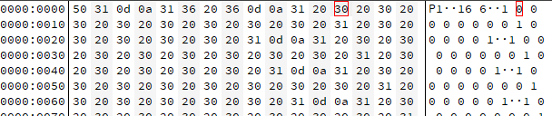

//Description: 图片格式总结

//Create Date: 2021-10-28 10:10:39

//Author: channy

# Image Format

## 概述

记录各种图片格式

## BMP
1. 文件头
bmp文件头包含如下信息：

bfType：2字节，文件类型；
bfSize：4字节，文件大小；
bfReserved1：2字节，保留，必须设置为0；
bfReserved2：2字节，保留，必须设置为0；
bfOffBits：4字节，从头到位图数据的偏移；

2. 位图信息头
位图信息头一共40字节，包含如下内容：
biSize：4字节，信息头的大小，即40；
biWidth：4字节，以像素为单位说明图像的宽度；
biHeight：4字节，以像素为单位说明图像的高度，同时如果为正，说明位图倒立（即数据表示从图像的左下角到右上角），如果为负说明正向；
biPlanes：2字节，为目标设备说明颜色平面数，总被设置为1；
biBitCount：2字节，说明比特数/像素数，值有1、2、4、8、16、24、32；
biCompression：4字节，说明图像的压缩类型，最常用的就是0（BI_RGB），表示不压缩；
biSizeImages：4字节，说明位图数据的大小，当用BI_RGB格式时，可以设置为0；
biXPelsPerMeter：表示水平分辨率，单位是像素/米，有符号整数；
biYPelsPerMeter：表示垂直分辨率，单位是像素/米，有符号整数；
biClrUsed：说明位图使用的调色板中的颜色索引数，为0说明使用所有；
biClrImportant：说明对图像显示有重要影响的颜色索引数，为0说明都重要；

3. 调色板（selected）

4. 位图数据

## PBM,PGM,PPM

| Magic Number | Type |	Encoding |
|:---|:------|:---|
| P1 |	Bitmap |	ASCII |
| P2 | Graymap |	ASCII |
| P3 | 	Pixmap |	ASCII |
| P4 | Bitmap |	Binary |
| P5 |	Graymap |	Binary |
| P6 |	Pixmap |	Binary |

### PBM
只有黑白两种颜色的图像格式，1是黑色，0是白色。



1. P1/P4，编码格式
1. 图像size，宽度和高度，ASCII码
1. 数据：每一位代表一个像素

### PGM
灰度图

1. P2/P5，编码格式
1. 图像size，宽度和高度，ASCII码
1. 最大灰度值
1. 数据：
**P5** 每个像素用可以用二进制表示
**P2** 每个像素使用字符串来表示

### PPM
PPM（Portable Pixmap Format）
```
P6
# Created by IrfanView
1280 960
255
,22,22+11.44156/34.23+/0,01/34.21-10/32.21.21265384.3/051384574352/32265376265273051/51/51.403954::-33/3426737:,03,1505929?.5;#-/#%%'!%($&%#%$"&' $%#'(&*+&')%&(()+)*,+,.()+&')()+)*,*+-+,.-.0./1,-/+,.-.0(,-)-.)-.,01-12)-.)-0*.1-.3./4108219,20(3/(40#//%&$$&$%&%#$#+"*%$%(*)
```


1. P3/P6，编码格式
1. 注释
1. 图像size，宽度和高度，ASCII码
1. 最大像素值，0-255
1. 数据：
**ASCII** 按RGB顺序，空格隔开，每一行用回车隔开，对应图像中的一行  
**Binary** 用24bits代表每一个像素，红绿蓝分别占用8bits

上图例子中，编码格式为P6，图像大小为1280*960，最大像素值255，首个像素的rgb是0x2c3232


## PNG
(Portable Network Graphic Format，PNG)

1. PNG，编码格式
1. 数据块，有两种类型的数据块，关键数据块（critical chunk）和辅助数据块（ancillary chunk）
1. 每个数据块由长度、数据块类型码、数据块实际内容、循环冗余检测
。。。。。。

## JPG

## GIF
GIF(Graphics Interchange Format)

数据块可分成3类：控制块(Control Block)，图形描绘块(Graphic-RenderingBlock)和专用块(Special Purpose Block)。

