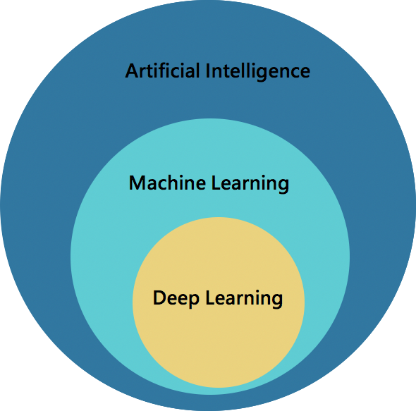

//Description: 机器学习笔记

//Create Date: 2021-10-29 12:17:39

//Author: channy

# 概述 

> AI->Machine Learning->Deep Learning

ML侧重分类，DL侧重识别

## 机器学习（ML）
分类： 
* 监督学习：给出定义好的标签，程序「学习」标签和数据之间的映射关系
* 非监督学习：没有标签的数据集
* 强化学习：达到目标会有正向反馈

运用：
* Classification 分类，如垃圾邮件识别(detection, ranking)
* Regression 回归，例如股市预测
* Clustering 聚类，如 iPhoto 按人分组
* Rule Extraction 规则提取，如数据挖掘

常用算法：
* 线性模型（线性回归、SVM、SGD、MLP、决策树/随机森林......）
* Clusting

## 深度学习（DL）

| CNN | RNN | GANs | RL |
|---|---|---|---|
| 图像 | 序列 | 数据生成 | 游戏策略 |

### CNN
* 卷积层：通过卷积核的过滤提取出图片中局部的特征
* 池化层：下采样，降低数据维度
* 全连接层

#### Tensorflow应用
```python
from keras.models import Sequential
model = Dequential
```
建立最简单的线性模型(Sequential)，一层层向下执行，没有分支，也没有回路
```python
from tensorflow.keras.layers import Convolution2D,MaxPooling2D,Flatten,Dense,Dropout
model.add(Convolution2D(filters = 128, kernel_size = (5, 5), padding = 'Same', activation = 'relu', input_shape = (28, 28, 1)))
model.add(MaxPooling2D(pool_size = (2,2))
model.add(Dropout(0.25))
model.add(Flatten())
model.add(Dense(10, activation = 'softmax'))
```

### RNN
* 生成器
* 判别器

与CNN输入数据之间相互无关不同，RNN输入数据的先后顺序影响数据的权重，主要适用于文本生成、机器翻译、语音识别、生成图像描述等方面。

### GAN
生成数据
[GAN Zoo](https://github.com/hindupuravinash/the-gan-zoo)

> 样例
[pix2pix](https://github.com/affinelayer/pix2pix-tensorflow)
[SPADE-Terrain](https://github.com/tpapp157/SPADE-Terrain-GAN)

## 数据处理
### 数据清洗
* 数据缺失：补/弃
* 数据异常：弃
* 数据均衡：上下采样
### 特征工程
* 归一化、离散化、统计特征
### 特征选择
* embedded
* filter
* wrapped

# 相关库
## python相关库
### 数学库
* pandas：C++/Python, 数据处理
* numpy: 数学计算
* matplotlib: 画图
### 机器学习库
* Scikit learn([sklearn](https://sklearn.apachecn.org/#/)):
* [tensorflow](https://www.tensorflow.org/)(keras):
* Theano: 类似于tensorflow
* [PyTorch](https://pytorch.org/tutorials/):
* [NLTK](https://www.nltk.org/)(Natural Language Toolkit)
## C++相关库
* caffe
* [mlpack](https://mlpack.org/)
* shark
* GRT (Gesture Recognition Toolkit)
* Microsoft Cognitive Toolkit (CNTK)
* DyNet
* Shogun
* FANN
* OpenNN
* Armadillo

## 监督学习


# reference
[Choose Model](https://scikit-learn.org/stable/tutorial/machine_learning_map/index.html)