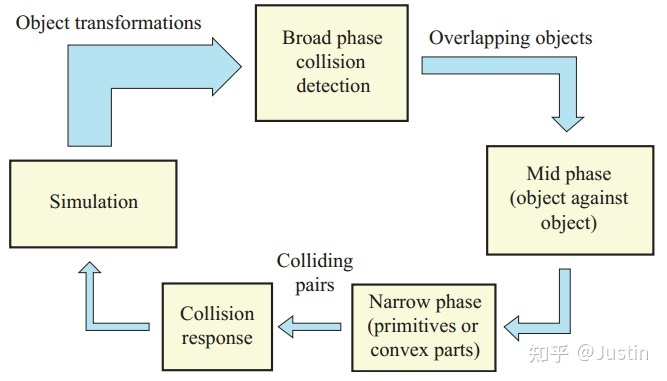
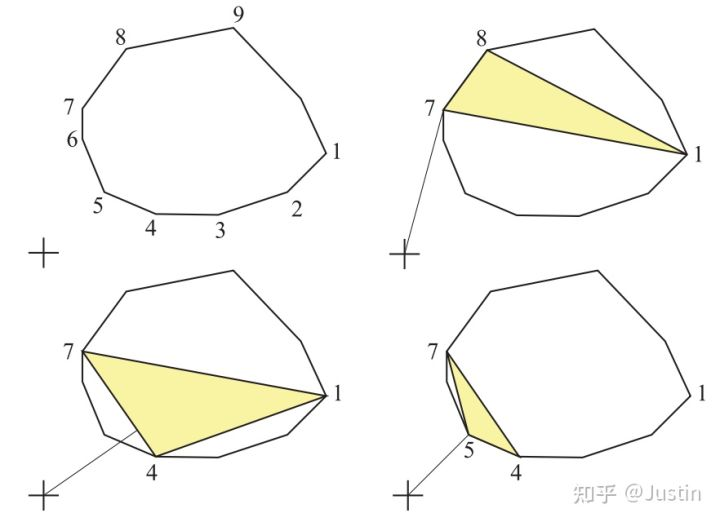

//Description: Physics

//Create Date: 2022-01-05 20:32:39

//Author: channy

# 概述 
游戏中使用到的物理笔记

## Convex Decomposition
* Approximate Convex Decomposition (ACD)
* HACD
* VHACD

## Collision

broad-phase和narrow-phase两个步骤
> broad-phase 粗略计算，产生碰撞体pair; Spatial Hashing/BVH  
> narrow-phase 精确计算，对所有pair; DCD/CCD

### Discrete Collision Detection (DCD, 离散碰撞检测)

### Bounding Volume Hierarchies(BVH, 层次包围体技术)
Bounding Volume, 即BV (AABB, OBB, Bounding Sphere, Convex Hull ...)

**目标**   
将所有包围体分层逐次地再次包围，建立树形结构

**步骤**  
* 计算场景中每一个图元的BV包围盒、质心（一般取包围盒的中心）并存储到数组中。
* 根据不同的划分策略构建树状索引结构。
* 将得到二叉树转化更加紧凑的表示形式（无指针，内存连续）。

**说明及改进**  
构建过程中最重要的问题就是如何对图元进行划分  
* 树尽量平衡
* 各节点包围盒尽可能不重叠

基于莫顿码（Morton code）的并行化BVH: LBVHs（Linear bounding volume hierarchies）和HLBVH（hierarchical linear bounding volume hierarchy）

首先将场景中的图元按照其所处的位置将其分成若干簇（clusters），对于每一个簇，并行地构建子树，最后将每一颗子看成一个单一节点完成整棵树的构建。LBVHs的核心在于将BVH的构建转换为一个排序问题。LBVHs利用莫顿码来对多维度的空间数据进行排序。

### Surface Area Heuristic (SAH, 表面积启发)
**目标**  
在构建BVH树时插入节点，提升“各节点包围盒尽可能不重叠”。通过对求交代价和遍历代价进行评估，给出了每一种划分的代价

traversal cost 和 Hit probability

**步骤**  
节点 C 中存在 n 个物体，设每个物体求交代价traversal cost = t(i)，则不划分情况下求交总代价为： $\sum t(i) = t(1) + t(2) + ... + t(n)$

如果这些物体划分为2组，这两组物体分别处于它们的包围盒A和B中。设光线击中它们的概率hit probability = p(A) 和 p(B)，（包围盒 A 和 B 之间存在重叠，且不一定会填满其父节点的包围体）

$$ c(A, B) = p(A) \sum t(i) i \in A + p(B) \sum t(i) i \in B + t_trav $$

其中t_trav表示遍历BVH树的代价

一般情况下，对所有图元的求交代价相同，即t(i)相同，且t(i) > t_trav。则可简化t(i) = 1, t_trav = 0.125, A和B中分别有a和b个图元

$$ c(A, B) = p(A) a + p(B) b + 0.125 $$

光线击中包围盒的概率可以根据包围体的表面积来估计。即在父节点的包围体C中，A和B的表面积越大它们被击中的概率也就越大。记S为表面积，则

$$ c(A, B) = S(A) / S(C) * a + S(B) / S(C) * b + 0.125 $$

在实现的时候，相比于计算可能划分的代价然后寻找代价最小的划分，一种更好的办法是将节点 C 所包围的空间沿着跨度最长的那个坐标轴的方向将空间均等的划分为若干个桶（Buckets），划分只会出现在桶与桶之间的位置上。若桶的个数为 n 则只会有 n - 1 种划分的可能。

遍历 C 中所有的图元，统计每一个桶中图元的个数以及每一个桶的包围盒，就能计算每一种划分的代价

**说明及改进**  
> 场景中的图元在计算划分代价（cost）时被重复遍历。
> 整个构建过程是自顶向下的（top-down），难以并行化。

### Separating Axis Theorem(SAT 分离轴定理)
**目标**

**原理**  
两个凸多边形不相交,当且仅当必然存在一条直线,两个凸多边形在这条直线上的投影不相交

两个凸多边形相交,则在所有直线上的投影都是相交的. 对于凸多面体也是一样的,只是投影在面上.

**步骤**  
对于两个多边形求相交,取其中一个多边形,遍历所有的边. 对于每条边, 顶点表示为 a 和 b ,向外的法线表示为 n . 然后判断另外一个多边形上的点是否都在这条边的外面,设点为 v ,求 (v-a).dot(n) 的值,根据值的符号,就可以判断出点在边的内侧或者外侧. 如果存在某条边,使得另外一个多边形上所有点都在外侧,即认为两个多边形不相交.

分别遍历两个多边形,找到所有计算出的 (v-a).dot(n) 值的最小值,还可以算出两个多边形相交的穿透深度.

对于多面体,原理是一样的,只是把边换成了面.

**说明及改进**  
只能适用于多边形/多面体,不能直接适用圆形/球形的物体.

**应用**  
box2d中多边形之间的碰撞通过SAT算法来实现.

### Gilbert-Johnson-Keerthi (GJK)
[GJK](http://www.dtecta.com/papers/jgt98convex.pdf)  
**目标**  
计算凸多面体之间最小距离 (A与(反射)B的闵可夫斯基(Minkowski)和)
$$ A - B = {x - y : x \in A, y \in B $$

**步骤**  
* 移动B的参考点到原点，然后反射B （如果原点在A - B内部，那么A和B就会重叠）
* 用B的参考点扫过A的表面
* 得到 A-B
* 原点到 A-B 的最小距离 d 即为所求



* 对于 A-B，任选一个三角形，计算该三角形的最小距离
* 最近的顶点替换在这个投影上距离最远的三角形顶点
* 顶点被投影到从原点到上一步最近点的直线上
* 直到投影点和最近点重合，完成迭代  

**说明及改进**  
该算法从多面体中的任意一个单纯形开始。 一个单纯形在各个维度上是最简单的几何体，所以它在二维上是一个三角形，在三维上是一个四面体。对于两个多面体，算法在有限的步长内结束。 

采用增量计算和缓存等技术可以提高算法的性能。

**应用**  
chipmonk,bullet,physx中的碰撞都是通过GJK实现,box2d的CCD和部分碰撞检测也是通过GJK实现的,GJK是物理引擎中计算碰撞的主流方案

### Expanding Polytope Algorithm(EPA)  
**目标**
GJK算出了当两个物体不相交时的最近距离.当两个几何体相交时,GJK算法会终止退出.

当GJK的算法退出后,我们在GJK得到的单纯形的基础上使用EPA算法,就可以算出两个几何体的穿透深度.

**步骤**
* 获得与原点距离最短的边，记对应的闵可夫斯基差为 M1,M2 。求出与这条边垂直、且 背离原点 的向量。
* 计算得到的闵可夫斯基差 M3
* 若 $|M1 - M3| + |M2 - M3| < \epson $ ，退出迭代
* 若 M3 不属于在方向上找到的点，退出迭代
* 若 M1 == M3 或 M2 == M3，于已有单纯形发生重复，退出迭代

**说明及改进**  
只适用于凸多边形

### Minkowski Portal Refinement (MPR, 闵可夫斯基入口简化)
**目标**  
GJK + EPA 可以通过定制不同的 support 函数，轻松实现 椭圆 之间或 封闭凸曲线 构成的图形之间的碰撞计算，从而泛化物体碰撞。

入口（Portal）选择不当将会得到不恰当的结果，此时算法退化为 EPA

### Continuous Collision Detection(CCD, 连续碰撞检测)

#### Time Of Impact (TOI)
扫掠法 (Sweep)
推测法 (Speculative)
保守步进法 (Conservative Advancement)
双边步进法 (Bilateral Advancement)
包围球近似 (Bounding Sphere Approximation)
光线投射 (Raycast)
解析解 (Analytical Solution)
……

## 3d拾取算法
1. 几何思路：通过连接摄像机和屏幕坐标生成射线，然后与场景中的物体做相交判断。
1. 渲染思路：对渲染的每个物体给予编号，将编号转换成颜色，然后通过拾取framebuffer的颜色来判断拾取到了哪个物体。

## Bullet3 代码基本结构

按windows + vs的解决方案分类
### demo类
1. App_BasicExample 创建基本的场景
1. App_ExampleBrowser 聚集了bullets的多个example
1. App_HelloBulletRobotics 文字输出robot的位置
1. App_HelloWorld 创建基本的场景并文字输出各物体位置
1. App_obj2sdf 文件格式转换obj->sdf
1. App_PhysicsServer_ShareMemory/App_PhysicsServer_ShareMemory_GUI 服务器端
1. App_RobotSimulator/App_RobotSimulator_NoGUI 四足机器人Minitaur
1. App_TwoJoint 
1. AppBaseExampleGui 基本的opengl显示及外设处理，创建了5*5*5个方块自由落体

### 单元测试类
Test_XXX 

### 功能类
1. Bullet3Collision/BulletCollision 碰撞相关
1. BulletSoftBody 软件物理
1. BulletRobotics/BulletRoboticsGUI 机器人控制，对应于demo中的App_RobotSimulator
1. Bullet3Dynamics/BulletDynamics 约束相关

1. Bullet3OpenCL_clew opencl多线程
1. clsocket 网络连接socket
1. BussIK 数学相关，Jacobian分解等
1. BulletWorldImporter/BulletXmlWorldImporter 文件导入
1. Bullet3Common/Bullet3Geometry/LinearMath/OpenGLWindow/pybullet 数学、渲染、python相关
1. gwen 界面控件，GWEN-a gui library
1. ConvexDecomposition/GIMPACTUtils 凸分解
1. HACD 凸分解的HACD库，有改进版VHACD

### 其它类
1. Bullet2开头或是与Bullet3XXX相比少一个3的项目，为老Bullet2的代码，如BulletCollision、BulletDynamics等

按文件夹分
bullet3  
	examples  
		BasicDemo 
	Extras
		BulletRobotics  
		HACD
	src
		Bullet3Collision 
		Bullet3Dynamics
			ConstraintSolver

## Bullet3 中的Collision
> stepSimulation

> btCollisionDispatcher  
>> defaultNearCallback (narrow phase)

> btCollisionWorld  
>>	addCollisionObject 添加物体到场景  
>>	performDiscreteCollisionDetection  
>>>		updateAabbs  
>>>		computeOverlappingPairs 检测碰撞对 (broad phase)  
>>>		dispatchAllCollisionPairs (遍历pairs计算精确碰撞, btDispatcher)  

btDynamicsWorld -> btDiscreteDynamicsWorld -> btMultiBodyDynamicsWorld -> btDeformableMultiBodyDynamicsWorld  
	predictUnconstraintMotion 计算物体在非约束条件下的运动  
	predictMotion (btDeformableBodySolver)  
	performDiscreteCollisionDetection (btCollisionWorld, 碰撞检测)  
	solveConstraints 约束求解  
	integrateTransforms 位移积分  

btDeformableBodySolver  
	predictMotion

btSoftRigidDynamicsWorld (btDynamicsWorld -> btDiscreteDynamicsWorld -> btSoftRigidDynamicsWorld)
	
## Bullet3 中的demo
ExampleEntries.cpp 中可以查看每个demo的入口函数

App_ExampleBrowser
	BasicExample 自由落体，碰撞检测
	RollingFrictionDemo 滚动，摩擦系数
	ConstraintDemo 各类约束，约束求解
	Motorized Hinge+TestHingeTorque 铰链HingeConstraint+扭矩btGeneric6DofSpring2Constraint

# LCP/MLCP 求解

## Gauss-Seidel (GS迭代求解法)
Gauss-Seidel迭代求解方程 Ax = b
**问题描述**  
Ax + b >= 0
x >= 0
x^T (Ax + b) = 0

**步骤**  
矩阵A可以被分割为 A = D - L - U, 其中D是对角矩阵，L是左下部分矩阵

得 x^(k+1) = (D - L)^(-1) U x^k + (D - L)^(-1) b 

通过Gauss-Seidel迭代求线性互补问题(LCP)的解，要求A是正定阵或者主元占优矩阵。

## Projected Gauss-Seidel (PGS迭代求解法)  
令 c^k = b - U x^k

得 x^(k+1) = max(0, ((D - L)^(-1) U x^k - (D - L)^(-1) b)_i)

每次迭代过程中，所得x^(k+1)每一个分量的值都会被截断 

## Mixed Linear Complementarity Problem (MLCP迭代求解法)  
**问题描述**
w = Ax + b
v_lo <= x <= v_hi

**步骤**  
记 z^k = (D - L)^(-1) U x^k - (D - L)^(-1) b

得 x^(k+1) = max(min( (x_(hi))_i, z^k), (x_(lo))_i)

## Lemke (互补枢轴算法)

## bullet3 中的LCP求解器  
btMLCPSolverInterface.solveMLCP

四类Solver直接继承btMLCPSolverInterface  
btDantzigSolver
btLemkeSolver
btPathSolver
btSolveProjectedGaussSeidel (PGS)  

## Bullet3 中的约束求解器
基本约束6种

基类 btConstraintSolver
```c++
class btConstraintSolver
{
public:
	virtual ~btConstraintSolver() {}

	virtual void prepareSolve(int /* numBodies */, int /* numManifolds */) { ; }

	///solve a group of constraints
	virtual btScalar solveGroup(btCollisionObject** bodies, int numBodies, btPersistentManifold** manifold, int numManifolds, btTypedConstraint** constraints, int numConstraints, const btContactSolverInfo& info, class btIDebugDraw* debugDrawer, btDispatcher* dispatcher) = 0;

	virtual void allSolved(const btContactSolverInfo& /* info */, class btIDebugDraw* /* debugDrawer */) { ; }

	///clear internal cached data and reset random seed
	virtual void reset() = 0;

	virtual btConstraintSolverType getSolverType() const = 0;
};
```
默认求解器 btSequentialImpulseConstraintSolver，另一个直接继承基类的求解器btConstraintSolverPoolMt

btSequentialImpulseConstraintSolver  
	setupSolverFunctions
		gResolveSingleConstraintRowGeneric_scalar_reference
		gResolveSingleConstraintRowLowerLimit_scalar_reference
		gResolveSplitPenetrationImpulse_scalar_reference
	prepareSolve & allSolved (btDiscreteDynamicsWorld::solveConstraints调用，bullet3中所有solver都没有重写)
	solveGroup (btDiscreteDynamicsWorld::processIsland调用) PGS 方法来处理分析所有的约束
		solveGroupCacheFriendlySetup 三类nonContact、contact、friction
			convertBodies
				getOrInitSolverBody
					initSolverBody 设置系数默认值
			convertJoints
				buildJacobian (btTypedConstraint)
				convertJoint
			convertContacts
				convertContact
					setupContactConstraint
		solveGroupCacheFriendlyIterations SSE优化，AVX
			solveGroupCacheFriendlySplitImpulseIterations
				resolveSplitPenetrationImpulse
			solveSingleIteration
				solveConstraintObsolete (btConeTwistConstraint)
				resolveSingleConstraintRowLowerLimit
				resolveSingleConstraintRowGeneric
		solveGroupCacheFriendlyFinish
			writeBackContacts
			writeBackJoints
			writeBackBodies

b3GpuRigidBodyPipeline
	b3PgsJacobiSolver
	b3GpuPgsConstraintSolver
	
btSequentialImpulseConstraintSolverMt
btMultiBodyConstraintSolver
btNNCGConstraintSolver
btMLCPSolver


## Inverse Kinematics 逆向运动学
### 手臂顺向运动学 Forward Kinematics (FK)
### 手臂逆向运动学 Inverse Kinematics(IK)
已知末端位置，反算手臂各个关节的角度。

### Graham Scan 凸包
**目标**  
计算点集的凸包

**步骤**  
从点集中先找出一个最左下方的点，以这个点为极点，将所有点根据与这个点的极角排序，并且同时使用一个栈结构维护凸包上的点

按照极角序依次将点与栈顶的两个点拐向判断：若右拐，则将当前点加入栈中；否则，将栈顶的点弹出。当遍历完点集后，还在栈中的点就是凸包上的点，而且依次出栈可以得到从起点开始顺时针旋转的所有凸包上的点。

### 
btAxis3Sweep

# reference
[Video Game Physics Tutorial](https://www.toptal.com/game/video-game-physics-part-i-an-introduction-to-rigid-body-dynamics)
[bullet3](https://github.com/bulletphysics/bullet3/releases)
[PhysX](https://github.com/NVIDIAGameWorks/PhysX)
[PhysX doc](https://gameworksdocs.nvidia.com/PhysX/4.1/documentation/physxguide/Manual/Introduction.html)

# 附录
## URDF文件
[Unified Robot Description Format](http://wiki.ros.org/urdf/Tutorials) (URDF，标准化机器人描述格式) 