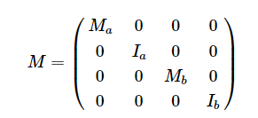
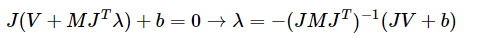

//Description: Physics in game, 游戏中使用到的物理笔记

//Create Date: 2022-01-05 20:32:39

//Author: channy

# 概述 
游戏中使用到的物理笔记

# Convex Decomposition
* Approximate Convex Decomposition (ACD)
* HACD
* VHACD

# Collision 碰撞算法

broad-phase和narrow-phase两个步骤
> broad-phase 粗略计算，产生碰撞体pair; Spatial Hashing/BVH  
> narrow-phase 精确计算，得到各自的穿透点，对所有pair; DCD/CCD

## Discrete Collision Detection (DCD, 离散碰撞检测)

## Bounding Volume Hierarchies(BVH, 层次包围体技术)
Bounding Volume, 即BV (AABB, OBB, Bounding Sphere, Convex Hull ...)

**目标**   
将所有包围体分层逐次地再次包围，建立树形结构

**步骤**  
* 计算场景中每一个图元的BV包围盒、质心（一般取包围盒的中心）并存储到数组中。
* 根据不同的划分策略构建树状索引结构。
* 将得到二叉树转化更加紧凑的表示形式（无指针，内存连续）。

**说明及改进**  
构建过程中最重要的问题就是如何对图元进行划分  
* 树尽量平衡
* 各节点包围盒尽可能不重叠

基于莫顿码（Morton code）的并行化BVH: LBVHs（Linear bounding volume hierarchies）和HLBVH（hierarchical linear bounding volume hierarchy）

首先将场景中的图元按照其所处的位置将其分成若干簇（clusters），对于每一个簇，并行地构建子树，最后将每一颗子看成一个单一节点完成整棵树的构建。LBVHs的核心在于将BVH的构建转换为一个排序问题。LBVHs利用莫顿码来对多维度的空间数据进行排序。

## Surface Area Heuristic (SAH, 表面积启发)
**目标**  
在构建BVH树时插入节点，提升“各节点包围盒尽可能不重叠”。通过对求交代价和遍历代价进行评估，给出了每一种划分的代价

traversal cost 和 Hit probability

**步骤**  
节点 C 中存在 n 个物体，设每个物体求交代价traversal cost = t(i)，则不划分情况下求交总代价为： $\sum t(i) = t(1) + t(2) + ... + t(n)$

如果这些物体划分为2组，这两组物体分别处于它们的包围盒A和B中。设光线击中它们的概率hit probability = p(A) 和 p(B)，（包围盒 A 和 B 之间存在重叠，且不一定会填满其父节点的包围体）

$$ c(A, B) = p(A) \sum t(i) i \in A + p(B) \sum t(i) i \in B + t_trav $$

其中t_trav表示遍历BVH树的代价

一般情况下，对所有图元的求交代价相同，即t(i)相同，且t(i) > t_trav。则可简化t(i) = 1, t_trav = 0.125, A和B中分别有a和b个图元

$$ c(A, B) = p(A) a + p(B) b + 0.125 $$

光线击中包围盒的概率可以根据包围体的表面积来估计。即在父节点的包围体C中，A和B的表面积越大它们被击中的概率也就越大。记S为表面积，则

$$ c(A, B) = S(A) / S(C) * a + S(B) / S(C) * b + 0.125 $$

在实现的时候，相比于计算可能划分的代价然后寻找代价最小的划分，一种更好的办法是将节点 C 所包围的空间沿着跨度最长的那个坐标轴的方向将空间均等的划分为若干个桶（Buckets），划分只会出现在桶与桶之间的位置上。若桶的个数为 n 则只会有 n - 1 种划分的可能。

遍历 C 中所有的图元，统计每一个桶中图元的个数以及每一个桶的包围盒，就能计算每一种划分的代价

**说明及改进**  
> 场景中的图元在计算划分代价（cost）时被重复遍历。  
> 整个构建过程是自顶向下的（top-down），难以并行化。

## Separating Axis Theorem(SAT 分离轴定理)
**目标**

**原理**  
两个凸多边形不相交,当且仅当必然存在一条直线,两个凸多边形在这条直线上的投影不相交

两个凸多边形相交,则在所有直线上的投影都是相交的. 对于凸多面体也是一样的,只是投影在面上.

**步骤**  
对于两个多边形求相交,取其中一个多边形,遍历所有的边. 对于每条边, 顶点表示为 a 和 b ,向外的法线表示为 n . 然后判断另外一个多边形上的点是否都在这条边的外面,设点为 v ,求 (v-a).dot(n) 的值,根据值的符号,就可以判断出点在边的内侧或者外侧. 如果存在某条边,使得另外一个多边形上所有点都在外侧,即认为两个多边形不相交.

分别遍历两个多边形,找到所有计算出的 (v-a).dot(n) 值的最小值,还可以算出两个多边形相交的穿透深度.

对于多面体,原理是一样的,只是把边换成了面.

**说明及改进**  
只能适用于多边形/多面体,不能直接适用圆形/球形的物体.

**应用**  
box2d中多边形之间的碰撞通过SAT算法来实现.

## Gilbert-Johnson-Keerthi (GJK)
[GJK](http://www.dtecta.com/papers/jgt98convex.pdf)  
**目标**  
计算凸多面体之间最小距离 (A与(反射)B的闵可夫斯基(Minkowski)和)
$$ A - B = {x - y : x \in A, y \in B $$

**步骤**  
* 移动B的参考点到原点，然后反射B （如果原点在A - B内部，那么A和B就会重叠）
* 用B的参考点扫过A的表面
* 得到 A-B
* 原点到 A-B 的最小距离 d 即为所求


* 对于 A-B，任选一个三角形，计算该三角形的最小距离
* 最近的顶点替换在这个投影上距离最远的三角形顶点
* 顶点被投影到从原点到上一步最近点的直线上
* 直到投影点和最近点重合，完成迭代  

**说明及改进**  
该算法从多面体中的任意一个单纯形开始。 一个单纯形在各个维度上是最简单的几何体，所以它在二维上是一个三角形，在三维上是一个四面体。对于两个多面体，算法在有限的步长内结束。 

采用增量计算和缓存等技术可以提高算法的性能。

**应用**  
chipmonk,bullet,physx中的碰撞都是通过GJK实现,box2d的CCD和部分碰撞检测也是通过GJK实现的,GJK是物理引擎中计算碰撞的主流方案

## Expanding Polytope Algorithm(EPA)  
**目标**  
GJK算出了当两个物体不相交时的最近距离.当两个几何体相交时,GJK算法会终止退出.

当GJK的算法退出后,我们在GJK得到的单纯形的基础上使用EPA算法,就可以算出两个几何体的穿透深度.

**步骤**  
* 获得与原点距离最短的边，记对应的闵可夫斯基差为 M1,M2 。求出与这条边垂直、且 背离原点 的向量。
* 计算得到的闵可夫斯基差 M3
* 若 $|M1 - M3| + |M2 - M3| < \epson $ ，退出迭代
* 若 M3 不属于在方向上找到的点，退出迭代
* 若 M1 == M3 或 M2 == M3，于已有单纯形发生重复，退出迭代

**说明及改进**  
只适用于凸多边形

## Minkowski Portal Refinement (MPR, 闵可夫斯基入口简化)
**目标**  
GJK + EPA 可以通过定制不同的 support 函数，轻松实现 椭圆 之间或 封闭凸曲线 构成的图形之间的碰撞计算，从而泛化物体碰撞。

入口（Portal）选择不当将会得到不恰当的结果，此时算法退化为 EPA

## Continuous Collision Detection(CCD, 连续碰撞检测)

### Time Of Impact (TOI)
* 扫掠法 (Sweep)
* 推测法 (Speculative)
* 保守步进法 (Conservative Advancement)
* 双边步进法 (Bilateral Advancement)
* 包围球近似 (Bounding Sphere Approximation)
* 光线投射 (Raycast)
* 解析解 (Analytical Solution)
* ……

# 3d拾取算法
1. 几何思路：通过连接摄像机和屏幕坐标生成射线，然后与场景中的物体做相交判断。
1. 渲染思路：对渲染的每个物体给予编号，将编号转换成颜色，然后通过拾取framebuffer的颜色来判断拾取到了哪个物体。

# LCP/MLCP 求解  
## Gauss-Seidel (GS迭代求解法)  
Gauss-Seidel迭代求解方程 Ax = b  
**问题描述**  
Ax + b >= 0
x >= 0
x^T (Ax + b) = 0

**步骤**  
矩阵A可以被分割为 A = D - L - U, 其中D是对角矩阵，L是左下部分矩阵

得 x^(k+1) = (D - L)^(-1) U x^k + (D - L)^(-1) b 

通过Gauss-Seidel迭代求线性互补问题(LCP)的解，要求A是正定阵或者主元占优矩阵。

## Projected Gauss-Seidel (PGS迭代求解法)  
PGS方法和GS方法的区别仅仅在于，PGS在每次迭代后会将 \lambda 截断(clamp)到一个给定范围内。

令 c^k = b - U x^k

得 x^(k+1) = max(0, ((D - L)^(-1) U x^k - (D - L)^(-1) b)_i)

每次迭代过程中，所得x^(k+1)每一个分量的值都会被截断 

## Mixed Linear Complementarity Problem (MLCP迭代求解法)  
**问题描述**  
w = Ax + b
v_lo <= x <= v_hi

**步骤**  
记 z^k = (D - L)^(-1) U x^k - (D - L)^(-1) b

得 x^(k+1) = max(min( (x_(hi))_i, z^k), (x_(lo))_i)

## Lemke (互补枢轴算法)
主元消去法，由一个准互补基本可行解出发，通过主元消去法（转轴方法）求出一个新的准互补基本可行解，不断迭代。可能求解失败。

1. 按照最小比值规则确定离基变量
1. 保持准互补性，若w_i(z_i)是离基变量，则z_i(w_i)是进基变量

**步骤**
1. 若q >= 0, 则(w, z) = (q, 0)为解，否则
取max{-q_i}所在的行s行为主行，z_0对应的列为主列，主元消去，令y_s = z_s
2. 设现行表中变量y_s下面的列为d_x，若d_x <= 0，退出；否则按最小比值规则确定指标r，使  
q_i / d_is = min{q_i / d_is, d_is > 0}  
如果r行的基变量是z_0，转4；否则转3
3. 设r行的基变量为w_l或z_l (l != s)，y_s进基，以r行为主行，y_s对应的列为主列，主元消去。如果离基变量是w_l，则令y_s = z_l；如果离基变量是z_l，则令y_s = w_l，转2  
4. y_s进基，z_0离基。以r行为主行，y_s对应的列为主列，主元消去。得可行解，退出

**说明及改进**
1. 只满足于一个互补可行解  
2. 收敛条件强  

# Graham Scan 凸包
**目标**  
计算点集的凸包

**步骤**  
从点集中先找出一个最左下方的点，以这个点为极点，将所有点根据与这个点的极角排序，并且同时使用一个栈结构维护凸包上的点

按照极角序依次将点与栈顶的两个点拐向判断：若右拐，则将当前点加入栈中；否则，将栈顶的点弹出。当遍历完点集后，还在栈中的点就是凸包上的点，而且依次出栈可以得到从起点开始顺时针旋转的所有凸包上的点。

# Inverse Kinematics 逆向运动学
## 手臂顺向运动学 Forward Kinematics (FK)
## 手臂逆向运动学 Inverse Kinematics(IK)
已知末端位置，反算手臂各个关节的角度。

# Bullet3 代码基本结构

按windows + vs的解决方案分类
## demo类
1. App_BasicExample 创建基本的场景
1. App_ExampleBrowser 聚集了bullets的多个example
1. App_HelloBulletRobotics 文字输出robot的位置
1. App_HelloWorld 创建基本的场景并文字输出各物体位置
1. App_obj2sdf 文件格式转换obj->sdf
1. App_PhysicsServer_ShareMemory/App_PhysicsServer_ShareMemory_GUI 服务器端
1. App_RobotSimulator/App_RobotSimulator_NoGUI 四足机器人Minitaur
1. App_TwoJoint 
1. AppBaseExampleGui 基本的opengl显示及外设处理，创建了5*5*5个方块自由落体

### Bullet3 中的demo
ExampleEntries.cpp 中可以查看每个demo的入口函数

* App_ExampleBrowser
	* BasicExample 自由落体，碰撞检测
	* RollingFrictionDemo 滚动，摩擦系数
	* ConstraintDemo 各类约束，约束求解
	* Motorized Hinge+TestHingeTorque 铰链HingeConstraint+扭矩btGeneric6DofSpring2Constraint

## 单元测试类
Test_XXX 

## 功能类
1. Bullet3Collision/BulletCollision 碰撞相关
1. BulletSoftBody 软件物理
1. BulletRobotics/BulletRoboticsGUI 机器人控制，对应于demo中的App_RobotSimulator
1. Bullet3Dynamics/BulletDynamics 约束相关

1. Bullet3OpenCL_clew opencl多线程
1. clsocket 网络连接socket
1. BussIK 数学相关，Jacobian分解等 
1. BulletWorldImporter/BulletXmlWorldImporter 文件导入
1. Bullet3Common/Bullet3Geometry/LinearMath/OpenGLWindow/pybullet 数学、渲染、python相关
1. gwen 界面控件，GWEN-a gui library
1. ConvexDecomposition/GIMPACTUtils 凸分解
1. HACD 凸分解的HACD库，有改进版VHACD

## 其它类
1. Bullet2开头或是与Bullet3XXX相比少一个3的项目，为老Bullet2的代码，如BulletCollision、BulletDynamics等

按文件夹分  
* bullet3  
	* examples  
		* BasicDemo 
	* Extras
		* BulletRobotics  
		* HACD 凸包分解
	* src
		* Bullet3Collision 
		* Bullet3Dynamics
			* ConstraintSolver 求解器

# Bullet3 中的 Collision 碰撞  
## 基本物理知识
| 线性 | 旋转 |
| --- | --- |
| 力：F = m a | 力矩 M = r F sin(\theta) |
| 质量：m = F / a | 转动惯量：单质点   = m r^2, 刚体 I = \int \rho r^2 dV, 其中r是每个微元到转轴的距离 |
| 速度：v = \delta(s) / \delta(t) | 角速度：w = d(\psi) / dt |
| 加速度：a = dv / dt = d^2x / dt^2 | 角加速度：\beta = dw / dt = d^w(\psi) / dt^2 , a = r \beta | 
| 动量：P = m v | 角动量：L = r x p = r x (m v) = r x (\omega x (m r)) = m r^2 \omega = I \omega |
| 冲量：I = \int F dt | 角冲量：I = \int M dt |
| 动能：E = 1/2 m v^2 | 转动动能：E = 1/2 I (\omega)^2 |

冲量是指力在时间上的积累效应

让物体平动的叫做力，让物体转动的叫做力矩。用相同的力矩作用在一个物体上想让他转动，不同的物体角速度变化的快慢也是不一样的，影响角速度变化快慢的这个因素就是转动惯量。

按照生活经验来看形状大小体积相同的两个物体，在相同的力矩作用相同的时间后质量重的那个物体角速度改变的较慢。所以可能有一种转动惯量就跟质量差不多这种感觉，实际上形状体积大小完全相同的两个物体也有可能有不同的转动惯量的，关键就在于质量分布的均匀程度是否相同。

刚体平动中有动量守恒，刚体转动中对应角动量守恒

## 部分参数说明  
linear Damping 线性阻尼, 0 到 1 之间 
angular Damping 旋转阻尼 
Anisotropic friction 各向异性摩擦力。各向异性摩擦力用来定义不同方向的不同摩擦力，比如用于实现一个滑板，它向前和向后的摩擦力都很小，但是往两边的摩擦力很大。

//cfm = 1 /       ( dt * kp + kd )
//erp = dt * kp / ( dt * kp + kd )

1. Baumgarte stabilization
1. Restitution 弹性碰撞，恢复系数
1. Frictions 摩擦系数，静摩擦和动摩擦
1. rollingFriction 滚动摩擦系数
1. spinningFriction 自旋摩擦系数
1. Linear Factor 线性因子，可影响刚体在每个轴向的线性速度变化，值越大刚体移动越快。为指定的对象设置位置自由度。例如，通过设置Z分量为零，您可以禁止实体的上下（Blender，Max）或前后（Maya）运动。
1. Angular Factor 旋转因子，可影响刚体在每个轴向的旋转速度变化，值越大刚体旋转越快
因子是 Vec3 的类型，相应分量的数值用于缩放相应轴向的速度变化，默认值都为 1，表示缩放为 1 倍，即无缩放。
1. torque 力与冲量也可以只对旋转轴产生影响，使刚体发生转动，这样的力叫做扭矩
1. push velocity 推动速度 = pushDir * pushPower

## 刚体碰撞求解

要解决碰撞约束，最直接的想法就是两者不再继续碰撞  
则碰撞点和碰撞分离法线之间的关系 (P_b - P_a) * n >= 0 (在分离法线上的投影大于0)  

C为质心，r为到碰撞点的距离，(C_b + r_b - C_a - r_a) * n >= 0, 对于时间微分，得 (V_b + w_b x r_b - V_a - w_a x r_a) * n >= 0 即为约束不等式  

## 解决碰撞约束
1. Sequential Impulse  
$$ JV + b = 0 $$ 其中 V = [V_a, w_a, V_b, w_b]^T, J = [-n (-r_a x n) n (r_b x n)] n 为法线及垂直于法线的其它两个方向，b 代表某些场景下对系统引入的能量  

调整量 \delta V 则 J (V + \delta V) + b = 0 即为所求  

## 陀螺力矩的计算原理。

　　根据欧拉方程很容易得到$\Delta\omega=\omega_2-\omega_1=\Delta tI^{-1}(T-\omega_1 \times I\omega_1)$，其中$\omega_1$是前一步的角速度、$\omega_2$是下一步的角速度。但是直接使用该公式迭代计算结果很容易发散。

## Bullet3 中的场景 World
* btCollisionWorld  
	* addCollisionObject 添加物体到场景  
	* performDiscreteCollisionDetection  
		* updateAabbs  
		* computeOverlappingPairs 检测碰撞对 (broad phase)  
		* dispatchAllCollisionPairs (遍历pairs计算精确碰撞, btDispatcher)  

* btCollisionDispatcher  
	* defaultNearCallback (narrow phase)

以 btDiscreteDynamicsWorld 为例，在构造函数中创建 Solver
* btCollisionWorld > btDynamicsWorld -> btDiscreteDynamicsWorld -> btMultiBodyDynamicsWorld -> btDeformableMultiBodyDynamicsWorld  
	* stepSimulation 类似于tick
		* internalSingleStepSimulation
			* predictUnconstraintMotion 计算物体在非约束条件下的运动  
			* predictMotion (btDeformableBodySolver)  
			* performDiscreteCollisionDetection (btCollisionWorld, 碰撞检测)  
			* solveConstraints 约束求解，其中 Solver 的 prepareSolve 和 allSolved 并没有具体实现
			* integrateTransforms 位移积分 

在 btMultiBodyDynamicsWorld 中
* solveConstraints
	* solveInternalConstraints (btDiscreteDynamicsWorld省略)
		* processConstraints (callback)
			* solveMultiBodyGroup (btMultiBodyConstraintSolver)
				* solveGroup 求解器三步曲

## Bullet3 中的约束求解器
基本约束8种，基类 btTypedConstraint 

1. btConeTwistConstraint 圆锥体扭曲
1. btContactConstraint
1. btGearConstraint 
1. btGeneric6DofConstraint -> btUniversalConstraint/btGeneric6DofSpring2Constraint -> btFixedConstraint/btHinge2Constraint
1. btHingeConstraint -> btHingeAccumulatedAngleConstraint 铰链约束
1. btPoint2PointConstraint 点约束
1. btSliderConstraint 滑块约束

bullet中的rope使用的是btSoftBody，使用多段

 Accept penetration
 Remember the past
 Apply impulses early and often
 Pursue the true impulse
 Update position last


基类 btConstraintSolver
```c++
class btConstraintSolver
{
public:
	virtual ~btConstraintSolver() {}

	virtual void prepareSolve(int /* numBodies */, int /* numManifolds */) { ; }

	///solve a group of constraints
	virtual btScalar solveGroup(btCollisionObject** bodies, int numBodies, btPersistentManifold** manifold, int numManifolds, btTypedConstraint** constraints, int numConstraints, const btContactSolverInfo& info, class btIDebugDraw* debugDrawer, btDispatcher* dispatcher) = 0;

	virtual void allSolved(const btContactSolverInfo& /* info */, class btIDebugDraw* /* debugDrawer */) { ; }

	///clear internal cached data and reset random seed
	virtual void reset() = 0;

	virtual btConstraintSolverType getSolverType() const = 0;
};
```
默认求解器 btSequentialImpulseConstraintSolver，另一个直接继承基类的求解器btConstraintSolverPoolMt

* btSequentialImpulseConstraintSolver  
	* setupSolverFunctions 
	* prepareSolve & allSolved (btDiscreteDynamicsWorld::solveConstraints调用，bullet3中所有solver都没有重写)
	* solveGroup 求解三部曲 

继承 btSequentialImpulseConstraintSolver 的 Solver  
* btSequentialImpulseConstraintSolverMt -> MySequentialImpulseConstraintSolverMt
* btMultiBodyConstraintSolver -> btMultiBodyMLCPConstraintSolver & btDeformableMultiBodyConstraintSolver
	* solveGroupCacheFriendlyIterations
		* solveMLCP MCLP求解器求解，求解失败转父类的 solveGroupCacheFriendlyIterations
* btNNCGConstraintSolver 只在基类的基础上重写了三步曲具体实现
* btMLCPSolver
	* solveGroupCacheFriendlyIterations
		* solveMLCP

* b3GpuRigidBodyPipeline
	* b3PgsJacobiSolver/b3GpuPgsContactSolver/b3GpuJacobiContactSolver
		* solveContacts
			* solveGroup 求解三部曲  

## 非刚体
btSoftRigidDynamicsWorld (btDynamicsWorld -> btDiscreteDynamicsWorld -> btSoftRigidDynamicsWorld)

* btDeformableBodySolver  
	* predictMotion

## bullet3 中的约束求解器 solveGroup 求解器三步曲  
btConstraintSolver.solveGroup  

* solveGroup (btDiscreteDynamicsWorld::processIsland调用) PGS 方法来处理分析所有的约束
	* solveGroupCacheFriendlySetup 三类nonContact、contact、friction分开求解
		* setupSolverFunctions 设置后续求解器的三个函数，三个函数类似，都是求冲量，返回 **deltaImpulse * (1. / c.m_jacDiagABInv);**
			* gResolveSingleConstraintRowGeneric_scalar_reference PGS/SI内部求解单行约束，同时应用上下界
			* gResolveSingleConstraintRowLowerLimit_scalar_reference 同上，只应用下界
			* gResolveSplitPenetrationImpulse_scalar_reference 受btSolverConstraint的m_rhsPenetration控制下要么返回0，要么只应用下界，同上一个函数
		* convertBodies 计算每个body的torque impulse。陀螺力矩。角速度更新主要应用了冲量矩(moment of impulse)/角冲量(angular impulse)定理。主要有以下3步，最后更新刚体角速度
			* getOrInitSolverBody
				* initSolverBody 根据碰撞体设置btSolverBody的系数默认值，角速度线速度等。1): 根据冲量矩定理计算角动量的变化，这里乘了逆惯性张量，得出的是dt时间段内角速度的变化量，计算外力矩引起的角速度变化， m_externalTorqueImpulse 实际是角速度变化量；
			* computeGyroscopicForceExplicit (btRigidBody) 
			* computeGyroscopicImpulseImplicit_World 以世界坐标系为参考
			* computeGyroscopicImpulseImplicit_Body 以自身坐标系为参考。2) 计算陀螺力矩引起的角速度变化并加到m_externalTorqueImpulse 上；gyroForce实际是角速度变化量；
		* convertJoints 对每个约束，创建Jacobian矩阵，及其它数据，J*v = c + cfm * lambda。非接触的
			* buildJacobian (btTypedConstraint)
			* convertJoint
				* getInfo2 (btTypedConstraint，cfm、damping等系数)
		* convertContacts 对每个manifold,更新摩擦系数等参数
			* convertContact
				* setupContactConstraint
				* addTorsionalFrictionConstraint
					* setupTorsionalFrictionConstraint
				* applyAnisotropicFriction
				* addFrictionConstraint
					* setupFrictionConstraint
				* setFrictionConstraintImpulse
	* solveGroupCacheFriendlyIterations 支持SSE2/SSE4/FMA3指令集
		* solveGroupCacheFriendlySplitImpulseIterations
			* resolveSplitPenetrationImpulse
				* gResolveSplitPenetrationImpulse_scalar_reference 计算施加冲量
		* solveSingleIteration 单次迭代，有Random_order
			* solveConstraintObsolete (只 btConeTwistConstraint 才有具体实现)
			* resolveSingleConstraintRowLowerLimit
			* resolveSingleConstraintRowGeneric
				* gResolveSingleConstraintRowGeneric_scalar_reference
	* solveGroupCacheFriendlyFinish 回写计算结果
		* writeBackContacts 回写冲量到btManifoldPoint
		* writeBackJoints 回写施加力和惯量到btJointFeedback
		* writeBackBodies 回写速度到btRigidBody

## bullet3 中的 MLCP 求解器 solveMLCP 
btMLCPSolverInterface.solveMLCP

四类 Solver 直接继承 btMLCPSolverInterface  
1. btDantzigSolver (Dantzig)
1. btLemkeSolver (Lemke)
1. btPathSolver //未启用，缺少头文件
1. btSolveProjectedGaussSeidel (PGS)  

具体步骤  
1. solveMLCP (btSolveProjectedGaussSeidel)  
	Ax = b  
	(L + U + D) x = b  
	(L + U) x + D x = b  
	x_(k+1) = D^(-1) * ( b - (L + U) * x_k ) 
	
1. solveMLCP (btLemkeSolver)
	* btLemkeAlgorithm.solve
		* findLexicographicMinimum
		* GaussJordanEliminationStep  
	z0 = max{-q_i}

1. solveMLCP (btDantzigSolver)
	* btSolveDantzigLCP
		* btFactorLDLT
			* btSolveL1_2 // L * X = B, B有2列；block=2*2；其中L为n*n的行优先存储的对角线为1的下三角矩阵，leading dimension为lskip1，B为n*2的列优先存储的矩阵，leading dimension为lskip1，返回值覆盖B
			* btSolveL1_1 // L * X = B, B有1列；block=2*2；其中L为n*n的行优先存储的对角线为1的下三角矩阵，leading dimension为lskip，返回值覆盖B
		* btSolveLDLT
			* btSolveL1 // L * X = B, B有1列；block=4*4；
			* btVectorScale // a[i] scale d[i]
			* btSolveL1T // L^T * x = b; block=4*4
		* btLCP.solve1
			* btSolveL1
			* btSolveL1T
		* btLCP.unpermute  

# Physx 中 碰撞检测
## demo  
PhysXSample 

## broadphase  
SAT & MBP (multi-box pruning)

* Scene
	* broadPhase
		* updateAABBsAndBP (AABBManager)
			* finalizeUpdate
				* update (BroadPhase，为 BroadPhaseSap 或 BroadPhaseMBP 或 BroadPhaseABP)

* PxScene > NpSceneAccessor > NpSceneQueries > NpScene
	* simulateOrCollide 
		* updateDirtyShaders
			* updateConstants (NpConstraint)

NpScene.executeScene
	simulate (ScbScene -> ScScene)
		stepSetupCollide

* setupSolverConstraint (ConstraintHelper)
	* setSolverConstants

runInternal (DyDynamics)

PxSceneDesc 场景属性  
1. gravity 重力大小和方向，
2. PxSimulationEventCallback 模拟事件回调，
3. PxContactModifyCallback 碰撞解算修改回调，
4. PxCCDContactModifyCallback CCD的碰撞解算修改回调，
5. filterShader 全局的碰撞分类处理函数，
6. cpuDispatcher Cpu线程分配器

PxRigidDynamic

Kinematic型的rigidbody质量相当于无穷大，它基本不受力的影响，也基本不参与碰撞解算流程，它的运动是直接设定位置的，而非Kinematic型Rigidbody运动是通过速度，或者力进行计算的，而且碰到东西穿插了会进行复杂的碰撞解算。

Kinematic型由于不受力和碰撞的影响，所以比较适合随着动画运动的碰撞盒，或者由服务器同步运动的碰撞盒，中间不需要额外的计算干扰，比较省性能，也不会出现抖动。

弹簧常数kp和阻尼常数kd  

ERP = hkp/(hkp + kd)  

CFM = 1/(hkp + kd)  

其中h为步长。这些数值将产生与用隐式一阶积分模拟弹簧-阻尼系统相同的效果

# reference
[Video Game Physics Tutorial](https://www.toptal.com/game/video-game-physics-part-i-an-introduction-to-rigid-body-dynamics)

[bullet3](https://github.com/bulletphysics/bullet3/releases)

[PhysX](https://github.com/NVIDIAGameWorks/PhysX)

[PhysX doc](https://gameworksdocs.nvidia.com/PhysX/4.1/documentation/physxguide/Manual/Introduction.html)

[Game Physics Series](http://allenchou.net/game-physics-series/)

# 附录  
## URDF文件
[Unified Robot Description Format](http://wiki.ros.org/urdf/Tutorials) (URDF，标准化机器人描述格式) 

## 
当刚体A与刚体B在某点接触时,接触点有约束方程

其中x为刚体的质心坐标，R为刚体的旋转矩阵,r为接触点相对质心的距离。

我们希望在碰撞后相对速度在法线方向的投影大于等于0。于是对上述方程对时间求导


我们可以根据角速度的定义得到旋转矩阵的求导结果。

将和速度有关的变量提出作为向量得到


其中可以利用

这个公式来将角速度项从方程中提出来

将右边的速度项记作V左手项为J有

其中b为了方便我们将外因引入方程所预留的一个变量

现在我们需要对系统施加一个冲量让方程能维持值等于0的状态。

我们将对A的冲量，A的冲量矩，B的冲量，B的冲量矩像之前那样排成一个向量记成P，P就是我们待求的量。

注意到在求法线方向的约束时，冲量的方向应该与法线方向相同。P的实际自由度只有1。因此，我们可以记成


为了方便我们计算冲量，我们需要将质量排布成矩阵的形式：


其中矩阵中的M为元素大小均为对应刚体质量的对角矩阵。而I为对应刚体的转动惯量。

将上述式子带入约束方程得到


由于计算结果是标量，我们可以简单的写成


当b=0时，这个式子的形式和经典完全非弹性碰撞求解得到的结果是一样的，在某种程度上也验证了这个式子的正确性。