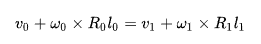
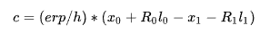

<head>
    <script type="text/x-mathjax-config">
    MathJax.Hub.Config({ TeX: { equationNumbers: { autoNumber: "all" } } });
    </script>

    <script type="text/x-mathjax-config">
    MathJax.Hub.Config({tex2jax: {
             inlineMath: [ ['$','$'],["$$","$$"], ["\\(","\\)"] ],
             processEscapes: true
           }
         });
    </script>

    <script src="https://cdn.mathjax.org/mathjax/latest/MathJax.js?config=TeX-AMS-MML_HTMLorMML" type="text/javascript">
    </script>
</head>

---
layout: default
title: Physics_About_Constraint_Equation
categories:
- Game
tags:
- Game
---
//Description: Physics_About_Constraint_Equation, 游戏中物理约束式子的由来

//Create Date: 2022-03-22 20:32:39

//Author: channy

[toc]

# 概述 
游戏中物理约束式子的由来，以bullet3为例。
 
# 基本物理变量
| 线性 | 旋转 |
| --- | --- | --- |
| 质量：$$ m = F / a $$ | 转动惯量：单质点 I = m r^2, 刚体 I = \int \rho r^2 dV, 其中r是每个微元到转轴的距离 |
| 加速度：a = dv / dt = d^2x / dt^2 | 角加速度：\beta = dw / dt = d^w(\psi) / dt^2 , a = r \beta | 
| 速度：v = \delta(s) / \delta(t) | 角速度：w = d(\psi) / dt |
| 动量(momentum)：P = m v | 角动量：L = r x p = r x (m v) = r x (\omega x (m r)) = m r^2 \omega = I \omega |
| 力：F = m a | 力矩 M = r F sin(\theta) |
| 冲量(impulse)：I = \int F dt | 角冲量：I = \int M dt |
| 动能：E = 1/2 m v^2 | 转动动能：E = 1/2 I (\omega)^2 |

> 冲量是指力在时间上的积累效应

> 让物体平动的叫做力，让物体转动的叫做力矩。用相同的力矩作用在一个物体上想让他转动，不同的物体角速度变化的快慢也是不一样的，影响角速度变化快慢的这个因素就是转动惯量。按照生活经验来看形状大小体积相同的两个物体，在相同的力矩作用相同的时间后质量重的那个物体角速度改变的较慢。所以可能有一种转动惯量就跟质量差不多这种感觉，实际上形状体积大小完全相同的两个物体也有可能有不同的转动惯量的，关键就在于质量分布的均匀程度是否相同。

> 刚体平动中有动量守恒，刚体转动中对应角动量守恒

Contact stiffness k_p and damping k_d for rigid body contacts as defined by ODE (ODE uses erp and cfm but there is a mapping between erp/cfm and stiffness/damping)

$ ERP = h k_p / (h k_p + k_d) $

$ CFM = 1 / (h k_p + k_d) $

where h is the step size.

# 部分物理参数说明  
1. linear Damping 线性阻尼, 0 到 1 之间 
1. angular Damping 旋转阻尼 
1. Restitution 弹性碰撞，恢复系数
1. Linear Factor 线性因子，可影响刚体在每个轴向的线性速度变化，值越大刚体移动越快。为指定的对象设置位置自由度。例如，通过设置Z分量为零，您可以禁止实体的上下（Blender，Max）或前后（Maya）运动。
1. Angular Factor 旋转因子，可影响刚体在每个轴向的旋转速度变化，值越大刚体旋转越快
因子是 Vec3 的类型，相应分量的数值用于缩放相应轴向的速度变化，默认值都为 1，表示缩放为 1 倍，即无缩放。
1. torque 力与冲量也可以只对旋转轴产生影响，使刚体发生转动，这样的力叫做扭矩
1. push velocity 推动速度 = pushDir * pushPower
1. Baumgarte stabilization 根据物体当前的穿透情况，适当地对他们进行补偿，使得碰撞双方相互分离。

## 摩擦力
1. Frictions 摩擦系数，静摩擦和动摩擦
1. rollingFriction 滚动摩擦系数
1. spinningFriction 自旋摩擦系数
1. Anisotropic friction 各向异性摩擦力。各向异性摩擦力用来定义不同方向的不同摩擦力，比如用于实现一个滑板，它向前和向后的摩擦力都很小，但是往两边的摩擦力很大。

> cfm = 1 /       ( dt * kp + kd ) 外加力

> erp = dt * kp / ( dt * kp + kd ) 误差修正

# Jacobian矩阵
 假设锚点在第一个刚体的局部坐标系下位置为 l0 , 而在第二个局部坐标系下为 l1 , 由于是锚点和刚体是刚性连接的, 这两个相对位置不会随时间改变. 如果某时刻，两个刚体的原点坐标和旋转分别用 x0, R0, x1, R1 表示, 那么有
 

上式对时间求导, 可以得到

使用当前时间步的旋转矩阵, 故而约束可以用矩阵写为
 
左边即为球关节(Ball Joint)对应的雅克比矩阵.

约束不一定严格满足, 球关节两侧物体的位置可能会有一定的偏差. 通过两个物体计算得到的球关节的位置, 可能会有微小的差异. 我们通过添加一个约束力, 把这个误差消掉. 等式右边可以写成:

因为这里的速度约束, 是通过位置约束对时间求导得到的. 因此, 等号右边的误差项, 也应该除以时间步长 h .


Projected Gauss-Seidel的好处就是计算快速, 但有这么几个缺点: 1. 无法保证收敛性; 2. 计算结果很可能不严格满足约束条件.


约束/摩擦约束
```
solverConstraint.m_rhs = penetrationImpulse + velocityImpulse;
```