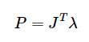

<head>
    <script type="text/x-mathjax-config">
    MathJax.Hub.Config({ TeX: { equationNumbers: { autoNumber: "all" } } });
    </script>

    <script type="text/x-mathjax-config">
    MathJax.Hub.Config({tex2jax: {
             inlineMath: [ ['$','$'],["$$","$$"], ["\\(","\\)"] ],
             processEscapes: true
           }
         });
    </script>

    <script src="https://cdn.mathjax.org/mathjax/latest/MathJax.js?config=TeX-AMS-MML_HTMLorMML" type="text/javascript">
    </script>
</head>

---
layout: default
title: Math In Physics Engine Bullet And Solver
categories:
- Algorithm
tags:
- Game
---
//Description: Math In Physics Engine Bullet And Solver, 物理引擎库Bullet中的数学和求解器

//Create Date: 2022-03-23 15:32:39

//Author: channy

[toc]

# 概述 
物理引擎库Bullet中的数学和求解器。以bullet3为例。

# 求解器
求解方程组 Ax = b, 其中A为n阶方阵，x和b均为n维列向量。该方程组有唯一解当且仅当矩阵A满秩。

## LCP/MLCP 求解  
### Gauss-Seidel (GS迭代求解法)  
Gauss-Seidel迭代求解方程 Ax = b  
**问题描述**  
Ax + b >= 0
x >= 0
x^T (Ax + b) = 0

**步骤**  
矩阵A可以被分割为 A = D - L - U, 其中D是对角矩阵，L是左下部分矩阵

得 $$ x_{k+1} = (D - L)^(-1) U x_{k} + (D - L)^(-1) b $$

通过Gauss-Seidel迭代求线性互补问题(LCP)的解，要求A是正定阵或者主元占优矩阵。


### Mixed Linear Complementarity Problem (MLCP迭代求解法)  
**问题描述**  
w = Ax + b
v_lo <= x <= v_hi

**步骤**  
记 z^k = (D - L)^(-1) U x^k - (D - L)^(-1) b

得 x^(k+1) = max(min( (x_(hi))_i, z^k), (x_(lo))_i)

## 原理  
### Gauss-Seidel 算法


把矩阵A拆成下三角L + 上三角U + 对角线D，则有
(L + U + D) x = b, 即
D x = b - (L + U)x，根据该式设计
x_(k + 1) = [b - (L + U) x] / D

### Projected Gauss-Seidel (PGS迭代求解法)  
PGS方法和GS方法的区别仅仅在于，PGS在每次迭代后会将 \lambda 截断到一个给定范围内。

令 c^k = b - U x^k

得 x^(k+1) = max(0, ((D - L)^(-1) U x^k - (D - L)^(-1) b)_i)

每次迭代过程中，所得x^(k+1)每一个分量的值都会被截断 

当矩阵 A 是正定矩阵的时候，PGS可得严格被证明为收敛
### Lemke (互补枢轴算法)
由原始单纯形法改进而来，主元消去法，由一个准互补基本可行解出发，通过主元消去法（转轴方法）求出一个新的准互补基本可行解，不断迭代。可能求解失败。

1. 按照最小比值规则确定离基变量
1. 保持准互补性，若w_i(z_i)是离基变量，则z_i(w_i)是进基变量

**步骤**
1. 若q >= 0, 则(w, z) = (q, 0)为解，否则
取max{-q_i}所在的行s行为主行，z_0对应的列为主列，主元消去，令y_s = z_s
2. 设现行表中变量y_s下面的列为d_x，若d_x <= 0，退出；否则按最小比值规则确定指标r，使  
q_i / d_is = min{q_i / d_is, d_is > 0}  
如果r行的基变量是z_0，转4；否则转3
3. 设r行的基变量为w_l或z_l (l != s)，y_s进基，以r行为主行，y_s对应的列为主列，主元消去。如果离基变量是w_l，则令y_s = z_l；如果离基变量是z_l，则令y_s = w_l，转2  
4. y_s进基，z_0离基。以r行为主行，y_s对应的列为主列，主元消去。得可行解，退出

**说明及改进**
1. 只满足于一个互补可行解  
2. 收敛条件强  

### Dantzig-Wolfe算法
暂未找到算法原理，只知道同样基于换基消元法

### SOR (Sucessive Over Relaxation Method) 算法
GS方法是SOR方法的特例
松弛因子(relaxation factor)
选择适当的松弛因子能使收敛的Gauss-Seidel迭代法获得加速收敛的效果

## PGS求解器
### 碰撞接触约束方程推导
要解决碰撞约束，最直接的想法就是两者不再继续碰撞  
则碰撞点和碰撞分离法线之间的关系 (P_b - P_a) * n >= 0 (在分离法线上的投影大于0)  

C为质心，r为到碰撞点的距离，(C_b + r_b - C_a - r_a) * n >= 0, 对于时间微分，得 (V_b + w_b x r_b - V_a - w_a x r_a) * n >= 0 即为约束不等式 

### 具体推导过程

当刚体A与刚体B在某点接触时,接触点有约束方程

其中x为刚体的质心坐标，R为刚体的旋转矩阵,r为接触点相对质心的距离。

我们希望在碰撞后相对速度在法线方向的投影大于等于0。于是对上述方程对时间求导


我们可以根据角速度的定义得到旋转矩阵的求导结果。

将和速度有关的变量提取作为向量得到


其中可以利用

这个公式来将角速度项从方程中提出来

将右边的速度项记作V左手项为J有

其中b为了方便我们将外因引入方程所预留的一个变量

现在我们需要对系统施加一个冲量让方程能维持值等于0的状态。

我们将对A的冲量，A的冲量矩，B的冲量，B的冲量矩像之前那样排成一个向量记成P，P就是我们待求的量。

注意到在求法线方向的约束时，冲量的方向应该与法线方向相同。P的实际自由度只有1。因此，我们可以记成


为了方便我们计算冲量，我们需要将质量排布成矩阵的形式：


其中矩阵中的M为元素大小均为对应刚体质量的对角矩阵。而I为对应刚体的转动惯量。

将上述式子带入约束方程得到


由于计算结果是标量，我们可以简单的写成


当b=0时，这个式子的形式和经典完全非弹性碰撞求解得到的结果是一样的，在某种程度上也验证了这个式子的正确性。

## bullet3 中的 MLCP 求解器 solveMLCP 
btMLCPSolverInterface.solveMLCP

四类 Solver 直接继承 btMLCPSolverInterface，具体求解过程在solveMLCP中。  

* btSolveProjectedGaussSeidel (PGS) 
	* solveMLCP (btSolveProjectedGaussSeidel) 根据算法公式直接求x_{k + 1}
* btDantzigSolver (Dantzig)
	* solveMLCP (btDantzigSolver)
		* btSolveDantzigLCP
			* btFactorLDLT
				* btSolveL1_2 // L * X = B, B有2列；block=2*2；其中L为n*n的行优先存储的对角线为1的下三角矩阵，leading dimension为lskip1，B为n*2的列优先存储的矩阵，leading dimension为lskip1，返回值覆盖B
				* btSolveL1_1 // L * X = B, B有1列；block=2*2；其中L为n*n的行优先存储的对角线为1的下三角矩阵，leading dimension为lskip，返回值覆盖B
			* btSolveLDLT
				* btSolveL1 // L * X = B, B有1列；block=4*4；
				* btVectorScale // a[i] scale d[i]
				* btSolveL1T // L^T * x = b; block=4*4
			* btLCP.solve1
				* btSolveL1
				* btSolveL1T
			* btLCP.unpermute 
* btLemkeSolver (Lemke)
	* solveMLCP (btLemkeSolver)
		* btLemkeAlgorithm.solve
			* findLexicographicMinimum 查找主元
			* GaussJordanEliminationStep Gauss-Jordan消元法
	z0 = max{-q_i}
* btPathSolver //未启用，缺少头文件 

## solver前奏
* btMLCPSolver 继承于btSequentialImpulseConstraintSolver，重写了三步曲
	* solveGroupCacheFriendlySetup 设置A、x和b
		* createMLCP/createMLCPFast
	* solveGroupCacheFriendlyIterations
		* solveMLCP 具体LCP求解

## bullet3 中的约束求解器 solveGroup 求解器三步曲  
btConstraintSolver.solveGroup  

* solveGroup (btDiscreteDynamicsWorld::processIsland调用) PGS 方法来处理分析所有的约束
	* solveGroupCacheFriendlySetup 三类nonContact、contact、friction分开求解
		* setupSolverFunctions 设置后续求解器的三个函数，三个函数类似，都是求冲量，返回 **deltaImpulse * (1. / c.m_jacDiagABInv);**
			* gResolveSingleConstraintRowGeneric_scalar_reference PGS/SI内部求解单行约束，同时应用上下界
				* internalApplyImpulse 根据求得的单位时间内冲量更新物体单位时间内的速度和角速度
			* gResolveSingleConstraintRowLowerLimit_scalar_reference 同上，只应用下界
			* gResolveSplitPenetrationImpulse_scalar_reference 受btSolverConstraint的m_rhsPenetration控制下要么返回0，要么只应用下界，同上一个函数
		* convertBodies 计算每个body的torque impulse。陀螺力矩。角速度更新主要应用了冲量矩(moment of impulse)/角冲量(angular impulse)定理。主要有以下3步，最后更新刚体角速度
			* getOrInitSolverBody
				* initSolverBody 根据碰撞体设置btSolverBody的系数默认值，角速度线速度等。1): 根据冲量矩定理计算角动量的变化，这里乘了逆惯性张量，得出的是dt时间段内角速度的变化量，计算外力矩引起的角速度变化， m_externalTorqueImpulse 实际是角速度变化量；
			* computeGyroscopicForceExplicit (btRigidBody) 
			* computeGyroscopicImpulseImplicit_World 以世界坐标系为参考
			* computeGyroscopicImpulseImplicit_Body 以自身坐标系为参考。2) 计算陀螺力矩引起的角速度变化并加到m_externalTorqueImpulse 上；gyroForce实际是角速度变化量；
		* convertJoints 对每个约束，创建Jacobian矩阵，及其它数据，J*v = c + cfm * lambda。非接触的
			* buildJacobian (btTypedConstraint)
			* convertJoint
				* getInfo2 (btTypedConstraint，cfm、damping等系数)
		* convertContacts 对每个manifold,更新摩擦系数等参数
			* convertContact 接触约束中可能有滑动摩擦和滚动摩擦   
				* setupContactConstraint 对应m_tmpSolverContactConstraintPool
				* addTorsionalFrictionConstraint
					* setupTorsionalFrictionConstraint 对应m_tmpSolverContactRollingFrictionConstraintPool
				* applyAnisotropicFriction
				* addFrictionConstraint
					* setupFrictionConstraint 对应对应m_tmpSolverContactConstraintPool
				* setFrictionConstraintImpulse
	* solveGroupCacheFriendlyIterations 支持SSE2/SSE4/FMA3指令集
		* solveGroupCacheFriendlySplitImpulseIterations
			* resolveSplitPenetrationImpulse
				* gResolveSplitPenetrationImpulse_scalar_reference 计算施加冲量
		* solveSingleIteration 单次迭代，有Random_order
			* solveConstraintObsolete (只 btConeTwistConstraint 才有具体实现)
			* resolveSingleConstraintRowLowerLimit
			* resolveSingleConstraintRowGeneric
				* gResolveSingleConstraintRowGeneric_scalar_reference
	* solveGroupCacheFriendlyFinish 回写计算结果
		* writeBackContacts 回写冲量到btManifoldPoint
		* writeBackJoints 回写施加力和惯量到btJointFeedback
		* writeBackBodies 回写速度到btRigidBody


## Bullet3 中的约束求解器
基本约束8种，基类 btTypedConstraint 

1. btConeTwistConstraint 圆锥体扭曲
1. btContactConstraint
1. btGearConstraint 
1. btGeneric6DofConstraint -> btUniversalConstraint/btGeneric6DofSpring2Constraint -> btFixedConstraint/btHinge2Constraint
1. btHingeConstraint -> btHingeAccumulatedAngleConstraint 铰链约束
1. btPoint2PointConstraint 点约束
1. btSliderConstraint 滑块约束

bullet中的rope使用的是btSoftBody，使用多段

 Accept penetration
 Remember the past
 Apply impulses early and often
 Pursue the true impulse
 Update position last


基类 btConstraintSolver
```c++
class btConstraintSolver
{
public:
	virtual ~btConstraintSolver() {}

	virtual void prepareSolve(int /* numBodies */, int /* numManifolds */) { ; }

	///solve a group of constraints
	virtual btScalar solveGroup(btCollisionObject** bodies, int numBodies, btPersistentManifold** manifold, int numManifolds, btTypedConstraint** constraints, int numConstraints, const btContactSolverInfo& info, class btIDebugDraw* debugDrawer, btDispatcher* dispatcher) = 0;

	virtual void allSolved(const btContactSolverInfo& /* info */, class btIDebugDraw* /* debugDrawer */) { ; }

	///clear internal cached data and reset random seed
	virtual void reset() = 0;

	virtual btConstraintSolverType getSolverType() const = 0;
};
```
默认求解器 btSequentialImpulseConstraintSolver，另一个直接继承基类的求解器btConstraintSolverPoolMt

* btSequentialImpulseConstraintSolver  
	* setupSolverFunctions 
	* prepareSolve & allSolved (btDiscreteDynamicsWorld::solveConstraints调用，bullet3中所有solver都没有重写)
	* solveGroup 求解三部曲 

继承 btSequentialImpulseConstraintSolver 的 Solver  
* btSequentialImpulseConstraintSolverMt -> MySequentialImpulseConstraintSolverMt
* btMultiBodyConstraintSolver -> btMultiBodyMLCPConstraintSolver & btDeformableMultiBodyConstraintSolver
	* solveGroupCacheFriendlyIterations
		* solveMLCP MCLP求解器求解，求解失败转父类的 solveGroupCacheFriendlyIterations
* btNNCGConstraintSolver 只在基类的基础上重写了三步曲具体实现
* btMLCPSolver
	* solveGroupCacheFriendlyIterations
		* solveMLCP

* b3GpuRigidBodyPipeline
	* b3PgsJacobiSolver/b3GpuPgsContactSolver/b3GpuJacobiContactSolver
		* solveContacts
			* solveGroup 求解三部曲  

# bullet的rayTest
Blockman::rayTestOnScreen
PhysicsWorld::rayTest(...,Callback)
btCollisionWorld::rayTest
BroadphaseCollisionDetector::rayTest(...,btSingleRayCallback,...)
btDbvtBroadphase::rayTest
btDbvt::rayTestInternal(...,BroadphaseRayTester)
btSingleRayCallback::process
btCollisionWorld::rayTestSingle
btCollisionWorld::rayTestSingleInternal(..., 
btBvhTriangleMeshShape::performRaycast(BridgeTriangleRaycastCallback,...)
btQuantizedBvh::reportRayOverlappingNodex
btQuantizedBvh::reportBoxCastOverlappingNodex
btQuantizedBvh::walkStacklessQuantizedTreeAgainstRay
btTriangleRaycastCallback::processTriangle
BridgeTriangleRaycastCallback::reportHit

# 参考文献
[Physics-Based Animation](https://www.researchgate.net/profile/Kenny-Erleben/publication/247181209_Physics-Based_Animation/links/5e1b2ed04585159aa4cb43d8/Physics-Based-Animation.pdf)
[Lemke-Howson Algorithm](https://web.stanford.edu/~saberi/lecture4.pdf)
[Iterative Dynamics with Temporal Coherence](https://box2d.org/files/ErinCatto_IterativeDynamics_GDC2005.pdf)
[Practical methods of optimization] by Fletcher R.

[LCP Algorithms for Collision Detection Using CUDA](https://developer.nvidia.com/gpugems/gpugems3/part-v-physics-simulation/chapter-33-lcp-algorithms-collision-detection-using-cuda)

[Physx 部分文档翻译](https://www.zhihu.com/people/li-jia-jun-1-44/posts)