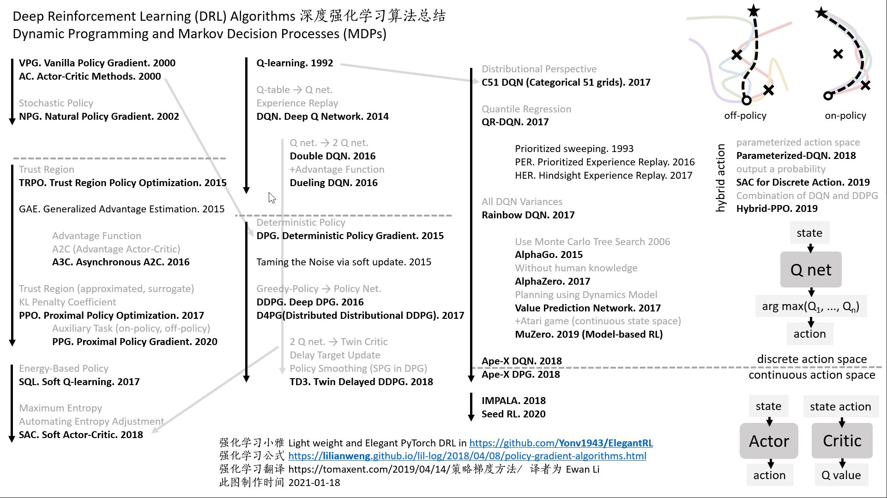
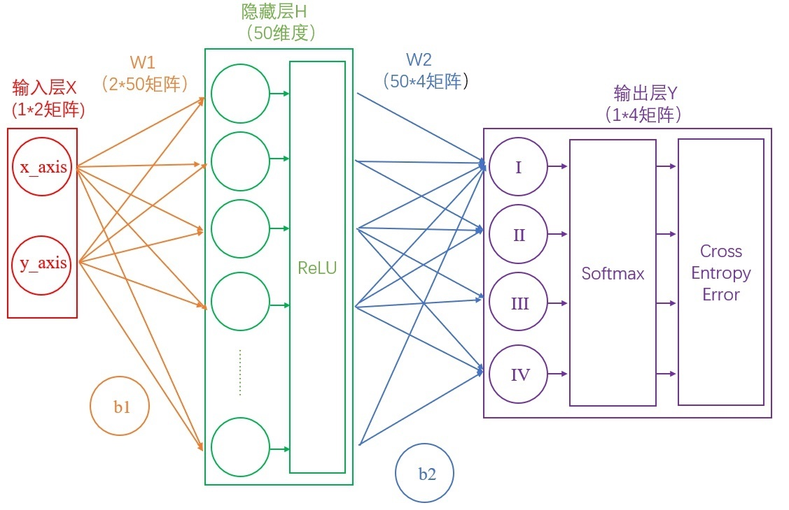

//Description: 记录和规划有关的算法。后续逐步补充完整。如现有的路径规划算法，一般分为两大类：基于搜索的和基于采样的。基于搜索的比较入门的有DFS/BFS/Dijkstra/A*等，基于采样的比较入门的有RTT等。其它的规划算法有多智能体强化算法如Q-Learning、DQN、DPG、Actor-Critic、DDPG、PPO等。

//Create Date: 2023-02-28 20:40:39

//Author: channy

[toc]

# 概述  
路径规划算法，一般分为两大类：基于搜索的和基于采样的。  
```
// 以二维地图为例，设起点st，终点end，障碍物函数block()。
struct Point {
    int x, y;
};
```

***
<font color = red> 协同规划 </font>
***

# 协同规划
## 基于搜索的路径规划算法
### DFS/BFS 深度优先算法/广度优先算法
DFS/BFS是OJ中常用的搜索算法。DFS可以看成是从可能的第1_1步走到可能的第n_1步，当第n+1_1步没有选择时，退回到第n步的另一种可能n_2，继续往前走直到达到目的。而BFS则是利用队列，把所有可能的第1步放入队列，再对队列里的每一个第1步（1_1, 1_2, ...) 把所有可能的第2步放入队列，以此类推，直到达到目的。  
```
bool DFS(Point &st) {
    if (st == end) return true;
    vector<Point> dir = {Point(-1, 0), Point(1, 0), Point(0, -1), Point(0, 1)};
    for (int i = 0; i < 4; ++i) {
        Point next = st + dir[i];
        if (block(next)) continue;
        bool res = DFS(next);
        if (res) return true;
    }
    return false;
}

bool BFS(Point &st) {
    if (st == end) return true;
    queue<Point> qu;
    qu.push(st);
    while (!qu.empty()) {
        Point cur = qu.front();
        qu.pop();
        if (cur == end) return true;
        for (int i = 0; i < 4; ++i) {
            Point next = cur + dir[i];
            if (block(next)) continue;
            qu.push(next);
        }
    }
    return false;
}
```
### Dijkstra算法
在BFS的基础上，在下一步的选择时优先选择当前走过的路径中代价最短的。当每一步的代价都相同时，退化成BFS。
```
// Cost(st, end)从st到end的代价函数
struct Point {
    int x, y;
    int cost;
}

bool Dijkstra(Point &st) {
    priority_queue<Point> qu;
    while (!qu.empty()) {
        Point cur = qu.front();
        qu.pop();
        if (cur == end) return true;
        for (int i = 0; i < 4; ++i) {
            Point next = cur + dir[i];
            if (block(next)) continue;
            next.cost = cur.cost + Cost(cur, cur + dir[i]);           
            qu.push(next);
        }
    }
    return false;
}
```
### 最佳优先算法
在BFS的基础上，在下一步的选择时优先选择当前位置到目的位置最近的路径。
### A*算法
结合了Dijstra和最佳优先算法。f = g + h。其中g(st, cur)为起始位置到当前位置的代价，h(cur, end)为当前位置到目的位置的代价。
### 双向A*算法
### Aaytime Repairing A*算法 (ARA*)
### Learning Real-time A*算法 (LRTA*)
### Real-time Adaptive A*算法 (RTAA*)
### Lifelong Planning A* (LPA*)
### Dynamic A*算法 (D*)
### Anytime D*

## 基于采样的路径规划算法
### RRT
### RRT-Connect
### RRT*
### Anytime RRT*
### Batch Informed Trees (BIT*)

## 粒子群算法
## 布谷鸟算法

***
<font color = red> 协同分配 </font>
***

# 协同分配
## 多智能体强化学习算法
强化学习算法，即在某一状态下，依据某一策略选择动作和环境交互，得到下一步状态，再根据新状态计算收益，优化策略。  
### 符号表
| 符号 | 含义 | 说明 |
| :---: | :--- | :--- |
| s | 状态 | state |
| a | 动作 | action |
| $\pi: s \rightarrow a$ | 策略函数 | $\pi(\theta)$, 在状态s下对动作a进行决策。  |
| $Q(s,a)$ | 动作效用函数 | |
| $R(s,a)$ | 回报函数 | reward |
| $V(s)$ | 状态效用函数 | |
| $\gamma$ | 折旧因子 | |
| $\alpha$ | 学习率 | |

off-policy: 是指行为策略和目标策略不是同一个策略，即智能体可以通过离线学习自己或别人的策略，来指导自己的行为；  
on-policy: 行为策略和目标策略是同一个策略。  

目标策略（target policy）：智能体要学习的策略  
行为策略（behavior policy）：智能体与环境交互的策略，即用于生成行为的策略  

### 方法
* TD (Temporal Difference): 时序差分  
* Monte Carlo: 蒙特卡洛

### 强化学习算法
state-action模型。 
总回报函数$$G(\tau) = \sum_{t=0}^{T} r(s_t, a_t, s_{t+1})$$  
折扣回报函数$$G(\tau) = \sum_{t=0}^{T} \gamma_t r_{t+1}$$

#### Q-Learning (离散状态，离散动作)
1. 初始化Q表。
2. 对当前状态s，根据Q表使用贪心策略选择使Q达到最大值的动作a，或以$\epsilon$的概率进行探索，以$1-\epsilon$的概率贪心。
3. 根据选择的动作a计算reward
4. 更新Q表
$$Q_{new}(s,a) = Q(s,a) + \alpha (R(s,a) + \gamma max Q^{'}(s^{'},a^{'}) - Q(s,a))$$
，返回2.直到Q表收敛。
#### DQN (Deep Q-Network) (连续状态，离散动作)
在Q-Learning的基础上，使用神经网络预测逼近值函数$Q(s,a) = f(s,a,\theta)$。深度神经网络是监督学习，需要标签，标签Q值$R_{t+1} + \gamma max Q(S_{t+1}, a, \theta)$。采用经验回放D，提高数据利用率。
#### Double DQN, Dueling DQN, D3QN, Noisy DQN...
#### DPG (Deterministic Policy Gradient) 
在Q-Learning的基础上，假设策略服从特殊分布如正态分布，使用神经网络预测策略函数$\pi: s \rightarrow a$，估计Q值，直接对价值函数求导。
$$\nabla_{\theta} J(\theta) = E_{\tau ~ \pi_{\theta}}[(\sum \nabla_{\theta} log {\pi_{\theta} (a|s)}) (\sum r(s,a))]$$
on-policy。
#### Actor-Critic = PG + DQN
使用actor和critic两个神经网络，其中actor输入状态，输出策略，用于选择动作；critic输入状态，计算每个动作的reward。
适用于连续状态，连续动作。
#### PPO (Proximal Policy Optimization) = Actor-Critic + DQN
使用Important-sampling重要性采样技术，输出策略，即概率分布密度函数。  
on-policy。
#### DDPG (Deep DPG)
使用4个神经网络：actor、critic、targetActor、targetCritic。Actor直接输出动作。Critic估计Q函数。
#### MADDPG 和 MADDPG
每个智能体有自己的神经网络。



## 分布式协同拍卖算法
## 模拟拍卖算法

***
<font color = red> 态势推理 </font>
***

# 态势推理
## 模板匹配-贝叶斯网络融合推理
## 基于能力的静态威胁计算
## 决策矩阵威胁评估算法
## 匈牙利算法
## KM算法
## 最邻近目标关联算法
## 回溯法
## 概率数据关联算法PDA
## 联合概率数据关联算法JPDA
## 自适应滤波算法
## 变结构多模型算法
## UKF-AGIMM

***
<font color = red> 部署规划 </font>
***

# 部署规划
## CS（Cuckoo Search）

***
<font color = red> 其它 </font>
***

# 特征提取
Transform-LSTM

# 协同决策
## 情景分析法（规则库）
## FCM-规则库
## 多模型综合策略融合视觉场景理解
## 粒子群优化PSO等
## 遗传算法
# 智能推送
## 基于图神经网络的多语义标签输出

# 参考资料
1. [MAPPO](https://github.com/marlbenchmark/on-policy)
1. [强化学习](https://www.cnblogs.com/kailugaji/p/15354491.html)
1. [路径规划的Python基本实现](https://github.com/zhm-real/PathPlanning)
1. [如何选择深度强化学习算法？](https://zhuanlan.zhihu.com/p/342919579?utm_id=0)

# 附录
## 神经网络NN
  
输入层的维度由输入数据X决定，输出层的维度由输出数据Y决定。  
隐藏层的层数、宽度都是NN中可设参数。  

第一层的数据$l_{1j} = \sum_i w_{1ij} * x_i + b_1$为输入数据的线性组合。其中权重$w_{ijk}$和偏置bias用于拟合。   
激活函数有：阶跃函数sgn(x) (<0 -> 0; >0 -> 1)、sigmoid函数($1/(1+e^{-x})$)、ReLU函数(<0 -> 0; >0 -> x)。非线性函数，线性组合+激活函数可以表示几乎所有的函数。  

输出正规化$p_i = e^i/( \sum_j e^j)$，即softmax。
交叉商损失（Cross Entropy Error）
loss函数$loss = \sum_i (y_i - y)^2$。
$\Delta \omega_i = \eta (y - y^{'}) x_i$, 更新$\omega_i = \omega_i + \Delta \omega_i$其中$\eta$为学习速率。

### BP神经网络和RBF神经网络
BP神经网络是多层NN，激活函数为sigmoid函数。全局逼近。
RBF神经网络的作用函数是高斯基函数$h_j = exp(-{||x - c_j||}^2/(2b_j^2))$.局部逼近。
