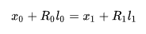
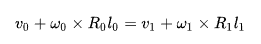
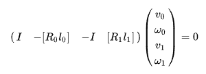
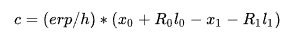

//Description: Physics in game, 游戏中使用到的物理笔记2

//Create Date: 2022-03-22 20:32:39

//Author: channy

# 概述 
游戏中使用到的物理笔记2

# Jacobian矩阵
 假设锚点在第一个刚体的局部坐标系下位置为 l0 , 而在第二个局部坐标系下为 l1 , 由于是锚点和刚体是刚性连接的, 这两个相对位置不会随时间改变. 如果某时刻，两个刚体的原点坐标和旋转分别用 x0, R0, x1, R1 表示, 那么有
 

上式对时间求导, 可以得到

使用当前时间步的旋转矩阵, 故而约束可以用矩阵写为
 
左边即为球关节(Ball Joint)对应的雅克比矩阵.

约束不一定严格满足, 球关节两侧物体的位置可能会有一定的偏差. 通过两个物体计算得到的球关节的位置, 可能会有微小的差异. 我们通过添加一个约束力, 把这个误差消掉. 等式右边可以写成:

因为这里的速度约束, 是通过位置约束对时间求导得到的. 因此, 等号右边的误差项, 也应该除以时间步长 h .

Projected Gauss-Seidel的好处就是计算快速, 但有这么几个缺点: 1. 无法保证收敛性; 2. 计算结果很可能不严格满足约束条件.