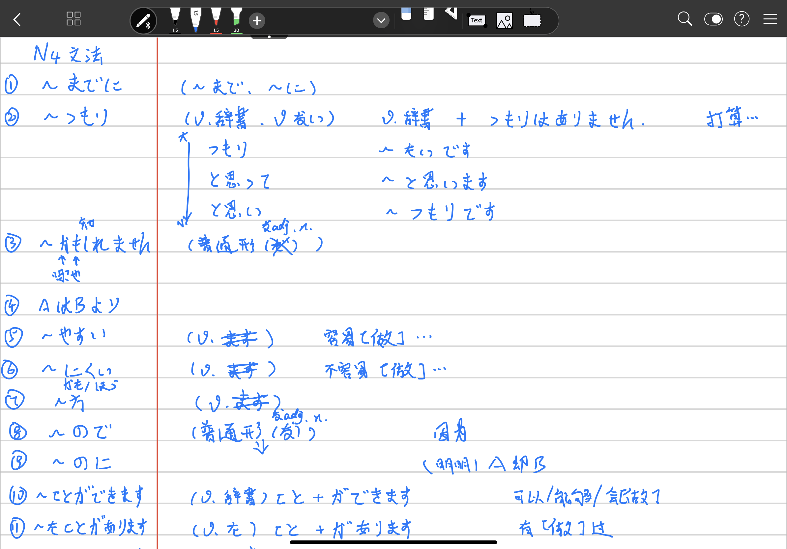
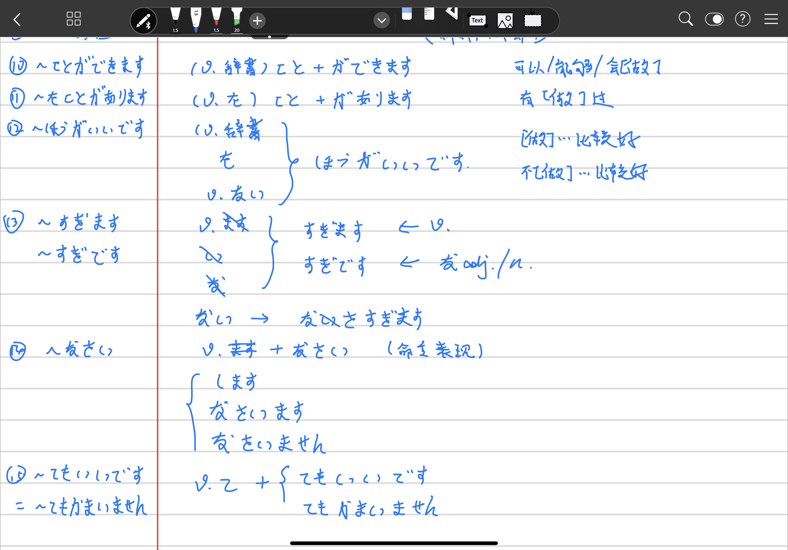
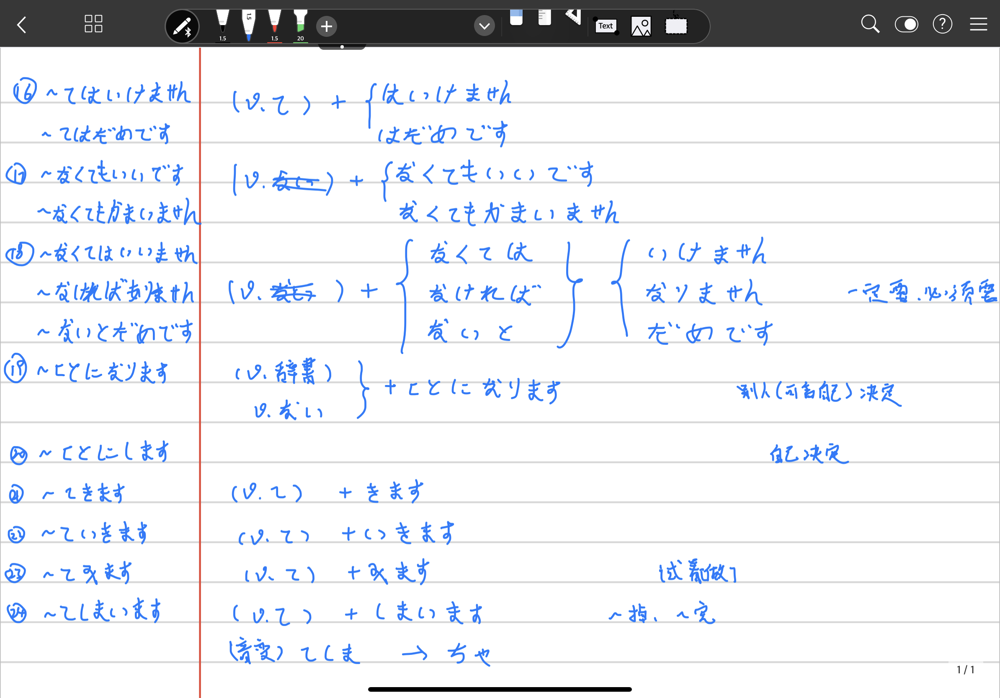

//Description: 日语N4方法笔记

//Create Date: 2020-02-25 09:48:15

//Author: channy

# Notes_Japanese_N4

## 1. ~までに

~まで, ~に

## 2. ~つもり

(v.辞書/v.ない)　+ つもりはありません

从大到小：つもり　と思って　と思い

	~たいです　~と思います　~つもりです

打算。。。

## 3. ~かもしれません

(普通形(なadj./n.去掉だ))

## 4. ~AはBより

## 5. ~やすい

(v.去掉ます)

容易[做]

## 6. ~にくい

(v.去掉ます)

不容易[做]

## 7. ~方(かた/ほう)

(v.去掉ます)

## 8. ~ので

(普通形(なadj./n.な))

因为

## 9. ~のに

(普通形(なadj./n.な))

(明明)A却B

## 10. ~ことができます

(v.辞書)　こと　+　ができます

可以/能够/会[做]

## 11. ~たことがあります

(v.た)　こと　+　があります

有[做]过

## 12. ~ほうがいいです

(v.辞書/た/v.ない) + ほうがいいです

[做]...比较好，不[做]...比较好

## 13. ~ すぎます/~すぎです

(v.去掉ます/adj去掉い/adj去掉な) + すぎます -> v.
				 + すぎです -> なadj./n.

ない -> なさすぎます 

## 14. ~ なさい

 (v.去掉ます) + なさい

命令表现

します　なさいます　なさいません

## 15. ~てもいいです = ~てもかみいません

(v.て)　+　てもいいです/てもかまいません

## 16. ~てはいけません = ~てはだめです

(v.て)　+　はいけません/はだめです

## 17. ~なくてもいいです = ~なくてもかまいません

(v.去掉ない)　+　なくてもいいです/なくてもかまいません 

## 18. ~なくてはいいません = ~なければなりません = ~ないとだめです

 (v.去掉ない)　+　なくては/なければ/ないと　+　いいません/なりません/だめです

## 19. ~ことになります

 (v.辞書/v.ない) + ことになります

别人(可含自己)决定

## 20. ~ことにします

自己决定

## 21. ~てきます

(v.て)　+　きます

## 22. ~ていきます

(v.て)　+　いきます

## 23. ~てみます

(v.て)　+　みます

试着[做]

## 24. ~てしまいます

(v.て)　+　しまいます

~掉、~完

(音变) てしま　->　ちゃ

## 25. ~ておきます

## 26. ~ています

正在~，目前状态，习惯

## 27. 缩约表现

## 28. 指示词

## 29. ~はじめます

开始~

## 30. ~だしまし

v.~ます~ + だします

开始~，~起来，~出来

## 31. ~続けます

持续~，继续~

## 32. ~終わります/終えます

~完

## 33. ~がします

有~，感觉~

## 34. ~てあげます

帮sb.[做]

## 35. ~てもらいます

请sb.(为sb.)[做]~

## 36. ~てくれます

sb.帮我~

## 37. ~やります/~てやります

帮sb.[做]~

[back](/)

