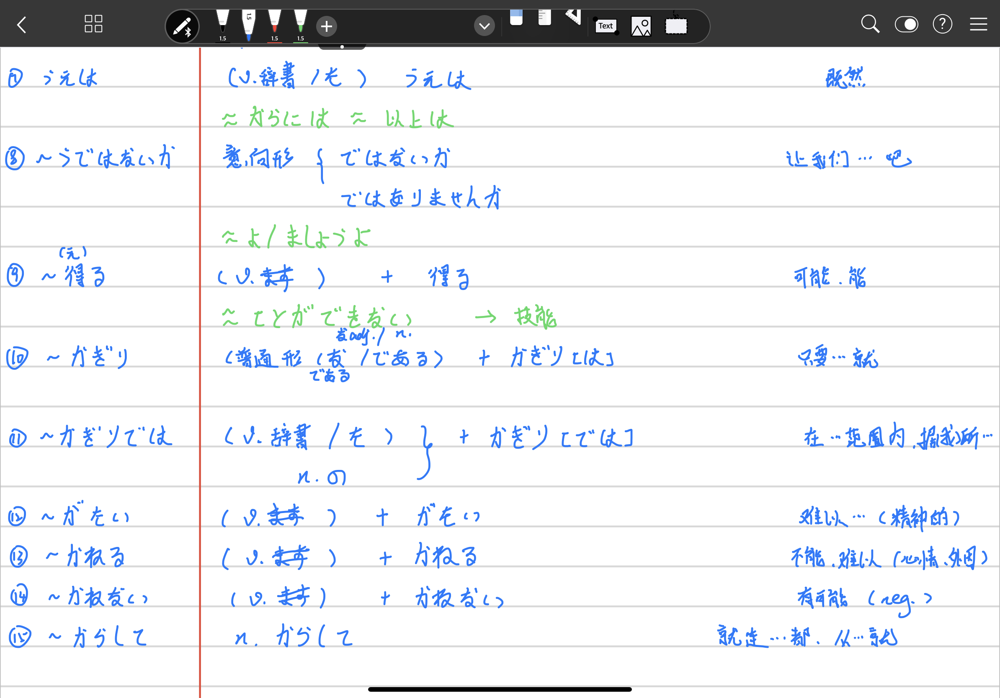
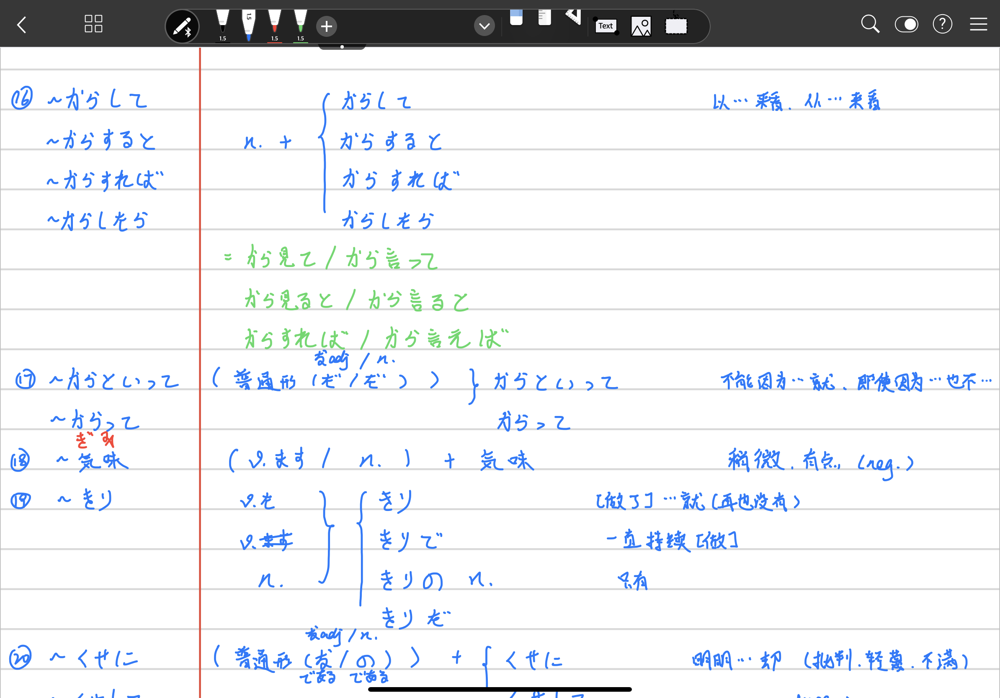
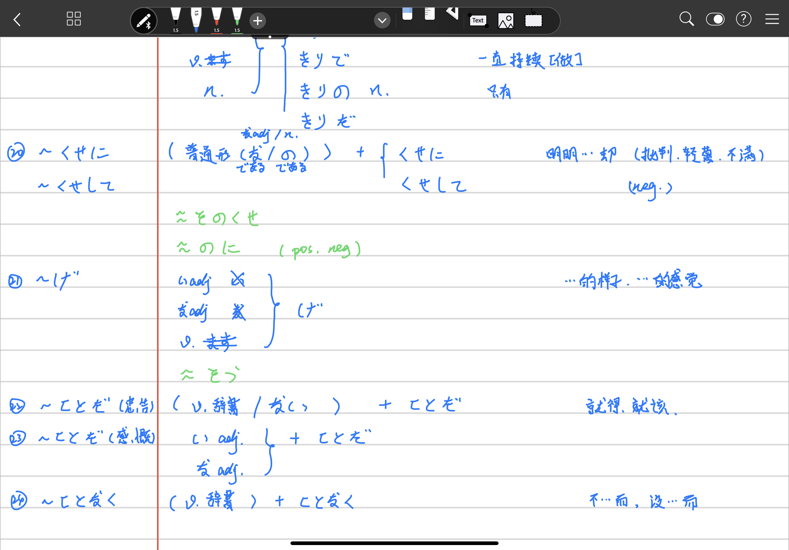

//Description:

//Create Date: 2020-02-26 09:42:51

//Author: channy

# Notes_Japanese_N2

## 1. ~あげく

[做]...结果...

## 2. ~あまり/あまりの~に

因为太...

## 3. ~以上

既然

## 4. ~一方

另一方面

## 5. ~うえで

在...的时候(必要,重要的事;不接具体行为动作)

## 6. ~うえで

[做]...后

## 7. ~うえは

既然

## 8. ~うではないか

让我们...吧

## 9. ~得る

可能，能

## 10. ~かぎり

只要...就

## 11. ~かぎりでは

在...范围内，据(我)所...

## 12. ~がたい

难以...(精神的)

## 13. ~かねる

不能，难以...(心情、外因)

## 14. ~かねない

有可能(neg.)

## 15. ~からして

就连...都,从...就

## 16. ~からして/~からすると/~からすれば/~からしたら

以...来看，从...来看

## 17. ~からといって/~からって

不能因为...就...，即使因为...也不...

## 18. ~気味

稍微，有点(neg.)

## 19. ~きり

[做了]...就(再也没有)，一直持续[做]，只有

## 20. ~くせに/~くせして

明明...却...(批判，轻蔑，不满)(neg.)

## 21. ~げ

...的样子，...的感觉

## 22. ~ことだ(忠告)

就得，就该

## 23. ~ことだ(感慨)

## 24. ~ことなく

不...而,没...而

[back](/)

