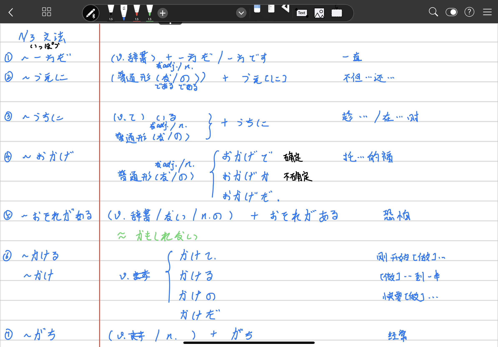
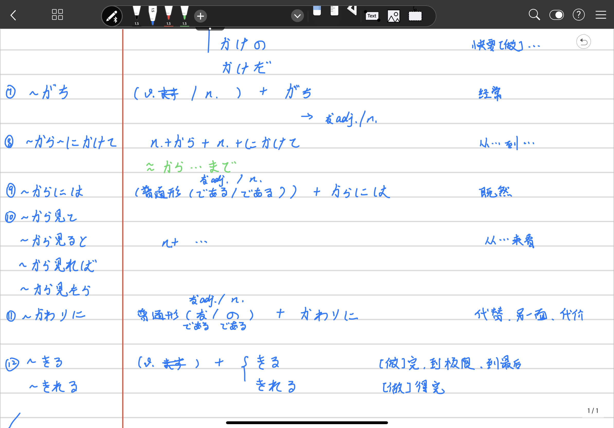
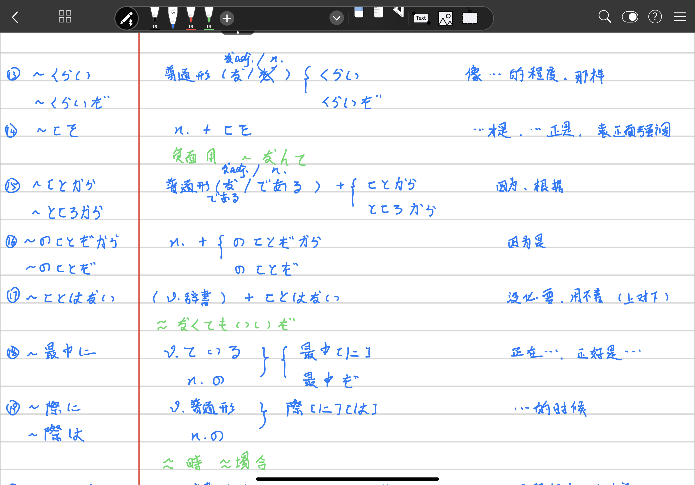
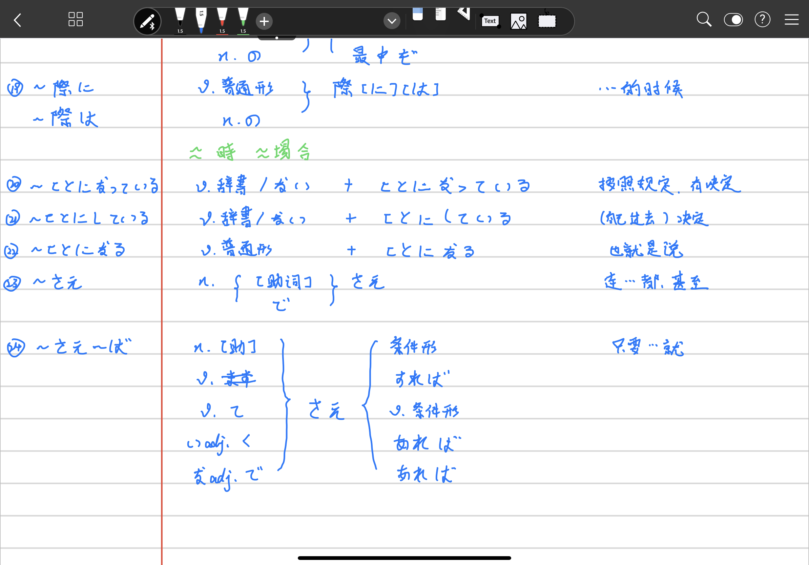

//Description:

//Create Date: 2020-02-26 09:12:31

//Author: channy

# Notes_Japanese_N3

## 1. ~一方だ

(v.辞書)　+　一方だ/一方です

一直...

## 2. ~うえに

(普通形(な/の))　+　うえ[に]

不但...还...

## 3. ~うちに

(v.て) いる　+　うちに

(普通形(な/の))　+　うちに

趁.../在...时

## 4. ~おかげ

(普通形(な/の))　+　おかげで/おかげか/おかげだ

托...的福

## 5. ~おそれがある

恐怕

## 6. ~かける/~かけ

(v.去掉ます)

刚开始...，到一半，快要

## 7. ~がち

经常

## 8. ~から~にかけて

从...到...

## 9. ~からには

既然

## 10. ~から見て/~から見ると/~から見れば/~から見たら

从...来看

## 11. ~かわりに

代替，另一面，代价

## 12. ~きる/~きれる

[做]完，到极限，到最后
[做]得完

## 13. ~くらい/~くらいだ

像...的程度，那样

## 14. ~こそ

n. + こそ

...才是,...正是

## 15. ~ことから/~ところから

因为，根据

## 16. ~のことだから/~のことだ

n. + ~のことだから/~のことだ

因为是

## 17. ~ことはない

没必要，用不着

## 18. ~最中に

正在...，正好是

## 19. ~祭に/~祭は

...的时候

## 20. ~ことになっている

按照规定，有决定

## 21. ~ことにしている

(自己过去)决定

## 22. ~ことになる

也就是说

## 23. ~さえ

连...都

## 24. ~さえ~ば

只要...就

## 25. 〜しかない

只好，只能

## 26. ~せい

因为，都怪

## 27. ~だけ/~だけの

〜多少就，尽量

## 28. ~たところ

[做]〜结果

## 29. ~たとたん

刚~就

## 30. ~たびに

每次，每当

## 31. ~だらけ

全是，满是

## 32. ~ついでに

顺便

## 33. ~っけ

[例]この店、以前来たことがあったっけ？

~来着（确认，回顾）

## 34. ~っぽう

v.~ます~/n. + っぽい

[例]うちの上司は怒りっぽい。

容易~，有点~，好像~

## 35. ~てからでないと/~てからでなければ

v.て + からでないと/からでなければ

[例]直接部屋を見てからでないと、借りるかどうか決められません。

若不先[做]~就

## 36. ~てしょうがない/~てしかたがない

v.て/い.adj　くて/な.adj で + しょうがない/しかたがない

~得不得了，非常~  

## 37. ~てたまらない

v.て/い.adj くて/な.adj で + たまらない

[例] 合格通知を受け取って、嬉しくてたまらない。

[例] 合格通知を受け取った彼女は嬉しくてたまらないようだ。

~得不得了

[back](/)

