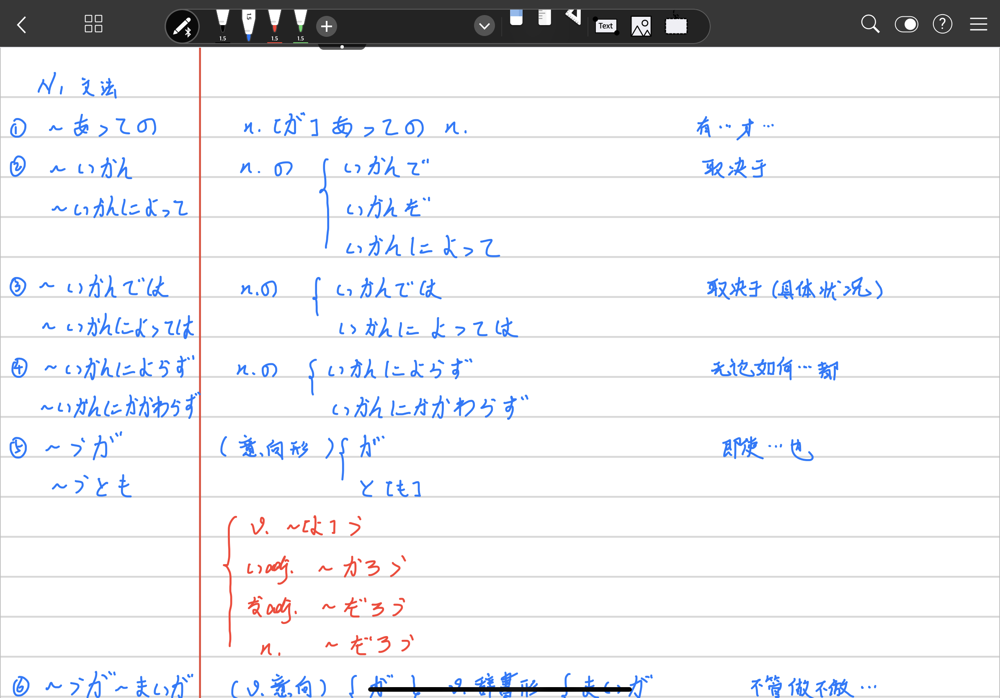
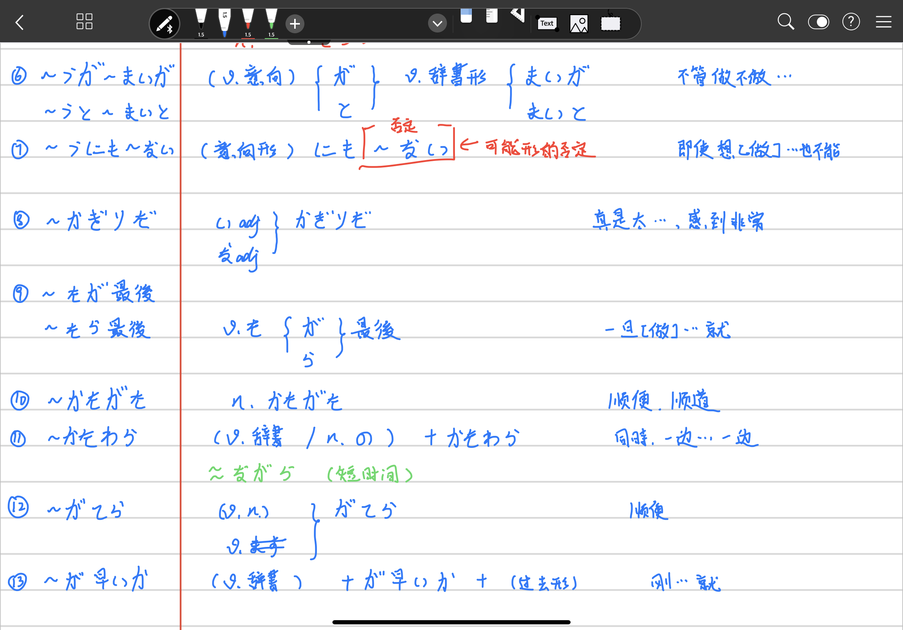
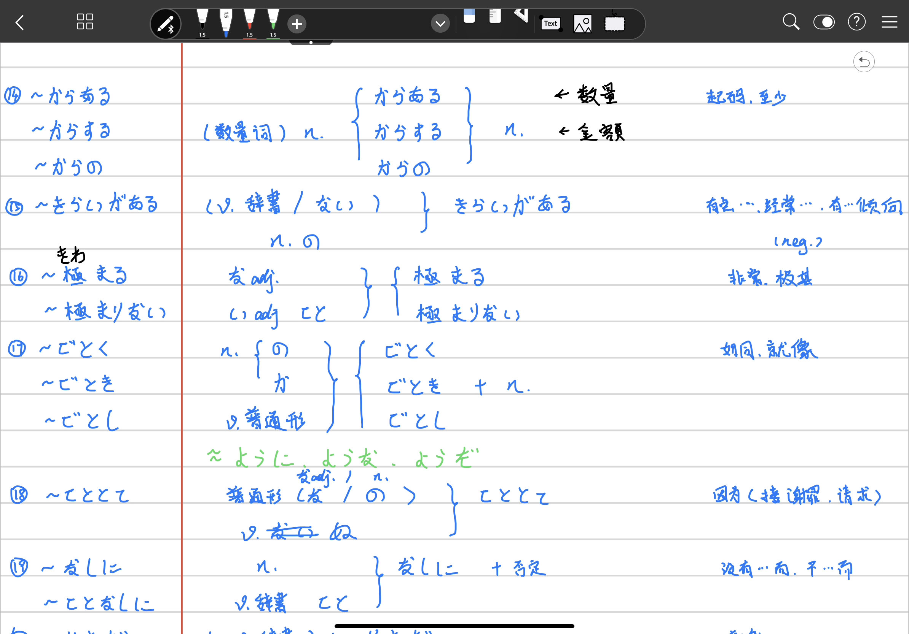
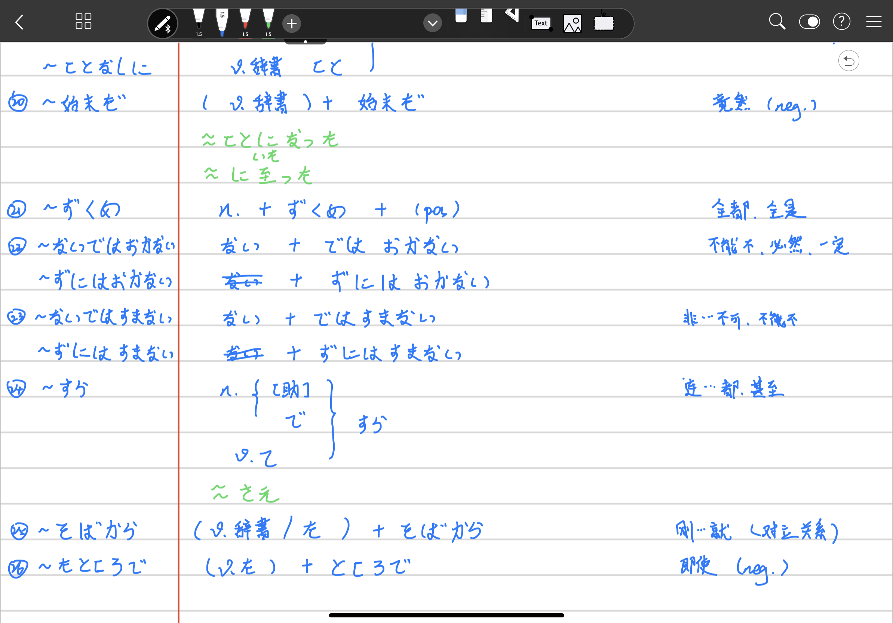

//Description:

//Create Date: 2020-02-28 21:45:40

//Author: channy

# Notes_Japanese_N1

## 1. ~あっての

有...才...

## 2. ~いかん/~いかんによって

取决于

## 3. ~いかんでは/~いかんよっては

取决于具体状况

## 4. ~いかんによらず/~いかんにかかわらず

无论如何都

## 5. ~うが/~うとも

即使也

## 6. ~うが~まいが

不管做不做

## 7. ~うにも~ない

即使想[做]...也不能

## 8. ~かぎりだ

真是太...,感到非常

## 9. ~たが最後/~たら最後

一旦[做]...就

## 10. ~かたがた

顺便，顺道

## 11. ~かたわら

同时，一边...一边

## 12. ~がてら

顺便

## 13. ~が早いか

刚...就

## 14. ~からある/~からする/~からの

起码，至少 

## 15. ~きらいがある

有点...,经常...,有...倾向(neg.)

## 16. ~極まる/~極まりない

非常，极其

## 17. ~ごとく/~ごとき/~ごとし

如同，就像

## 18. ~ことと手

因为(接谢罪、请求)

## 19. ~なしに/~ことなしに

没有...而,不...而

## 20. ~始めだ

竟然(neg.)

## 21. ~ずくめ

全都，全是

## 22. ~ないではおかない/~ずにはおかない

不能不，必然，一定

## 23. ~ないではすまない/~ずにはすまない

非...不可

## 24. ~すら

连...都，甚至

## 25. ~そばから

刚...就(对立关系)

## 26. ~たところで

即使(neg.)

[back](/)

