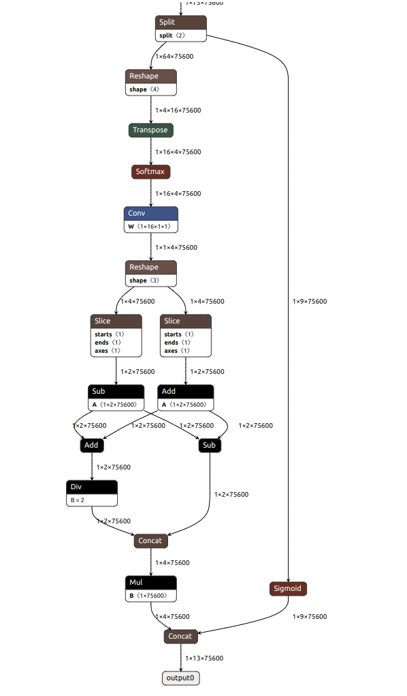

//Description: 记录把Yolov8n预训练的模型push到rk3588的板子上进行目标检测的整个过程，其中遇到原始模型无法jit.load、模型转换后检测错误、板子上安装SDK失败等问题，最终通过改用load、分析error list抛弃部分模型、检查版本一致性解决。写于2024年4月初。

//Create Date: 2024-04-02 10:14:28

//Author: channy

[toc]

# 基本环境信息
板子上需要版本一致 Version (RKNN Server = Runtime = RKNN-Toolkit2)。aarch64。
* RKNN Server: 1.5.0
* RKNN Runtime (librknnrt): 1.5.0
* RKNPU driver: 0.9.2

PC 使用了Ubuntu，必需要x86_64，因为官方的SDK中只有x64的whl安装文件，aarch64的只能安装ToolkitLite

# step1: pt模型转换成onnx模型
原本是想要直接使用SDK中的`rknn.load_pytorch(model = '../model/v8n.pt', input_size_list = [[1, 3, 1920, 1920]])`直接转换成rknn的，但出现了load错误
## Q: torch.jit.load failed

```sh
RuntimeError('PytorchStreamReader failed locating file constants.pkl: file not found')
```

```
D Save log info to: build.log
I rknn-toolkit2 version: 2.0.0b0+9bab5682
W config: The quant_img_RGB2BGR of input 0 is set to True, which means that the RGB2BGR conversion will be done first
          when the quantized image is loaded (only valid for jpg/jpeg/png/bmp, npy will ignore this flag).
          Special note here, if quant_img_RGB2BGR is True and the quantized image is jpg/jpeg/png/bmp,
          the mean_values / std_values in the config corresponds the order of BGR.
W load_pytorch: Catch exception when torch.jit.load:
    RuntimeError('PytorchStreamReader failed locating file constants.pkl: file not found')
W load_pytorch: Make sure that the torch version of '/home/channy/Documents/thirdlibs/rknn_model_zoo/examples/yolov8/model/v8n.pt' is consistent with the installed torch version '2.2.1+cu121'!
E load_pytorch: Traceback (most recent call last):
E load_pytorch:   File "rknn/api/rknn_base.py", line 1590, in rknn.api.rknn_base.RKNNBase.load_pytorch
E load_pytorch:   File "/home/channy/miniconda3/envs/NewVersion/lib/python3.8/site-packages/torch/jit/_serialization.py", line 159, in load
E load_pytorch:     cpp_module = torch._C.import_ir_module(cu, str(f), map_location, _extra_files, _restore_shapes)  # type: ignore[call-arg]
E load_pytorch: RuntimeError: PytorchStreamReader failed locating file constants.pkl: file not found
W If you can't handle this error, please try updating to the latest version of the toolkit2 and runtime from:
  https://console.zbox.filez.com/l/I00fc3 (Pwd: rknn)  Path: RKNPU2_SDK / 2.X.X / develop /
  If the error still exists in the latest version, please collect the corresponding error logs and the model,
  convert script, and input data that can reproduce the problem, and then submit an issue on:
  https://redmine.rock-chips.com (Please consult our sales or FAE for the redmine account)
E build: The model has not been loaded, please load it first!
E export_rknn: RKNN model does not exist, please load & build model first!
E init_runtime: RKNN model does not exist, please load & build model first!
E inference: The runtime has not been initialized, please call init_runtime first!
```
上网搜索发现缺少`constants.pkl`大概率是导出模型的时候设置的只导出权重还是导出整个网络导致的，不方便重新训练导出，故直接改用Yolov8自带的格式转换函数先行转换到`onnx`模型，见附录１。

# step 2: PC上查看onnx模型的检测结果
见附录2。检测图像中有多个目标，能够正常检测到其中两个目标。

# step 3: 在PC上转换成rknn模型并模拟检测
其中`ret = rknn.load_onnx(model = model_path, outputs = export_outputs)`参数outputs默认为`onnx`的最终输出模型。
## Q: ERROR 'REGTASK: The bit width of field value exceeds the limit'
```
E RKNN: [11:55:46.914] REGTASK: The bit width of field value exceeds the limit, target: v2, offset: 0x4038, shift = 16, limit: 0x1fff, value: 0x11f70
E RKNN: [11:55:46.914] REGTASK: The bit width of field value exceeds the limit, target: v2, offset: 0x5048, shift = 19, limit: 0x1fff, value: 0x11f70
```
模型转换报错`REGTASK: The bit width of field value exceeds the limit`，但依然会输出转换后的rknn文件。

上网搜索有说加`simplify=False`参数的，有让增加混合量化的，尝试后均没有解决报错问题，模型转换过程中依旧会报上面的错误。又搜索到说该报错不影响的，暂时
## Q: detect failed
最初`output`参数没有设置，直接使用的默认值。结果发现检测失败，没有任何检测结果。

然后使用`ret = rknn.accuracy_analysis(inputs = ['../model/test.jpg'], target = None)`分析误差。在`snapshot`文件夹下`error_analysis.txt`文件中查看每一层网络PC模拟和原模型的误差差距。

发现官方模型每层的欧拉距离都在6以内，但自己的模型最后两层欧拉距离达到180+。怀疑是最后两层有不支持的算子导致的误差太大从而检测失败。
```
[Mul] /model.22/Mul_2_output_0_shape4                                               1.00000 | 181.08    1.00000 | 83.088        
[Reshape] /model.22/Mul_2_output_0                                                  1.00000 | 181.08    1.00000 | 83.088 
```

使用netron查看原`onnx`文件的网络结构



在`rknn.load_onnx(...)`中设置`outputs`参数舍弃误差太大的层。

再重新转换成rknn后模拟检测发现可以检测到目标了。

## Q: different results in simulator and PC
然后发现对同一张包含多个目标的图像，PC上使用`onnx`模型能够检测到2个目标，PC模拟使用`rknn`也能够检测到2个目标，但不是相同的2个目标，即检测结果不完全一致，前者检测到目标A和B，而后者检测到目标A和C。

# step 4: 在板子上运行目标检测
把生成的rknn放到板子上后，根据SDK文档在板子上安装SDK，即目录`rknn-toolkit-lite2/packages`下的whl文件。确认版本一致 Version (RKNN Server = Runtime = RKNN-Toolkit2)。

安装完成后，在板子上是rknnlite，直接加载模型、初始化，即可以推理。

```python
from rknnlite.api import RKNNLite

rknn_lite = RKNNLite()
ret = rknn_lite.load_rknn('../model/v8n.rknn')
ret = rknn_lite.init_runtime(core_mask=RKNNLite.NPU_CORE_0)

# read image same as in PC

outputs = rknn_lite.inference(inputs=[img])
# do something same as in PC
rknn_lite.release()
```
详细可见附录3。

***
<font color=red>附录</font>
***

# 附录1: pt到onnx的模型转换
```python
from ultralytics import YOLO

def pt2onnx(path = '../model/v8n.pt'):
    model = YOLO(path)
    res = model.export(format="onnx", opset = 19, simplify = True)  # export the model to ONNX format
```
# 附录2: PC上查看onnx模型的检测结果
```python
# Ultralytics YOLO 🚀, AGPL-3.0 license

import argparse

import cv2
import numpy as np
import onnxruntime as ort
import torch

from ultralytics.utils import ASSETS, yaml_load
from ultralytics.utils.checks import check_requirements, check_yaml


class YOLOv8:
    """YOLOv8 object detection model class for handling inference and visualization."""

    def __init__(self, onnx_model, input_image, confidence_thres, iou_thres):
        """
        Initializes an instance of the YOLOv8 class.

        Args:
            onnx_model: Path to the ONNX model.
            input_image: Path to the input image.
            confidence_thres: Confidence threshold for filtering detections.
            iou_thres: IoU (Intersection over Union) threshold for non-maximum suppression.
        """
        self.onnx_model = onnx_model
        self.input_image = input_image
        self.confidence_thres = confidence_thres
        self.iou_thres = iou_thres

        # Load the class names from the COCO dataset
        self.classes = yaml_load(check_yaml("coco128.yaml"))["names"]

        # Generate a color palette for the classes
        self.color_palette = np.random.uniform(0, 255, size=(len(self.classes), 3))

    def draw_detections(self, img, box, score, class_id):
        """
        Draws bounding boxes and labels on the input image based on the detected objects.

        Args:
            img: The input image to draw detections on.
            box: Detected bounding box.
            score: Corresponding detection score.
            class_id: Class ID for the detected object.

        Returns:
            None
        """

        # Extract the coordinates of the bounding box
        x1, y1, w, h = box

        # Retrieve the color for the class ID
        color = self.color_palette[class_id]

        # Draw the bounding box on the image
        cv2.rectangle(img, (int(x1), int(y1)), (int(x1 + w), int(y1 + h)), color, 2)

        # Create the label text with class name and score
        label = f"{self.classes[class_id]}: {score:.2f}"

        # Calculate the dimensions of the label text
        (label_width, label_height), _ = cv2.getTextSize(label, cv2.FONT_HERSHEY_SIMPLEX, 0.5, 1)

        # Calculate the position of the label text
        label_x = x1
        label_y = y1 - 10 if y1 - 10 > label_height else y1 + 10

        # Draw a filled rectangle as the background for the label text
        cv2.rectangle(
            img, (label_x, label_y - label_height), (label_x + label_width, label_y + label_height), color, cv2.FILLED
        )

        # Draw the label text on the image
        cv2.putText(img, label, (label_x, label_y), cv2.FONT_HERSHEY_SIMPLEX, 0.5, (0, 0, 0), 1, cv2.LINE_AA)

    def preprocess(self):
        """
        Preprocesses the input image before performing inference.

        Returns:
            image_data: Preprocessed image data ready for inference.
        """
        # Read the input image using OpenCV
        self.img = cv2.imread(self.input_image)

        # Get the height and width of the input image
        self.img_height, self.img_width = self.img.shape[:2]

        # Convert the image color space from BGR to RGB
        img = cv2.cvtColor(self.img, cv2.COLOR_BGR2RGB)

        # Resize the image to match the input shape
        img = cv2.resize(img, (self.input_width, self.input_height))

        # Normalize the image data by dividing it by 255.0
        image_data = np.array(img) / 255.0

        # Transpose the image to have the channel dimension as the first dimension
        image_data = np.transpose(image_data, (2, 0, 1))  # Channel first

        # Expand the dimensions of the image data to match the expected input shape
        image_data = np.expand_dims(image_data, axis=0).astype(np.float32)

        # Return the preprocessed image data
        return image_data

    def postprocess(self, input_image, output):
        """
        Performs post-processing on the model's output to extract bounding boxes, scores, and class IDs.

        Args:
            input_image (numpy.ndarray): The input image.
            output (numpy.ndarray): The output of the model.

        Returns:
            numpy.ndarray: The input image with detections drawn on it.
        """
        
        # Transpose and squeeze the output to match the expected shape
        outputs = np.transpose(np.squeeze(output[0]))
        
        # Get the number of rows in the outputs array
        rows = outputs.shape[0]

        # Lists to store the bounding boxes, scores, and class IDs of the detections
        boxes = []
        scores = []
        class_ids = []

        # Calculate the scaling factors for the bounding box coordinates
        x_factor = self.img_width / self.input_width
        y_factor = self.img_height / self.input_height

        # Iterate over each row in the outputs array
        for i in range(rows):
            # Extract the class scores from the current row
            classes_scores = outputs[i][4:]

            # Find the maximum score among the class scores
            max_score = np.amax(classes_scores)

            # If the maximum score is above the confidence threshold
            if max_score >= self.confidence_thres:
                # Get the class ID with the highest score
                class_id = np.argmax(classes_scores)

                # Extract the bounding box coordinates from the current row
                x, y, w, h = outputs[i][0], outputs[i][1], outputs[i][2], outputs[i][3]

                # Calculate the scaled coordinates of the bounding box
                left = int((x - w / 2) * x_factor)
                top = int((y - h / 2) * y_factor)
                width = int(w * x_factor)
                height = int(h * y_factor)

                # Add the class ID, score, and box coordinates to the respective lists
                class_ids.append(class_id)
                scores.append(max_score)
                boxes.append([left, top, width, height])

        # Apply non-maximum suppression to filter out overlapping bounding boxes
        indices = cv2.dnn.NMSBoxes(boxes, scores, self.confidence_thres, self.iou_thres)

        # Iterate over the selected indices after non-maximum suppression
        for i in indices:
            # Get the box, score, and class ID corresponding to the index
            box = boxes[i]
            score = scores[i]
            class_id = class_ids[i]

            # Draw the detection on the input image
            self.draw_detections(input_image, box, score, class_id)

        # Return the modified input image
        return input_image

    def main(self):
        """
        Performs inference using an ONNX model and returns the output image with drawn detections.

        Returns:
            output_img: The output image with drawn detections.
        """
        # Create an inference session using the ONNX model and specify execution providers
        session = ort.InferenceSession(self.onnx_model, providers=["CUDAExecutionProvider", "CPUExecutionProvider"])

        # Get the model inputs
        model_inputs = session.get_inputs()

        # Store the shape of the input for later use
        input_shape = model_inputs[0].shape
        self.input_width = input_shape[2]
        self.input_height = input_shape[3]

        # Preprocess the image data
        img_data = self.preprocess()

        # Run inference using the preprocessed image data
        outputs = session.run(None, {model_inputs[0].name: img_data})

        # Perform post-processing on the outputs to obtain output image.
        return self.postprocess(self.img, outputs)  # output image


if __name__ == "__main__":
    # Create an argument parser to handle command-line arguments
    parser = argparse.ArgumentParser()
    parser.add_argument("--model", type=str, default="yolov8n.onnx", help="Input your ONNX model.")
    parser.add_argument("--img", type=str, default=str(ASSETS / "bus.jpg"), help="Path to input image.")
    parser.add_argument("--conf-thres", type=float, default=0.5, help="Confidence threshold")
    parser.add_argument("--iou-thres", type=float, default=0.5, help="NMS IoU threshold")
    args = parser.parse_args()

    # Check the requirements and select the appropriate backend (CPU or GPU)
    check_requirements("onnxruntime-gpu" if torch.cuda.is_available() else "onnxruntime")

    # Create an instance of the YOLOv8 class with the specified arguments
    detection = YOLOv8(args.model, args.img, args.conf_thres, args.iou_thres)

    # Perform object detection and obtain the output image
    output_image = detection.main()

    # Display the output image in a window
    cv2.namedWindow("Output", cv2.WINDOW_NORMAL)
    cv2.imshow("Output", output_image)
    cv2.imwrite("test_onnx_res.jpg", output_image)
    # Wait for a key press to exit
    cv2.waitKey(10000)
    cv2.destroyAllWindows()
```

# 附录3: PC上模拟运行目标检测
```python
import os
import cv2
import sys
import argparse

from rknn.api import RKNN

import numpy as np

OBJ_THRESH = 0.25
NMS_THRESH = 0.45

IMG_SIZE = (1920, 1920)  # (width, height), such as (1280, 736)

CLASSES = ("person", "bicycle", "car","motorbike ","aeroplane ","bus ","train","truck ","boat","traffic light",
           "fire hydrant","stop sign ","parking meter","bench","bird","cat","dog ","horse ","sheep","cow","elephant",
           "bear","zebra ","giraffe","backpack","umbrella","handbag","tie","suitcase","frisbee","skis","snowboard","sports ball","kite",
           "baseball bat","baseball glove","skateboard","surfboard","tennis racket","bottle","wine glass","cup","fork","knife ",
           "spoon","bowl","banana","apple","sandwich","orange","broccoli","carrot","hot dog","pizza ","donut","cake","chair","sofa",
           "pottedplant","bed","diningtable","toilet ","tvmonitor","laptop	","mouse	","remote ","keyboard ","cell phone","microwave ",
           "oven ","toaster","sink","refrigerator ","book","clock","vase","scissors ","teddy bear ","hair drier", "toothbrush ")


def xywh2xyxy(*box):
    ret = [box[0] - box[2] // 2, box[1] - box[3] // 2, box[0] + box[2] // 2, box[1] + box[3] // 2]
    return ret

def get_inter(box1, box2):
    x1, y1, x2, y2 = xywh2xyxy(*box1)
    x3, y3, x4, y4 = xywh2xyxy(*box2)
    if x1 >= x4 or x2 <= x3:
        return 0
    if y1 >= y4 or y2 <= y3:
        return 0
    x_list = sorted([x1, x2, x3, x4])
    x_inter = x_list[2] - x_list[1]
    y_list = sorted([y1, y2, y3, y4])
    y_inter = y_list[2] - y_list[1]
    inter = x_inter * y_inter
    return inter

def get_iou(box1, box2):
    box1_area = box1[2] * box1[3]
    box2_area = box2[2] * box2[3]
    inter_area = get_inter(box1, box2)
    union = box1_area + box2_area - inter_area
    iou = inter_area / union
    return iou

def nms(pred, conf_thres, iou_thres):
    box = pred[pred[..., 4] > conf_thres]
    cls_conf = box[..., 5:]
    cls = []
    for i in range(len(cls_conf)):
        cls.append(int(np.argmax(cls_conf[i])))
    total_cls = list(set(cls))
    output_box = []
    output_class = []
    output_conf = []
    for i in range(len(total_cls)):
        clss = total_cls[i]
        cls_box = []
        temp = box[:, :6]
        for j in range(len(cls)):
            if cls[j] == clss:
                temp[j][5] = clss
                cls_box.append(temp[j][:6])
        cls_box = np.array(cls_box)
        sort_cls_box = sorted(cls_box, key = lambda x : -x[4])

        max_conf_box = sort_cls_box[0]
        output_box.append(max_conf_box)
        output_class.append(int(max_conf_box[4]))
        output_conf.append(max_conf_box[5])
        sort_cls_box = np.delete(sort_cls_box, 0, 0)

        while len(sort_cls_box) > 0:
            max_conf_box = output_box[-1]
            del_index = []
            for j in range(len(sort_cls_box)):
                current_box = sort_cls_box[j]
                iou = get_iou(max_conf_box, current_box)
                if iou > iou_thres:
                    del_index.append(j)
            sort_cls_box = np.delete(sort_cls_box, del_index, 0)
            if len(sort_cls_box) > 0:
                output_box.append(sort_cls_box[0])
                output_class.append(int(sort_cls_box[0][4]))
                output_conf.append(sort_cls_box[0][5])
                sort_cls_box = np.delete(sort_cls_box, 0, 0)
    return output_box, output_class, output_conf

def cod_trf(result, pre, after):
    res = np.array(result)
    x, y, w, h, conf, cls = res.transpose((1, 0))
    x1, y1, x2, y2 = xywh2xyxy(x, y, w, h)
    h_pre, w_pre, _ = pre.shape
    h_after, w_after, _ = after.shape
    scale = max(w_pre / w_after, h_pre / h_after)
    h_pre, w_pre = h_pre / scale, w_pre / scale
    x_move, y_move = abs(w_pre - w_after) // 2, abs(h_pre - h_after) // 2
    ret_x1, ret_x2 = (x1 - x_move) * scale, (x2 - x_move) * scale
    ret_y1, ret_y2 = (y1 - y_move) * scale, (y2 - y_move) * scale
    ret = np.array([ret_x1, ret_y1, ret_x2, ret_y2, conf, cls]).transpose((1, 0))
    return ret

def post_process(output):
    # (1, 13, 75600) -> box4[xywh], conf1, cls1, xxx
    pred = np.squeeze(output)
    pred = np.transpose(pred, (1, 0))
    pred_class = pred[..., 4:]
    pred_conf = np.max(pred_class, axis = -1)
    pred = np.insert(pred, 4, pred_conf, axis = -1)

    box, classes, confs = nms(pred, 0.5, 0.5)
    return box, classes, confs

def draw(image, boxes, scores, classes):
    for box, score, cl in zip(boxes, scores, classes):
        top, left, right, bottom = [int(_b) for _b in box]
        print("%s @ (%d %d %d %d) %.3f" % (CLASSES[cl], top, left, right, bottom, score))
        cv2.rectangle(image, (top, left), (right, bottom), (255, 0, 0), 2)
        cv2.putText(image, '{0} {1:.2f}'.format(CLASSES[cl], score),
                    (top, left - 6), cv2.FONT_HERSHEY_SIMPLEX, 0.6, (0, 0, 255), 2)

def convert(model_path = '../model/v8n.onnx'):
    rknn = RKNN(verbose = False, verbose_file = 'build.log')
    rknn.config(mean_values=[128, 128, 128], std_values=[128, 128, 128], quant_img_RGB2BGR = True, quantized_method = 'channel', target_platform = 'rk3588')
    export_outputs = ['/model.22/Mul_2_output_0', '/model.22/Split_output_1']
    ret = rknn.load_onnx(model = model_path, outputs = export_outputs)
    #ret = rknn.load_pytorch(model = '../model/v8n.pt', input_size_list = [[1, 3, 1920, 1920]])
    ret = rknn.build(do_quantization = False)
    ret = rknn.export_rknn(export_path = 'v8n.rknn', simplify = False)
    return rknn

if __name__ == '__main__':
    rknn = convert()
    
    imglist = ['../model/test.jpg']
    if False:
        path = '/home/channy/Documents/thirdlibs/rknn_model_zoo/datasets/COCO/subset'
        for root, ds, fs in os.walk(path):
            for f in fs:
                imglist.append(root + '/' + f)
        ret = rknn.accuracy_analysis(inputs = ['../model/test.jpg'], target = None)
    
    origin_img = cv2.imread('../model/test.jpg')
    origin_img_rz = cv2.resize(origin_img, IMG_SIZE)
    img_height, img_width = origin_img.shape[:2]
    img = cv2.cvtColor(origin_img, cv2.COLOR_BGR2RGB)
    img = cv2.resize(img, IMG_SIZE)
    image_data = np.array(img) / 255.0
    image_data = np.transpose(image_data, (0, 1, 2))
    image_data = np.expand_dims(image_data, axis = 0).astype(np.float16)
    
    ret = rknn.load_rknn(path = 'v8n.rknn')
    ret = rknn.init_runtime(target = None, eval_mem = False, perf_debug = False)
    print(rknn.get_sdk_version())
    outputs = rknn.inference(inputs = [img])#, data_format = 'nchw')  
    output = np.concatenate((outputs[0], outputs[1]), axis = 1)
    boxes, classes, scores = post_process(output)
    xyxyboxes = []
    for b in boxes:
        xyxyboxes.append(xywh2xyxy(b[0], b[1], b[2], b[3]))
    draw(origin_img_rz, xyxyboxes, scores, classes)
    cv2.imshow('res', cv2.resize(origin_img_rz, (750, 750)))
    cv2.imwrite('test_res.jpg', cv2.resize(origin_img_rz, (750, 750)))
    cv2.waitKey(10000)
    cv2.destroyAllWindows()
    # only support in device, not in simulator
    #ret = rknn.eval_perf()
    #ret = rknn.eval_memory()
    rknn.release()
```
