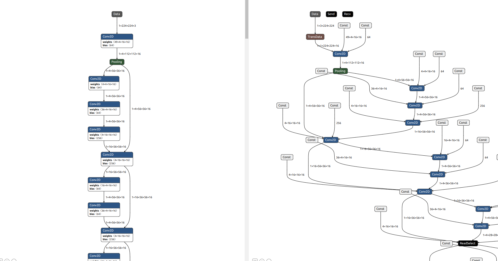

//Description: 记录在银河Kylin系统+华为昇腾一体机进行模型推理部署过程中的笔记，写于2025年3月

//Create Date: 2025-03-18 14:20:28

//Author: channy

[toc]

# 在银河Kylin+华为昇腾一体机进行模型推理部署
## 背景
Edge-FHDS2300-Z1算力机。

计划在原ubuntu 20.04 (x86_64) 服务器上继续训练，只在算力机 (Kylin V10 aarch64) 上做推理部署，不在算力机上训练（机器风扇太太太吵了@_@）。

## 开发环境准备
### ubuntu服务器即训练机上
1. 安装CANN软件，（Ascend-cann-toolkit_8.0.0_linux-x86_64.run）  
Ubuntu上安装[Ascend](https://www.hiascend.com/document/detail/zh/Atlas200IDKA2DeveloperKit/23.0.RC2/Application%20Development%20Guide/tmuacop/tmuacop_0016.html)

[资源下载](https://www.hiascend.com/developer/download/community/result?module=cluster+pt+tf+cann&cannChild=rt)

2. 配置环境变量
```sh
source /home/channy/Ascend/ascend-toolkit/set_env.sh 

export LD_LIBRARY_PATH=/home/channy/Ascend/ascend-toolkit/latest/x86_64-linux/devlib/:$LD_LIBRARY_PATH
```
或者把
```sh
source /home/channy/Ascend/ascend-toolkit/set_env.sh
```
加入到`~/.bashrc`中

只source没有`export LD_LIBRARY_PATH`atc转换会报错
```sh
/home/channy/Ascend/ascend-toolkit/8.0.0/x86_64-linux/bin/atc.bin: error while loading shared libraries: libascend_hal.so: cannot open shared object file: No such file or directory
```

3. 验证模型转换工具已正确安装　
```sh
$ atc
ATC start working now, please wait for a moment.
...
ATC run failed, Please check the detail log, Try 'atc --help' for more information
E10007: [PID: 10490] 2025-03-18-09:02:18.501.341 [--framework] is required. The value must be [0(Caffe) or 1(MindSpore) or 3(TensorFlow) or 5(Onnx)].
```

4. 
```sh
ATC run failed, Please check the detail log, Try 'atc --help' for more information
EC0010: [PID: 129520] 2025-07-08-10:25:28.680.962 Failed to import Python module [ModuleNotFoundError: No module named 'decorator'.].
        Solution: Check that all required components are properly installed and the specified Python path matches the Python installation directory. (If the path does not match the directory, run set_env.sh in the installation package.)
        TraceBack (most recent call last):
        AOE Failed to call InitCannKB[FUNC:Initialize][FILE:python_adapter_manager.cc][LINE:47]
        Failed to initialize TeConfigInfo.
        [GraphOpt][InitializeInner][InitTbeFunc] Failed to init tbe.[FUNC:InitializeTeFusion][FILE:tbe_op_store_adapter.cc][LINE:1816]
        [GraphOpt][InitializeInner][InitTeFusion]: Failed to initialize TeFusion.[FUNC:InitializeInner][FILE:tbe_op_store_adapter.cc][LINE:1783]
        [SubGraphOpt][PreCompileOp][InitAdapter] InitializeAdapter adapter [tbe_op_adapter] failed! Ret [4294967295][FUNC:InitializeAdapter][FILE:op_store_adapter_manager.cc][LINE:79]
        [SubGraphOpt][PreCompileOp][Init] Initialize op store adapter failed, OpsStoreName[tbe-custom].[FUNC:Initialize][FILE:op_store_adapter_manager.cc][LINE:120]
        [FusionMngr][Init] Op store adapter manager init failed.[FUNC:Initialize][FILE:fusion_manager.cc][LINE:115]
        PluginManager InvokeAll failed.[FUNC:Initialize][FILE:ops_kernel_manager.cc][LINE:82]
        OpsManager initialize failed.[FUNC:InnerInitialize][FILE:gelib.cc][LINE:249]
        GELib::InnerInitialize failed.[FUNC:Initialize][FILE:gelib.cc][LINE:177]
```

### 华为盒子即算力机上
1. 安装CANN软件，（Ascend-cann-toolkit_8.0.0_linux-aarch64.run)
其中如果需要用于torch_npu的话，不建议安装最新版torch（写该文章时是2.4.0）和torchvision（0.19.1），因为torch_npu会因版本不匹配而报错。

官网的第三方库支持版本列表：[完整清单列表](https://www.hiascend.com/document/detail/zh/Pytorch/60RC2/modthirdparty/modparts/thirdpart_0005.html)

[torch_npu](https://www.hiascend.com/document/detail/zh/Pytorch/60RC2/configandinstg/instg/insg_0001.html)
这时还只支持torch 2.3.1以下的。

| torch | torchvision | torch_npu |
|:---:|:---:|:---:|
| 2.1.0 | 0.16.0  | 5.0.rc2 |

2. 安装完toolkit后可继续安装kernels和nnrt，最好toolkit、kernels和nnrt的版本号保持一致，如都是8.0.0版本，否则如toolkit=8.0.0、kernels=8.1.RC3、nnrt=8.1.RC1等有概率模型推理时会报错。

同时建议训练机和算力机的toolkit版本也保持一致，否则同样有概率模型推理时会报错，模型转换过程中没有报错。

## 跑样例模型验证环境正常
选择[samples](https://gitee.com/ascend/samples.git)中的样例`resnet50_imagenet_classification`，可以根据Readme.md的指示直接下载.caffemodel、.prototxt和.om模型。
1. 直接跑python脚本能够跑成功

2. 跑pyACL加载模型  
最开始看到拿到的机器里下载好了一个`Ascend-cann-toolkit-8.0.RC1.alpha001_linux-aarch64.run`，没有怀疑直接安装，然后使用`pyACL`加载模型一直加载失败返回错误码500002内部错误，见附录1。没有头绪尝试着重新下载安装RC3高一点版本的`Ascend-cann-toolkit-8.0.RC3_linux-aarch64.run`然后加载就好了。。。好了。。。了。。。

[pyACL](https://www.hiascend.com/document/detail/zh/canncommercial/700/inferapplicationdev/aclpythondevg/nottoctopics/aclpythondevg_01_0002.html)

[错误码列表](https://www.hiascend.com/document/detail/zh/canncommercial/700/inferapplicationdev/aclpythondevg/nottoctopics/aclpythondevg_01_0901.html)

3. 查看AI处理器版本号
```sh
$ npu-smi info
+--------------------------------------------------------------------------------------------------------+
| npu-smi 23.0.0                                   Version: 23.0.0                                       |
+-------------------------------+-----------------+------------------------------------------------------+
| NPU     Name                  | Health          | Power(W)     Temp(C)           Hugepages-Usage(page) |
| Chip    Device                | Bus-Id          | AICore(%)    Memory-Usage(MB)                        |
+===============================+=================+======================================================+
| 24      310P3                 | OK              | NA           29                0     / 0             |
| 0       0                     | 0000:04:00.0    | 0            1832 / 21527                            |
+===============================+=================+======================================================+
+-------------------------------+-----------------+------------------------------------------------------+
| NPU     Chip                  | Process id      | Process name             | Process memory(MB)        |
+===============================+=================+======================================================+
| No running processes found in NPU 24                                                                   |
+===============================+=================+======================================================+
```
其中`Name`下方的`310P3`前加上`Ascend`即为版本号`Ascend310P3`

4. 使用ATC工具对.caffemodel和.prototxt进行转换成.om模型
```sh
atc --model=caffe_model/resnet50.prototxt --weight=caffe_model/resnet50.caffemodel --framework=0 --output=model/resnet50 --soc_version=Ascendxxx --input_format=NCHW --input_fp16_nodes=data --output_type=FP32 --out_nodes=prob:0
```
发现同样的sample脚本代码，直接下载的.om模型能够跑成功，但自己转换的.om模型跑失败。开始以为是转换操作出问题，甚至还用netron对比了直接下载的模型和自己转换的模型，确实不一样。但实际上并不要紧，只是CANN的toolkit等软件的版本不一致导致的。全部统一成8.0.0后就可以正常跑了。

resnet50.om直接下载的模型（左）和自己转换的模型（右）对比图：


统一版本后自己转换的模型依旧比较“杂乱”，但其实是可以正常推理使用的。

## .onnx模型转换成.om模型
1. 转换模型  
其中.pt模型到.onnx模型可直接使用`torch.onnx.export`转换。
```py
    torch.onnx.export(model, 
                    # torch.randn(1, 256, 95, 127).cpu(),
                    torch.randn(1, 3, 3040, 4064).cuda(),
                    output_name,
                    export_params=True,
                    input_names=['input'],
                    output_names=['output'],
                    opset_version = 15
                    )
```
.onnx模型到.om模型使用ATC工具转换（安装完toolkit后即有）
```sh
atc --model=encodeModel.onnx --framework=5 --output=encodeModel --soc_version=Ascend310B4
atc --model=encodeModel.onnx --framework=5 --output=encodeModel --soc_version=Ascend310P3
```

`--framework`原始框架类型，各框架对应的数值如下：
0:Caffe; 1:MindSpore; 3:Tensorflow; 5:ONNX

3. 如果输入维度过大时考虑采用单精度FP16  
一般直接用`torch.onnx.export`导出的.onnx输入输出都是双精度float32，可通过netron工具查看。当输入维度过大时，可能会出现在copy输入数据到Device时报错错误码207001，在转换时增加参数`--input_fp16_nodes`转成单精度可以解决。

### 申请内存失败错误码207001
模型输入是1x3x4064x3040的尺寸，写入数据一直报内存不够，刚开机16G内存也不够
```sh
ret = acl.rt.memcpy(input_data[0]["buffer"], input_data[0]["size"], np_ptr, input_data[0]["size"], ACL_MEMCPY_HOST_TO_DEVICE)
```

重新按样例中的转换增加参数后内存失败错误消失
```sh
atc --model=encodeModel.onnx --framework=5 --output=encodeModel --soc_version=Ascend310P3 --input_format=NCHW --input_fp16_nodes="input" --output_type=FP32 --out_nodes="output"
```

也有可能是上一次内存没有正常释放，过一段时间或重启后能正常调用。

## 修改适配机载推理代码 
把cuda改成npu，如`torch.cuda.is_available`改成`torch.npu.is_available`，`xxx.cuda()`改成`xxx.npu()`等。。。是不够的。。。

直接用`torch.load`加载.om模型，报错
```sh
    encodeModel = torch.load(sEncodeModel).float()
  File "/home/edge/.local/lib/python3.8/site-packages/torch/serialization.py", line 1028, in load
    return _legacy_load(opened_file, map_location, pickle_module, **pickle_load_args)
  File "/home/edge/.local/lib/python3.8/site-packages/torch/serialization.py", line 1246, in _legacy_load
    magic_number = pickle_module.load(f, **pickle_load_args)
ValueError: could not convert string to int
```

## 推理代码
推理代码直接参考[samples](https://gitee.com/ascend/samples.git)中的样例即可。Python可以参考`resnet50_imagenet_classification/src/acl_net.py`。

1. 输入数据精度和模型转换精度相对应
如果模型转换时设置了`--input_fp16_nodes`，则输入图像数据也需要转换成float16
2. 输入维度和模型转换维度相对应
.onnx转换成.om的维度只有NCHW而没有NHWC可选，而一般OpenCV和PIL直接读取的图像默认都是NHWC的，需要转换成NCHW再输入到模型推理中

### 推理失败错误码507011
推理一直报错，见附录2
```sh
ret = acl.mdl.execute(model_id, load_input_dataset, load_output_dataset)
```
如果CANN各软件版本不一致时，在ubuntu训练机上转换模型并不会报任何错误，可以转换成功。但在算力机上运行时会报推理错误，错误码507011。统一版本即可解决，包括训练机上的x86_64的toolkit、算力机上的aarch64的toolkit、算力机上的kernel、算力机上的nnrt共四样，最好版本都保持一致。

### acllite_logger和torch不能同时import，报_getframe错误 
```sh
acllite_logger.py", line 62, in log_info
AttributeError: 'NoneType' object has no attribute '_getframe'
```

```py
import cv2
import numpy as np
import os
import sys
import threading
import time
import torch # 注释掉或移到另一个文件作postprocess处理再在此处 from xxx.py import * 均可，直接import会在AclLiteResource析构时报错在sys._getframe()语句中

sys.path.append(os.path.abspath(os.path.join(os.path.dirname(__file__), '..')))
sys.path.append(os.path.abspath(os.path.join(os.path.dirname(__file__), '../acl_net')))
from acllite_model import AclLiteModel
from acllite_resource import AclLiteResource

if __name__ == '__main__':
    acl_resource = AclLiteResource()
    acl_resource.init()
```

# 优化
## 动态shape
```sh
atc --model=encodeModel.onnx --framework=5 --output=encodeModel --soc_version=Ascend310P3 --input_format=ND --input_fp16_nodes="input" --output_type=FP32 --out_nodes="output" --input_shape="input:1,3,-1,-1" --dynamic_dims="3040,4064;1088,1952"

atc --model=decodeModel.onnx --framework=5 --output=decodeModel --soc_version=Ascend310P3 --input_format=ND --input_fp16_nodes="input" --output_type=FP32 --out_nodes="output" --input_shape="input:1,256,-1,-1" --dynamic_dims="95,127;34,61"
```

## aipp
aipp没有缩放，`The max padding size is 32`
|操作|aipp||
|:---:|:---:|:---:|  
| 缩放 | 无 | 无 |
| RGB->BGR | 通道转换 | rbuv_swap_switch: true |
| /255.0 np.astype("float16) | 归一化 | var_reci_chn_0: 0.00392156862745098 |
| cv::copyMakeBorder | padding | padding: true |

可见附录3 aipp配置

## dvpp
### 图像缩放
dvpp并不一定支持所有jpg图像，见[图片格式不支持](https://www.hiascend.com/forum/thread-0259120740514768036-1-1.html)

从`sample`中取出`AclLiteImage`、`AclLiteResource`和`AclLiteImageProc`，对图像做缩放，发现并不是所有缩放保存成jpg的图像都正常。如opencv的`/samples/data`下的`ela_original.jpg`和`orange.jpg`，暂未知两图像的区别。
> 解码JPEG图片，只支持JPEG图片为huffman编码(colorspace: yuv, subsample: 444/440/422/420/400 )，不支持算术编码，不支持渐进编码，不支持jpeg2000格式。
```py
import os
import sys
sys.path.append(os.path.abspath(os.path.join(os.path.dirname(__file__), '..')))

from acl_net.acllite_image import AclLiteImage
from acl_net.acllite_resource import AclLiteResource
from acl_net.acllite_imageproc import AclLiteImageProc

import inspect
import cv2

class DvppCls(object):
    def __init__(self):
        self.dvpp = None

    def init_resource(self):
        self.acl_resource = AclLiteResource()
        self.acl_resource.init()
        self.dvpp = AclLiteImageProc(self.acl_resource)

    def dvpp_resize(self, image_path, save_path = 'dvpp.jpg'):
        image_acl = AclLiteImage(image_path)
        image_dvpp = image_acl.copy_to_dvpp()
        yuv_image = self.dvpp.jpegd(image_dvpp) 
        image_resize = self.dvpp.resize(yuv_image, 640, 640)
        print('line', inspect.stack()[0].lineno)

        jpeg_image = self.dvpp.jpege(image_resize)
        jpeg_image.save(save_path)

    def dvpp_resize2(self, image_path, save_path = 'dvpp.jpg'):
        image = cv2.imread(image_path)
        ret, image_bytes = cv2.imencode('.jpg', image)

        image_acl = AclLiteImage(image_bytes, image.shape[1], image.shape[0], size = image.size)
        image_dvpp = image_acl.copy_to_dvpp()
        yuv_image = self.dvpp.jpegd(image_dvpp) 
        image_resize = self.dvpp.resize(yuv_image, 640, 640)
        print('line', inspect.stack()[0].lineno)

        jpeg_image = self.dvpp.jpege(image_resize)
        jpeg_image.save(save_path)


    def release_source(self):
        self.dvpp.__del__()
        self.acl_resource.__del__()
        AclLiteResource.__del__ = lambda x:0
        AclLiteImage.__del__ = lambda x:0
        AclLiteImageProc.__del__ = lambda x:0

if __name__ == '__main__':
    cls = DvppCls()

    cls.init_resource()

    cls.dvpp_resize('/home/edge/HGInference/opencv/samples/data/ela_original.jpg', '1.jpg')
    cls.dvpp_resize('/home/edge/HGInference/opencv/samples/data/orange.jpg', '2.jpg')

    cls.dvpp_resize2('/home/edge/HGInference/opencv/samples/data/orange.jpg', '3.jpg')

    cls.release_source()
```
### yuv查看
```py
def  image2yuv():
    input_image = cv2.imread('./tmp.jpg')
    input_image = cv2.resize(input_image, (640, 640))
    yuv_cv = cv2.cvtColor(input_image, cv2.COLOR_RGB2YUV_I420)
    h, w = input_image.shape[:2]
    y = yuv_cv[:h, :w]
    uv = yuv_cv[h:, :]
    uv_interleaved = uv.reshape(-1, w)
    image_cv = np.vstack((y, uv_interleaved))
    image_cv.tofile('output.yuv')
    return image_cv
```
使用ffmpeg转换成mp4后查看
```sh
ffmpeg -pixel_format yuv420p -s 640x640 -framerate 30 -i output.yuv -c:v libx264 output.mp4
```

# 其它模型 
使用Yolov8n-seg的语义分割模型，发现不同的export导出onnx参数影响.om模型转换的成功率。

.onnx模型导出代码
```py
# 直接导出，后面模型转换失败，报算子未注册 No parser is registered for Op 
model.export(format = 'onnx', amp = False)
# 隆低op_version，后面模型转换成功
model.export(format = 'onnx', amp = False, dynamic=False, opset=9)
```

模型转换命令：
```sh
atc --model=yolov8n-seg.onnx     --framework=5     --output=yolov8n-seg     --input_format=NCHW     --input_fp16_nodes="images" --input_shape="images:1,3,640,640"     --log=error     --soc_version=Ascend310P3
```

貌似只能指定[1,100]个输入维度，未找到像pt或onnx那种可以任意维度输入的设置。。。

## 其它记录
### 模型转换atc报错
1. 
```sh
ATC run failed, Please check the detail log, Try 'atc --help' for more information
EC0010: [PID: 5948] 2025-04-21-15:00:19.776.801 Failed to import Python module [ModuleNotFoundError: No module named 'tbe'.].

ATC run failed, Please check the detail log, Try 'atc --help' for more information
EC0010: [PID: 6039] 2025-04-21-15:01:07.931.973 Failed to import Python module [ModuleNotFoundError: No module named 'tbe.common'.].

ATC run failed, Please check the detail log, Try 'atc --help' for more information
EC0010: [PID: 7651] 2025-04-21-15:18:29.050.937 Failed to import Python module [AttributeError: `np.float_` was removed in the NumPy 2.0 release. Use `np.float64` instead..].
```
使用miniconda,自己pip安装的tbe依旧报错，需要把`Ascend/ascend-toolkit/8.0.0/python/site-packages`中的tbe复制到对应环境目录下`miniconda3/envs/segment/lib/python3.10/site-package`。numpy版本不能太高，否则会报np.float相关错误

2. 
```sh
ATC run failed, Please check the detail log, Try 'atc --help' for more information
EC0010: [PID: 129520] 2025-07-08-10:25:28.680.962 Failed to import Python module [ModuleNotFoundError: No module named 'decorator'.].
        Solution: Check that all required components are properly installed and the specified Python path matches the Python installation directory. (If the path does not match the directory, run set_env.sh in the installation package.)
        TraceBack (most recent call last):
        AOE Failed to call InitCannKB[FUNC:Initialize][FILE:python_adapter_manager.cc][LINE:47]
        Failed to initialize TeConfigInfo.
        [GraphOpt][InitializeInner][InitTbeFunc] Failed to init tbe.[FUNC:InitializeTeFusion][FILE:tbe_op_store_adapter.cc][LINE:1816]
        [GraphOpt][InitializeInner][InitTeFusion]: Failed to initialize TeFusion.[FUNC:InitializeInner][FILE:tbe_op_store_adapter.cc][LINE:1783]
        [SubGraphOpt][PreCompileOp][InitAdapter] InitializeAdapter adapter [tbe_op_adapter] failed! Ret [4294967295][FUNC:InitializeAdapter][FILE:op_store_adapter_manager.cc][LINE:79]
        [SubGraphOpt][PreCompileOp][Init] Initialize op store adapter failed, OpsStoreName[tbe-custom].[FUNC:Initialize][FILE:op_store_adapter_manager.cc][LINE:120]
        [FusionMngr][Init] Op store adapter manager init failed.[FUNC:Initialize][FILE:fusion_manager.cc][LINE:115]
        PluginManager InvokeAll failed.[FUNC:Initialize][FILE:ops_kernel_manager.cc][LINE:82]
        OpsManager initialize failed.[FUNC:InnerInitialize][FILE:gelib.cc][LINE:249]
        GELib::InnerInitialize failed.[FUNC:Initialize][FILE:gelib.cc][LINE:177]
```
需要安装依赖库`pip3 install decorator sympy scipy psutil`

### run_model是ACL_HOST
`acl.rt.get_run_mode()`返回的是1即ACL_HOST，不管是样例还是自己的模型都是。
### 带无线网卡开机卡在开机画面
插着无线网卡开机会卡在“银河Kylin”那个蓝色标志的开机画面，只有先拔掉无线网卡再开机等开机进桌面后再插上无线网卡才能正常。不知道是无线网卡的原因还是什么原因。

## OpenVino
OpenVino更多支持Intel的CPU/GPU
[推理设备支持](https://docs.openvino.ai/cn/2022.3/openvino_workflow_zh_CN/deployment_intro_zh_CN/openvino_intro_zh_CN/GPU_zh_CN.html)
### apt install 安装依赖
libcurl4-openssl-dev
iperf3
llvm-12-dev
clang-12
libclang-12-dev
scons
### 编译调试
能够编译成功，但发现无法在aarch64的华为盒子里跑OpenVino，无论是CPU还是GPU或是NPU。CPU直接崩溃，GPU报找不到
```sh
Device with "GPU" name is not registedred in the OpenVINO Runtime
```

```sh
wget https://apt.repos.intel.com/intel-gpg-keys/GPG-PUB-KEY-INTEL-SW-PRODUCTS.PUB
sudo apt-key add GPG-PUB-KEY-INTEL-SW-PRODUCTS.PUB
echo "deb https://apt.repos.intel.com/openvino ubuntu20 main" | sudo tee /etc/apt/sources.list.d/intel-openvino.list
sudo apt update
apt-cache search openvino
sudo apt install openvino-2025.1.0
```
## onnxruntime
onnxruntime能够调用起华为盒子的CPU做推理，但速度巨慢，近10s（对应于调用Intel的CPU用时2s，Intel的GPU用时0.5s）

## mindie
截止2025年7月7日，300ipro貌似依旧不支持mindie。  
开始使用CANN 8.0.0 + mindie 1.0.0，运行官网样例代码报错
```sh
Create infer builder failed, please check MindIE-RT log.
```

以为是版本不匹配，修改成CANN 8.1.RC1 + mindie 2.0.RC1依旧有相同报错。后发现mindie对硬件加速卡有要求。

```py
    # 1.导入mindietorch框架
    import torch
    import mindietorch

    # 2.模型导出
    class SimpleNet(torch.nn.Module): # 定义模型SimpleNet
        def __init__(self):
            super().__init__()
        def forward(self, x, y):
            return torch.add(x, y)
    traced_model = torch.jit.trace(SimpleNet().eval(), (torch.ones([5, 5]), torch.ones([5, 5]))) # 模型TorchScript模型导出

    # 3.模型编译
    mindietorch.set_device(0) # 设置使用device 0设备
    compiled_model = mindietorch.compile(traced_model, inputs=[mindietorch.Input((5, 5)), mindietorch.Input((5, 5))], soc_version="Ascend310P3") # 静态模型编译

    # 4.模型推理
    x = torch.ones([5, 5])
    y = torch.ones([5, 5])
    result = compiled_model.forward(x.to("npu"), y.to("npu")) # 模型加速推理
    print(result.to("cpu")) # 输出计算结果

    # 5.资源释放
    mindietorch.finalize()
```
## mindx
使用pyACL需要把输入转换成tobytes()有拷贝比较耗时，可以使用mindx进行模型加载和推理。
```py
from mindx.sdk import Tensor
from mindx.sdk import base

# ...
self.net = base.model(modelPath=model, deviceId=0)
image_tensor = Tensor(image)
outputs = self.net.infer([image_tensor])
# ...
```

理论上加载模型前应该有`base.mx_init()`和`base.mx_deinit()`初始化和反初始化，但当业务需要同时加载多个模型时，有`base.mx_init()`会报错重复init。官网样例中的`AclLiteModel`也有同样的问题，不能同时加载多个模型，会报重复init。

mindx和acl貌似不能同时使用，环境变量有冲突。


# 附录1: 安装低版本CANN后加载模型报错500002
使用python的`acl.mdl.load_from_file('xxx.om')`一直失败，错误码500002内部错误。
/home/xxx/ascend/log/debug/plog/里面的日志报错
```sh
[ERROR] DRV(69072,python3):2025-03-18-14:35:48.599.331 [ascend][curpid: 69072, 69072][drv][devmm][_devmm_mem_remote_map 1888]<errno:22, 8> Mem_remote_map ioctl error. (src_va=0x124080000000; size=4194304; devid=0; ret=8)
[ERROR] RUNTIME(69072,python3):2025-03-18-14:35:48.599.713 [pool.cc:1031]69072 MallocPcieBarBuffer:Pcie Host Register failed, retCode=0x7020010, size=4194304(Byte), dev_id=0.
[ERROR] RUNTIME(69072,python3):2025-03-18-14:35:48.599.725 [pool.cc:190]69072 BufferAllocator:allocFunc failed, init count=1024, item size=4096(Byte)
[ERROR] GE(69072,python3):2025-03-18-14:35:48.619.348 [model_utils.cc:1313]69072 GetHbmFeatureMapMemInfo: ErrorNo: 4294967295(failed) [LOAD][DEFAULT]Assert (sub_memory_info.size() == 3U) failed, expect 3 actual 4
[ERROR] GE(69072,python3):2025-03-18-14:35:48.619.603 [model_utils.cc:1329]69072 GetAllMemoryTypeSize: ErrorNo: 4294967295(failed) [LOAD][DEFAULT]Assert ((GetHbmFeatureMapMemInfo(ge_model, all_mem_info)) == ge::SUCCESS) failed
[ERROR] GE(69072,python3):2025-03-18-14:35:48.619.628 [model_utils.cc:1286]69072 InitRuntimeParams: ErrorNo: 4294967295(failed) [LOAD][DEFAULT]Assert (total_hbm_size == (static_cast<int64_t>(runtime_param.mem_size) - runtime_param.zero_copy_size)) failed, expect 469474304 actual 0
[ERROR] GE(69072,python3):2025-03-18-14:35:48.619.645 [davinci_model.cc:481]69072 InitRuntimeParams: ErrorNo: 4294967295(failed) [LOAD][DEFAULT]Assert ((ModelUtils::InitRuntimeParams(ge_model_, runtime_param_, device_id_)) == ge::SUCCESS) failed
[ERROR] GE(69072,python3):2025-03-18-14:35:48.619.661 [davinci_model.cc:686]69072 Init: ErrorNo: 4294967295(failed) [LOAD][DEFAULT]Assert ((InitRuntimeParams()) == ge::SUCCESS) failed
[ERROR] GE(69072,python3):2025-03-18-14:35:48.619.670 [model_manager.cc:1210]69072 LoadModelOffline: ErrorNo: 4294967295(failed) [LOAD][DEFAULT][Init][DavinciModel] failed, ret:1343225857.
[ERROR] GE(69072,python3):2025-03-18-14:35:48.620.302 [graph_loader.cc:143]69072 LoadModelFromData: ErrorNo: 1343225857(Parameter's invalid!) [LOAD][DEFAULT][Load][Model] failed, model_id:1.
[ERROR] ASCENDCL(69072,python3):2025-03-18-14:35:48.620.316 [model.cpp:280]69072 ModelLoadFromFileWithMem: [LOAD][DEFAULT][Model][FromData]load model from data failed, ge result[1343225857]
[ERROR] ASCENDCL(69072,python3):2025-03-18-14:35:48.620.518 [model.cpp:1637]69072 aclmdlLoadFromFile: [LOAD][DEFAULT]Load model from file failed!
[ERROR] GE(69072,python3):2025-03-18-14:35:48.620.624 [model_manager.cc:954]69072 GetInputOutputDescInfo: ErrorNo: 145003(Model id invalid.) [GET][DEFAULT][Get][Model] Failed, Invalid model id 0!
[ERROR] GE(69072,python3):2025-03-18-14:35:48.620.634 [graph_executor.cc:409]69072 GetInputOutputDescInfo: ErrorNo: 145003(Model id invalid.) [GET][DEFAULT][Get][InputOutputDescInfo] failed, model_id:0.
[ERROR] GE(69072,python3):2025-03-18-14:35:48.620.650 [ge_executor.cc:744]69072 GetModelDescInfo: ErrorNo: 145003(Model id invalid.) [GET][DEFAULT][Get][InputOutputDescInfo] failed. ret = 145003, model id:0
[ERROR] ASCENDCL(69072,python3):2025-03-18-14:35:48.620.658 [model.cpp:1386]69072 aclmdlGetDesc: [GET][DEFAULT][Get][ModelDescInfo]get model description failed, ge result[545008], model id[0]
```

# 附录2: 推理报错507011
```sh
[ERROR] DRV(10686,msame):2025-03-19-15:09:45.659.913 [ascend][curpid: 10686, 10686][drv][devmm][_devmm_mem_remote_map 1888]<errno:22, 8> Mem_remote_map ioctl error. (src_va=0x124080000000; size=4194304; devid=0; ret=8)
[ERROR] RUNTIME(10686,msame):2025-03-19-15:09:45.659.990 [h2d_copy_mgr.cc:360]10686 MallocPcieBarBuffer:Pcie Host Register failed, retCode=0x7020010, size=4194304(Byte), dev_id=0.
[ERROR] RUNTIME(10686,msame):2025-03-19-15:09:45.659.998 [buffer_allocator.cc:52]10686 BufferAllocator:allocFunc failed, init count=1024, item size=4096(Byte)
[ERROR] RUNTIME(10686,msame):2025-03-19-15:09:46.643.861 [hwts_engine.cc:123]10686 ReportExceptProc:[EXEC][DEFAULT]Real task exception! device_id=0, stream_id=5, task_id=2, task_type=0 (KERNEL_AICORE)
[ERROR] RUNTIME(10686,msame):2025-03-19-15:09:46.643.880 [hwts_engine.cc:128]10686 ReportExceptProc:[EXEC][DEFAULT]Task exception! device_id=0, stream_id=3, task_id=1, type=13(MODEL_EXECUTE), failuremode =0, retCode=0x91, [the model stream execute failed]
[ERROR] RUNTIME(10686,msame):2025-03-19-15:09:46.645.768 [device_error_proc.cc:634]10686 PrintCoreErrorInfo:[EXEC][DEFAULT]report error module_type=5, module_name=EZ9999
[ERROR] RUNTIME(10686,msame):2025-03-19-15:09:46.645.779 [device_error_proc.cc:634]10686 PrintCoreErrorInfo:[EXEC][DEFAULT]The error from device(0), serial number is 1, there is an aicore error, core id is 0, error code = 0x800000, dump info: pc start: 0x800124040115000, current: 0x1240401154e4, vec error info: 0x1fe5feff, mte error info: 0x30000c2, ifu error info: 0x3733fa77ff500, ccu error info: 0xffe5ff7b001f1ffb, cube error info: 0xfc, biu error info: 0, aic error mask: 0x65000200d000288, para base: 0x124040114180, errorStr: The DDR address of the MTE instruction is out of range.
[ERROR] RUNTIME(10686,msame):2025-03-19-15:09:46.645.897 [device_error_proc.cc:665]10686 PrintCoreErrorInfo:[EXEC][DEFAULT]report error module_type=5, module_name=EZ9999
[ERROR] RUNTIME(10686,msame):2025-03-19-15:09:46.645.904 [device_error_proc.cc:665]10686 PrintCoreErrorInfo:[EXEC][DEFAULT]The extend info from device(0), serial number is 1, there is aicore error, core id is 0, aicore int: 0x10, aicore error2: 0, axi clamp ctrl: 0, axi clamp state: 0x1717, biu status0: 0x101d14000000000, biu status1: 0x80000201020000, clk gate mask: 0, dbg addr: 0, ecc en: 0, mte ccu ecc 1bit error: 0x2680000000000000, vector cube ecc 1bit error: 0, run stall: 0x1, dbg data0: 0, dbg data1: 0, dbg data2: 0, dbg data3: 0, dfx data: 0xf6
[ERROR] RUNTIME(10686,msame):2025-03-19-15:09:46.645.943 [device_error_proc.cc:634]10686 PrintCoreErrorInfo:[EXEC][DEFAULT]report error module_type=5, module_name=EZ9999
[ERROR] RUNTIME(10686,msame):2025-03-19-15:09:46.645.949 [device_error_proc.cc:634]10686 PrintCoreErrorInfo:[EXEC][DEFAULT]The error from device(0), serial number is 1, there is an aicore error, core id is 1, error code = 0x800000, dump info: pc start: 0x800124040115000, current: 0x1240401154e4, vec error info: 0x1ff7bdd1, mte error info: 0x30000c2, ifu error info: 0xce7fb8f80f80, ccu error info: 0xbf1d825a004a9c77, cube error info: 0xff, biu error info: 0, aic error mask: 0x65000200d000288, para base: 0x124040114180, errorStr: The DDR address of the MTE instruction is out of range.
[ERROR] RUNTIME(10686,msame):2025-03-19-15:09:46.645.983 [device_error_proc.cc:665]10686 PrintCoreErrorInfo:[EXEC][DEFAULT]report error module_type=5, module_name=EZ9999
[ERROR] RUNTIME(10686,msame):2025-03-19-15:09:46.645.989 [device_error_proc.cc:665]10686 PrintCoreErrorInfo:[EXEC][DEFAULT]The extend info from device(0), serial number is 1, there is aicore error, core id is 1, aicore int: 0x10, aicore error2: 0, axi clamp ctrl: 0, axi clamp state: 0x1717, biu status0: 0x101d14000000000, biu status1: 0x80000201020000, clk gate mask: 0, dbg addr: 0, ecc en: 0, mte ccu ecc 1bit error: 0x3580000000000000, vector cube ecc 1bit error: 0, run stall: 0x1, dbg data0: 0, dbg data1: 0, dbg data2: 0, dbg data3: 0, dfx data: 0xd8
[ERROR] RUNTIME(10686,msame):2025-03-19-15:09:46.646.020 [device_error_proc.cc:634]10686 PrintCoreErrorInfo:[EXEC][DEFAULT]report error module_type=5, module_name=EZ9999
[ERROR] RUNTIME(10686,msame):2025-03-19-15:09:46.646.026 [device_error_proc.cc:634]10686 PrintCoreErrorInfo:[EXEC][DEFAULT]The error from device(0), serial number is 1, there is an aicore error, core id is 2, error code = 0x800000, dump info: pc start: 0x800124040115000, current: 0x1240401154e4, vec error info: 0x13d384cd, mte error info: 0x30000c2, ifu error info: 0x2f5b80a07aa00, ccu error info: 0xdffccfc5007fff7f, cube error info: 0xfb, biu error info: 0, aic error mask: 0x65000200d000288, para base: 0x124040114180, errorStr: The DDR address of the MTE instruction is out of range.
[ERROR] RUNTIME(10686,msame):2025-03-19-15:09:46.646.059 [device_error_proc.cc:665]10686 PrintCoreErrorInfo:[EXEC][DEFAULT]report error module_type=5, module_name=EZ9999
[ERROR] RUNTIME(10686,msame):2025-03-19-15:09:46.646.065 [device_error_proc.cc:665]10686 PrintCoreErrorInfo:[EXEC][DEFAULT]The extend info from device(0), serial number is 1, there is aicore error, core id is 2, aicore int: 0x10, aicore error2: 0, axi clamp ctrl: 0, axi clamp state: 0x1717, biu status0: 0x101d14000000000, biu status1: 0x80000201020000, clk gate mask: 0, dbg addr: 0, ecc en: 0, mte ccu ecc 1bit error: 0x780000000000000, vector cube ecc 1bit error: 0, run stall: 0x1, dbg data0: 0, dbg data1: 0, dbg data2: 0, dbg data3: 0, dfx data: 0xbe
[ERROR] RUNTIME(10686,msame):2025-03-19-15:09:46.646.095 [device_error_proc.cc:634]10686 PrintCoreErrorInfo:[EXEC][DEFAULT]report error module_type=5, module_name=EZ9999
[ERROR] RUNTIME(10686,msame):2025-03-19-15:09:46.646.102 [device_error_proc.cc:634]10686 PrintCoreErrorInfo:[EXEC][DEFAULT]The error from device(0), serial number is 1, there is an aicore error, core id is 3, error code = 0x800000, dump info: pc start: 0x800124040115000, current: 0x1240401154e4, vec error info: 0xf5cfe7b, mte error info: 0x30000c2, ifu error info: 0xffb7656fbf00, ccu error info: 0xfffcedff0078fcb7, cube error info: 0x86, biu error info: 0, aic error mask: 0x65000200d000288, para base: 0x124040114180, errorStr: The DDR address of the MTE instruction is out of range.
[ERROR] RUNTIME(10686,msame):2025-03-19-15:09:46.646.130 [device_error_proc.cc:665]10686 PrintCoreErrorInfo:[EXEC][DEFAULT]report error module_type=5, module_name=EZ9999
[ERROR] RUNTIME(10686,msame):2025-03-19-15:09:46.646.136 [device_error_proc.cc:665]10686 PrintCoreErrorInfo:[EXEC][DEFAULT]The extend info from device(0), serial number is 1, there is aicore error, core id is 3, aicore int: 0x10, aicore error2: 0, axi clamp ctrl: 0, axi clamp state: 0x1717, biu status0: 0x101d14000000000, biu status1: 0x80000201020000, clk gate mask: 0, dbg addr: 0, ecc en: 0, mte ccu ecc 1bit error: 0x2780000000000000, vector cube ecc 1bit error: 0, run stall: 0x1, dbg data0: 0, dbg data1: 0, dbg data2: 0, dbg data3: 0, dfx data: 0xfe
[ERROR] RUNTIME(10686,msame):2025-03-19-15:09:46.646.167 [device_error_proc.cc:634]10686 PrintCoreErrorInfo:[EXEC][DEFAULT]report error module_type=5, module_name=EZ9999
[ERROR] RUNTIME(10686,msame):2025-03-19-15:09:46.646.174 [device_error_proc.cc:634]10686 PrintCoreErrorInfo:[EXEC][DEFAULT]The error from device(0), serial number is 1, there is an aicore error, core id is 4, error code = 0x800000, dump info: pc start: 0x800124040115000, current: 0x1240401154e4, vec error info: 0x1ffafabd, mte error info: 0x30000c2, ifu error info: 0x33fb746e47080, ccu error info: 0xd97e9cf70019a4fc, cube error info: 0xdf, biu error info: 0, aic error mask: 0x65000200d000288, para base: 0x124040114180, errorStr: The DDR address of the MTE instruction is out of range.
[ERROR] RUNTIME(10686,msame):2025-03-19-15:09:46.646.207 [device_error_proc.cc:665]10686 PrintCoreErrorInfo:[EXEC][DEFAULT]report error module_type=5, module_name=EZ9999
[ERROR] RUNTIME(10686,msame):2025-03-19-15:09:46.646.213 [device_error_proc.cc:665]10686 PrintCoreErrorInfo:[EXEC][DEFAULT]The extend info from device(0), serial number is 1, there is aicore error, core id is 4, aicore int: 0x10, aicore error2: 0, axi clamp ctrl: 0, axi clamp state: 0x1717, biu status0: 0x101d14000000000, biu status1: 0x80000201020000, clk gate mask: 0, dbg addr: 0, ecc en: 0, mte ccu ecc 1bit error: 0x2580000000000000, vector cube ecc 1bit error: 0, run stall: 0x1, dbg data0: 0, dbg data1: 0, dbg data2: 0, dbg data3: 0, dfx data: 0xf9
[ERROR] RUNTIME(10686,msame):2025-03-19-15:09:46.646.246 [device_error_proc.cc:634]10686 PrintCoreErrorInfo:[EXEC][DEFAULT]report error module_type=5, module_name=EZ9999
[ERROR] RUNTIME(10686,msame):2025-03-19-15:09:46.646.252 [device_error_proc.cc:634]10686 PrintCoreErrorInfo:[EXEC][DEFAULT]The error from device(0), serial number is 1, there is an aicore error, core id is 5, error code = 0x800000, dump info: pc start: 0x800124040115000, current: 0x1240401154e4, vec error info: 0x1a37f6cf, mte error info: 0x30000c2, ifu error info: 0x24ff2cb6f6f80, ccu error info: 0xf1cfe3ff004edf77, cube error info: 0xee, biu error info: 0, aic error mask: 0x65000200d000288, para base: 0x124040114180, errorStr: The DDR address of the MTE instruction is out of range.
[ERROR] RUNTIME(10686,msame):2025-03-19-15:09:46.646.285 [device_error_proc.cc:665]10686 PrintCoreErrorInfo:[EXEC][DEFAULT]report error module_type=5, module_name=EZ9999
[ERROR] RUNTIME(10686,msame):2025-03-19-15:09:46.646.291 [device_error_proc.cc:665]10686 PrintCoreErrorInfo:[EXEC][DEFAULT]The extend info from device(0), serial number is 1, there is aicore error, core id is 5, aicore int: 0x10, aicore error2: 0, axi clamp ctrl: 0, axi clamp state: 0x1717, biu status0: 0x101d14000000000, biu status1: 0x80000201020000, clk gate mask: 0, dbg addr: 0, ecc en: 0, mte ccu ecc 1bit error: 0x2780000000000000, vector cube ecc 1bit error: 0, run stall: 0x1, dbg data0: 0, dbg data1: 0, dbg data2: 0, dbg data3: 0, dfx data: 0xe7
[ERROR] RUNTIME(10686,msame):2025-03-19-15:09:46.646.323 [device_error_proc.cc:634]10686 PrintCoreErrorInfo:[EXEC][DEFAULT]report error module_type=5, module_name=EZ9999
[ERROR] RUNTIME(10686,msame):2025-03-19-15:09:46.646.330 [device_error_proc.cc:634]10686 PrintCoreErrorInfo:[EXEC][DEFAULT]The error from device(0), serial number is 1, there is an aicore error, core id is 6, error code = 0x800000, dump info: pc start: 0x800124040115000, current: 0x1240401154e4, vec error info: 0x7de7dbc, mte error info: 0x30000c2, ifu error info: 0x3fbfffff6f700, ccu error info: 0xfffffffd005dffbb, cube error info: 0xdf, biu error info: 0, aic error mask: 0x65000200d000288, para base: 0x124040114180, errorStr: The DDR address of the MTE instruction is out of range.
[ERROR] RUNTIME(10686,msame):2025-03-19-15:09:46.646.361 [device_error_proc.cc:665]10686 PrintCoreErrorInfo:[EXEC][DEFAULT]report error module_type=5, module_name=EZ9999
[ERROR] RUNTIME(10686,msame):2025-03-19-15:09:46.646.367 [device_error_proc.cc:665]10686 PrintCoreErrorInfo:[EXEC][DEFAULT]The extend info from device(0), serial number is 1, there is aicore error, core id is 6, aicore int: 0x10, aicore error2: 0, axi clamp ctrl: 0, axi clamp state: 0x1717, biu status0: 0x101d14000000000, biu status1: 0x80000201020000, clk gate mask: 0, dbg addr: 0, ecc en: 0, mte ccu ecc 1bit error: 0x3f80000000000000, vector cube ecc 1bit error: 0, run stall: 0x1, dbg data0: 0, dbg data1: 0, dbg data2: 0, dbg data3: 0, dfx data: 0xdf
[ERROR] RUNTIME(10686,msame):2025-03-19-15:09:46.646.398 [device_error_proc.cc:634]10686 PrintCoreErrorInfo:[EXEC][DEFAULT]report error module_type=5, module_name=EZ9999
[ERROR] RUNTIME(10686,msame):2025-03-19-15:09:46.646.404 [device_error_proc.cc:634]10686 PrintCoreErrorInfo:[EXEC][DEFAULT]The error from device(0), serial number is 1, there is an aicore error, core id is 7, error code = 0x800000, dump info: pc start: 0x800124040115000, current: 0x1240401152d8, vec error info: 0x1723591d, mte error info: 0x300003e, ifu error info: 0x2ff3a3fa3fa80, ccu error info: 0xd4c90eef0056b77f, cube error info: 0xff, biu error info: 0, aic error mask: 0x65000200d000288, para base: 0x124040114180, errorStr: The DDR address of the MTE instruction is out of range.
[ERROR] RUNTIME(10686,msame):2025-03-19-15:09:46.646.434 [device_error_proc.cc:665]10686 PrintCoreErrorInfo:[EXEC][DEFAULT]report error module_type=5, module_name=EZ9999
[ERROR] RUNTIME(10686,msame):2025-03-19-15:09:46.646.440 [device_error_proc.cc:665]10686 PrintCoreErrorInfo:[EXEC][DEFAULT]The extend info from device(0), serial number is 1, there is aicore error, core id is 7, aicore int: 0x10, aicore error2: 0, axi clamp ctrl: 0, axi clamp state: 0x1717, biu status0: 0x101d14000000000, biu status1: 0x80000201020000, clk gate mask: 0, dbg addr: 0, ecc en: 0, mte ccu ecc 1bit error: 0x2780000000000000, vector cube ecc 1bit error: 0, run stall: 0x1, dbg data0: 0, dbg data1: 0, dbg data2: 0, dbg data3: 0, dfx data: 0xf8
[ERROR] RUNTIME(10686,msame):2025-03-19-15:09:46.646.471 [device_error_proc.cc:755]10686 ProcessCoreErrorInfo:[EXEC][DEFAULT]report error module_type=5, module_name=EZ9999
[ERROR] RUNTIME(10686,msame):2025-03-19-15:09:46.646.477 [device_error_proc.cc:755]10686 ProcessCoreErrorInfo:[EXEC][DEFAULT]The dha(mata) info from device(0), dha id is 0, dha status 1 info:0x23
[ERROR] RUNTIME(10686,msame):2025-03-19-15:09:46.646.508 [device_error_proc.cc:755]10686 ProcessCoreErrorInfo:[EXEC][DEFAULT]report error module_type=5, module_name=EZ9999
[ERROR] RUNTIME(10686,msame):2025-03-19-15:09:46.646.514 [device_error_proc.cc:755]10686 ProcessCoreErrorInfo:[EXEC][DEFAULT]The dha(mata) info from device(0), dha id is 1, dha status 1 info:0x3
[ERROR] RUNTIME(10686,msame):2025-03-19-15:09:46.649.425 [task_info.cc:523]10686 ReportErrorInfoForModelExecuteTask:[EXEC][DEFAULT]model execute error, retCode=0x91, [the model stream execute failed].
[ERROR] RUNTIME(10686,msame):2025-03-19-15:09:46.649.435 [task_info.cc:496]10686 PrintErrorInfoForModelExecuteTask:[EXEC][DEFAULT]model execute task failed, device_id=0, model stream_id=3, model task_id=1, flip_num=0, model_id=0, first_task_id=65535
[ERROR] RUNTIME(10686,msame):2025-03-19-15:09:46.649.508 [davinci_kernel_task.cc:1204]10686 PrintErrorInfoForDavinciTask:[EXEC][DEFAULT]Aicore kernel execute failed, device_id=0, stream_id=5, report_stream_id=3, task_id=2, flip_num=0, fault kernel_name=te_cast_06ca905b2a08ab8e9303e27ed61c5bddb78b7a7c9bce542cbfe68cef10938a088cbd93f630d5540a52d984102096c11480095129442a02e731d7f3fcdd25b90c_static_bin, fault kernel info ext=te_cast_06ca905b2a08ab8e9303e27ed61c5bddb78b7a7c9bce542cbfe68cef10938a08__kernel0, program id=0, hash=9889620186169183069.
[ERROR] RUNTIME(10686,msame):2025-03-19-15:09:46.649.555 [davinci_kernel_task.cc:1143]10686 GetArgsInfo:[EXEC][DEFAULT][AIC_INFO] args(0 to 2) after execute:0x9cb82200, 0x97908200,  
[ERROR] RUNTIME(10686,msame):2025-03-19-15:09:46.649.564 [davinci_kernel_task.cc:1146]10686 GetArgsInfo:[EXEC][DEFAULT]tilingKey = 0, print 1 Times totalLen=(2*8)Bytes, argsSize=16, blockDim=8
[ERROR] RUNTIME(10686,msame):2025-03-19-15:09:46.649.573 [davinci_kernel_task.cc:1208]10686 PrintErrorInfoForDavinciTask:[EXEC][DEFAULT][AIC_INFO] after execute:args print end
[ERROR] GE(10686,msame):2025-03-19-15:09:46.649.604 [error_tracking.cc:110]10686 ErrorTrackingCallback: ErrorNo: 4294967295(failed) [EXEC][DEFAULT]Error happened, origin_op_name [trans_Cast_0], op_name [trans_Cast_0], task_id 2, stream_id 5.
[ERROR] RUNTIME(10686,msame):2025-03-19-15:09:46.649.676 [stream.cc:1081]10686 GetError:[EXEC][DEFAULT]Stream Synchronize failed, stream_id=3, retCode=0x91, [the model stream execute failed].
[ERROR] RUNTIME(10686,msame):2025-03-19-15:09:46.649.719 [stream.cc:1084]10686 GetError:[EXEC][DEFAULT]report error module_type=5, module_name=EZ9999
[ERROR] RUNTIME(10686,msame):2025-03-19-15:09:46.649.724 [stream.cc:1084]10686 GetError:[EXEC][DEFAULT]Aicore kernel execute failed, device_id=0, stream_id=5, report_stream_id=3, task_id=2, flip_num=0, fault kernel_name=te_cast_06ca905b2a08ab8e9303e27ed61c5bddb78b7a7c9bce542cbfe68cef10938a088cbd93f630d5540a52d984102096c11480095129442a02e731d7f3fcdd25b90c_static_bin, fault kernel info ext=te_cast_06ca905b2a08ab8e9303e27ed61c5bddb78b7a7c9bce542cbfe68cef10938a08__kernel0, program id=0, hash=9889620186169183069.
[ERROR] RUNTIME(10686,msame):2025-03-19-15:09:46.649.753 [stream.cc:1084]10686 GetError:[EXEC][DEFAULT]report error module_type=5, module_name=EZ9999
[ERROR] RUNTIME(10686,msame):2025-03-19-15:09:46.649.759 [stream.cc:1084]10686 GetError:[EXEC][DEFAULT][AIC_INFO] after execute:args print end
[ERROR] RUNTIME(10686,msame):2025-03-19-15:09:46.649.783 [model.cc:744]10686 SynchronizeExecute:[EXEC][DEFAULT]Fail to synchronize forbbiden stream_id=3, retCode=0x7150050!
[ERROR] RUNTIME(10686,msame):2025-03-19-15:09:46.649.791 [model.cc:774]10686 GetStreamToSyncExecute:[EXEC][DEFAULT]report error module_type=0, module_name=EE9999
[ERROR] RUNTIME(10686,msame):2025-03-19-15:09:46.649.796 [model.cc:774]10686 GetStreamToSyncExecute:[EXEC][DEFAULT]Model synchronize execute failed, model_id=0!
[ERROR] RUNTIME(10686,msame):2025-03-19-15:09:46.649.823 [api_error.cc:2350]10686 ModelExecute:[EXEC][DEFAULT]Execute model failed.
[ERROR] RUNTIME(10686,msame):2025-03-19-15:09:46.649.836 [api_c.cc:2028]10686 rtModelExecute:[EXEC][DEFAULT]ErrCode=507011, desc=[the model stream execute failed], InnerCode=0x7150050
[ERROR] RUNTIME(10686,msame):2025-03-19-15:09:46.649.842 [error_message_manage.cc:53]10686 FuncErrorReason:[EXEC][DEFAULT]report error module_type=3, module_name=EE8888
[ERROR] RUNTIME(10686,msame):2025-03-19-15:09:46.649.851 [error_message_manage.cc:53]10686 FuncErrorReason:[EXEC][DEFAULT]rtModelExecute execute failed, reason=[the model stream execute failed]
[ERROR] GE(10686,msame):2025-03-19-15:09:46.649.891 [davinci_model.cc:6369]10686 NnExecute: ErrorNo: 1343225859(Failed to call runtime API!) [EXEC][DEFAULT]Call rt api failed, ret: 0x7BC83
[ERROR] GE(10686,msame):2025-03-19-15:09:46.649.904 [graph_loader.cc:231]10686 ExecuteModel: ErrorNo: 507011() [EXEC][DEFAULT][Execute][Model] failed, model_id:1.
[ERROR] ASCENDCL(10686,msame):2025-03-19-15:09:46.649.914 [model.cpp:911]10686 ModelExecute: [EXEC][DEFAULT][Exec][Model]Execute model failed, ge result[507011], modelId[1]
[ERROR] ASCENDCL(10686,msame):2025-03-19-15:09:46.649.947 [model.cpp:2115]10686 aclmdlExecute: [EXEC][DEFAULT][Exec][Model]modelId[1] execute failed, result[507011]
```

# 附录3: AIPP预处理配置
```sh
aipp_op {
    aipp_mode: static
    related_input_rank: 0
    
    input_format: RGB888_U8
    src_image_size_w: 640
    src_image_size_h: 640

    crop: true
    load_start_pos_w: 0
    load_start_pos_h: 0
    crop_size_w: 640
    crop_size_h: 624

    # RGB888_U8转BGR
    csc_switch: false
    rbuv_swap_switch: true

    # int8->fp16
    # 当uint8->fp16时，pixel_out_chx(i) = [pixel_in_chx(i) – mean_chn_i – min_chn_i] * var_reci_chn

    # 每个通道的均值
    # 类型：uint8
    # 取值范围：[0, 255]
    mean_chn_0: 0
    mean_chn_1: 0
    mean_chn_2: 0

    # 每个通道的最小值
    # 类型：float16
    # 取值范围：[0, 255]
    min_chn_0: 0.0
    min_chn_1: 0.0
    min_chn_2: 0.0

    # 每个通道方差的倒数
    # 类型：float16
    # 取值范围：[-65504, 65504]
    var_reci_chn_0: 0.00392156862745098
    var_reci_chn_1: 0.00392156862745098
    var_reci_chn_2: 0.00392156862745098

    padding: true
    left_padding_size: 0
    right_padding_size: 0
    top_padding_size: 0
    bottom_padding_size: 16
    padding_value: 0
}
```
